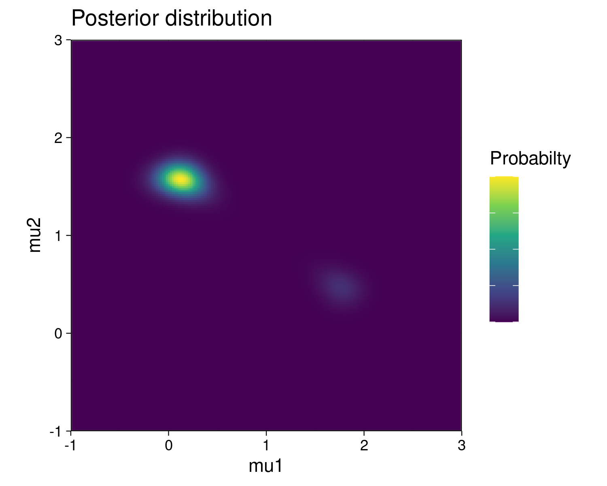

# Better soft k-means clustering with Chainsail - multimodality treated right
[Soft k-means clustering](https://en.wikipedia.org/wiki/Fuzzy_clustering), also known as fuzzy clustering, is the probabilistic version of the better known k-means clustering.
In this example, we simulate a one dimension clustering problem to illustrate a use-case of Chainsail.


## Data generation
We generated two 1-dimension clusters of points by drawing them from two normal probability distributions:
- **Cluster 1:** 80 points, drawn for a normal probability distribution of mean `mu1 = 0` and standard deviation `sigma = 1`
- **Cluster 2:** 120 points, drawn for a normal probability distribution of mean `mu2 = 1.5` and standard deviation `sigma = 1`


## Model
The model used to fit those clusters is a gaussian mixture (inspired from the [Stan example of soft k-means](https://mc-stan.org/docs/2_21/stan-users-guide/soft-k-means.html)).
It is defined in the file `probability.py`.  

- **Number of mixture components:** Just like in regular "hard" k-means, the users defines the number of clusters to find a priori. There are two clusters to find in this case, so the mixture model was defined with 2 components.
- **Components weights:** Since the clusters do not contain the same number of points, weights were set on the components of the mixture at `w1 = 0.4` and `w2 = 0.6` (which fits the proportions of data points in each cluster).
- **Parameters to fit:** To keep things simple, only the means of the components were set a variable parameters. The standard deviations were fixed at `sigma = 1` (which fits the data generation model), and components weights were also kept fixed.
- **Prior parameters:** The prior parameters for both components of the gaussian mixture were arbitrarily set at mean `mu=0` and standard deviation `sigma = 5`.

The log-posterior distribution is visualized below:



The posterior shows two modes, which correspond to the two possible positions of the mixture model to explain the generation of the clusters (Situation 1: components 1 and 2 of the gaussian mixture generated cluster 1 and 2 respectively. Situation 2 (reverse): components 1 and 2 generated clusters 2 and 1 respectively).
But since the clusters contain a different number of points, and the mixture components have different weights, one situation is less likely to be true than the other.
This is highlighted by the fact that the top-left mode in the posterior shows a higher probability than the lower-right mode.


## Single MCMC chain sampling
We created a simple single MCMC chain for sampling this posterior distribution, defined in the module `single_chain.py`.

### Sampling
With an initial state for the MCMC chain set at (1, 0), the chain gets stuck on the lower probability mode.
That means that the gaussian mixture component with the higher weight (component 2) fits the cluster with the lower number of points, and vice versa.


This results in the samples of the means being slightly offset from their expected positions (0 and 1.5), as to compensate for the mismatch.


### Cluster assignment
Soft k-means clustering treats the cluster assignments as probability distributions over the clusters.
Each data point is associated with a log unnormalized probability distribution for each cluster, which is obtained from transformation of the samples of the means (called the "soft Z" transformed samples).
These soft Z distributions, after softmax normalization, provide the probability of each point to belong to each cluster.
The distributions of the soft Z samples for 3 individual data points are shown below (one point located on the left, one in the middle, and one on the right).


The leftward point at `x = -0.687`, shows a distribution of higher soft Z values for the cluster 2, that is clearly distinct for the distribution of soft Z values for cluster 1.
Therefore, it can be unequivocally assigned to the cluster 2.
Similarly, the rightward point at `x = 2.369` can be unequivocally assigned to cluster 1.
However, the middle point at `x = 1.4` displays two distributions of soft Z values that are superimposed.
This highlights the fact that this point is in an ambiguous area, and cannot be assigned confidently to any of the two cluster.
Note that this uncertainty is not quantified in the traditional "hard" k-means algorithm, whereas it is available here, through these soft Z samples.

This being said, the soft Z distributions can be summarized to their median value, and consequently, the soft k-means clustering can be converted to a "hard" k-means by assigning each point to its cluster of higher median probability.


In this case, because the lower probability mode of the posterior is sampled, the cluster assignment is rather imperfect.
The points at the frontier of the 2 clusters (framed in dotted line) were assigned to the left cluster, which is the less probable one.


## Chainsail sampling

### Sampling
We also sampled the posterior distribution with Chainsail.
This time, replica exchange allows the main MCMC chain to not get stuck in one mode, and to sample both the low and the high probability modes.


The sampled means are shown below.
The two higher peaks correspond to the samples from the higher posterior mode, and the lower peaks to samples from the lower one.
Similarly to the samples from the single chain, the means sampled from the lower posterior mode are offset from their expected position, but more importantly, samples from the higher posterior mode match the theoretical cluster centroids much better.


### Cluster assignment
Similarly, the soft Z samples show bimodal distributions.


And finally, the clusters assignments are closer to what would be expected with a hard k-means clustering.


## Reproduce the example
- The code to generate those figures lives in the jupyter notebook `soft-kmeans.ipynb`. It is packaged with [Nix](https://github.com/NixOS/nix) through [JupyterWith](https://github.com/tweag/jupyterWith). It can be run with the following command:
  ```bash
  nix-shell shell-jupyter.nix --command 'jupyter-notebook soft-kmeans.ipynb'
  ```
- The data points in `data.txt` were generated with `make_data.py`
- The model used is defined in `probability.py`
- The single chain samples `sc_samples.npy` were generated with the module `single_chain.py`
- The Chainsail samples `chainsail_samples.npy` were generated with Chainsail's web application.
