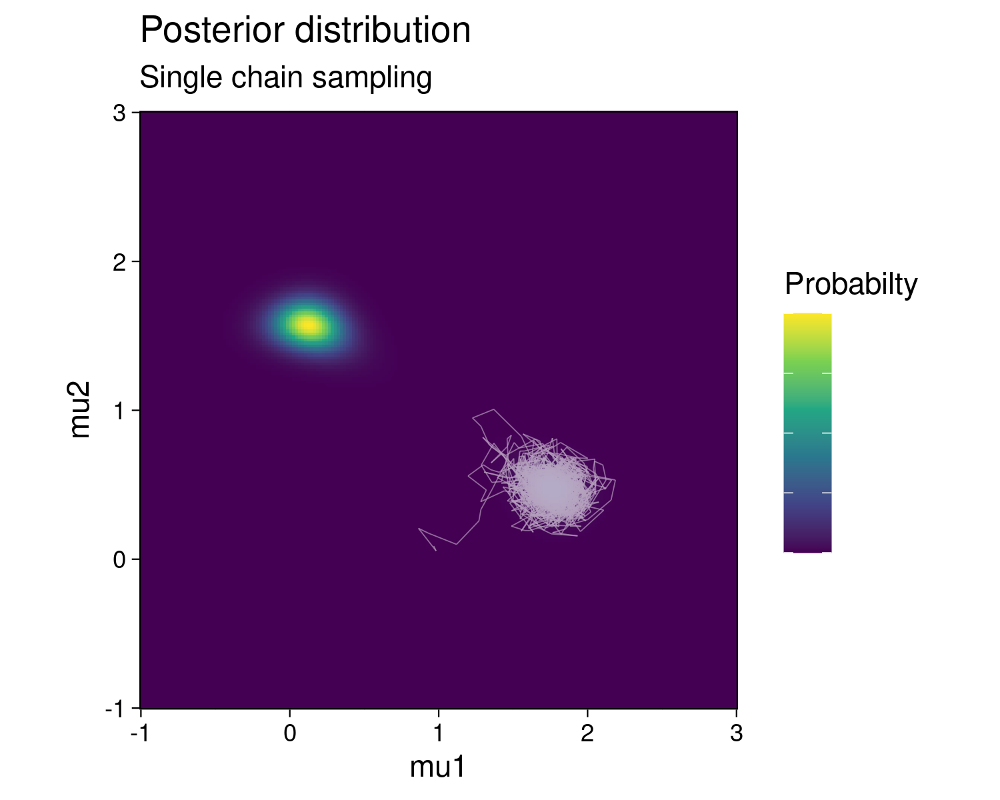
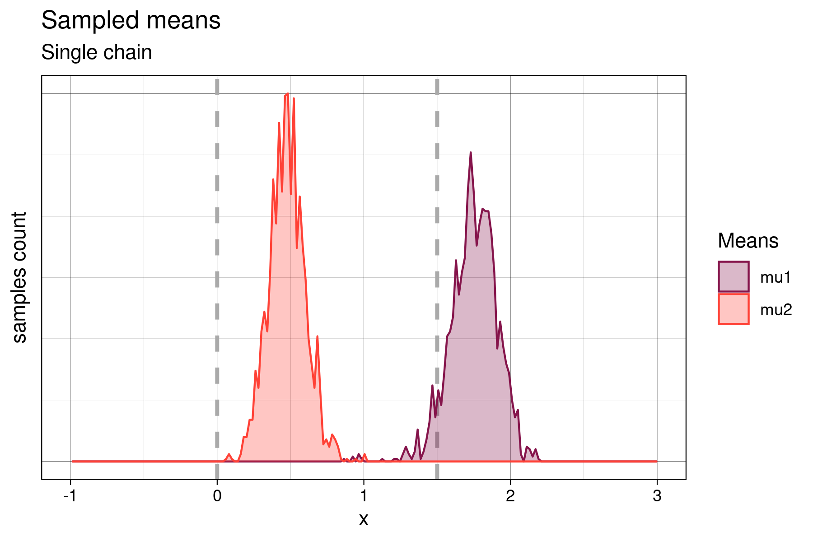
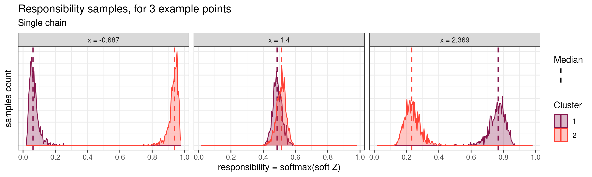
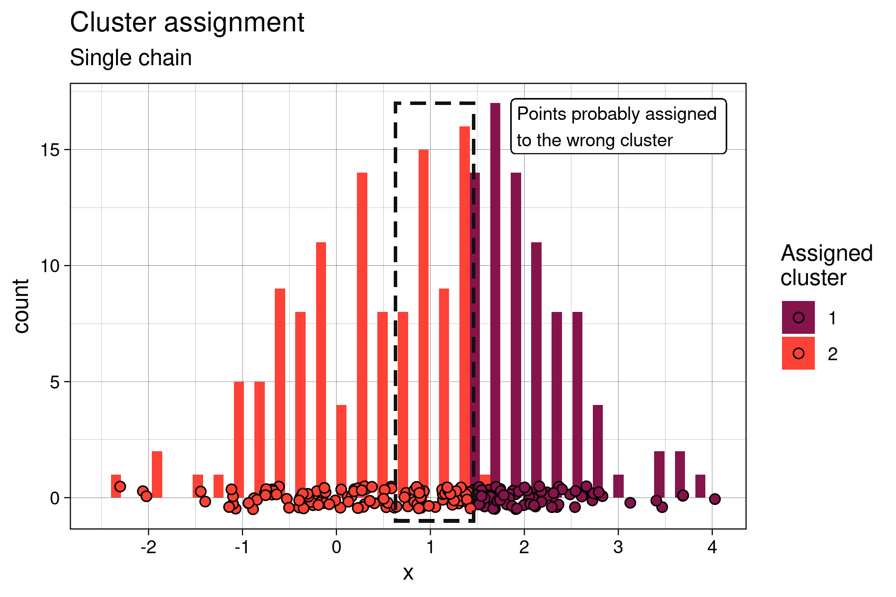
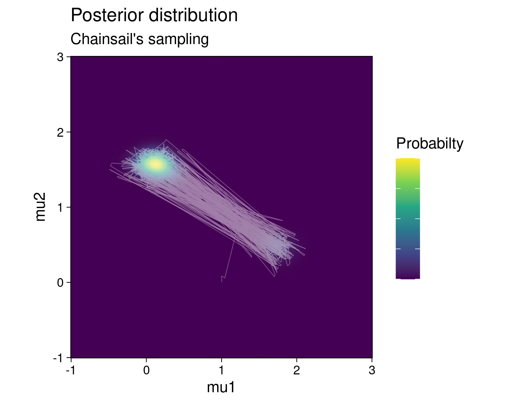

# Better soft k-means clustering with Chainsail - multimodality treated right
[Soft k-means clustering](https://en.wikipedia.org/wiki/Fuzzy_clustering), also known as fuzzy clustering, is the probabilistic version of the better known k-means clustering.
K-means algorithms are usually applied to a range of different tasks, like exploratory data analysis, classification (document classification, image segmentation, finding consensus sequences in DNA) or anomaly detection (financial fraud detection, safety vulnerability discovery).

Although clustering is particularly powerful on high dimensional datasets (as it allows to define clusters that could difficultly be inferred by a human), in this blog post, for the sake of simpler visualization, we simulate an abstract clustering problem in one dimension only.

This example aims to illustrate a use case of [Chainsail](https://chainsail.io/), a web service we developed that helps with sampling multimodal probability distributions.
See the [Chainsail announcement blog post](TODO) for a quick introduction to Chainsail!  
The Bayesian model discussed here exhibits such a multimodal posterior distribution, and whereas single-chain MCMC algorithms notoriously struggle to correctly sample similar posteriors, we will show how Chainsail improves on that state of affairs.


## Data generation
We generated two one-dimensional clusters of points by drawing from two normal probability distributions with different means:
- **Cluster 1:** 80 points, drawn for a normal probability distribution of mean `mu1 = 0` and standard deviation `sigma = 1`
- **Cluster 2:** 120 points, drawn for a normal probability distribution of mean `mu2 = 1.5` and standard deviation `sigma = 1`


## Model
The model used to fit these data is a Gaussian mixture, inspired by the [Stan example of soft k-means](https://mc-stan.org/docs/2_21/stan-users-guide/soft-k-means.html).
We don't discuss the model in detail in this example, but additional precision can be found in the excellent Stan documentation.
The Chainsail-ready Gaussian mixture implementation of this model is defined in the file [`probability.py`](./probability.py).
While the code in `probability.py` is general (and works for higher dimensions, too), for this example, we chose the following parameters:

- **Number of mixture components (clusters):** Just like in regular "hard" k-means, the users defines the number of clusters to find a priori. There are two clusters to find in this case, so the mixture model was defined with 2 components.
- **Components weights:** Since the clusters do not contain the same number of points, we set the weights of the mixture components to `w1 = 0.4` and `w2 = 0.6` (which fits the proportion of data points in each cluster).
- **Parameters to fit:** To keep things simple, only the means of the components vary. The standard deviations were fixed at `sigma = 1` (which fits the data generation model), and component weights were also kept fixed.
- **Prior parameters:** The prior parameters for both components of the Gaussian mixture were arbitrarily set at mean `mu = 1` and standard deviation `sigma = 5`.

The posterior distribution is visualized below:


The posterior shows two modes, each of which correspond to one possible parameter configuration explaining the data: in the first configuration, components 1 and 2 of the mixture generate cluster 1 and 2 respectively.
In the second configuration, the roles of the mixture components are reversed: component 1 generates cluster 2 and component 2 generates cluster 1.
But since the clusters contain a different number of data points and the mixture components have different weights, one configuration is less likely to be correct than the other.
This is highlighted by the fact that the top-left mode in the posterior shows a higher probability than the lower-right mode.


## Single MCMC chain
We created a [simple Metropolis MCMC sampler](https://www.tweag.io/blog/2019-10-25-mcmc-intro1/) for sampling this posterior distribution, defined in the module [`single_chain.py`](./single_chain.py).
Note that single chain sampling is also what most probabilistic programming libraries provide by default, although in a more advanced manner: they usually give the possibility to mix samples from multiple isolated chains and provide some sort of initial state estimation, which in practice makes these algorithms a bit more robust than our naive implementation here.

### Sampling
With an initial state for the MCMC chain set at `(mean of 1st component, mean of 2nd component) = (1, 0)`, the chain gets stuck in the lower probability mode:



That means that the mixture component with the higher weight (component 2) incorrectly fits the cluster with the lower number of points and vice versa.
As the following histogram shows, this results in the samples of the means being slightly offset from their expected positions (`~(0, 1.5)`) due to the mismatch between the number of points in the cluster and the weight of the Gaussian mixture component:




### Cluster assignment
Soft k-means clustering treats the cluster assignments as probability distributions over the clusters.
Each data point is associated with a probability distribution for each cluster, which is obtained from a transformation of the samples of the means (called the "soft Z" transformed samples).
These soft Z distributions provide the probability of each point to belong to each cluster.
In his book *Pattern Recognition and Machine Learning*, Christopher M. Bishop also calls this probability the *responsibility* that a component takes for explaining an observation *X* (chapter 9.2, page 432).
We will adopt this name in the rest of this example.
The histograms for the responsibilities of three individual data points are shown below (one point located on the left, one in the middle, and one on the right):



The leftward point at `x = -0.687` shows a higher responsibility for cluster 2, and which is clearly distinct from the responsibility for cluster 1.
Therefore, it can be unequivocally assigned to the cluster 2.
Similarly, the rightward point at `x = 2.369` can be unequivocally assigned to cluster 1.
However, for the middle point at `x = 1.4`, the two responsibility distributions overlap strongly.
This highlights the fact that this point is in an ambiguous area and cannot be assigned confidently to either cluster.
Note that this uncertainty is not quantified in the traditional "hard" k-means algorithm.

If we summarize the responsibilities by, for example, their median value, soft k-means clustering can be converted to a "hard" k-means by assigning each point to its cluster of highest median probability.



In this case, because the lower probability mode of the posterior is sampled, the cluster assignment is rather imperfect.
The points at the frontier of the 2 clusters (framed in dotted line) were assigned to the left cluster, which is the less probable one.


## Chainsail
Chainsail implements Replica Exchange, a MCMC algorithm that has been specifically designed to sample  multimodal posterior distributions by running several, communicating MCMC chains.
Correctly tuned, it is thus far less prone to the over- / undersampling of modes.
Let's see whether the sampling and clustering obtained with Chainsail does a better job than a single chain!

### Sampling
After running the Chainsail web applicatoin, we find that Chainsail allows the main MCMC chain to sample both the low and the high probability mode instead of getting stuck in one of them:



In fact, the main MCMC chain jumps frequently between both modes.
The sampled means are shown below:


We identify the two higher peaks with the samples from the higher posterior probability mode, and the lower peaks with samples from the lower probability one.
Similarly to the samples from the single chain, the means sampled from the lower posterior mode are offset from their expected position.
But at the same time, samples from the higher posterior mode match the theoretical cluster centroids much better, since in this case, the higher weight component of the Gaussian mixture is fitted to the cluster with the higher number of points and vice versa.
This demonstrates that Chainsail found _both_ modes - the "correct", desired one _and_ the less likely one and thus correctly and honestly samples the full posterior distribution.


### Cluster assignment
Similarly, the soft Z samples show bimodal distributions:


Therefore, with Chainsail, we capture the fact that there is a certain responsibility for *both* component 1 and 2 to have generated each data point.
This is absent in the soft Z histograms for the single chain, and thus single-chain sampling made us miss out on important information. 
Finally, the clusters assignments are much closer to what would be expected with a hard k-means clustering:


## Conclusion
While this example showcased a rather trivial, one-dimensional problem, it highlighted the difficulty for single-chain MCMC algorithms to correctly sample multimodal posteriors, and the biased analysis results that this leads to.
Keep in mind that while the posterior distribution is easily to visualize in this 1D case, most real life problems generate highly dimensional posteriors, in which case a bias in sampling is much less obvious to detect.

[Chainsail](https://chainsail.io/) aims at providing a hosted and user-friendly solution to this problem.
We recently released our first public version of the service, which you can read about more in our [annoucement blog post](TODO).
We also wrote a series of blog posts about MCMC sampling algorithms, the fourth and last of which describes the core algorithm of Chainsail itself, [Replica Exchange](https://www.tweag.io/blog/2020-10-28-mcmc-intro-4/).

Finally, to learn more about soft k-means and Gaussian mixtures, we heartily recommend chapter 9 of Christopher M. Bishop's book *Pattern Recognition and Machine Learning* and the [Stan documentation](https://mc-stan.org/docs/2_21/stan-users-guide/soft-k-means.html), which is full of other similar and also more advanced example models.


## To reproduce this example
- Find the source code for this example in our `tweag/chainsail-resources` GitHub repository [here](https://github.com/tweag/chainsail-resources/tree/main/examples/soft-kmeans). Other examples also exist in the `examples` directory of the repository.
- The code to generate those figures lives in the Jupyter notebook `soft-kmeans.ipynb`. It is packaged with [Nix](https://github.com/NixOS/nix) through [JupyterWith](https://github.com/tweag/jupyterWith). It can be run with the following command:
  ```bash
  nix-shell shell-jupyter.nix --command 'jupyter-notebook soft-kmeans.ipynb'
  ```
- The data points in `data.txt` were generated with `make_data.py`
- The model used is defined in `probability.py`
- The single chain samples `sc_samples.npy` were generated with the module `single_chain.py`
- The Chainsail samples `chainsail_samples.npy` were generated with Chainsail's web application.
