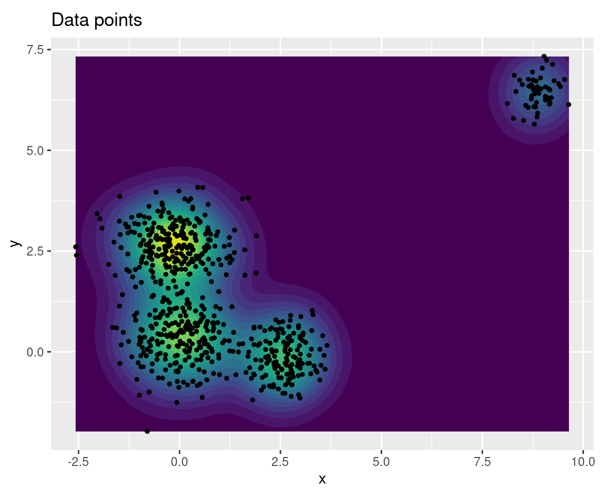
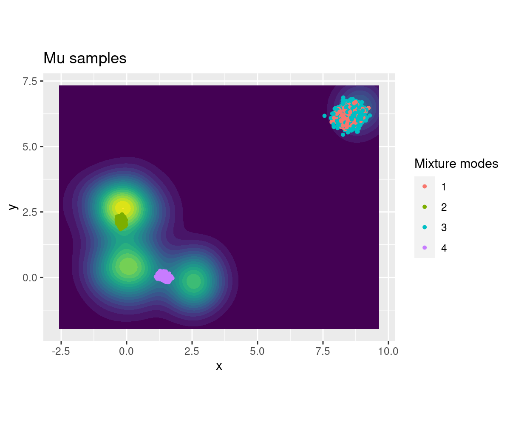
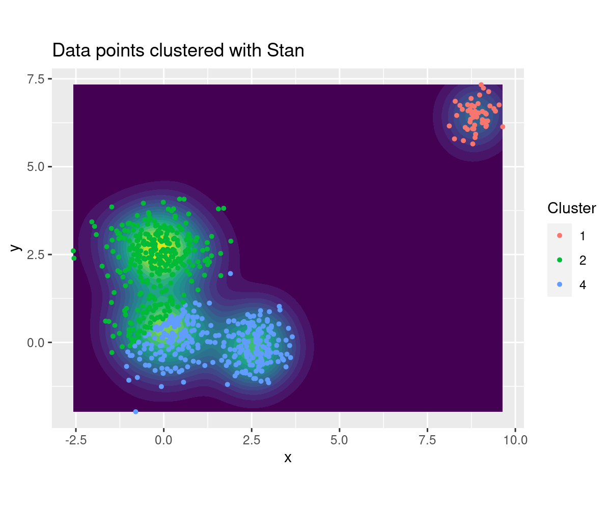
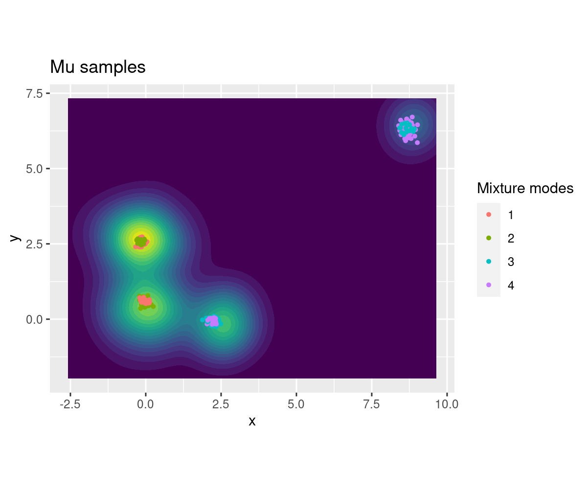

# Soft K-means example


```R
library(tidyverse)
library(rstan)
Sys.setenv(RETICULATE_PYTHON = "/nix/store/66p7i56lg3zzp7nj6g0fywb704ihp4iy-python3-3.8.11/bin/python")
library(reticulate)
pd = import("pandas")
```

    ── Attaching packages ────────────────────────────────────────────────────────────────────────────────────────────────────────────────────────────────────────────────────────────────── tidyverse 1.3.1 ──
    
    ✔ ggplot2 3.3.3     ✔ purrr   0.3.4
    ✔ tibble  3.1.1     ✔ dplyr   1.0.5
    ✔ tidyr   1.1.3     ✔ stringr 1.4.0
    ✔ readr   1.4.0     ✔ forcats 0.5.1
    
    ── Conflicts ───────────────────────────────────────────────────────────────────────────────────────────────────────────────────────────────────────────────────────────────────── tidyverse_conflicts() ──
    ✖ dplyr::filter() masks stats::filter()
    ✖ dplyr::lag()    masks stats::lag()
    
    Loading required package: StanHeaders
    
    rstan (Version 2.21.2, GitRev: 2e1f913d3ca3)
    
    For execution on a local, multicore CPU with excess RAM we recommend calling
    options(mc.cores = parallel::detectCores()).
    To avoid recompilation of unchanged Stan programs, we recommend calling
    rstan_options(auto_write = TRUE)
    
    
    Attaching package: ‘rstan’
    
    
    The following object is masked from ‘package:tidyr’:
    
        extract
    
    


**To do**
- **Data preparation**
  - Generate cluster data
  - Plot the data
- **Stan model**
  - Code the model in Stan
  - Sample using Stan
  - Plot the clusters found by Stan
  - Conclusion: Did it find all the clusters? (hopefully not)
- **Chainsail model**
  - Code the PDF with `chainsail_helpers`. Reuse Stan's model
  - Upload `probability.py` on GCP (zip + upload)
  - Sample it with Chainsail
  - Download the `results.zip` samples
  - Plot the clusters found by Chainsail
  - Conclusion: Did it find all the clusters? (Hopefully yes)
- **Conclusion**
  - Compare the clusters from Chainsail and Stan


## Data generation
Generate 2D clustered data points


```R
# Read data & reshape into a dataframe
read_delim("data2.txt", delim=" ", col_names=FALSE, col_types=cols(.default=col_double())) %>%
t() %>%
as_tibble() %>%
rename(x=V1, y=V2) -> data_points
data_points
```


<table class="dataframe">
<caption>A tibble: 669 x 2</caption>
<thead>
	<tr><th scope=col>x</th><th scope=col>y</th></tr>
	<tr><th scope=col>&lt;dbl&gt;</th><th scope=col>&lt;dbl&gt;</th></tr>
</thead>
<tbody>
	<tr><td>-0.06799257</td><td>-1.256614963</td></tr>
	<tr><td>-0.95405819</td><td> 0.557106929</td></tr>
	<tr><td>-0.18406840</td><td> 0.700378882</td></tr>
	<tr><td>-0.96134859</td><td> 0.248282280</td></tr>
	<tr><td>-0.42073952</td><td>-0.653614772</td></tr>
	<tr><td> 0.65157435</td><td> 0.619918335</td></tr>
	<tr><td>-0.05869550</td><td> 0.150059072</td></tr>
	<tr><td> 0.25643032</td><td> 0.652327301</td></tr>
	<tr><td> 0.16145296</td><td> 0.893202068</td></tr>
	<tr><td>-0.95910188</td><td>-0.098079529</td></tr>
	<tr><td>-0.41880843</td><td> 1.245781923</td></tr>
	<tr><td> 0.25725971</td><td> 0.089229995</td></tr>
	<tr><td> 0.66777760</td><td> 0.689390962</td></tr>
	<tr><td> 0.84985377</td><td> 0.717574014</td></tr>
	<tr><td> 0.17273635</td><td> 0.670992843</td></tr>
	<tr><td> 0.18205065</td><td> 1.187327055</td></tr>
	<tr><td>-0.24675924</td><td>-0.797536148</td></tr>
	<tr><td>-0.49446779</td><td> 0.846970378</td></tr>
	<tr><td> 0.14461532</td><td> 0.606861863</td></tr>
	<tr><td> 0.01913747</td><td>-0.376559010</td></tr>
	<tr><td> 0.41939419</td><td> 0.504003055</td></tr>
	<tr><td> 0.60071998</td><td> 0.348087479</td></tr>
	<tr><td> 0.55327189</td><td>-0.086870125</td></tr>
	<tr><td>-0.99323729</td><td>-1.076302880</td></tr>
	<tr><td> 1.45865669</td><td>-0.003249845</td></tr>
	<tr><td> 0.81949577</td><td> 0.719744288</td></tr>
	<tr><td>-1.02466851</td><td>-0.270385593</td></tr>
	<tr><td>-0.86751673</td><td> 0.364178181</td></tr>
	<tr><td>-0.52886989</td><td> 0.186722887</td></tr>
	<tr><td>-0.53505405</td><td> 0.447904817</td></tr>
	<tr><td>...</td><td>...</td></tr>
	<tr><td>8.332520</td><td>6.457453</td></tr>
	<tr><td>8.731042</td><td>6.585678</td></tr>
	<tr><td>8.760392</td><td>6.746169</td></tr>
	<tr><td>8.900798</td><td>6.413087</td></tr>
	<tr><td>9.239906</td><td>7.133573</td></tr>
	<tr><td>8.712150</td><td>6.630893</td></tr>
	<tr><td>9.177466</td><td>6.175866</td></tr>
	<tr><td>8.522736</td><td>5.740464</td></tr>
	<tr><td>9.389199</td><td>6.651738</td></tr>
	<tr><td>9.172989</td><td>6.498171</td></tr>
	<tr><td>9.212229</td><td>6.302320</td></tr>
	<tr><td>8.780326</td><td>6.082038</td></tr>
	<tr><td>8.796123</td><td>6.402801</td></tr>
	<tr><td>9.434715</td><td>6.579550</td></tr>
	<tr><td>9.162830</td><td>6.142539</td></tr>
	<tr><td>8.951445</td><td>6.528737</td></tr>
	<tr><td>9.144813</td><td>6.526658</td></tr>
	<tr><td>8.854459</td><td>5.827050</td></tr>
	<tr><td>8.832839</td><td>6.714875</td></tr>
	<tr><td>8.940411</td><td>6.794558</td></tr>
	<tr><td>8.268247</td><td>5.790742</td></tr>
	<tr><td>8.725275</td><td>6.349057</td></tr>
	<tr><td>8.854425</td><td>6.575546</td></tr>
	<tr><td>8.815423</td><td>6.545427</td></tr>
	<tr><td>8.984181</td><td>7.039096</td></tr>
	<tr><td>9.640380</td><td>6.135130</td></tr>
	<tr><td>9.141149</td><td>6.264319</td></tr>
	<tr><td>8.789183</td><td>5.647478</td></tr>
	<tr><td>8.637266</td><td>6.060497</td></tr>
	<tr><td>9.062022</td><td>6.337467</td></tr>
</tbody>
</table>


```R
# Plot data points
options(repr.plot.width=6, repr.plot.height=5, repr.plot.res=200)
ggplot(data_points) +
geom_density_2d_filled(aes(x, y), bins=20) +
geom_point(aes(x, y), size=1) +
labs(title="Data points") +
theme(legend.position='none') +
coord_fixed()
```


    

    


## Stan model

### Model definition
Create the model with Stan by definig the data, the parameters to fit, the priors and likelihood. The model is a bivariate normal mixture, with as many modes as clusters we want to find.  
This model is taken from the the [soft K-means example from the Stan documentation](https://mc-stan.org/docs/2_21/stan-users-guide/soft-k-means.html).


```R
# Define Stan model
model_code = "
data {
  int<lower=0> N;  // number of data points
  int<lower=1> D;  // number of dimensions
  int<lower=1> K;  // number of clusters
  vector[D] y[N];  // observations
}
transformed data {
  real<upper=0> neg_log_K;
  neg_log_K = -log(K);
}
parameters {
  vector[D] mu[K]; // cluster means
}
transformed parameters {
  real<upper=0> soft_z[N, K]; // log unnormalized clusters
  for (n in 1:N)
    for (k in 1:K)
      soft_z[n, k] = neg_log_K - 0.5 * dot_self(mu[k] - y[n]);
}
model {
  // prior
  for (k in 1:K)
    mu[k] ~ std_normal();

  // likelihood
  for (n in 1:N)
    target += log_sum_exp(soft_z[n]);
}
"
```


```R
# Compile the model
model = stan_model(model_code=model_code)
```

### Posterior distribution sampling


```R
# Prepare input data
N = nrow(data_points)
D = 2
K = 4
y = data_points %>%
    split(1:nrow(.)) %>%
    map(~ c(.x$x, .x$y))
data = list(N, D, K, y)
```


```R
# Sample the posterior distribution
fit_soft_kmeans = sampling(model, data=data, chains=1, iter=3000, warmup=1000, algorithm="HMC")
```

    
    SAMPLING FOR MODEL '57d5edbf090e8109c334578dcccb262c' NOW (CHAIN 1).
    Chain 1: 
    Chain 1: Gradient evaluation took 0.001033 seconds
    Chain 1: 1000 transitions using 10 leapfrog steps per transition would take 10.33 seconds.
    Chain 1: Adjust your expectations accordingly!
    Chain 1: 
    Chain 1: 
    Chain 1: Iteration:    1 / 3000 [  0%]  (Warmup)
    Chain 1: Iteration:  300 / 3000 [ 10%]  (Warmup)
    Chain 1: Iteration:  600 / 3000 [ 20%]  (Warmup)
    Chain 1: Iteration:  900 / 3000 [ 30%]  (Warmup)
    Chain 1: Iteration: 1001 / 3000 [ 33%]  (Sampling)
    Chain 1: Iteration: 1300 / 3000 [ 43%]  (Sampling)
    Chain 1: Iteration: 1600 / 3000 [ 53%]  (Sampling)
    Chain 1: Iteration: 1900 / 3000 [ 63%]  (Sampling)
    Chain 1: Iteration: 2200 / 3000 [ 73%]  (Sampling)
    Chain 1: Iteration: 2500 / 3000 [ 83%]  (Sampling)
    Chain 1: Iteration: 2800 / 3000 [ 93%]  (Sampling)
    Chain 1: Iteration: 3000 / 3000 [100%]  (Sampling)
    Chain 1: 
    Chain 1:  Elapsed Time: 15.7569 seconds (Warm-up)
    Chain 1:                7.96057 seconds (Sampling)
    Chain 1:                23.7174 seconds (Total)
    Chain 1: 


    Warning message:
    “Bulk Effective Samples Size (ESS) is too low, indicating posterior means and medians may be unreliable.
    Running the chains for more iterations may help. See
    http://mc-stan.org/misc/warnings.html#bulk-ess”
    Warning message:
    “Tail Effective Samples Size (ESS) is too low, indicating posterior variances and tail quantiles may be unreliable.
    Running the chains for more iterations may help. See
    http://mc-stan.org/misc/warnings.html#tail-ess”


```R
fit_soft_kmeans
```


    Inference for Stan model: 57d5edbf090e8109c334578dcccb262c.
    1 chains, each with iter=3000; warmup=1000; thin=1; 
    post-warmup draws per chain=2000, total post-warmup draws=2000.
    
                      mean se_mean   sd     2.5%      25%      50%      75%
    mu[1,1]           8.55    0.00 0.20     8.14     8.41     8.56     8.69
    mu[1,2]           6.21    0.00 0.20     5.80     6.08     6.21     6.36
    mu[2,1]          -0.20    0.00 0.06    -0.31    -0.24    -0.20    -0.16
    mu[2,2]           2.14    0.00 0.08     1.99     2.09     2.14     2.20
    mu[3,1]           8.55    0.00 0.21     8.10     8.43     8.56     8.69
    mu[3,2]           6.21    0.00 0.22     5.76     6.06     6.21     6.37
    mu[4,1]           1.42    0.00 0.09     1.26     1.36     1.42     1.48
    mu[4,2]           0.04    0.00 0.07    -0.09     0.00     0.04     0.09
    soft_z[1,1]     -66.47    0.03 2.41   -70.96   -68.14   -66.51   -64.88
    soft_z[1,2]      -7.17    0.00 0.27    -7.71    -7.36    -7.16    -6.98
    soft_z[1,3]     -66.45    0.03 2.53   -71.13   -68.33   -66.46   -64.70
    soft_z[1,4]      -3.34    0.00 0.14    -3.62    -3.43    -3.34    -3.25
    soft_z[2,1]     -62.60    0.03 2.32   -66.84   -64.18   -62.62   -61.07
    soft_z[2,2]      -2.93    0.00 0.13    -3.19    -3.02    -2.92    -2.84
    soft_z[2,3]     -62.58    0.03 2.43   -67.15   -64.30   -62.59   -60.92
    soft_z[2,4]      -4.34    0.00 0.22    -4.79    -4.48    -4.34    -4.19
    soft_z[3,1]     -54.77    0.03 2.17   -58.80   -56.25   -54.81   -53.35
    soft_z[3,2]      -2.43    0.00 0.11    -2.66    -2.51    -2.42    -2.35
    soft_z[3,3]     -54.76    0.03 2.28   -59.01   -56.37   -54.77   -53.19
    soft_z[3,4]      -2.90    0.00 0.15    -3.22    -3.00    -2.89    -2.79
    soft_z[4,1]     -64.46    0.03 2.35   -68.83   -66.07   -64.49   -62.92
    soft_z[4,2]      -3.47    0.00 0.15    -3.78    -3.58    -3.46    -3.36
    soft_z[4,3]     -64.44    0.03 2.47   -69.05   -66.20   -64.45   -62.73
    soft_z[4,4]      -4.25    0.00 0.21    -4.68    -4.38    -4.24    -4.10
    soft_z[5,1]     -65.25    0.03 2.38   -69.64   -66.88   -65.29   -63.66
    soft_z[5,2]      -5.32    0.00 0.22    -5.76    -5.48    -5.31    -5.16
    soft_z[5,3]     -65.23    0.03 2.50   -69.87   -67.06   -65.26   -63.51
    soft_z[5,4]      -3.33    0.00 0.16    -3.65    -3.43    -3.32    -3.22
    soft_z[6,1]     -48.27    0.03 2.04   -52.05   -49.64   -48.29   -46.93
    soft_z[6,2]      -2.91    0.00 0.13    -3.17    -3.00    -2.91    -2.82
    soft_z[6,3]     -48.26    0.03 2.14   -52.21   -49.80   -48.27   -46.78
    soft_z[6,4]      -1.85    0.00 0.08    -2.04    -1.91    -1.85    -1.80
    soft_z[7,1]     -56.87    0.03 2.21   -60.99   -58.37   -56.90   -55.41
    soft_z[7,2]      -3.38    0.00 0.16    -3.71    -3.49    -3.38    -3.27
    soft_z[7,3]     -56.86    0.03 2.33   -61.15   -58.53   -56.87   -55.25
    soft_z[7,4]      -2.49    0.00 0.13    -2.77    -2.57    -2.48    -2.40
    soft_z[8,1]     -51.29    0.03 2.10   -55.20   -52.71   -51.32   -49.90
    soft_z[8,2]      -2.60    0.00 0.12    -2.85    -2.69    -2.60    -2.52
    soft_z[8,3]     -51.27    0.03 2.20   -55.40   -52.85   -51.29   -49.76
    soft_z[8,4]      -2.26    0.00 0.12    -2.50    -2.33    -2.25    -2.17
    soft_z[9,1]     -50.77    0.03 2.08   -54.64   -52.19   -50.80   -49.40
    soft_z[9,2]      -2.23    0.00 0.10    -2.44    -2.31    -2.23    -2.16
    soft_z[9,3]     -50.76    0.03 2.19   -54.84   -52.31   -50.77   -49.25
    soft_z[9,4]      -2.55    0.00 0.13    -2.83    -2.63    -2.54    -2.46
    soft_z[10,1]    -66.56    0.03 2.40   -71.01   -68.18   -66.61   -64.99
    soft_z[10,2]     -4.18    0.00 0.18    -4.54    -4.31    -4.18    -4.06
    soft_z[10,3]    -66.55    0.03 2.52   -71.26   -68.33   -66.57   -64.82
    soft_z[10,4]     -4.23    0.00 0.20    -4.65    -4.36    -4.23    -4.09
    soft_z[11,1]    -53.99    0.03 2.14   -57.90   -55.44   -54.02   -52.59
    soft_z[11,2]     -1.81    0.00 0.07    -1.96    -1.86    -1.81    -1.76
    soft_z[11,3]    -53.98    0.03 2.25   -58.26   -55.55   -53.97   -52.48
    soft_z[11,4]     -3.81    0.00 0.19    -4.21    -3.93    -3.80    -3.68
    soft_z[12,1]    -54.57    0.03 2.17   -58.59   -56.05   -54.61   -53.12
    soft_z[12,2]     -3.60    0.00 0.17    -3.93    -3.72    -3.60    -3.48
    soft_z[12,3]    -54.56    0.03 2.28   -58.80   -56.22   -54.58   -52.97
    soft_z[12,4]     -2.07    0.00 0.10    -2.29    -2.13    -2.06    -2.00
    soft_z[13,1]    -47.76    0.02 2.02   -51.52   -49.12   -47.78   -46.43
    soft_z[13,2]     -2.82    0.00 0.13    -3.07    -2.91    -2.82    -2.74
    soft_z[13,3]    -47.74    0.03 2.13   -51.69   -49.28   -47.75   -46.28
    soft_z[13,4]     -1.89    0.00 0.09    -2.07    -1.94    -1.88    -1.83
    soft_z[14,1]    -46.18    0.02 1.99   -49.87   -47.53   -46.21   -44.87
    soft_z[14,2]     -2.96    0.00 0.13    -3.21    -3.05    -2.95    -2.87
    soft_z[14,3]    -46.17    0.03 2.09   -50.04   -47.69   -46.18   -44.73
    soft_z[14,4]     -1.78    0.00 0.07    -1.95    -1.83    -1.78    -1.73
    soft_z[15,1]    -51.88    0.03 2.11   -55.80   -53.31   -51.92   -50.50
    soft_z[15,2]     -2.54    0.00 0.12    -2.78    -2.63    -2.54    -2.46
    soft_z[15,3]    -51.87    0.03 2.22   -56.02   -53.45   -51.89   -50.34
    soft_z[15,4]     -2.37    0.00 0.12    -2.63    -2.45    -2.36    -2.28
    soft_z[16,1]    -49.08    0.03 2.04   -52.84   -50.47   -49.09   -47.74
    soft_z[16,2]     -1.92    0.00 0.08    -2.08    -1.97    -1.92    -1.86
    soft_z[16,3]    -49.06    0.03 2.15   -53.09   -50.58   -49.07   -47.59
    soft_z[16,4]     -2.81    0.00 0.15    -3.12    -2.90    -2.81    -2.72
    soft_z[17,1]    -64.70    0.03 2.37   -69.11   -66.33   -64.74   -63.12
    soft_z[17,2]     -5.71    0.00 0.23    -6.17    -5.87    -5.70    -5.54
    soft_z[17,3]    -64.69    0.03 2.49   -69.23   -66.52   -64.71   -62.95
    soft_z[17,4]     -3.14    0.00 0.14    -3.43    -3.23    -3.13    -3.03
    soft_z[18,1]    -56.74    0.03 2.20   -60.77   -58.24   -56.76   -55.29
    soft_z[18,2]     -2.27    0.00 0.10    -2.48    -2.34    -2.26    -2.20
    soft_z[18,3]    -56.72    0.03 2.31   -61.07   -58.35   -56.73   -55.14
    soft_z[18,4]     -3.55    0.00 0.19    -3.93    -3.67    -3.54    -3.42
    soft_z[19,1]    -52.48    0.03 2.12   -56.43   -53.91   -52.51   -51.08
    soft_z[19,2]     -2.63    0.00 0.12    -2.88    -2.72    -2.62    -2.54
    soft_z[19,3]    -52.46    0.03 2.23   -56.64   -54.05   -52.47   -50.93
    soft_z[19,4]     -2.37    0.00 0.12    -2.62    -2.44    -2.36    -2.28
    soft_z[20,1]    -59.54    0.03 2.27   -63.74   -61.09   -59.57   -58.02
    soft_z[20,2]     -4.58    0.00 0.20    -4.99    -4.73    -4.58    -4.44
    soft_z[20,3]    -59.52    0.03 2.39   -63.94   -61.26   -59.55   -57.87
    soft_z[20,4]     -2.46    0.00 0.12    -2.71    -2.54    -2.46    -2.38
    soft_z[21,1]    -50.79    0.03 2.09   -54.67   -52.19   -50.81   -49.41
    soft_z[21,2]     -2.92    0.00 0.14    -3.19    -3.02    -2.92    -2.83
    soft_z[21,3]    -50.77    0.03 2.19   -54.84   -52.35   -50.78   -49.26
    soft_z[21,4]     -2.00    0.00 0.10    -2.21    -2.06    -1.99    -1.93
    soft_z[22,1]    -50.23    0.03 2.08   -54.08   -51.65   -50.27   -48.84
    soft_z[22,2]     -3.32    0.00 0.15    -3.62    -3.43    -3.32    -3.22
    soft_z[22,3]    -50.22    0.03 2.18   -54.28   -51.81   -50.23   -48.69
    soft_z[22,4]     -1.78    0.00 0.08    -1.94    -1.82    -1.77    -1.72
    soft_z[23,1]    -53.26    0.03 2.15   -57.24   -54.73   -53.28   -51.82
    soft_z[23,2]     -4.16    0.00 0.18    -4.52    -4.29    -4.15    -4.03
    soft_z[23,3]    -53.24    0.03 2.25   -57.38   -54.89   -53.26   -51.68
    soft_z[23,4]     -1.78    0.00 0.07    -1.93    -1.82    -1.77    -1.72
    soft_z[24,1]    -73.54    0.03 2.53   -78.21   -75.27   -73.59   -71.85
    soft_z[24,2]     -6.88    0.00 0.26    -7.38    -7.06    -6.86    -6.70
    soft_z[24,3]    -73.52    0.03 2.66   -78.45   -75.47   -73.56   -71.69
    soft_z[24,4]     -4.93    0.00 0.21    -5.35    -5.07    -4.92    -4.79
    soft_z[25,1]    -45.90    0.02 1.99   -49.62   -47.27   -45.93   -44.59
    soft_z[25,2]     -5.07    0.00 0.20    -5.46    -5.20    -5.06    -4.93
    soft_z[25,3]    -45.89    0.03 2.09   -49.77   -47.44   -45.88   -44.43
    soft_z[25,4]     -1.39    0.00 0.01    -1.41    -1.40    -1.39    -1.39
    soft_z[26,1]    -46.40    0.02 1.99   -50.11   -47.75   -46.43   -45.09
    soft_z[26,2]     -2.92    0.00 0.13    -3.18    -3.01    -2.92    -2.83
    soft_z[26,3]    -46.39    0.03 2.09   -50.27   -47.91   -46.40   -44.95
    soft_z[26,4]     -1.80    0.00 0.08    -1.97    -1.85    -1.80    -1.75
    soft_z[27,1]    -68.29    0.03 2.43   -72.82   -69.94   -68.33   -66.69
    soft_z[27,2]     -4.63    0.00 0.19    -5.02    -4.77    -4.63    -4.50
    soft_z[27,3]    -68.27    0.03 2.55   -73.04   -70.11   -68.30   -66.52
    soft_z[27,4]     -4.43    0.00 0.21    -4.85    -4.56    -4.42    -4.28
    soft_z[28,1]    -62.89    0.03 2.32   -67.20   -64.48   -62.91   -61.37
    soft_z[28,2]     -3.19    0.00 0.14    -3.48    -3.29    -3.18    -3.09
    soft_z[28,3]    -62.87    0.03 2.44   -67.41   -64.60   -62.88   -61.19
    soft_z[28,4]     -4.06    0.00 0.20    -4.48    -4.19    -4.05    -3.92
    soft_z[29,1]    -60.81    0.03 2.29   -65.06   -62.35   -60.85   -59.30
    soft_z[29,2]     -3.35    0.00 0.15    -3.67    -3.46    -3.34    -3.24
    soft_z[29,3]    -60.79    0.03 2.40   -65.30   -62.50   -60.81   -59.14
    soft_z[29,4]     -3.30    0.00 0.17    -3.66    -3.41    -3.29    -3.18
    soft_z[30,1]    -59.32    0.03 2.26   -63.51   -60.87   -59.36   -57.84
    soft_z[30,2]     -2.88    0.00 0.13    -3.15    -2.97    -2.87    -2.78
    soft_z[30,3]    -59.31    0.03 2.37   -63.73   -60.99   -59.32   -57.68
    soft_z[30,4]     -3.39    0.00 0.18    -3.75    -3.50    -3.38    -3.26
    soft_z[31,1]    -54.14    0.03 2.16   -58.16   -55.62   -54.17   -52.69
    soft_z[31,2]     -4.38    0.00 0.19    -4.76    -4.52    -4.37    -4.25
    soft_z[31,3]    -54.12    0.03 2.27   -58.28   -55.80   -54.14   -52.54
    soft_z[31,4]     -1.82    0.00 0.08    -1.98    -1.87    -1.81    -1.77
    soft_z[32,1]    -50.66    0.03 2.09   -54.56   -52.10   -50.68   -49.26
    soft_z[32,2]     -4.18    0.00 0.18    -4.54    -4.31    -4.18    -4.06
    soft_z[32,3]    -50.65    0.03 2.20   -54.66   -52.26   -50.66   -49.11
    soft_z[32,4]     -1.58    0.00 0.05    -1.70    -1.61    -1.57    -1.54
    soft_z[33,1]    -48.19    0.03 2.04   -51.96   -49.58   -48.23   -46.83
    soft_z[33,2]     -3.57    0.00 0.16    -3.87    -3.68    -3.56    -3.46
    soft_z[33,3]    -48.18    0.03 2.14   -52.17   -49.75   -48.20   -46.70
    soft_z[33,4]     -1.59    0.00 0.06    -1.72    -1.63    -1.59    -1.55
    soft_z[34,1]    -62.59    0.03 2.32   -66.92   -64.16   -62.62   -61.06
    soft_z[34,2]     -3.90    0.00 0.18    -4.25    -4.02    -3.89    -3.78
    soft_z[34,3]    -62.58    0.03 2.44   -67.13   -64.34   -62.60   -60.90
    soft_z[34,4]     -3.34    0.00 0.17    -3.69    -3.45    -3.33    -3.22
    soft_z[35,1]    -65.17    0.03 2.37   -69.58   -66.78   -65.20   -63.61
    soft_z[35,2]     -4.47    0.00 0.19    -4.86    -4.61    -4.46    -4.34
    soft_z[35,3]    -65.15    0.03 2.49   -69.75   -66.95   -65.17   -63.43
    soft_z[35,4]     -3.64    0.00 0.18    -4.01    -3.76    -3.64    -3.52
    soft_z[36,1]    -62.43    0.03 2.31   -66.68   -64.01   -62.45   -60.91
    soft_z[36,2]     -2.94    0.00 0.13    -3.20    -3.03    -2.93    -2.85
    soft_z[36,3]    -62.41    0.03 2.43   -66.97   -64.13   -62.42   -60.76
    soft_z[36,4]     -4.27    0.00 0.21    -4.70    -4.40    -4.26    -4.12
    soft_z[37,1]    -71.39    0.03 2.49   -75.99   -73.08   -71.43   -69.75
    soft_z[37,2]     -5.75    0.00 0.23    -6.20    -5.91    -5.74    -5.59
    soft_z[37,3]    -71.38    0.03 2.61   -76.21   -73.28   -71.39   -69.56
    soft_z[37,4]     -4.73    0.00 0.21    -5.16    -4.86    -4.72    -4.58
    soft_z[38,1]    -50.51    0.03 2.09   -54.37   -51.94   -50.54   -49.12
    soft_z[38,2]     -3.72    0.00 0.17    -4.05    -3.84    -3.72    -3.61
    soft_z[38,3]    -50.50    0.03 2.19   -54.57   -52.10   -50.52   -48.98
    soft_z[38,4]     -1.67    0.00 0.07    -1.81    -1.71    -1.66    -1.62
    soft_z[39,1]    -49.88    0.03 2.07   -53.74   -51.28   -49.91   -48.52
    soft_z[39,2]     -2.59    0.00 0.12    -2.82    -2.67    -2.58    -2.50
    soft_z[39,3]    -49.87    0.03 2.17   -53.94   -51.42   -49.88   -48.38
    soft_z[39,4]     -2.15    0.00 0.11    -2.38    -2.22    -2.14    -2.08
    soft_z[40,1]    -66.12    0.03 2.40   -70.55   -67.75   -66.16   -64.51
    soft_z[40,2]     -5.33    0.00 0.22    -5.77    -5.49    -5.32    -5.18
    soft_z[40,3]    -66.10    0.03 2.52   -70.77   -67.94   -66.13   -64.37
    soft_z[40,4]     -3.52    0.00 0.16    -3.85    -3.62    -3.51    -3.40
    soft_z[41,1]    -47.46    0.02 2.02   -51.19   -48.83   -47.49   -46.10
    soft_z[41,2]     -3.23    0.00 0.14    -3.51    -3.33    -3.23    -3.13
    soft_z[41,3]    -47.44    0.03 2.12   -51.39   -48.98   -47.46   -45.96
    soft_z[41,4]     -1.68    0.00 0.07    -1.83    -1.72    -1.68    -1.64
    soft_z[42,1]    -48.85    0.03 2.05   -52.65   -50.25   -48.88   -47.47
    soft_z[42,2]     -3.54    0.00 0.16    -3.84    -3.64    -3.53    -3.43
    soft_z[42,3]    -48.83    0.03 2.15   -52.85   -50.41   -48.85   -47.35
    soft_z[42,4]     -1.63    0.00 0.06    -1.76    -1.67    -1.62    -1.58
    soft_z[43,1]    -50.38    0.03 2.08   -54.25   -51.79   -50.41   -48.97
    soft_z[43,2]     -3.46    0.00 0.16    -3.77    -3.58    -3.46    -3.36
    soft_z[43,3]    -50.36    0.03 2.19   -54.42   -51.96   -50.38   -48.84
    soft_z[43,4]     -1.73    0.00 0.07    -1.89    -1.78    -1.73    -1.68
    soft_z[44,1]    -65.20    0.03 2.37   -69.60   -66.83   -65.24   -63.65
    soft_z[44,2]     -3.62    0.00 0.16    -3.94    -3.73    -3.61    -3.51
    soft_z[44,3]    -65.19    0.03 2.49   -69.83   -66.95   -65.20   -63.47
    soft_z[44,4]     -4.33    0.00 0.21    -4.77    -4.47    -4.33    -4.19
    soft_z[45,1]    -59.82    0.03 2.26   -63.98   -61.36   -59.84   -58.34
    soft_z[45,2]     -2.64    0.00 0.12    -2.89    -2.73    -2.64    -2.56
    soft_z[45,3]    -59.80    0.03 2.38   -64.25   -61.48   -59.81   -58.18
    soft_z[45,4]     -3.84    0.00 0.20    -4.23    -3.96    -3.83    -3.70
    soft_z[46,1]    -52.31    0.03 2.12   -56.25   -53.75   -52.34   -50.88
    soft_z[46,2]     -3.64    0.00 0.17    -3.97    -3.76    -3.64    -3.53
    soft_z[46,3]    -52.29    0.03 2.23   -56.44   -53.92   -52.32   -50.75
    soft_z[46,4]     -1.82    0.00 0.08    -2.00    -1.87    -1.82    -1.76
    soft_z[47,1]    -48.20    0.03 2.03   -52.00   -49.57   -48.23   -46.86
    soft_z[47,2]     -2.57    0.00 0.12    -2.80    -2.65    -2.57    -2.49
    soft_z[47,3]    -48.19    0.03 2.13   -52.19   -49.72   -48.20   -46.72
    soft_z[47,4]     -2.07    0.00 0.10    -2.28    -2.13    -2.06    -2.00
    soft_z[48,1]    -60.31    0.03 2.29   -64.59   -61.88   -60.34   -58.78
    soft_z[48,2]     -7.04    0.00 0.27    -7.56    -7.23    -7.03    -6.85
    soft_z[48,3]    -60.30    0.03 2.41   -64.71   -62.12   -60.28   -58.62
    soft_z[48,4]     -2.45    0.00 0.10    -2.65    -2.51    -2.45    -2.38
    soft_z[49,1]    -61.73    0.03 2.31   -66.02   -63.28   -61.74   -60.20
    soft_z[49,2]     -3.80    0.00 0.17    -4.15    -3.92    -3.79    -3.68
    soft_z[49,3]    -61.71    0.03 2.42   -66.22   -63.46   -61.73   -60.05
    soft_z[49,4]     -3.20    0.00 0.16    -3.53    -3.30    -3.19    -3.08
    soft_z[50,1]    -56.69    0.03 2.21   -60.80   -58.18   -56.72   -55.23
    soft_z[50,2]     -2.99    0.00 0.14    -3.28    -3.09    -2.98    -2.89
    soft_z[50,3]    -56.67    0.03 2.32   -61.01   -58.33   -56.69   -55.08
    soft_z[50,4]     -2.72    0.00 0.14    -3.02    -2.81    -2.71    -2.61
    soft_z[51,1]    -51.03    0.03 2.10   -54.92   -52.46   -51.07   -49.62
    soft_z[51,2]     -3.60    0.00 0.16    -3.93    -3.72    -3.60    -3.49
    soft_z[51,3]    -51.02    0.03 2.20   -55.12   -52.63   -51.04   -49.50
    soft_z[51,4]     -1.73    0.00 0.07    -1.89    -1.78    -1.73    -1.68
    soft_z[52,1]    -62.59    0.03 2.33   -66.92   -64.20   -62.62   -61.03
    soft_z[52,2]     -5.53    0.00 0.23    -6.00    -5.70    -5.53    -5.38
    soft_z[52,3]    -62.57    0.03 2.45   -67.02   -64.36   -62.59   -60.85
    soft_z[52,4]     -2.78    0.00 0.13    -3.04    -2.87    -2.78    -2.69
    soft_z[53,1]    -43.11    0.02 1.92   -46.71   -44.41   -43.14   -41.85
    soft_z[53,2]     -2.70    0.00 0.11    -2.92    -2.77    -2.70    -2.62
    soft_z[53,3]    -43.10    0.02 2.01   -46.89   -44.55   -43.11   -41.72
    soft_z[53,4]     -2.00    0.00 0.08    -2.18    -2.06    -2.00    -1.95
    soft_z[54,1]    -63.71    0.03 2.34   -68.07   -65.30   -63.75   -62.17
    soft_z[54,2]     -3.81    0.00 0.17    -4.15    -3.93    -3.80    -3.69
    soft_z[54,3]    -63.70    0.03 2.46   -68.30   -65.45   -63.71   -62.01
    soft_z[54,4]     -3.69    0.00 0.18    -4.07    -3.81    -3.69    -3.56
    soft_z[55,1]    -51.74    0.03 2.10   -55.59   -53.17   -51.76   -50.36
    soft_z[55,2]     -1.96    0.00 0.08    -2.13    -2.01    -1.95    -1.90
    soft_z[55,3]    -51.72    0.03 2.21   -55.88   -53.28   -51.73   -50.22
    soft_z[55,4]     -3.05    0.00 0.16    -3.38    -3.15    -3.04    -2.94
    soft_z[56,1]    -48.78    0.03 2.04   -52.60   -50.16   -48.81   -47.43
    soft_z[56,2]     -2.62    0.00 0.12    -2.85    -2.70    -2.62    -2.54
    soft_z[56,3]    -48.76    0.03 2.15   -52.80   -50.30   -48.78   -47.29
    soft_z[56,4]     -2.06    0.00 0.10    -2.27    -2.12    -2.05    -1.99
    soft_z[57,1]    -56.58    0.03 2.21   -60.70   -58.10   -56.61   -55.10
    soft_z[57,2]     -4.57    0.00 0.20    -4.97    -4.71    -4.57    -4.43
    soft_z[57,3]    -56.57    0.03 2.33   -60.82   -58.28   -56.59   -54.95
    soft_z[57,4]     -2.05    0.00 0.09    -2.25    -2.11    -2.05    -1.99
    soft_z[58,1]    -50.03    0.03 2.07   -53.90   -51.43   -50.05   -48.66
    soft_z[58,2]     -2.71    0.00 0.13    -2.97    -2.80    -2.71    -2.63
    soft_z[58,3]    -50.01    0.03 2.18   -54.10   -51.58   -50.03   -48.52
    soft_z[58,4]     -2.07    0.00 0.10    -2.29    -2.13    -2.06    -2.00
    soft_z[59,1]    -54.68    0.03 2.16   -58.66   -56.16   -54.70   -53.26
    soft_z[59,2]     -2.16    0.00 0.10    -2.36    -2.23    -2.15    -2.09
    soft_z[59,3]    -54.67    0.03 2.27   -58.92   -56.27   -54.68   -53.12
    soft_z[59,4]     -3.24    0.00 0.17    -3.59    -3.35    -3.24    -3.12
    soft_z[60,1]    -60.78    0.03 2.30   -65.04   -62.36   -60.81   -59.25
    soft_z[60,2]     -4.88    0.00 0.21    -5.31    -5.03    -4.88    -4.74
    soft_z[60,3]    -60.76    0.03 2.41   -65.20   -62.53   -60.79   -59.10
    soft_z[60,4]     -2.59    0.00 0.12    -2.85    -2.67    -2.59    -2.51
    soft_z[61,1]    -57.61    0.03 2.23   -61.74   -59.11   -57.64   -56.15
    soft_z[61,2]     -2.94    0.00 0.14    -3.22    -3.04    -2.94    -2.84
    soft_z[61,3]    -57.59    0.03 2.34   -61.97   -59.24   -57.62   -55.98
    soft_z[61,4]     -2.93    0.00 0.16    -3.25    -3.03    -2.92    -2.82
    soft_z[62,1]    -55.92    0.03 2.20   -59.98   -57.42   -55.96   -54.46
    soft_z[62,2]     -3.66    0.00 0.17    -4.01    -3.79    -3.66    -3.55
    soft_z[62,3]    -55.91    0.03 2.31   -60.20   -57.59   -55.93   -54.30
    soft_z[62,4]     -2.22    0.00 0.11    -2.45    -2.29    -2.21    -2.14
    soft_z[63,1]    -69.61    0.03 2.45   -74.11   -71.28   -69.64   -68.01
    soft_z[63,2]     -4.09    0.00 0.17    -4.44    -4.21    -4.09    -3.98
    soft_z[63,3]    -69.59    0.03 2.57   -74.38   -71.40   -69.61   -67.84
    soft_z[63,4]     -5.50    0.00 0.25    -6.01    -5.67    -5.49    -5.33
    soft_z[64,1]    -55.91    0.03 2.18   -59.90   -57.40   -55.94   -54.49
    soft_z[64,2]     -2.15    0.00 0.10    -2.35    -2.21    -2.14    -2.08
    soft_z[64,3]    -55.90    0.03 2.30   -60.22   -57.52   -55.90   -54.34
    soft_z[64,4]     -3.55    0.00 0.19    -3.93    -3.67    -3.55    -3.42
    soft_z[65,1]    -46.69    0.02 2.01   -50.42   -48.06   -46.71   -45.34
    soft_z[65,2]     -3.98    0.00 0.17    -4.31    -4.10    -3.98    -3.87
    soft_z[65,3]    -46.67    0.03 2.11   -50.53   -48.22   -46.69   -45.20
    soft_z[65,4]     -1.47    0.00 0.04    -1.55    -1.49    -1.46    -1.44
    soft_z[66,1]    -65.32    0.03 2.37   -69.72   -66.92   -65.36   -63.76
    soft_z[66,2]     -3.94    0.00 0.17    -4.29    -4.06    -3.93    -3.82
    soft_z[66,3]    -65.30    0.03 2.49   -69.97   -67.05   -65.33   -63.59
    soft_z[66,4]     -4.05    0.00 0.20    -4.46    -4.18    -4.04    -3.91
    soft_z[67,1]    -55.62    0.03 2.18   -59.59   -57.10   -55.64   -54.20
    soft_z[67,2]     -2.13    0.00 0.09    -2.33    -2.20    -2.12    -2.06
    soft_z[67,3]    -55.60    0.03 2.29   -59.91   -57.22   -55.60   -54.05
    soft_z[67,4]     -3.51    0.00 0.18    -3.89    -3.63    -3.50    -3.38
    soft_z[68,1]    -61.14    0.03 2.30   -65.40   -62.72   -61.17   -59.60
    soft_z[68,2]     -4.84    0.00 0.21    -5.26    -4.99    -4.83    -4.70
    soft_z[68,3]    -61.12    0.03 2.42   -65.59   -62.89   -61.15   -59.45
    soft_z[68,4]     -2.66    0.00 0.13    -2.93    -2.75    -2.66    -2.57
    soft_z[69,1]    -41.28    0.02 1.87   -44.77   -42.56   -41.30   -40.06
    soft_z[69,2]     -2.29    0.00 0.09    -2.46    -2.35    -2.29    -2.23
    soft_z[69,3]    -41.27    0.02 1.97   -44.95   -42.66   -41.27   -39.91
    soft_z[69,4]     -2.55    0.00 0.11    -2.78    -2.62    -2.54    -2.47
    soft_z[70,1]    -61.45    0.03 2.31   -65.72   -63.02   -61.49   -59.90
    soft_z[70,2]     -4.45    0.00 0.20    -4.84    -4.59    -4.45    -4.31
    soft_z[70,3]    -61.43    0.03 2.42   -65.93   -63.20   -61.46   -59.74
    soft_z[70,4]     -2.83    0.00 0.14    -3.12    -2.92    -2.83    -2.73
    soft_z[71,1]    -64.03    0.03 2.35   -68.39   -65.62   -64.07   -62.49
    soft_z[71,2]     -3.72    0.00 0.17    -4.06    -3.84    -3.72    -3.61
    soft_z[71,3]    -64.01    0.03 2.47   -68.64   -65.75   -64.04   -62.32
    soft_z[71,4]     -3.85    0.00 0.19    -4.25    -3.98    -3.84    -3.72
    soft_z[72,1]    -61.36    0.03 2.30   -65.61   -62.93   -61.40   -59.85
    soft_z[72,2]     -3.16    0.00 0.14    -3.45    -3.26    -3.15    -3.06
    soft_z[72,3]    -61.34    0.03 2.41   -65.83   -63.05   -61.36   -59.68
    soft_z[72,4]     -3.63    0.00 0.19    -4.02    -3.75    -3.62    -3.50
    soft_z[73,1]    -57.70    0.03 2.22   -61.75   -59.21   -57.73   -56.25
    soft_z[73,2]     -2.31    0.00 0.10    -2.52    -2.38    -2.30    -2.23
    soft_z[73,3]    -57.68    0.03 2.33   -62.07   -59.33   -57.68   -56.10
    soft_z[73,4]     -3.76    0.00 0.19    -4.15    -3.88    -3.75    -3.62
    soft_z[74,1]    -55.46    0.03 2.19   -59.54   -56.97   -55.50   -54.00
    soft_z[74,2]     -5.20    0.00 0.22    -5.62    -5.35    -5.19    -5.05
    soft_z[74,3]    -55.44    0.03 2.31   -59.68   -57.14   -55.47   -53.84
    soft_z[74,4]     -1.87    0.00 0.07    -2.02    -1.91    -1.86    -1.81
    soft_z[75,1]    -55.75    0.03 2.19   -59.82   -57.23   -55.78   -54.30
    soft_z[75,2]     -3.29    0.00 0.15    -3.61    -3.40    -3.29    -3.18
    soft_z[75,3]    -55.73    0.03 2.30   -59.98   -57.39   -55.75   -54.14
    soft_z[75,4]     -2.37    0.00 0.12    -2.63    -2.45    -2.36    -2.28
    soft_z[76,1]    -62.26    0.03 2.30   -66.45   -63.82   -62.28   -60.75
    soft_z[76,2]     -2.58    0.00 0.11    -2.80    -2.65    -2.58    -2.50
    soft_z[76,3]    -62.24    0.03 2.42   -66.84   -63.92   -62.24   -60.63
    soft_z[76,4]     -4.98    0.00 0.24    -5.45    -5.13    -4.97    -4.81
    soft_z[77,1]    -60.77    0.03 2.29   -65.02   -62.31   -60.79   -59.26
    soft_z[77,2]     -3.85    0.00 0.18    -4.20    -3.97    -3.84    -3.73
    soft_z[77,3]    -60.75    0.03 2.41   -65.19   -62.48   -60.77   -59.09
    soft_z[77,4]     -2.96    0.00 0.15    -3.27    -3.06    -2.95    -2.85
    soft_z[78,1]    -44.59    0.02 1.96   -48.22   -45.92   -44.62   -43.28
    soft_z[78,2]     -3.30    0.00 0.14    -3.57    -3.39    -3.29    -3.20
    soft_z[78,3]    -44.58    0.03 2.05   -48.41   -46.08   -44.60   -43.15
    soft_z[78,4]     -1.65    0.00 0.06    -1.77    -1.68    -1.64    -1.61
    soft_z[79,1]    -59.43    0.03 2.27   -63.66   -61.01   -59.48   -57.92
    soft_z[79,2]     -5.68    0.00 0.23    -6.14    -5.84    -5.67    -5.52
    soft_z[79,3]    -59.42    0.03 2.39   -63.81   -61.18   -59.45   -57.76
    soft_z[79,4]     -2.30    0.00 0.10    -2.50    -2.36    -2.30    -2.23
    soft_z[80,1]    -45.19    0.02 1.97   -48.85   -46.51   -45.20   -43.88
    soft_z[80,2]     -2.73    0.00 0.12    -2.97    -2.81    -2.73    -2.65
    soft_z[80,3]    -45.17    0.03 2.07   -49.04   -46.66   -45.19   -43.76
    soft_z[80,4]     -1.91    0.00 0.08    -2.09    -1.96    -1.90    -1.85
    soft_z[81,1]    -47.36    0.02 2.01   -51.11   -48.72   -47.38   -46.03
    soft_z[81,2]     -2.52    0.00 0.11    -2.74    -2.59    -2.51    -2.44
    soft_z[81,3]    -47.34    0.03 2.11   -51.30   -48.85   -47.35   -45.89
    soft_z[81,4]     -2.07    0.00 0.10    -2.29    -2.14    -2.07    -2.01
    soft_z[82,1]    -58.57    0.03 2.24   -62.72   -60.10   -58.61   -57.10
    soft_z[82,2]     -2.89    0.00 0.14    -3.16    -2.98    -2.88    -2.79
    soft_z[82,3]    -58.55    0.03 2.36   -62.95   -60.22   -58.57   -56.93
    soft_z[82,4]     -3.19    0.00 0.17    -3.54    -3.30    -3.19    -3.08
    soft_z[83,1]    -44.60    0.02 1.96   -48.26   -45.96   -44.64   -43.30
    soft_z[83,2]     -4.70    0.00 0.19    -5.06    -4.83    -4.70    -4.57
    soft_z[83,3]    -44.59    0.03 2.06   -48.39   -46.10   -44.62   -43.16
    soft_z[83,4]     -1.40    0.00 0.01    -1.43    -1.41    -1.40    -1.40
    soft_z[84,1]    -55.76    0.03 2.19   -59.83   -57.26   -55.80   -54.33
    soft_z[84,2]     -2.50    0.00 0.12    -2.74    -2.58    -2.50    -2.42
    soft_z[84,3]    -55.75    0.03 2.30   -60.03   -57.38   -55.76   -54.16
    soft_z[84,4]     -3.00    0.00 0.16    -3.33    -3.10    -2.99    -2.89
    soft_z[85,1]    -56.10    0.03 2.19   -60.16   -57.60   -56.12   -54.67
    soft_z[85,2]     -2.42    0.00 0.11    -2.65    -2.50    -2.41    -2.34
    soft_z[85,3]    -56.08    0.03 2.30   -60.38   -57.71   -56.09   -54.50
    soft_z[85,4]     -3.17    0.00 0.17    -3.51    -3.28    -3.16    -3.05
    soft_z[86,1]    -56.12    0.03 2.20   -60.18   -57.62   -56.15   -54.64
    soft_z[86,2]     -4.06    0.00 0.18    -4.43    -4.20    -4.06    -3.94
    soft_z[86,3]    -56.10    0.03 2.31   -60.41   -57.80   -56.12   -54.50
    soft_z[86,4]     -2.11    0.00 0.10    -2.32    -2.17    -2.10    -2.04
    soft_z[87,1]    -52.38    0.03 2.12   -56.30   -53.82   -52.41   -50.99
    soft_z[87,2]     -2.39    0.00 0.11    -2.61    -2.47    -2.38    -2.31
    soft_z[87,3]    -52.36    0.03 2.22   -56.52   -53.94   -52.38   -50.83
    soft_z[87,4]     -2.57    0.00 0.14    -2.86    -2.66    -2.57    -2.48
    soft_z[88,1]    -51.97    0.03 2.11   -55.90   -53.39   -51.99   -50.58
    soft_z[88,2]     -2.97    0.00 0.14    -3.24    -3.07    -2.96    -2.87
    soft_z[88,3]    -51.95    0.03 2.22   -56.07   -53.56   -51.97   -50.43
    soft_z[88,4]     -2.08    0.00 0.11    -2.30    -2.15    -2.07    -2.01
    soft_z[89,1]    -63.41    0.03 2.34   -67.76   -64.99   -63.43   -61.87
    soft_z[89,2]     -4.17    0.00 0.18    -4.54    -4.30    -4.16    -4.04
    soft_z[89,3]    -63.39    0.03 2.46   -67.93   -65.16   -63.41   -61.69
    soft_z[89,4]     -3.38    0.00 0.17    -3.72    -3.48    -3.37    -3.26
    soft_z[90,1]    -56.87    0.03 2.22   -60.99   -58.39   -56.90   -55.38
    soft_z[90,2]     -4.62    0.00 0.20    -5.02    -4.76    -4.61    -4.48
    soft_z[90,3]    -56.85    0.03 2.33   -61.11   -58.57   -56.87   -55.23
    soft_z[90,4]     -2.08    0.00 0.09    -2.28    -2.14    -2.08    -2.01
    soft_z[91,1]    -46.80    0.02 2.01   -50.55   -48.19   -46.84   -45.46
    soft_z[91,2]     -4.82    0.00 0.19    -5.20    -4.95    -4.82    -4.69
    soft_z[91,3]    -46.78    0.03 2.11   -50.69   -48.34   -46.81   -45.32
    soft_z[91,4]     -1.40    0.00 0.01    -1.43    -1.40    -1.39    -1.39
    soft_z[92,1]    -53.81    0.03 2.15   -57.81   -55.26   -53.84   -52.39
    soft_z[92,2]     -2.70    0.00 0.13    -2.96    -2.79    -2.69    -2.61
    soft_z[92,3]    -53.80    0.03 2.26   -58.03   -55.40   -53.81   -52.25
    soft_z[92,4]     -2.48    0.00 0.13    -2.75    -2.57    -2.47    -2.39
    soft_z[93,1]    -54.12    0.03 2.16   -58.13   -55.58   -54.15   -52.70
    soft_z[93,2]     -2.74    0.00 0.13    -3.01    -2.83    -2.74    -2.65
    soft_z[93,3]    -54.10    0.03 2.26   -58.34   -55.71   -54.12   -52.55
    soft_z[93,4]     -2.49    0.00 0.13    -2.76    -2.58    -2.49    -2.40
    soft_z[94,1]    -55.60    0.03 2.19   -59.68   -57.08   -55.62   -54.16
    soft_z[94,2]     -3.18    0.00 0.15    -3.49    -3.29    -3.18    -3.07
    soft_z[94,3]    -55.59    0.03 2.30   -59.86   -57.25   -55.60   -54.01
    soft_z[94,4]     -2.41    0.00 0.13    -2.67    -2.49    -2.40    -2.32
    soft_z[95,1]    -58.61    0.03 2.24   -62.69   -60.13   -58.64   -57.14
    soft_z[95,2]     -2.28    0.00 0.10    -2.49    -2.35    -2.28    -2.21
    soft_z[95,3]    -58.59    0.03 2.35   -63.04   -60.24   -58.59   -57.02
    soft_z[95,4]     -4.11    0.00 0.21    -4.53    -4.24    -4.10    -3.96
    soft_z[96,1]    -52.31    0.03 2.13   -56.27   -53.78   -52.36   -50.90
    soft_z[96,2]     -4.74    0.00 0.20    -5.14    -4.89    -4.74    -4.61
    soft_z[96,3]    -52.30    0.03 2.24   -56.40   -53.94   -52.33   -50.74
    soft_z[96,4]     -1.63    0.00 0.05    -1.74    -1.66    -1.62    -1.59
    soft_z[97,1]    -64.02    0.03 2.35   -68.36   -65.63   -64.05   -62.49
    soft_z[97,2]     -3.28    0.00 0.15    -3.57    -3.38    -3.28    -3.18
    soft_z[97,3]    -64.00    0.03 2.46   -68.60   -65.74   -64.02   -62.32
    soft_z[97,4]     -4.34    0.00 0.21    -4.78    -4.48    -4.33    -4.19
    soft_z[98,1]    -67.27    0.03 2.40   -71.65   -68.90   -67.31   -65.70
    soft_z[98,2]     -3.47    0.00 0.14    -3.76    -3.57    -3.47    -3.37
    soft_z[98,3]    -67.25    0.03 2.52   -71.99   -69.03   -67.25   -65.55
    soft_z[98,4]     -5.45    0.00 0.25    -5.96    -5.61    -5.43    -5.27
    soft_z[99,1]    -53.44    0.03 2.13   -57.34   -54.89   -53.47   -52.05
    soft_z[99,2]     -1.97    0.00 0.09    -2.15    -2.03    -1.97    -1.91
    soft_z[99,3]    -53.43    0.03 2.24   -57.65   -55.01   -53.43   -51.91
    soft_z[99,4]     -3.31    0.00 0.17    -3.67    -3.42    -3.31    -3.20
    soft_z[100,1]   -49.77    0.03 2.07   -53.63   -51.16   -49.79   -48.40
    soft_z[100,2]    -2.71    0.00 0.13    -2.96    -2.80    -2.71    -2.63
    soft_z[100,3]   -49.75    0.03 2.17   -53.83   -51.32   -49.77   -48.26
    soft_z[100,4]    -2.05    0.00 0.10    -2.27    -2.11    -2.05    -1.98
    soft_z[101,1]   -53.79    0.03 2.15   -57.80   -55.24   -53.82   -52.37
    soft_z[101,2]    -2.81    0.00 0.13    -3.08    -2.91    -2.81    -2.72
    soft_z[101,3]   -53.77    0.03 2.26   -58.00   -55.39   -53.79   -52.22
    soft_z[101,4]    -2.39    0.00 0.13    -2.65    -2.47    -2.39    -2.30
    soft_z[102,1]   -66.47    0.03 2.40   -70.90   -68.10   -66.51   -64.88
    soft_z[102,2]    -4.94    0.00 0.21    -5.35    -5.08    -4.92    -4.79
    soft_z[102,3]   -66.45    0.03 2.52   -71.13   -68.29   -66.47   -64.70
    soft_z[102,4]    -3.75    0.00 0.18    -4.11    -3.86    -3.74    -3.62
    soft_z[103,1]   -61.05    0.03 2.30   -65.34   -62.64   -61.10   -59.52
    soft_z[103,2]    -5.86    0.00 0.24    -6.34    -6.03    -5.86    -5.70
    soft_z[103,3]   -61.03    0.03 2.42   -65.48   -62.82   -61.07   -59.35
    soft_z[103,4]    -2.51    0.00 0.11    -2.73    -2.58    -2.51    -2.44
    soft_z[104,1]   -45.87    0.02 1.99   -49.57   -47.24   -45.89   -44.54
    soft_z[104,2]    -4.16    0.00 0.17    -4.50    -4.28    -4.16    -4.04
    soft_z[104,3]   -45.86    0.03 2.09   -49.67   -47.38   -45.87   -44.39
    soft_z[104,4]    -1.44    0.00 0.03    -1.50    -1.45    -1.43    -1.42
    soft_z[105,1]   -62.60    0.03 2.31   -66.81   -64.16   -62.63   -61.08
    soft_z[105,2]    -2.70    0.00 0.12    -2.94    -2.78    -2.70    -2.62
    soft_z[105,3]   -62.58    0.03 2.43   -67.18   -64.28   -62.58   -60.97
    soft_z[105,4]    -4.81    0.00 0.23    -5.27    -4.96    -4.80    -4.65
    soft_z[106,1]   -68.88    0.03 2.44   -73.38   -70.53   -68.91   -67.28
    soft_z[106,2]    -4.43    0.00 0.18    -4.80    -4.56    -4.43    -4.31
    soft_z[106,3]   -68.86    0.03 2.56   -73.65   -70.67   -68.89   -67.10
    soft_z[106,4]    -4.80    0.00 0.22    -5.25    -4.94    -4.79    -4.64
    soft_z[107,1]   -63.61    0.03 2.34   -67.96   -65.19   -63.64   -62.06
    soft_z[107,2]    -3.80    0.00 0.17    -4.13    -3.92    -3.79    -3.68
    soft_z[107,3]   -63.59    0.03 2.46   -68.19   -65.34   -63.60   -61.90
    soft_z[107,4]    -3.67    0.00 0.18    -4.05    -3.79    -3.67    -3.54
    soft_z[108,1]   -62.77    0.03 2.33   -67.08   -64.35   -62.81   -61.25
    soft_z[108,2]    -3.50    0.00 0.16    -3.82    -3.62    -3.50    -3.39
    soft_z[108,3]   -62.76    0.03 2.44   -67.33   -64.48   -62.78   -61.07
    soft_z[108,4]    -3.69    0.00 0.19    -4.07    -3.81    -3.68    -3.56
    soft_z[109,1]   -46.22    0.02 1.99   -49.90   -47.57   -46.25   -44.92
    soft_z[109,2]    -2.30    0.00 0.10    -2.50    -2.37    -2.30    -2.23
    soft_z[109,3]   -46.21    0.03 2.09   -50.12   -47.69   -46.22   -44.77
    soft_z[109,4]    -2.24    0.00 0.11    -2.47    -2.31    -2.23    -2.16
    soft_z[110,1]   -52.17    0.03 2.12   -56.11   -53.63   -52.20   -50.75
    soft_z[110,2]    -4.07    0.00 0.18    -4.43    -4.20    -4.07    -3.95
    soft_z[110,3]   -52.16    0.03 2.23   -56.25   -53.79   -52.18   -50.61
    soft_z[110,4]    -1.70    0.00 0.07    -1.85    -1.74    -1.70    -1.65
    soft_z[111,1]   -45.13    0.02 1.96   -48.75   -46.46   -45.15   -43.85
    soft_z[111,2]    -2.01    0.00 0.08    -2.16    -2.06    -2.00    -1.95
    soft_z[111,3]   -45.11    0.03 2.06   -48.96   -46.57   -45.12   -43.70
    soft_z[111,4]    -2.60    0.00 0.13    -2.87    -2.68    -2.59    -2.51
    soft_z[112,1]   -64.09    0.03 2.35   -68.45   -65.70   -64.12   -62.56
    soft_z[112,2]    -3.36    0.00 0.15    -3.66    -3.47    -3.36    -3.26
    soft_z[112,3]   -64.08    0.03 2.47   -68.66   -65.83   -64.08   -62.38
    soft_z[112,4]    -4.25    0.00 0.21    -4.69    -4.39    -4.24    -4.11
    soft_z[113,1]   -59.56    0.03 2.26   -63.77   -61.09   -59.60   -58.07
    soft_z[113,2]    -3.22    0.00 0.15    -3.53    -3.33    -3.22    -3.12
    soft_z[113,3]   -59.54    0.03 2.38   -64.00   -61.24   -59.56   -57.91
    soft_z[113,4]    -3.12    0.00 0.16    -3.46    -3.22    -3.11    -3.00
    soft_z[114,1]   -57.70    0.03 2.23   -61.83   -59.21   -57.74   -56.24
    soft_z[114,2]    -2.89    0.00 0.14    -3.17    -2.99    -2.89    -2.80
    soft_z[114,3]   -57.69    0.03 2.34   -62.07   -59.34   -57.71   -56.08
    soft_z[114,4]    -3.00    0.00 0.16    -3.33    -3.10    -2.99    -2.88
    soft_z[115,1]   -67.77    0.03 2.42   -72.28   -69.41   -67.80   -66.18
    soft_z[115,2]    -4.79    0.00 0.20    -5.19    -4.93    -4.78    -4.65
    soft_z[115,3]   -67.76    0.03 2.54   -72.47   -69.59   -67.78   -66.01
    soft_z[115,4]    -4.17    0.00 0.20    -4.57    -4.30    -4.17    -4.03
    soft_z[116,1]   -44.93    0.02 1.97   -48.61   -46.27   -44.96   -43.61
    soft_z[116,2]    -5.73    0.00 0.21    -6.15    -5.88    -5.73    -5.58
    soft_z[116,3]   -44.92    0.03 2.07   -48.72   -46.48   -44.90   -43.47
    soft_z[116,4]    -1.44    0.00 0.03    -1.51    -1.46    -1.44    -1.42
    soft_z[117,1]   -52.30    0.03 2.12   -56.22   -53.74   -52.33   -50.87
    soft_z[117,2]    -3.73    0.00 0.17    -4.06    -3.85    -3.72    -3.61
    soft_z[117,3]   -52.28    0.03 2.23   -56.44   -53.91   -52.30   -50.74
    soft_z[117,4]    -1.80    0.00 0.08    -1.97    -1.85    -1.79    -1.74
    soft_z[118,1]   -52.20    0.03 2.12   -56.16   -53.63   -52.23   -50.80
    soft_z[118,2]    -2.73    0.00 0.13    -2.99    -2.82    -2.72    -2.64
    soft_z[118,3]   -52.19    0.03 2.22   -56.36   -53.78   -52.20   -50.66
    soft_z[118,4]    -2.26    0.00 0.12    -2.50    -2.33    -2.25    -2.17
    soft_z[119,1]   -53.58    0.03 2.14   -57.54   -55.04   -53.61   -52.17
    soft_z[119,2]    -2.49    0.00 0.12    -2.74    -2.58    -2.49    -2.41
    soft_z[119,3]   -53.57    0.03 2.25   -57.78   -55.16   -53.58   -52.01
    soft_z[119,4]    -2.63    0.00 0.14    -2.92    -2.72    -2.62    -2.53
    soft_z[120,1]   -59.77    0.03 2.27   -63.99   -61.31   -59.81   -58.24
    soft_z[120,2]    -4.32    0.00 0.19    -4.71    -4.46    -4.32    -4.19
    soft_z[120,3]   -59.75    0.03 2.39   -64.17   -61.49   -59.78   -58.09
    soft_z[120,4]    -2.57    0.00 0.13    -2.84    -2.66    -2.57    -2.48
    soft_z[121,1]   -50.58    0.03 2.08   -54.43   -52.00   -50.60   -49.22
    soft_z[121,2]    -2.09    0.00 0.09    -2.28    -2.16    -2.09    -2.03
    soft_z[121,3]   -50.56    0.03 2.18   -54.64   -52.11   -50.57   -49.06
    soft_z[121,4]    -2.70    0.00 0.14    -2.99    -2.79    -2.69    -2.60
    soft_z[122,1]   -56.09    0.03 2.21   -60.20   -57.61   -56.13   -54.61
    soft_z[122,2]    -4.96    0.00 0.21    -5.37    -5.11    -4.95    -4.81
    soft_z[122,3]   -56.08    0.03 2.32   -60.31   -57.77   -56.10   -54.45
    soft_z[122,4]    -1.95    0.00 0.08    -2.12    -2.00    -1.94    -1.89
    soft_z[123,1]   -51.85    0.03 2.12   -55.78   -53.30   -51.88   -50.43
    soft_z[123,2]    -4.10    0.00 0.18    -4.45    -4.23    -4.10    -3.98
    soft_z[123,3]   -51.84    0.03 2.22   -55.91   -53.46   -51.86   -50.29
    soft_z[123,4]    -1.67    0.00 0.06    -1.81    -1.71    -1.67    -1.63
    soft_z[124,1]   -61.36    0.03 2.29   -65.51   -62.91   -61.38   -59.86
    soft_z[124,2]    -2.45    0.00 0.10    -2.66    -2.51    -2.44    -2.37
    soft_z[124,3]   -61.34    0.03 2.40   -65.90   -63.01   -61.34   -59.75
    soft_z[124,4]    -4.89    0.00 0.24    -5.37    -5.04    -4.88    -4.73
    soft_z[125,1]   -65.30    0.03 2.37   -69.73   -66.91   -65.34   -63.74
    soft_z[125,2]    -4.10    0.00 0.18    -4.46    -4.23    -4.09    -3.98
    soft_z[125,3]   -65.29    0.03 2.49   -69.94   -67.07   -65.31   -63.58
    soft_z[125,4]    -3.92    0.00 0.19    -4.31    -4.04    -3.91    -3.78
    soft_z[126,1]   -43.90    0.02 1.95   -47.53   -45.25   -43.94   -42.61
    soft_z[126,2]    -4.83    0.00 0.19    -5.20    -4.96    -4.83    -4.70
    soft_z[126,3]   -43.89    0.03 2.04   -47.67   -45.40   -43.91   -42.48
    soft_z[126,4]    -1.42    0.00 0.02    -1.45    -1.43    -1.41    -1.40
    soft_z[127,1]   -53.60    0.03 2.15   -57.58   -55.05   -53.63   -52.18
    soft_z[127,2]    -3.24    0.00 0.15    -3.54    -3.35    -3.24    -3.13
    soft_z[127,3]   -53.58    0.03 2.26   -57.76   -55.22   -53.59   -52.02
    soft_z[127,4]    -2.11    0.00 0.11    -2.34    -2.18    -2.10    -2.04
    soft_z[128,1]   -64.93    0.03 2.37   -69.30   -66.54   -64.96   -63.37
    soft_z[128,2]    -3.72    0.00 0.16    -4.05    -3.84    -3.71    -3.60
    soft_z[128,3]   -64.91    0.03 2.48   -69.54   -66.67   -64.94   -63.20
    soft_z[128,4]    -4.14    0.00 0.20    -4.55    -4.27    -4.13    -3.99
    soft_z[129,1]   -57.32    0.03 2.22   -61.44   -58.84   -57.36   -55.87
    soft_z[129,2]    -2.66    0.00 0.13    -2.92    -2.75    -2.66    -2.57
    soft_z[129,3]   -57.31    0.03 2.33   -61.66   -58.96   -57.32   -55.70
    soft_z[129,4]    -3.15    0.00 0.17    -3.48    -3.26    -3.14    -3.03
    soft_z[130,1]   -68.29    0.03 2.43   -72.81   -69.93   -68.31   -66.69
    soft_z[130,2]    -4.83    0.00 0.20    -5.23    -4.98    -4.82    -4.69
    soft_z[130,3]   -68.27    0.03 2.55   -73.02   -70.12   -68.30   -66.52
    soft_z[130,4]    -4.30    0.00 0.20    -4.71    -4.43    -4.29    -4.16
    soft_z[131,1]   -55.14    0.03 2.17   -59.09   -56.61   -55.16   -53.72
    soft_z[131,2]    -2.06    0.00 0.09    -2.25    -2.13    -2.06    -2.00
    soft_z[131,3]   -55.12    0.03 2.28   -59.41   -56.73   -55.12   -53.58
    soft_z[131,4]    -3.52    0.00 0.18    -3.90    -3.64    -3.51    -3.39
    soft_z[132,1]   -50.38    0.03 2.09   -54.25   -51.81   -50.40   -48.98
    soft_z[132,2]    -4.01    0.00 0.18    -4.36    -4.14    -4.01    -3.89
    soft_z[132,3]   -50.36    0.03 2.19   -54.38   -51.97   -50.38   -48.84
    soft_z[132,4]    -1.59    0.00 0.06    -1.72    -1.63    -1.59    -1.55
    soft_z[133,1]   -51.78    0.03 2.11   -55.69   -53.22   -51.82   -50.36
    soft_z[133,2]    -3.43    0.00 0.16    -3.74    -3.54    -3.43    -3.32
    soft_z[133,3]   -51.77    0.03 2.22   -55.90   -53.39   -51.79   -50.22
    soft_z[133,4]    -1.85    0.00 0.09    -2.03    -1.90    -1.84    -1.79
    soft_z[134,1]   -55.70    0.03 2.19   -59.78   -57.18   -55.73   -54.25
    soft_z[134,2]    -2.95    0.00 0.14    -3.24    -3.05    -2.94    -2.85
    soft_z[134,3]   -55.68    0.03 2.30   -59.98   -57.33   -55.70   -54.10
    soft_z[134,4]    -2.58    0.00 0.14    -2.86    -2.66    -2.57    -2.48
    soft_z[135,1]   -78.65    0.03 2.63   -83.54   -80.46   -78.70   -76.92
    soft_z[135,2]   -10.03    0.00 0.33   -10.68   -10.26   -10.02    -9.80
    soft_z[135,3]   -78.63    0.03 2.76   -83.73   -80.69   -78.63   -76.73
    soft_z[135,4]    -5.89    0.00 0.21    -6.31    -6.03    -5.89    -5.74
    soft_z[136,1]   -59.05    0.03 2.25   -63.23   -60.59   -59.09   -57.58
    soft_z[136,2]    -2.89    0.00 0.14    -3.17    -2.99    -2.88    -2.80
    soft_z[136,3]   -59.04    0.03 2.37   -63.44   -60.71   -59.05   -57.41
    soft_z[136,4]    -3.31    0.00 0.17    -3.66    -3.42    -3.30    -3.18
    soft_z[137,1]   -53.46    0.03 2.15   -57.43   -54.92   -53.49   -52.01
    soft_z[137,2]    -3.78    0.00 0.17    -4.12    -3.90    -3.77    -3.66
    soft_z[137,3]   -53.44    0.03 2.26   -57.64   -55.09   -53.46   -51.88
    soft_z[137,4]    -1.89    0.00 0.09    -2.07    -1.94    -1.88    -1.83
    soft_z[138,1]   -49.04    0.03 2.05   -52.84   -50.44   -49.06   -47.70
    soft_z[138,2]    -2.04    0.00 0.09    -2.22    -2.10    -2.04    -1.98
    soft_z[138,3]   -49.03    0.03 2.15   -53.04   -50.54   -49.03   -47.55
    soft_z[138,4]    -2.63    0.00 0.14    -2.92    -2.72    -2.62    -2.54
    soft_z[139,1]   -62.48    0.03 2.32   -66.77   -64.06   -62.52   -60.96
    soft_z[139,2]    -3.33    0.00 0.15    -3.63    -3.44    -3.32    -3.22
    soft_z[139,3]   -62.46    0.03 2.44   -66.99   -64.19   -62.48   -60.79
    soft_z[139,4]    -3.77    0.00 0.19    -4.17    -3.90    -3.76    -3.64
    soft_z[140,1]   -56.74    0.03 2.20   -60.75   -58.23   -56.77   -55.30
    soft_z[140,2]    -2.09    0.00 0.09    -2.27    -2.15    -2.08    -2.02
    soft_z[140,3]   -56.72    0.03 2.31   -61.10   -58.34   -56.72   -55.18
    soft_z[140,4]    -3.92    0.00 0.20    -4.33    -4.05    -3.91    -3.78
    soft_z[141,1]   -47.37    0.02 2.02   -51.13   -48.75   -47.39   -46.02
    soft_z[141,2]    -4.04    0.00 0.17    -4.37    -4.16    -4.04    -3.92
    soft_z[141,3]   -47.35    0.03 2.12   -51.24   -48.91   -47.37   -45.87
    soft_z[141,4]    -1.47    0.00 0.04    -1.55    -1.49    -1.47    -1.44
    soft_z[142,1]   -50.72    0.03 2.09   -54.59   -52.15   -50.76   -49.32
    soft_z[142,2]    -3.36    0.00 0.15    -3.66    -3.47    -3.36    -3.26
    soft_z[142,3]   -50.71    0.03 2.20   -54.79   -52.31   -50.73   -49.18
    soft_z[142,4]    -1.79    0.00 0.08    -1.96    -1.84    -1.79    -1.74
    soft_z[143,1]   -54.81    0.03 2.17   -58.83   -56.28   -54.85   -53.37
    soft_z[143,2]    -3.42    0.00 0.16    -3.75    -3.54    -3.42    -3.31
    soft_z[143,3]   -54.80    0.03 2.28   -59.03   -56.46   -54.81   -53.21
    soft_z[143,4]    -2.17    0.00 0.11    -2.41    -2.24    -2.17    -2.10
    soft_z[144,1]   -60.11    0.03 2.28   -64.34   -61.66   -60.15   -58.57
    soft_z[144,2]    -4.34    0.00 0.19    -4.73    -4.48    -4.34    -4.21
    soft_z[144,3]   -60.09    0.03 2.40   -64.53   -61.84   -60.12   -58.43
    soft_z[144,4]    -2.63    0.00 0.13    -2.89    -2.71    -2.62    -2.53
    soft_z[145,1]   -49.88    0.03 2.06   -53.64   -51.27   -49.91   -48.53
    soft_z[145,2]    -1.65    0.00 0.06    -1.78    -1.69    -1.65    -1.61
    soft_z[145,3]   -49.87    0.03 2.16   -53.99   -51.38   -49.86   -48.43
    soft_z[145,4]    -3.44    0.00 0.17    -3.81    -3.55    -3.43    -3.32
    soft_z[146,1]   -57.02    0.03 2.21   -61.13   -58.52   -57.06   -55.57
    soft_z[146,2]    -2.88    0.00 0.14    -3.16    -2.98    -2.88    -2.79
    soft_z[146,3]   -57.01    0.03 2.33   -61.37   -58.64   -57.03   -55.41
    soft_z[146,4]    -2.87    0.00 0.15    -3.18    -2.96    -2.86    -2.76
    soft_z[147,1]   -59.27    0.03 2.27   -63.49   -60.84   -59.31   -57.76
    soft_z[147,2]    -5.65    0.00 0.23    -6.11    -5.82    -5.65    -5.49
    soft_z[147,3]   -59.25    0.03 2.39   -63.63   -61.01   -59.28   -57.60
    soft_z[147,4]    -2.28    0.00 0.10    -2.48    -2.34    -2.27    -2.21
    soft_z[148,1]   -53.23    0.03 2.13   -57.10   -54.68   -53.25   -51.85
    soft_z[148,2]    -1.73    0.00 0.06    -1.86    -1.77    -1.72    -1.68
    soft_z[148,3]   -53.22    0.03 2.23   -57.46   -54.77   -53.22   -51.74
    soft_z[148,4]    -3.87    0.00 0.20    -4.28    -3.99    -3.86    -3.74
    soft_z[149,1]   -47.18    0.02 2.01   -50.93   -48.53   -47.20   -45.85
    soft_z[149,2]    -2.75    0.00 0.12    -2.99    -2.83    -2.74    -2.66
    soft_z[149,3]   -47.17    0.03 2.11   -51.11   -48.69   -47.18   -45.72
    soft_z[149,4]    -1.91    0.00 0.09    -2.10    -1.97    -1.91    -1.85
    soft_z[150,1]   -53.93    0.03 2.15   -57.92   -55.40   -53.96   -52.52
    soft_z[150,2]    -2.40    0.00 0.11    -2.63    -2.48    -2.39    -2.32
    soft_z[150,3]   -53.91    0.03 2.26   -58.13   -55.51   -53.92   -52.36
    soft_z[150,4]    -2.79    0.00 0.15    -3.09    -2.88    -2.78    -2.68
    soft_z[151,1]   -58.81    0.03 2.25   -62.97   -60.34   -58.85   -57.31
    soft_z[151,2]    -3.91    0.00 0.18    -4.27    -4.03    -3.90    -3.78
    soft_z[151,3]   -58.80    0.03 2.37   -63.19   -60.53   -58.81   -57.14
    soft_z[151,4]    -2.57    0.00 0.13    -2.84    -2.65    -2.56    -2.47
    soft_z[152,1]   -50.54    0.03 2.09   -54.41   -51.97   -50.57   -49.14
    soft_z[152,2]    -3.85    0.00 0.17    -4.19    -3.97    -3.85    -3.74
    soft_z[152,3]   -50.52    0.03 2.19   -54.58   -52.13   -50.54   -49.00
    soft_z[152,4]    -1.64    0.00 0.06    -1.77    -1.67    -1.63    -1.59
    soft_z[153,1]   -47.28    0.02 2.02   -51.05   -48.68   -47.32   -45.94
    soft_z[153,2]    -4.68    0.00 0.19    -5.05    -4.82    -4.68    -4.55
    soft_z[153,3]   -47.27    0.03 2.12   -51.18   -48.83   -47.29   -45.79
    soft_z[153,4]    -1.41    0.00 0.02    -1.45    -1.42    -1.40    -1.40
    soft_z[154,1]   -53.07    0.03 2.11   -56.87   -54.53   -53.10   -51.68
    soft_z[154,2]    -1.53    0.00 0.03    -1.59    -1.54    -1.52    -1.50
    soft_z[154,3]   -53.06    0.03 2.22   -57.35   -54.56   -53.05   -51.63
    soft_z[154,4]    -5.61    0.00 0.25    -6.12    -5.76    -5.60    -5.44
    soft_z[155,1]   -55.14    0.03 2.18   -59.19   -56.61   -55.17   -53.70
    soft_z[155,2]    -2.85    0.00 0.14    -3.13    -2.95    -2.85    -2.76
    soft_z[155,3]   -55.12    0.03 2.29   -59.40   -56.76   -55.14   -53.55
    soft_z[155,4]    -2.56    0.00 0.14    -2.84    -2.65    -2.55    -2.46
    soft_z[156,1]   -59.18    0.03 2.27   -63.41   -60.75   -59.22   -57.68
    soft_z[156,2]    -6.03    0.00 0.24    -6.51    -6.21    -6.03    -5.86
    soft_z[156,3]   -59.17    0.03 2.39   -63.58   -60.93   -59.17   -57.51
    soft_z[156,4]    -2.26    0.00 0.09    -2.45    -2.32    -2.26    -2.20
    soft_z[157,1]   -58.29    0.03 2.25   -62.49   -59.85   -58.33   -56.81
    soft_z[157,2]    -5.96    0.00 0.24    -6.43    -6.13    -5.95    -5.79
    soft_z[157,3]   -58.28    0.03 2.37   -62.66   -60.03   -58.28   -56.64
    soft_z[157,4]    -2.16    0.00 0.09    -2.33    -2.21    -2.15    -2.09
    soft_z[158,1]   -49.94    0.03 2.08   -53.81   -51.37   -49.98   -48.55
    soft_z[158,2]    -4.52    0.00 0.19    -4.90    -4.66    -4.52    -4.40
    soft_z[158,3]   -49.92    0.03 2.18   -53.92   -51.52   -49.95   -48.39
    soft_z[158,4]    -1.50    0.00 0.04    -1.59    -1.52    -1.50    -1.47
    soft_z[159,1]   -57.41    0.03 2.23   -61.52   -58.93   -57.44   -55.91
    soft_z[159,2]    -4.20    0.00 0.19    -4.58    -4.34    -4.19    -4.07
    soft_z[159,3]   -57.39    0.03 2.34   -61.75   -59.11   -57.41   -55.77
    soft_z[159,4]    -2.24    0.00 0.11    -2.47    -2.31    -2.24    -2.17
    soft_z[160,1]   -56.28    0.03 2.21   -60.41   -57.80   -56.31   -54.82
    soft_z[160,2]    -5.80    0.00 0.23    -6.26    -5.97    -5.79    -5.64
    soft_z[160,3]   -56.26    0.03 2.32   -60.57   -57.99   -56.26   -54.65
    soft_z[160,4]    -1.94    0.00 0.07    -2.09    -1.99    -1.94    -1.89
    soft_z[161,1]   -59.66    0.03 2.27   -63.88   -61.20   -59.70   -58.13
    soft_z[161,2]    -4.29    0.00 0.19    -4.68    -4.43    -4.29    -4.16
    soft_z[161,3]   -59.64    0.03 2.39   -64.06   -61.38   -59.67   -57.99
    soft_z[161,4]    -2.56    0.00 0.13    -2.83    -2.65    -2.56    -2.47
    soft_z[162,1]   -45.41    0.02 1.97   -49.06   -46.75   -45.45   -44.11
    soft_z[162,2]    -3.06    0.00 0.13    -3.32    -3.15    -3.05    -2.96
    soft_z[162,3]   -45.40    0.03 2.07   -49.25   -46.91   -45.41   -43.96
    soft_z[162,4]    -1.74    0.00 0.07    -1.89    -1.78    -1.73    -1.69
    soft_z[163,1]   -51.87    0.03 2.11   -55.82   -53.30   -51.90   -50.48
    soft_z[163,2]    -2.78    0.00 0.13    -3.04    -2.88    -2.78    -2.69
    soft_z[163,3]   -51.86    0.03 2.22   -56.02   -53.45   -51.87   -50.34
    soft_z[163,4]    -2.19    0.00 0.11    -2.42    -2.26    -2.18    -2.11
    soft_z[164,1]   -53.92    0.03 2.16   -57.96   -55.41   -53.96   -52.49
    soft_z[164,2]    -5.52    0.00 0.22    -5.96    -5.68    -5.52    -5.37
    soft_z[164,3]   -53.91    0.03 2.27   -58.12   -55.60   -53.91   -52.33
    soft_z[164,4]    -1.73    0.00 0.06    -1.84    -1.76    -1.73    -1.69
    soft_z[165,1]   -52.98    0.03 2.14   -56.96   -54.44   -53.02   -51.56
    soft_z[165,2]    -5.76    0.00 0.23    -6.21    -5.93    -5.76    -5.61
    soft_z[165,3]   -52.97    0.03 2.25   -57.17   -54.66   -52.96   -51.40
    soft_z[165,4]    -1.67    0.00 0.05    -1.77    -1.70    -1.67    -1.63
    soft_z[166,1]   -48.48    0.02 2.03   -52.20   -49.87   -48.51   -47.16
    soft_z[166,2]    -1.83    0.00 0.07    -1.97    -1.88    -1.82    -1.78
    soft_z[166,3]   -48.47    0.03 2.13   -52.49   -49.98   -48.47   -47.02
    soft_z[166,4]    -2.93    0.00 0.15    -3.25    -3.03    -2.93    -2.83
    soft_z[167,1]   -51.60    0.03 2.12   -55.61   -53.03   -51.62   -50.17
    soft_z[167,2]    -8.99    0.00 0.29    -9.55    -9.19    -8.98    -8.79
    soft_z[167,3]   -51.59    0.03 2.23   -55.66   -53.25   -51.57   -49.99
    soft_z[167,4]    -2.24    0.00 0.10    -2.43    -2.30    -2.24    -2.17
    soft_z[168,1]   -67.31    0.03 2.41   -71.74   -68.95   -67.34   -65.74
    soft_z[168,2]    -3.72    0.00 0.16    -4.04    -3.83    -3.72    -3.61
    soft_z[168,3]   -67.29    0.03 2.53   -72.00   -69.07   -67.31   -65.57
    soft_z[168,4]    -5.01    0.00 0.24    -5.50    -5.17    -5.00    -4.85
    soft_z[169,1]   -59.82    0.03 2.26   -64.00   -61.37   -59.85   -58.34
    soft_z[169,2]    -2.71    0.00 0.12    -2.96    -2.80    -2.70    -2.62
    soft_z[169,3]   -59.80    0.03 2.38   -64.24   -61.48   -59.82   -58.18
    soft_z[169,4]    -3.74    0.00 0.19    -4.13    -3.87    -3.73    -3.60
    soft_z[170,1]   -49.40    0.03 2.04   -53.11   -50.79   -49.41   -48.06
    soft_z[170,2]    -1.54    0.00 0.04    -1.63    -1.57    -1.53    -1.51
    soft_z[170,3]   -49.38    0.03 2.15   -53.46   -50.86   -49.37   -47.96
    soft_z[170,4]    -3.77    0.00 0.19    -4.15    -3.89    -3.76    -3.64
    soft_z[171,1]   -55.96    0.03 2.20   -60.01   -57.45   -56.00   -54.49
    soft_z[171,2]    -3.67    0.00 0.17    -4.01    -3.79    -3.66    -3.55
    soft_z[171,3]   -55.94    0.03 2.31   -60.23   -57.62   -55.96   -54.33
    soft_z[171,4]    -2.22    0.00 0.11    -2.45    -2.29    -2.21    -2.14
    soft_z[172,1]   -52.64    0.03 2.12   -56.51   -54.08   -52.67   -51.26
    soft_z[172,2]    -1.81    0.00 0.07    -1.96    -1.86    -1.81    -1.76
    soft_z[172,3]   -52.63    0.03 2.22   -56.85   -54.19   -52.62   -51.14
    soft_z[172,4]    -3.49    0.00 0.18    -3.87    -3.60    -3.48    -3.37
    soft_z[173,1]   -46.48    0.02 2.00   -50.19   -47.84   -46.51   -45.14
    soft_z[173,2]    -3.46    0.00 0.15    -3.76    -3.57    -3.46    -3.36
    soft_z[173,3]   -46.47    0.03 2.10   -50.38   -48.00   -46.49   -45.02
    soft_z[173,4]    -1.59    0.00 0.05    -1.70    -1.62    -1.58    -1.55
    soft_z[174,1]   -46.27    0.02 1.99   -49.96   -47.63   -46.30   -44.97
    soft_z[174,2]    -2.17    0.00 0.09    -2.36    -2.24    -2.17    -2.11
    soft_z[174,3]   -46.26    0.03 2.09   -50.16   -47.73   -46.26   -44.82
    soft_z[174,4]    -2.38    0.00 0.12    -2.62    -2.45    -2.37    -2.29
    soft_z[175,1]   -69.25    0.03 2.43   -73.67   -70.90   -69.28   -67.66
    soft_z[175,2]    -3.63    0.00 0.14    -3.91    -3.72    -3.63    -3.53
    soft_z[175,3]   -69.23    0.03 2.56   -74.08   -71.01   -69.23   -67.53
    soft_z[175,4]    -6.29    0.00 0.28    -6.84    -6.46    -6.27    -6.09
    soft_z[176,1]   -55.80    0.03 2.19   -59.88   -57.28   -55.83   -54.36
    soft_z[176,2]    -2.90    0.00 0.14    -3.18    -3.00    -2.90    -2.80
    soft_z[176,3]   -55.79    0.03 2.30   -60.09   -57.43   -55.80   -54.20
    soft_z[176,4]    -2.63    0.00 0.14    -2.92    -2.72    -2.62    -2.53
    soft_z[177,1]   -47.46    0.02 2.01   -51.21   -48.82   -47.49   -46.14
    soft_z[177,2]    -2.40    0.00 0.11    -2.61    -2.47    -2.39    -2.32
    soft_z[177,3]   -47.45    0.03 2.12   -51.42   -48.96   -47.47   -45.99
    soft_z[177,4]    -2.18    0.00 0.11    -2.40    -2.24    -2.17    -2.10
    soft_z[178,1]   -51.13    0.03 2.09   -55.01   -52.55   -51.16   -49.76
    soft_z[178,2]    -2.45    0.00 0.11    -2.68    -2.53    -2.44    -2.37
    soft_z[178,3]   -51.12    0.03 2.20   -55.24   -52.67   -51.14   -49.60
    soft_z[178,4]    -2.37    0.00 0.12    -2.63    -2.45    -2.36    -2.28
    soft_z[179,1]   -61.41    0.03 2.31   -65.71   -63.00   -61.44   -59.86
    soft_z[179,2]    -5.62    0.00 0.23    -6.09    -5.78    -5.61    -5.46
    soft_z[179,3]   -61.39    0.03 2.43   -65.82   -63.17   -61.42   -59.69
    soft_z[179,4]    -2.58    0.00 0.11    -2.82    -2.66    -2.58    -2.50
    soft_z[180,1]   -55.88    0.03 2.20   -59.95   -57.38   -55.92   -54.41
    soft_z[180,2]    -3.77    0.00 0.17    -4.12    -3.89    -3.76    -3.65
    soft_z[180,3]   -55.87    0.03 2.31   -60.16   -57.55   -55.89   -54.26
    soft_z[180,4]    -2.17    0.00 0.11    -2.40    -2.24    -2.17    -2.10
    soft_z[181,1]   -56.73    0.03 2.21   -60.83   -58.22   -56.76   -55.27
    soft_z[181,2]    -3.42    0.00 0.16    -3.75    -3.54    -3.42    -3.31
    soft_z[181,3]   -56.71    0.03 2.32   -61.01   -58.39   -56.73   -55.11
    soft_z[181,4]    -2.45    0.00 0.13    -2.72    -2.53    -2.44    -2.36
    soft_z[182,1]   -55.22    0.03 2.18   -59.27   -56.70   -55.26   -53.75
    soft_z[182,2]    -3.76    0.00 0.17    -4.10    -3.88    -3.75    -3.64
    soft_z[182,3]   -55.20    0.03 2.29   -59.46   -56.88   -55.23   -53.61
    soft_z[182,4]    -2.09    0.00 0.10    -2.31    -2.16    -2.09    -2.02
    soft_z[183,1]   -70.71    0.03 2.48   -75.29   -72.41   -70.74   -69.05
    soft_z[183,2]    -6.47    0.00 0.25    -6.97    -6.65    -6.46    -6.30
    soft_z[183,3]   -70.69    0.03 2.61   -75.49   -72.59   -70.72   -68.89
    soft_z[183,4]    -4.30    0.00 0.18    -4.67    -4.42    -4.29    -4.16
    soft_z[184,1]   -53.63    0.03 2.14   -57.56   -55.09   -53.65   -52.23
    soft_z[184,2]    -2.06    0.00 0.09    -2.25    -2.13    -2.06    -2.00
    soft_z[184,3]   -53.62    0.03 2.25   -57.84   -55.21   -53.62   -52.08
    soft_z[184,4]    -3.19    0.00 0.17    -3.54    -3.30    -3.18    -3.08
    soft_z[185,1]   -72.83    0.03 2.51   -77.46   -74.53   -72.86   -71.18
    soft_z[185,2]    -5.15    0.00 0.20    -5.56    -5.29    -5.15    -5.01
    soft_z[185,3]   -72.81    0.03 2.64   -77.72   -74.68   -72.84   -71.00
    soft_z[185,4]    -5.64    0.00 0.25    -6.14    -5.80    -5.63    -5.47
    soft_z[186,1]   -51.96    0.03 2.11   -55.88   -53.40   -51.98   -50.58
    soft_z[186,2]    -2.20    0.00 0.10    -2.40    -2.27    -2.19    -2.13
    soft_z[186,3]   -51.94    0.03 2.21   -56.07   -53.52   -51.95   -50.42
    soft_z[186,4]    -2.73    0.00 0.14    -3.03    -2.82    -2.72    -2.63
    soft_z[187,1]   -48.18    0.02 2.03   -51.94   -49.56   -48.21   -46.85
    soft_z[187,2]    -2.20    0.00 0.10    -2.40    -2.27    -2.20    -2.14
    soft_z[187,3]   -48.17    0.03 2.13   -52.14   -49.68   -48.18   -46.70
    soft_z[187,4]    -2.39    0.00 0.12    -2.64    -2.46    -2.38    -2.31
    soft_z[188,1]   -43.66    0.02 1.93   -47.25   -44.96   -43.69   -42.39
    soft_z[188,2]    -2.52    0.00 0.10    -2.72    -2.59    -2.51    -2.44
    soft_z[188,3]   -43.65    0.02 2.03   -47.45   -45.09   -43.66   -42.25
    soft_z[188,4]    -2.11    0.00 0.09    -2.31    -2.17    -2.11    -2.05
    soft_z[189,1]   -51.12    0.03 2.09   -55.04   -52.53   -51.15   -49.74
    soft_z[189,2]    -2.73    0.00 0.13    -2.99    -2.83    -2.73    -2.65
    soft_z[189,3]   -51.11    0.03 2.20   -55.24   -52.68   -51.12   -49.60
    soft_z[189,4]    -2.15    0.00 0.11    -2.37    -2.21    -2.14    -2.07
    soft_z[190,1]   -50.44    0.03 2.07   -54.27   -51.86   -50.46   -49.09
    soft_z[190,2]    -1.99    0.00 0.09    -2.16    -2.05    -1.98    -1.93
    soft_z[190,3]   -50.43    0.03 2.18   -54.50   -51.96   -50.44   -48.94
    soft_z[190,4]    -2.84    0.00 0.15    -3.15    -2.93    -2.83    -2.74
    soft_z[191,1]   -55.26    0.03 2.18   -59.31   -56.74   -55.29   -53.82
    soft_z[191,2]    -3.31    0.00 0.16    -3.63    -3.42    -3.31    -3.20
    soft_z[191,3]   -55.24    0.03 2.29   -59.48   -56.90   -55.26   -53.67
    soft_z[191,4]    -2.29    0.00 0.12    -2.54    -2.36    -2.28    -2.20
    soft_z[192,1]   -46.41    0.02 2.00   -50.11   -47.76   -46.44   -45.09
    soft_z[192,2]    -3.00    0.00 0.13    -3.26    -3.09    -3.00    -2.91
    soft_z[192,3]   -46.40    0.03 2.10   -50.28   -47.93   -46.40   -44.95
    soft_z[192,4]    -1.76    0.00 0.07    -1.92    -1.81    -1.76    -1.71
    soft_z[193,1]   -52.42    0.03 2.13   -56.38   -53.89   -52.45   -51.00
    soft_z[193,2]    -4.41    0.00 0.19    -4.79    -4.55    -4.41    -4.28
    soft_z[193,3]   -52.41    0.03 2.24   -56.48   -54.04   -52.43   -50.84
    soft_z[193,4]    -1.67    0.00 0.06    -1.80    -1.70    -1.66    -1.62
    soft_z[194,1]   -60.56    0.03 2.28   -64.79   -62.11   -60.60   -59.06
    soft_z[194,2]    -3.21    0.00 0.15    -3.51    -3.31    -3.20    -3.11
    soft_z[194,3]   -60.55    0.03 2.40   -65.04   -62.24   -60.57   -58.89
    soft_z[194,4]    -3.37    0.00 0.17    -3.73    -3.48    -3.36    -3.24
    soft_z[195,1]   -68.34    0.03 2.42   -72.75   -69.98   -68.38   -66.76
    soft_z[195,2]    -3.51    0.00 0.14    -3.79    -3.60    -3.51    -3.41
    soft_z[195,3]   -68.33    0.03 2.54   -73.16   -70.11   -68.33   -66.64
    soft_z[195,4]    -5.99    0.00 0.27    -6.53    -6.17    -5.98    -5.80
    soft_z[196,1]   -53.48    0.03 2.14   -57.48   -54.93   -53.51   -52.06
    soft_z[196,2]    -2.80    0.00 0.13    -3.07    -2.89    -2.79    -2.70
    soft_z[196,3]   -53.47    0.03 2.25   -57.69   -55.08   -53.48   -51.92
    soft_z[196,4]    -2.36    0.00 0.12    -2.62    -2.44    -2.36    -2.27
    soft_z[197,1]   -60.65    0.03 2.29   -64.90   -62.22   -60.68   -59.11
    soft_z[197,2]    -4.81    0.00 0.21    -5.23    -4.96    -4.80    -4.66
    soft_z[197,3]   -60.63    0.03 2.41   -65.07   -62.39   -60.66   -58.96
    soft_z[197,4]    -2.59    0.00 0.12    -2.84    -2.67    -2.58    -2.50
    soft_z[198,1]   -61.45    0.03 2.30   -65.71   -63.02   -61.49   -59.95
    soft_z[198,2]    -3.17    0.00 0.15    -3.46    -3.27    -3.16    -3.07
    soft_z[198,3]   -61.44    0.03 2.41   -65.93   -63.15   -61.45   -59.77
    soft_z[198,4]    -3.65    0.00 0.19    -4.03    -3.77    -3.63    -3.51
    soft_z[199,1]   -56.44    0.03 2.20   -60.53   -57.93   -56.48   -55.00
    soft_z[199,2]    -2.82    0.00 0.13    -3.09    -2.91    -2.81    -2.72
    soft_z[199,3]   -56.43    0.03 2.31   -60.76   -58.05   -56.45   -54.83
    soft_z[199,4]    -2.81    0.00 0.15    -3.12    -2.91    -2.80    -2.71
    soft_z[200,1]   -58.36    0.03 2.24   -62.47   -59.88   -58.38   -56.90
    soft_z[200,2]    -2.51    0.00 0.12    -2.74    -2.59    -2.50    -2.43
    soft_z[200,3]   -58.34    0.03 2.35   -62.73   -59.99   -58.35   -56.74
    soft_z[200,4]    -3.60    0.00 0.19    -3.98    -3.73    -3.60    -3.47
    soft_z[201,1]   -46.97    0.02 2.01   -50.67   -48.33   -47.00   -45.62
    soft_z[201,2]    -3.15    0.00 0.14    -3.43    -3.25    -3.15    -3.06
    soft_z[201,3]   -46.95    0.03 2.11   -50.87   -48.49   -46.96   -45.48
    soft_z[201,4]    -1.70    0.00 0.07    -1.85    -1.74    -1.70    -1.66
    soft_z[202,1]   -63.18    0.03 2.34   -67.52   -64.78   -63.23   -61.61
    soft_z[202,2]    -4.75    0.00 0.20    -5.16    -4.90    -4.74    -4.61
    soft_z[202,3]   -63.17    0.03 2.46   -67.72   -64.96   -63.20   -61.46
    soft_z[202,4]    -3.07    0.00 0.15    -3.38    -3.17    -3.07    -2.97
    soft_z[203,1]   -58.30    0.03 2.24   -62.44   -59.82   -58.34   -56.80
    soft_z[203,2]    -3.88    0.00 0.18    -4.24    -4.01    -3.88    -3.76
    soft_z[203,3]   -58.28    0.03 2.36   -62.66   -60.00   -58.30   -56.64
    soft_z[203,4]    -2.49    0.00 0.13    -2.75    -2.57    -2.48    -2.40
    soft_z[204,1]   -56.62    0.03 2.20   -60.64   -58.12   -56.64   -55.18
    soft_z[204,2]    -2.24    0.00 0.10    -2.45    -2.31    -2.23    -2.17
    soft_z[204,3]   -56.60    0.03 2.31   -60.96   -58.24   -56.61   -55.03
    soft_z[204,4]    -3.57    0.00 0.19    -3.95    -3.69    -3.56    -3.44
    soft_z[205,1]   -55.04    0.03 2.18   -59.09   -56.54   -55.07   -53.58
    soft_z[205,2]    -4.33    0.00 0.19    -4.70    -4.47    -4.32    -4.20
    soft_z[205,3]   -55.03    0.03 2.29   -59.23   -56.71   -55.05   -53.44
    soft_z[205,4]    -1.92    0.00 0.08    -2.10    -1.97    -1.92    -1.86
    soft_z[206,1]   -50.44    0.03 2.09   -54.33   -51.88   -50.48   -49.05
    soft_z[206,2]    -4.72    0.00 0.20    -5.11    -4.86    -4.72    -4.59
    soft_z[206,3]   -50.42    0.03 2.20   -54.46   -52.04   -50.45   -48.89
    soft_z[206,4]    -1.51    0.00 0.04    -1.60    -1.54    -1.51    -1.48
    soft_z[207,1]   -52.12    0.03 2.12   -56.06   -53.54   -52.14   -50.72
    soft_z[207,2]    -2.95    0.00 0.14    -3.23    -3.05    -2.95    -2.86
    soft_z[207,3]   -52.10    0.03 2.22   -56.23   -53.71   -52.12   -50.58
    soft_z[207,4]    -2.10    0.00 0.11    -2.32    -2.17    -2.10    -2.03
    soft_z[208,1]   -61.54    0.03 2.31   -65.80   -63.10   -61.58   -60.02
    soft_z[208,2]    -4.11    0.00 0.18    -4.48    -4.24    -4.10    -3.98
    soft_z[208,3]   -61.52    0.03 2.42   -66.01   -63.29   -61.53   -59.84
    soft_z[208,4]    -2.99    0.00 0.15    -3.30    -3.09    -2.99    -2.88
    soft_z[209,1]   -58.83    0.03 2.25   -63.02   -60.35   -58.85   -57.34
    soft_z[209,2]    -3.41    0.00 0.16    -3.73    -3.53    -3.41    -3.30
    soft_z[209,3]   -58.81    0.03 2.37   -63.23   -60.52   -58.83   -57.19
    soft_z[209,4]    -2.82    0.00 0.15    -3.13    -2.92    -2.82    -2.72
    soft_z[210,1]   -52.29    0.03 2.13   -56.28   -53.74   -52.33   -50.86
    soft_z[210,2]    -6.24    0.00 0.24    -6.71    -6.41    -6.24    -6.08
    soft_z[210,3]   -52.28    0.03 2.24   -56.40   -53.97   -52.27   -50.72
    soft_z[210,4]    -1.67    0.00 0.05    -1.76    -1.70    -1.67    -1.64
    soft_z[211,1]   -63.30    0.03 2.35   -67.66   -64.92   -63.34   -61.73
    soft_z[211,2]    -5.97    0.00 0.24    -6.46    -6.15    -5.97    -5.81
    soft_z[211,3]   -63.28    0.03 2.47   -67.79   -65.09   -63.31   -61.56
    soft_z[211,4]    -2.85    0.00 0.13    -3.11    -2.93    -2.85    -2.77
    soft_z[212,1]   -52.34    0.03 2.11   -56.21   -53.78   -52.36   -50.95
    soft_z[212,2]    -1.97    0.00 0.09    -2.15    -2.03    -1.96    -1.91
    soft_z[212,3]   -52.32    0.03 2.22   -56.51   -53.89   -52.33   -50.81
    soft_z[212,4]    -3.12    0.00 0.16    -3.46    -3.22    -3.11    -3.01
    soft_z[213,1]   -54.31    0.03 2.16   -58.33   -55.77   -54.35   -52.89
    soft_z[213,2]    -2.75    0.00 0.13    -3.02    -2.84    -2.75    -2.66
    soft_z[213,3]   -54.30    0.03 2.27   -58.55   -55.91   -54.31   -52.74
    soft_z[213,4]    -2.51    0.00 0.13    -2.78    -2.60    -2.50    -2.42
    soft_z[214,1]   -53.44    0.03 2.15   -57.39   -54.89   -53.47   -52.00
    soft_z[214,2]    -3.41    0.00 0.16    -3.72    -3.52    -3.40    -3.30
    soft_z[214,3]   -53.42    0.03 2.25   -57.61   -55.07   -53.43   -51.85
    soft_z[214,4]    -2.02    0.00 0.10    -2.23    -2.08    -2.01    -1.95
    soft_z[215,1]   -64.72    0.03 2.35   -68.95   -66.32   -64.73   -63.19
    soft_z[215,2]    -2.72    0.00 0.10    -2.93    -2.79    -2.72    -2.65
    soft_z[215,3]   -64.70    0.03 2.47   -69.43   -66.38   -64.70   -63.09
    soft_z[215,4]    -6.22    0.00 0.28    -6.78    -6.40    -6.21    -6.03
    soft_z[216,1]   -64.45    0.03 2.35   -68.82   -66.06   -64.48   -62.92
    soft_z[216,2]    -3.43    0.00 0.15    -3.73    -3.54    -3.43    -3.33
    soft_z[216,3]   -64.43    0.03 2.47   -69.03   -66.19   -64.44   -62.73
    soft_z[216,4]    -4.30    0.00 0.21    -4.73    -4.43    -4.28    -4.15
    soft_z[217,1]   -48.49    0.03 2.04   -52.26   -49.87   -48.52   -47.14
    soft_z[217,2]    -3.09    0.00 0.14    -3.37    -3.19    -3.09    -3.00
    soft_z[217,3]   -48.48    0.03 2.14   -52.46   -50.04   -48.48   -46.99
    soft_z[217,4]    -1.78    0.00 0.08    -1.94    -1.82    -1.77    -1.72
    soft_z[218,1]   -47.25    0.02 1.98   -50.80   -48.64   -47.26   -45.94
    soft_z[218,2]    -1.51    0.00 0.04    -1.60    -1.54    -1.51    -1.48
    soft_z[218,3]   -47.24    0.03 2.09   -51.25   -48.64   -47.22   -45.90
    soft_z[218,4]    -6.24    0.00 0.25    -6.77    -6.41    -6.22    -6.07
    soft_z[219,1]   -53.12    0.03 2.10   -56.88   -54.61   -53.14   -51.73
    soft_z[219,2]    -1.81    0.00 0.06    -1.93    -1.85    -1.81    -1.77
    soft_z[219,3]   -53.11    0.03 2.21   -57.40   -54.57   -53.11   -51.70
    soft_z[219,4]    -7.62    0.00 0.30    -8.23    -7.81    -7.60    -7.42
    soft_z[220,1]   -43.34    0.02 1.90   -46.75   -44.67   -43.36   -42.07
    soft_z[220,2]    -1.56    0.00 0.04    -1.65    -1.59    -1.56    -1.53
    soft_z[220,3]   -43.33    0.02 2.00   -47.18   -44.67   -43.31   -42.05
    soft_z[220,4]    -5.56    0.00 0.23    -6.03    -5.71    -5.55    -5.40
    soft_z[221,1]   -45.03    0.02 1.92   -48.47   -46.41   -45.04   -43.74
    soft_z[221,2]    -2.38    0.00 0.11    -2.61    -2.46    -2.38    -2.30
    soft_z[221,3]   -45.02    0.02 2.02   -49.01   -46.33   -45.02   -43.74
    soft_z[221,4]    -9.14    0.00 0.31    -9.78    -9.35    -9.13    -8.93
    soft_z[222,1]   -48.95    0.02 2.01   -52.56   -50.38   -48.97   -47.61
    soft_z[222,2]    -1.70    0.00 0.06    -1.82    -1.73    -1.69    -1.65
    soft_z[222,3]   -48.94    0.03 2.12   -53.07   -50.34   -48.94   -47.59
    soft_z[222,4]    -7.27    0.00 0.28    -7.85    -7.45    -7.25    -7.07
    soft_z[223,1]   -56.61    0.03 2.19   -60.55   -58.12   -56.64   -55.17
    soft_z[223,2]    -1.76    0.00 0.05    -1.86    -1.79    -1.75    -1.72
    soft_z[223,3]   -56.59    0.03 2.30   -61.03   -58.16   -56.59   -55.11
    soft_z[223,4]    -5.61    0.00 0.25    -6.13    -5.77    -5.60    -5.43
    soft_z[224,1]   -61.20    0.03 2.25   -65.22   -62.82   -61.21   -59.68
    soft_z[224,2]    -3.30    0.00 0.13    -3.55    -3.38    -3.29    -3.21
    soft_z[224,3]   -61.18    0.03 2.37   -65.85   -62.72   -61.19   -59.68
    soft_z[224,4]   -11.55    0.00 0.39   -12.35   -11.79   -11.53   -11.29
    soft_z[225,1]   -46.26    0.02 1.97   -49.83   -47.62   -46.28   -44.97
    soft_z[225,2]    -1.43    0.00 0.02    -1.46    -1.44    -1.42    -1.41
    soft_z[225,3]   -46.25    0.03 2.07   -50.27   -47.66   -46.24   -44.90
    soft_z[225,4]    -4.35    0.00 0.20    -4.77    -4.48    -4.34    -4.22
    soft_z[226,1]   -50.32    0.03 2.05   -53.97   -51.75   -50.33   -48.97
    soft_z[226,2]    -1.60    0.00 0.05    -1.70    -1.63    -1.60    -1.57
    soft_z[226,3]   -50.31    0.03 2.15   -54.47   -51.75   -50.30   -48.94
    soft_z[226,4]    -6.82    0.00 0.27    -7.40    -7.01    -6.81    -6.64
    soft_z[227,1]   -54.52    0.03 2.10   -58.31   -56.03   -54.54   -53.07
    soft_z[227,2]    -3.68    0.00 0.16    -4.00    -3.78    -3.67    -3.57
    soft_z[227,3]   -54.51    0.03 2.22   -58.86   -55.96   -54.53   -53.13
    soft_z[227,4]   -12.87    0.00 0.39   -13.69   -13.13   -12.84   -12.60
    soft_z[228,1]   -44.78    0.02 1.93   -48.25   -46.12   -44.81   -43.50
    soft_z[228,2]    -1.46    0.00 0.03    -1.52    -1.48    -1.46    -1.44
    soft_z[228,3]   -44.77    0.03 2.03   -48.69   -46.13   -44.76   -43.46
    soft_z[228,4]    -5.21    0.00 0.22    -5.67    -5.36    -5.20    -5.06
    soft_z[229,1]   -69.80    0.03 2.41   -74.12   -71.54   -69.84   -68.19
    soft_z[229,2]    -4.31    0.00 0.14    -4.58    -4.41    -4.31    -4.21
    soft_z[229,3]   -69.79    0.03 2.54   -74.78   -71.44   -69.79   -68.18
    soft_z[229,4]   -12.65    0.01 0.42   -13.50   -12.91   -12.64   -12.36
    soft_z[230,1]   -40.58    0.02 1.81   -43.83   -41.88   -40.60   -39.33
    soft_z[230,2]    -3.11    0.00 0.15    -3.40    -3.21    -3.11    -3.01
    soft_z[230,3]   -40.57    0.02 1.91   -44.33   -41.81   -40.57   -39.37
    soft_z[230,4]   -10.20    0.00 0.31   -10.84   -10.41   -10.19    -9.99
    soft_z[231,1]   -43.00    0.02 1.89   -46.40   -44.31   -43.02   -41.75
    soft_z[231,2]    -1.56    0.00 0.04    -1.64    -1.59    -1.56    -1.53
    soft_z[231,3]   -42.99    0.02 1.99   -46.82   -44.33   -42.98   -41.72
    soft_z[231,4]    -5.35    0.00 0.22    -5.81    -5.50    -5.34    -5.20
    soft_z[232,1]   -49.15    0.03 2.04   -52.84   -50.54   -49.16   -47.83
    soft_z[232,2]    -1.46    0.00 0.03    -1.53    -1.48    -1.46    -1.44
    soft_z[232,3]   -49.14    0.03 2.14   -53.24   -50.60   -49.13   -47.74
    soft_z[232,4]    -4.10    0.00 0.20    -4.51    -4.22    -4.09    -3.97
    soft_z[233,1]   -38.65    0.02 1.78   -41.84   -39.90   -38.65   -37.46
    soft_z[233,2]    -2.27    0.00 0.10    -2.46    -2.33    -2.27    -2.20
    soft_z[233,3]   -38.64    0.02 1.88   -42.29   -39.86   -38.63   -37.45
    soft_z[233,4]    -7.21    0.00 0.25    -7.71    -7.38    -7.20    -7.04
    soft_z[234,1]   -51.93    0.03 2.08   -55.65   -53.40   -51.94   -50.55
    soft_z[234,2]    -1.83    0.00 0.07    -1.96    -1.87    -1.82    -1.78
    soft_z[234,3]   -51.92    0.03 2.19   -56.18   -53.36   -51.92   -50.53
    soft_z[234,4]    -7.78    0.00 0.30    -8.40    -7.98    -7.77    -7.58
    soft_z[235,1]   -52.91    0.03 2.10   -56.67   -54.39   -52.92   -51.52
    soft_z[235,2]    -1.82    0.00 0.06    -1.95    -1.86    -1.82    -1.78
    soft_z[235,3]   -52.90    0.03 2.21   -57.19   -54.35   -52.90   -51.49
    soft_z[235,4]    -7.70    0.00 0.30    -8.31    -7.89    -7.68    -7.49
    soft_z[236,1]   -50.16    0.03 2.05   -53.87   -51.58   -50.18   -48.81
    soft_z[236,2]    -1.42    0.00 0.02    -1.47    -1.44    -1.42    -1.41
    soft_z[236,3]   -50.15    0.03 2.16   -54.33   -51.61   -50.14   -48.75
    soft_z[236,4]    -4.71    0.00 0.22    -5.16    -4.85    -4.70    -4.56
    soft_z[237,1]   -47.39    0.02 1.99   -50.99   -48.77   -47.41   -46.07
    soft_z[237,2]    -1.40    0.00 0.01    -1.42    -1.40    -1.39    -1.39
    soft_z[237,3]   -47.38    0.03 2.10   -51.44   -48.80   -47.37   -46.02
    soft_z[237,4]    -4.67    0.00 0.21    -5.12    -4.81    -4.66    -4.53
    soft_z[238,1]   -41.52    0.02 1.87   -44.89   -42.80   -41.54   -40.30
    soft_z[238,2]    -1.67    0.00 0.04    -1.75    -1.69    -1.66    -1.64
    soft_z[238,3]   -41.51    0.02 1.96   -45.32   -42.84   -41.51   -40.23
    soft_z[238,4]    -4.16    0.00 0.18    -4.52    -4.28    -4.15    -4.04
    soft_z[239,1]   -42.56    0.02 1.88   -45.90   -43.87   -42.56   -41.31
    soft_z[239,2]    -1.75    0.00 0.06    -1.88    -1.79    -1.75    -1.70
    soft_z[239,3]   -42.54    0.02 1.97   -46.37   -43.87   -42.54   -41.29
    soft_z[239,4]    -6.44    0.00 0.25    -6.95    -6.61    -6.43    -6.28
    soft_z[240,1]   -50.01    0.03 2.03   -53.66   -51.45   -50.02   -48.65
    soft_z[240,2]    -1.82    0.00 0.07    -1.97    -1.87    -1.82    -1.77
    soft_z[240,3]   -50.00    0.03 2.14   -54.17   -51.40   -50.00   -48.65
    soft_z[240,4]    -7.80    0.00 0.29    -8.42    -8.00    -7.78    -7.60
    soft_z[241,1]   -51.74    0.03 2.07   -55.44   -53.20   -51.76   -50.37
    soft_z[241,2]    -1.72    0.00 0.06    -1.84    -1.76    -1.72    -1.68
    soft_z[241,3]   -51.73    0.03 2.18   -55.97   -53.17   -51.72   -50.34
    soft_z[241,4]    -7.34    0.00 0.29    -7.93    -7.52    -7.32    -7.14
    soft_z[242,1]   -36.77    0.02 1.73   -39.88   -37.99   -36.77   -35.60
    soft_z[242,2]    -2.52    0.00 0.11    -2.74    -2.60    -2.52    -2.45
    soft_z[242,3]   -36.76    0.02 1.83   -40.32   -37.95   -36.75   -35.60
    soft_z[242,4]    -7.32    0.00 0.25    -7.82    -7.49    -7.31    -7.16
    soft_z[243,1]   -53.64    0.03 2.12   -57.43   -55.13   -53.66   -52.24
    soft_z[243,2]    -1.67    0.00 0.04    -1.76    -1.70    -1.66    -1.63
    soft_z[243,3]   -53.63    0.03 2.23   -57.91   -55.14   -53.61   -52.21
    soft_z[243,4]    -6.78    0.00 0.28    -7.36    -6.96    -6.77    -6.60
    soft_z[244,1]   -46.42    0.02 1.95   -49.91   -47.82   -46.42   -45.11
    soft_z[244,2]    -2.36    0.00 0.11    -2.58    -2.43    -2.35    -2.28
    soft_z[244,3]   -46.40    0.03 2.06   -50.46   -47.74   -46.41   -45.10
    soft_z[244,4]    -9.25    0.00 0.31    -9.90    -9.46    -9.23    -9.03
    soft_z[245,1]   -41.88    0.02 1.87   -45.26   -43.17   -41.90   -40.65
    soft_z[245,2]    -1.61    0.00 0.04    -1.69    -1.64    -1.61    -1.58
    soft_z[245,3]   -41.87    0.02 1.97   -45.68   -43.20   -41.86   -40.60
    soft_z[245,4]    -4.63    0.00 0.19    -5.03    -4.76    -4.62    -4.49
    soft_z[246,1]   -42.13    0.02 1.86   -45.47   -43.45   -42.15   -40.88
    soft_z[246,2]    -2.03    0.00 0.09    -2.20    -2.09    -2.03    -1.96
    soft_z[246,3]   -42.12    0.02 1.96   -45.95   -43.40   -42.12   -40.88
    soft_z[246,4]    -7.49    0.00 0.27    -8.04    -7.67    -7.47    -7.30
    soft_z[247,1]   -41.98    0.02 1.86   -45.31   -43.30   -41.99   -40.72
    soft_z[247,2]    -2.06    0.00 0.09    -2.23    -2.12    -2.06    -1.99
    soft_z[247,3]   -41.97    0.02 1.96   -45.79   -43.25   -41.96   -40.73
    soft_z[247,4]    -7.55    0.00 0.27    -8.10    -7.73    -7.54    -7.36
    soft_z[248,1]   -35.59    0.02 1.72   -38.70   -36.77   -35.61   -34.45
    soft_z[248,2]    -2.36    0.00 0.08    -2.52    -2.42    -2.36    -2.31
    soft_z[248,3]   -35.58    0.02 1.81   -39.09   -36.80   -35.56   -34.40
    soft_z[248,4]    -4.76    0.00 0.18    -5.11    -4.88    -4.75    -4.63
    soft_z[249,1]   -44.22    0.02 1.90   -47.64   -45.59   -44.24   -42.94
    soft_z[249,2]    -2.08    0.00 0.09    -2.27    -2.14    -2.08    -2.01
    soft_z[249,3]   -44.21    0.02 2.01   -48.16   -45.52   -44.21   -42.94
    soft_z[249,4]    -8.11    0.00 0.29    -8.71    -8.31    -8.10    -7.92
    soft_z[250,1]   -39.61    0.02 1.82   -42.89   -40.87   -39.63   -38.41
    soft_z[250,2]    -1.81    0.00 0.05    -1.92    -1.85    -1.81    -1.77
    soft_z[250,3]   -39.60    0.02 1.91   -43.30   -40.90   -39.59   -38.37
    soft_z[250,4]    -4.74    0.00 0.19    -5.13    -4.87    -4.73    -4.61
    soft_z[251,1]   -53.33    0.03 2.12   -57.16   -54.80   -53.36   -51.93
    soft_z[251,2]    -1.54    0.00 0.03    -1.61    -1.56    -1.53    -1.51
    soft_z[251,3]   -53.32    0.03 2.23   -57.63   -54.83   -53.31   -51.88
    soft_z[251,4]    -5.19    0.00 0.24    -5.68    -5.34    -5.18    -5.03
    soft_z[252,1]   -46.40    0.02 1.96   -49.91   -47.78   -46.41   -45.09
    soft_z[252,2]    -1.71    0.00 0.06    -1.84    -1.75    -1.71    -1.66
    soft_z[252,3]   -46.39    0.03 2.06   -50.40   -47.74   -46.38   -45.08
    soft_z[252,4]    -7.11    0.00 0.27    -7.68    -7.29    -7.10    -6.93
    soft_z[253,1]   -48.87    0.02 2.01   -52.47   -50.30   -48.89   -47.51
    soft_z[253,2]    -1.94    0.00 0.08    -2.11    -1.99    -1.94    -1.88
    soft_z[253,3]   -48.86    0.03 2.12   -53.00   -50.25   -48.85   -47.52
    soft_z[253,4]    -8.19    0.00 0.30    -8.82    -8.39    -8.17    -7.98
    soft_z[254,1]   -46.90    0.02 1.97   -50.43   -48.29   -46.91   -45.57
    soft_z[254,2]    -1.86    0.00 0.08    -2.02    -1.91    -1.85    -1.80
    soft_z[254,3]   -46.89    0.03 2.07   -50.92   -48.24   -46.88   -45.57
    soft_z[254,4]    -7.74    0.00 0.29    -8.33    -7.93    -7.72    -7.54
    soft_z[255,1]   -48.45    0.02 2.02   -52.10   -49.85   -48.48   -47.12
    soft_z[255,2]    -1.40    0.00 0.01    -1.43    -1.41    -1.40    -1.39
    soft_z[255,3]   -48.44    0.03 2.12   -52.55   -49.88   -48.43   -47.07
    soft_z[255,4]    -4.58    0.00 0.21    -5.02    -4.72    -4.57    -4.44
    soft_z[256,1]   -43.35    0.02 1.89   -46.72   -44.67   -43.35   -42.09
    soft_z[256,2]    -1.70    0.00 0.06    -1.82    -1.74    -1.70    -1.66
    soft_z[256,3]   -43.34    0.02 1.99   -47.20   -44.67   -43.33   -42.07
    soft_z[256,4]    -6.45    0.00 0.25    -6.97    -6.62    -6.44    -6.28
    soft_z[257,1]   -55.76    0.03 2.18   -59.71   -57.26   -55.77   -54.35
    soft_z[257,2]    -1.80    0.00 0.07    -1.94    -1.85    -1.80    -1.76
    soft_z[257,3]   -55.75    0.03 2.29   -60.09   -57.32   -55.75   -54.25
    soft_z[257,4]    -4.48    0.00 0.22    -4.93    -4.61    -4.47    -4.33
    soft_z[258,1]   -39.49    0.02 1.81   -42.76   -40.74   -39.51   -38.30
    soft_z[258,2]    -1.82    0.00 0.06    -1.94    -1.86    -1.82    -1.78
    soft_z[258,3]   -39.48    0.02 1.91   -43.19   -40.77   -39.47   -38.26
    soft_z[258,4]    -4.95    0.00 0.20    -5.35    -5.09    -4.95    -4.82
    soft_z[259,1]   -28.81    0.02 1.52   -31.56   -29.90   -28.82   -27.78
    soft_z[259,2]    -4.31    0.00 0.16    -4.62    -4.42    -4.30    -4.20
    soft_z[259,3]   -28.81    0.02 1.61   -31.96   -29.86   -28.80   -27.79
    soft_z[259,4]    -8.46    0.00 0.25    -8.94    -8.63    -8.45    -8.28
    soft_z[260,1]   -45.94    0.02 1.95   -49.42   -47.31   -45.95   -44.65
    soft_z[260,2]    -1.61    0.00 0.05    -1.72    -1.64    -1.60    -1.57
    soft_z[260,3]   -45.93    0.03 2.05   -49.90   -47.31   -45.92   -44.62
    soft_z[260,4]    -6.56    0.00 0.26    -7.10    -6.73    -6.55    -6.38
    soft_z[261,1]   -43.95    0.02 1.90   -47.37   -45.30   -43.97   -42.67
    soft_z[261,2]    -1.93    0.00 0.08    -2.09    -1.98    -1.92    -1.87
    soft_z[261,3]   -43.94    0.02 2.00   -47.85   -45.25   -43.94   -42.67
    soft_z[261,4]    -7.54    0.00 0.27    -8.11    -7.72    -7.52    -7.35
    soft_z[262,1]   -54.50    0.03 2.14   -58.32   -56.00   -54.53   -53.07
    soft_z[262,2]    -1.67    0.00 0.04    -1.76    -1.70    -1.67    -1.64
    soft_z[262,3]   -54.49    0.03 2.25   -58.81   -56.01   -54.47   -53.06
    soft_z[262,4]    -6.56    0.00 0.28    -7.13    -6.73    -6.55    -6.37
    soft_z[263,1]   -34.32    0.02 1.69   -37.40   -35.48   -34.32   -33.22
    soft_z[263,2]    -2.66    0.00 0.09    -2.84    -2.72    -2.66    -2.60
    soft_z[263,3]   -34.31    0.02 1.78   -37.72   -35.53   -34.31   -33.14
    soft_z[263,4]    -4.33    0.00 0.16    -4.65    -4.44    -4.32    -4.21
    soft_z[264,1]   -53.44    0.03 2.10   -57.21   -54.95   -53.48   -52.02
    soft_z[264,2]    -2.14    0.00 0.09    -2.32    -2.20    -2.14    -2.08
    soft_z[264,3]   -53.43    0.03 2.21   -57.77   -54.89   -53.43   -52.04
    soft_z[264,4]    -8.86    0.00 0.32    -9.53    -9.08    -8.85    -8.64
    soft_z[265,1]   -49.18    0.02 2.02   -52.80   -50.61   -49.20   -47.84
    soft_z[265,2]    -1.52    0.00 0.04    -1.61    -1.54    -1.52    -1.49
    soft_z[265,3]   -49.17    0.03 2.13   -53.27   -50.60   -49.15   -47.81
    soft_z[265,4]    -6.39    0.00 0.26    -6.94    -6.57    -6.38    -6.21
    soft_z[266,1]   -27.74    0.02 1.50   -30.43   -28.80   -27.75   -26.74
    soft_z[266,2]    -4.61    0.00 0.16    -4.93    -4.73    -4.60    -4.50
    soft_z[266,3]   -27.74    0.02 1.58   -30.82   -28.77   -27.73   -26.73
    soft_z[266,4]    -8.55    0.00 0.25    -9.03    -8.72    -8.54    -8.37
    soft_z[267,1]   -55.29    0.03 2.17   -59.22   -56.79   -55.30   -53.88
    soft_z[267,2]    -1.76    0.00 0.06    -1.89    -1.80    -1.76    -1.72
    soft_z[267,3]   -55.28    0.03 2.28   -59.60   -56.84   -55.28   -53.79
    soft_z[267,4]    -4.45    0.00 0.22    -4.90    -4.59    -4.44    -4.30
    soft_z[268,1]   -36.11    0.02 1.74   -39.29   -37.29   -36.13   -34.97
    soft_z[268,2]    -2.44    0.00 0.08    -2.61    -2.50    -2.44    -2.38
    soft_z[268,3]   -36.10    0.02 1.83   -39.59   -37.38   -36.10   -34.89
    soft_z[268,4]    -3.76    0.00 0.15    -4.06    -3.86    -3.75    -3.65
    soft_z[269,1]   -48.94    0.03 2.04   -52.66   -50.32   -48.97   -47.61
    soft_z[269,2]    -1.65    0.00 0.06    -1.77    -1.69    -1.65    -1.61
    soft_z[269,3]   -48.93    0.03 2.14   -53.01   -50.43   -48.92   -47.50
    soft_z[269,4]    -3.35    0.00 0.17    -3.70    -3.46    -3.34    -3.24
    soft_z[270,1]   -32.37    0.02 1.63   -35.31   -33.50   -32.39   -31.28
    soft_z[270,2]    -3.00    0.00 0.11    -3.21    -3.08    -3.00    -2.93
    soft_z[270,3]   -32.36    0.02 1.72   -35.69   -33.51   -32.35   -31.25
    soft_z[270,4]    -5.82    0.00 0.20    -6.22    -5.96    -5.82    -5.68
    soft_z[271,1]   -55.44    0.03 2.16   -59.31   -56.95   -55.47   -54.01
    soft_z[271,2]    -1.71    0.00 0.04    -1.80    -1.74    -1.70    -1.67
    soft_z[271,3]   -55.43    0.03 2.27   -59.78   -56.95   -55.41   -53.98
    soft_z[271,4]    -6.42    0.00 0.27    -6.99    -6.59    -6.41    -6.23
    soft_z[272,1]   -44.95    0.02 1.95   -48.48   -46.29   -44.96   -43.69
    soft_z[272,2]    -1.52    0.00 0.03    -1.59    -1.54    -1.52    -1.50
    soft_z[272,3]   -44.94    0.03 2.05   -48.86   -46.34   -44.94   -43.60
    soft_z[272,4]    -3.85    0.00 0.18    -4.23    -3.97    -3.84    -3.73
    soft_z[273,1]   -58.71    0.03 2.22   -62.68   -60.27   -58.75   -57.23
    soft_z[273,2]    -2.01    0.00 0.06    -2.13    -2.05    -2.00    -1.96
    soft_z[273,3]   -58.70    0.03 2.34   -63.19   -60.27   -58.68   -57.21
    soft_z[273,4]    -7.11    0.00 0.30    -7.72    -7.29    -7.10    -6.91
    soft_z[274,1]   -46.57    0.02 1.98   -50.18   -47.92   -46.59   -45.27
    soft_z[274,2]    -1.57    0.00 0.04    -1.67    -1.60    -1.57    -1.54
    soft_z[274,3]   -46.56    0.03 2.09   -50.52   -48.00   -46.55   -45.17
    soft_z[274,4]    -3.49    0.00 0.17    -3.85    -3.60    -3.48    -3.38
    soft_z[275,1]   -47.93    0.02 1.99   -51.49   -49.34   -47.94   -46.61
    soft_z[275,2]    -1.66    0.00 0.06    -1.78    -1.69    -1.65    -1.61
    soft_z[275,3]   -47.92    0.03 2.10   -52.00   -49.30   -47.91   -46.58
    soft_z[275,4]    -7.04    0.00 0.27    -7.61    -7.22    -7.02    -6.85
    soft_z[276,1]   -45.68    0.02 1.96   -49.21   -47.03   -45.70   -44.38
    soft_z[276,2]    -1.42    0.00 0.02    -1.46    -1.43    -1.42    -1.41
    soft_z[276,3]   -45.66    0.03 2.06   -49.65   -47.06   -45.66   -44.33
    soft_z[276,4]    -4.62    0.00 0.20    -5.05    -4.75    -4.60    -4.48
    soft_z[277,1]   -61.44    0.03 2.24   -65.46   -63.06   -61.47   -59.90
    soft_z[277,2]    -3.92    0.00 0.15    -4.22    -4.02    -3.92    -3.81
    soft_z[277,3]   -61.43    0.03 2.37   -66.07   -62.97   -61.43   -59.94
    soft_z[277,4]   -13.14    0.01 0.41   -13.99   -13.40   -13.12   -12.86
    soft_z[278,1]   -43.04    0.02 1.90   -46.48   -44.34   -43.06   -41.80
    soft_z[278,2]    -1.57    0.00 0.03    -1.64    -1.59    -1.57    -1.55
    soft_z[278,3]   -43.03    0.02 2.00   -46.90   -44.39   -43.03   -41.73
    soft_z[278,4]    -4.07    0.00 0.18    -4.44    -4.19    -4.06    -3.94
    soft_z[279,1]   -43.63    0.02 1.91   -47.09   -44.95   -43.66   -42.38
    soft_z[279,2]    -1.51    0.00 0.03    -1.57    -1.53    -1.51    -1.49
    soft_z[279,3]   -43.62    0.02 2.01   -47.52   -44.98   -43.61   -42.32
    soft_z[279,4]    -4.43    0.00 0.19    -4.84    -4.56    -4.42    -4.30
    soft_z[280,1]   -41.71    0.02 1.87   -45.08   -43.00   -41.73   -40.47
    soft_z[280,2]    -1.62    0.00 0.04    -1.70    -1.65    -1.62    -1.60
    soft_z[280,3]   -41.70    0.02 1.96   -45.50   -43.03   -41.69   -40.42
    soft_z[280,4]    -4.55    0.00 0.19    -4.95    -4.68    -4.54    -4.42
    soft_z[281,1]   -48.12    0.02 1.98   -51.68   -49.56   -48.14   -46.77
    soft_z[281,2]    -2.63    0.00 0.12    -2.88    -2.71    -2.62    -2.54
    soft_z[281,3]   -48.11    0.03 2.09   -52.23   -49.49   -48.11   -46.79
    soft_z[281,4]   -10.13    0.00 0.33   -10.82   -10.35   -10.11    -9.90
    soft_z[282,1]   -42.88    0.02 1.88   -46.26   -44.20   -42.89   -41.64
    soft_z[282,2]    -1.67    0.00 0.06    -1.78    -1.71    -1.67    -1.63
    soft_z[282,3]   -42.87    0.02 1.98   -46.70   -44.21   -42.86   -41.61
    soft_z[282,4]    -6.13    0.00 0.24    -6.63    -6.29    -6.12    -5.97
    soft_z[283,1]   -44.99    0.02 1.91   -48.42   -46.37   -45.00   -43.68
    soft_z[283,2]    -2.55    0.00 0.12    -2.80    -2.63    -2.55    -2.46
    soft_z[283,3]   -44.98    0.02 2.02   -48.97   -46.30   -44.98   -43.69
    soft_z[283,4]    -9.59    0.00 0.32   -10.24    -9.80    -9.57    -9.37
    soft_z[284,1]   -29.04    0.02 1.55   -31.85   -30.10   -29.05   -28.03
    soft_z[284,2]    -3.89    0.00 0.13    -4.14    -3.99    -3.89    -3.80
    soft_z[284,3]   -29.03    0.02 1.63   -32.21   -30.15   -29.03   -27.97
    soft_z[284,4]    -5.54    0.00 0.18    -5.89    -5.67    -5.54    -5.40
    soft_z[285,1]   -58.50    0.03 2.22   -62.51   -60.03   -58.53   -57.04
    soft_z[285,2]    -1.93    0.00 0.06    -2.05    -1.97    -1.92    -1.88
    soft_z[285,3]   -58.48    0.03 2.34   -63.00   -60.07   -58.48   -56.98
    soft_z[285,4]    -5.77    0.00 0.26    -6.31    -5.94    -5.76    -5.59
    soft_z[286,1]   -43.47    0.02 1.89   -46.86   -44.80   -43.47   -42.21
    soft_z[286,2]    -1.87    0.00 0.08    -2.03    -1.92    -1.87    -1.82
    soft_z[286,3]   -43.46    0.02 1.99   -47.34   -44.76   -43.45   -42.19
    soft_z[286,4]    -7.23    0.00 0.27    -7.79    -7.42    -7.22    -7.05
    soft_z[287,1]   -48.44    0.02 2.01   -52.05   -49.85   -48.47   -47.10
    soft_z[287,2]    -1.45    0.00 0.03    -1.50    -1.46    -1.44    -1.43
    soft_z[287,3]   -48.43    0.03 2.12   -52.50   -49.85   -48.41   -47.08
    soft_z[287,4]    -5.83    0.00 0.25    -6.35    -5.99    -5.82    -5.66
    soft_z[288,1]   -40.49    0.02 1.83   -43.77   -41.78   -40.51   -39.27
    soft_z[288,2]    -1.80    0.00 0.06    -1.92    -1.84    -1.79    -1.75
    soft_z[288,3]   -40.48    0.02 1.93   -44.18   -41.78   -40.46   -39.25
    soft_z[288,4]    -5.80    0.00 0.22    -6.26    -5.95    -5.79    -5.65
    soft_z[289,1]   -44.49    0.02 1.91   -47.93   -45.84   -44.50   -43.21
    soft_z[289,2]    -1.84    0.00 0.08    -1.99    -1.89    -1.84    -1.78
    soft_z[289,3]   -44.48    0.02 2.02   -48.41   -45.80   -44.48   -43.20
    soft_z[289,4]    -7.31    0.00 0.27    -7.88    -7.50    -7.30    -7.13
    soft_z[290,1]   -37.98    0.02 1.78   -41.23   -39.19   -37.99   -36.81
    soft_z[290,2]    -2.14    0.00 0.07    -2.28    -2.19    -2.14    -2.09
    soft_z[290,3]   -37.97    0.02 1.88   -41.53   -39.26   -37.96   -36.72
    soft_z[290,4]    -3.71    0.00 0.15    -4.02    -3.81    -3.70    -3.60
    soft_z[291,1]   -52.95    0.03 2.08   -56.69   -54.46   -52.96   -51.54
    soft_z[291,2]    -2.59    0.00 0.11    -2.82    -2.66    -2.59    -2.51
    soft_z[291,3]   -52.94    0.03 2.20   -57.28   -54.37   -52.94   -51.54
    soft_z[291,4]   -10.22    0.00 0.35   -10.95   -10.45   -10.20    -9.98
    soft_z[292,1]   -46.84    0.02 1.98   -50.39   -48.21   -46.87   -45.53
    soft_z[292,2]    -1.42    0.00 0.02    -1.46    -1.43    -1.41    -1.40
    soft_z[292,3]   -46.83    0.03 2.08   -50.84   -48.22   -46.82   -45.50
    soft_z[292,4]    -5.34    0.00 0.23    -5.82    -5.49    -5.33    -5.19
    soft_z[293,1]   -47.83    0.02 2.00   -51.40   -49.23   -47.85   -46.51
    soft_z[293,2]    -1.49    0.00 0.03    -1.56    -1.51    -1.48    -1.46
    soft_z[293,3]   -47.82    0.03 2.10   -51.85   -49.24   -47.80   -46.48
    soft_z[293,4]    -6.12    0.00 0.25    -6.65    -6.29    -6.11    -5.95
    soft_z[294,1]   -50.34    0.03 2.04   -54.00   -51.79   -50.36   -48.98
    soft_z[294,2]    -1.71    0.00 0.06    -1.84    -1.75    -1.71    -1.67
    soft_z[294,3]   -50.33    0.03 2.15   -54.51   -51.74   -50.33   -48.96
    soft_z[294,4]    -7.35    0.00 0.29    -7.95    -7.54    -7.34    -7.16
    soft_z[295,1]   -57.09    0.03 2.17   -60.99   -58.65   -57.12   -55.63
    soft_z[295,2]    -2.49    0.00 0.10    -2.69    -2.55    -2.49    -2.42
    soft_z[295,3]   -57.08    0.03 2.29   -61.58   -58.58   -57.08   -55.63
    soft_z[295,4]    -9.68    0.00 0.35   -10.40    -9.90    -9.67    -9.45
    soft_z[296,1]   -42.77    0.02 1.89   -46.16   -44.08   -42.79   -41.52
    soft_z[296,2]    -1.58    0.00 0.04    -1.66    -1.61    -1.57    -1.55
    soft_z[296,3]   -42.76    0.02 1.98   -46.57   -44.09   -42.74   -41.49
    soft_z[296,4]    -5.37    0.00 0.22    -5.83    -5.52    -5.36    -5.22
    soft_z[297,1]   -41.65    0.02 1.85   -44.97   -42.96   -41.66   -40.40
    soft_z[297,2]    -2.05    0.00 0.09    -2.23    -2.11    -2.05    -1.98
    soft_z[297,3]   -41.64    0.02 1.95   -45.44   -42.91   -41.64   -40.40
    soft_z[297,4]    -7.43    0.00 0.26    -7.97    -7.61    -7.42    -7.25
    soft_z[298,1]   -35.50    0.02 1.69   -38.54   -36.72   -35.52   -34.34
    soft_z[298,2]    -3.56    0.00 0.16    -3.87    -3.67    -3.56    -3.45
    soft_z[298,3]   -35.49    0.02 1.78   -39.01   -36.66   -35.49   -34.37
    soft_z[298,4]    -9.87    0.00 0.29   -10.46   -10.07    -9.87    -9.68
    soft_z[299,1]   -51.67    0.03 2.08   -55.38   -53.13   -51.69   -50.29
    soft_z[299,2]    -1.56    0.00 0.04    -1.64    -1.58    -1.56    -1.53
    soft_z[299,3]   -51.66    0.03 2.19   -55.85   -53.13   -51.64   -50.26
    soft_z[299,4]    -6.46    0.00 0.27    -7.01    -6.63    -6.44    -6.28
    soft_z[300,1]   -37.70    0.02 1.77   -40.88   -38.93   -37.73   -36.53
    soft_z[300,2]    -2.05    0.00 0.07    -2.19    -2.10    -2.05    -2.00
    soft_z[300,3]   -37.69    0.02 1.86   -41.28   -38.94   -37.68   -36.50
    soft_z[300,4]    -5.33    0.00 0.20    -5.74    -5.46    -5.32    -5.19
    soft_z[301,1]   -50.76    0.03 2.04   -54.42   -52.24   -50.77   -49.39
    soft_z[301,2]    -2.47    0.00 0.11    -2.70    -2.54    -2.46    -2.39
    soft_z[301,3]   -50.75    0.03 2.15   -55.00   -52.15   -50.76   -49.39
    soft_z[301,4]    -9.85    0.00 0.34   -10.56   -10.08    -9.84    -9.63
    soft_z[302,1]   -50.12    0.03 2.03   -53.77   -51.57   -50.14   -48.75
    soft_z[302,2]    -1.96    0.00 0.08    -2.13    -2.01    -1.96    -1.90
    soft_z[302,3]   -50.11    0.03 2.14   -54.30   -51.52   -50.10   -48.76
    soft_z[302,4]    -8.30    0.00 0.31    -8.94    -8.51    -8.29    -8.10
    soft_z[303,1]   -42.69    0.02 1.88   -46.05   -44.02   -42.70   -41.45
    soft_z[303,2]    -1.79    0.00 0.07    -1.92    -1.83    -1.79    -1.74
    soft_z[303,3]   -42.68    0.02 1.98   -46.52   -43.99   -42.68   -41.43
    soft_z[303,4]    -6.67    0.00 0.25    -7.19    -6.85    -6.66    -6.50
    soft_z[304,1]   -47.61    0.02 1.99   -51.15   -49.00   -47.62   -46.29
    soft_z[304,2]    -1.62    0.00 0.05    -1.74    -1.66    -1.62    -1.58
    soft_z[304,3]   -47.60    0.03 2.09   -51.65   -48.99   -47.59   -46.27
    soft_z[304,4]    -6.86    0.00 0.27    -7.42    -7.04    -6.84    -6.68
    soft_z[305,1]   -52.39    0.03 2.08   -56.12   -53.87   -52.41   -50.98
    soft_z[305,2]    -1.98    0.00 0.08    -2.14    -2.03    -1.98    -1.93
    soft_z[305,3]   -52.38    0.03 2.19   -56.65   -53.81   -52.37   -50.99
    soft_z[305,4]    -8.35    0.00 0.31    -8.99    -8.55    -8.33    -8.14
    soft_z[306,1]   -55.03    0.03 2.13   -58.86   -56.56   -55.06   -53.59
    soft_z[306,2]    -2.30    0.00 0.09    -2.49    -2.36    -2.30    -2.23
    soft_z[306,3]   -55.02    0.03 2.25   -59.43   -56.49   -55.02   -53.61
    soft_z[306,4]    -9.26    0.00 0.33    -9.95    -9.48    -9.25    -9.04
    soft_z[307,1]   -48.86    0.02 2.00   -52.46   -50.31   -48.89   -47.52
    soft_z[307,2]    -2.24    0.00 0.10    -2.45    -2.31    -2.24    -2.17
    soft_z[307,3]   -48.85    0.03 2.11   -53.02   -50.22   -48.85   -47.51
    soft_z[307,4]    -9.13    0.00 0.32    -9.80    -9.34    -9.11    -8.91
    soft_z[308,1]   -56.94    0.03 2.18   -60.82   -58.47   -56.95   -55.50
    soft_z[308,2]    -2.01    0.00 0.07    -2.15    -2.06    -2.01    -1.97
    soft_z[308,3]   -56.93    0.03 2.29   -61.36   -58.46   -56.92   -55.47
    soft_z[308,4]    -7.89    0.00 0.31    -8.53    -8.08    -7.87    -7.68
    soft_z[309,1]   -46.29    0.02 1.96   -49.80   -47.66   -46.30   -44.99
    soft_z[309,2]    -1.56    0.00 0.05    -1.66    -1.59    -1.56    -1.53
    soft_z[309,3]   -46.28    0.03 2.06   -50.26   -47.66   -46.26   -44.96
    soft_z[309,4]    -6.38    0.00 0.25    -6.91    -6.55    -6.36    -6.20
    soft_z[310,1]   -51.18    0.03 2.05   -54.85   -52.66   -51.19   -49.80
    soft_z[310,2]    -2.49    0.00 0.11    -2.72    -2.56    -2.48    -2.41
    soft_z[310,3]   -51.17    0.03 2.16   -55.43   -52.57   -51.18   -49.80
    soft_z[310,4]    -9.92    0.00 0.34   -10.63   -10.14    -9.90    -9.69
    soft_z[311,1]   -44.32    0.02 1.93   -47.80   -45.65   -44.34   -43.04
    soft_z[311,2]    -1.48    0.00 0.02    -1.53    -1.49    -1.48    -1.46
    soft_z[311,3]   -44.30    0.02 2.03   -48.23   -45.68   -44.29   -42.99
    soft_z[311,4]    -4.40    0.00 0.19    -4.80    -4.53    -4.39    -4.26
    soft_z[312,1]   -48.15    0.02 2.01   -51.79   -49.54   -48.17   -46.83
    soft_z[312,2]    -1.41    0.00 0.02    -1.45    -1.42    -1.41    -1.40
    soft_z[312,3]   -48.14    0.03 2.12   -52.24   -49.57   -48.13   -46.76
    soft_z[312,4]    -4.39    0.00 0.20    -4.82    -4.53    -4.38    -4.25
    soft_z[313,1]   -44.90    0.02 1.92   -48.35   -46.26   -44.91   -43.61
    soft_z[313,2]    -1.83    0.00 0.07    -1.98    -1.88    -1.83    -1.77
    soft_z[313,3]   -44.89    0.02 2.03   -48.83   -46.21   -44.88   -43.60
    soft_z[313,4]    -7.36    0.00 0.27    -7.92    -7.54    -7.34    -7.17
    soft_z[314,1]   -51.19    0.03 2.06   -54.87   -52.64   -51.20   -49.83
    soft_z[314,2]    -1.64    0.00 0.05    -1.74    -1.67    -1.64    -1.60
    soft_z[314,3]   -51.18    0.03 2.17   -55.38   -52.64   -51.18   -49.80
    soft_z[314,4]    -6.98    0.00 0.28    -7.56    -7.16    -6.96    -6.79
    soft_z[315,1]   -41.94    0.02 1.87   -45.33   -43.23   -41.96   -40.71
    soft_z[315,2]    -1.61    0.00 0.04    -1.69    -1.64    -1.61    -1.58
    soft_z[315,3]   -41.93    0.02 1.97   -45.75   -43.27   -41.92   -40.66
    soft_z[315,4]    -4.44    0.00 0.19    -4.83    -4.57    -4.43    -4.31
    soft_z[316,1]   -48.53    0.02 2.03   -52.23   -49.90   -48.56   -47.20
    soft_z[316,2]    -1.64    0.00 0.05    -1.75    -1.67    -1.63    -1.60
    soft_z[316,3]   -48.52    0.03 2.13   -52.58   -50.01   -48.51   -47.10
    soft_z[316,4]    -3.36    0.00 0.17    -3.71    -3.47    -3.35    -3.25
    soft_z[317,1]   -38.41    0.02 1.78   -41.60   -39.67   -38.42   -37.23
    soft_z[317,2]    -2.20    0.00 0.09    -2.38    -2.26    -2.20    -2.14
    soft_z[317,3]   -38.40    0.02 1.87   -42.05   -39.64   -38.40   -37.21
    soft_z[317,4]    -6.83    0.00 0.24    -7.31    -6.99    -6.82    -6.67
    soft_z[318,1]   -35.45    0.02 1.70   -38.50   -36.67   -35.47   -34.31
    soft_z[318,2]    -2.95    0.00 0.13    -3.20    -3.04    -2.95    -2.86
    soft_z[318,3]   -35.44    0.02 1.79   -38.98   -36.61   -35.44   -34.31
    soft_z[318,4]    -8.17    0.00 0.26    -8.70    -8.35    -8.16    -7.99
    soft_z[319,1]   -37.14    0.02 1.75   -40.27   -38.37   -37.15   -35.98
    soft_z[319,2]    -2.24    0.00 0.09    -2.41    -2.30    -2.24    -2.18
    soft_z[319,3]   -37.13    0.02 1.84   -40.69   -38.37   -37.11   -35.96
    soft_z[319,4]    -6.26    0.00 0.22    -6.71    -6.41    -6.25    -6.11
    soft_z[320,1]   -45.40    0.02 1.95   -48.93   -46.74   -45.42   -44.12
    soft_z[320,2]    -1.46    0.00 0.02    -1.50    -1.47    -1.46    -1.44
    soft_z[320,3]   -45.39    0.03 2.05   -49.37   -46.77   -45.39   -44.05
    soft_z[320,4]    -4.21    0.00 0.19    -4.62    -4.34    -4.20    -4.08
    soft_z[321,1]   -38.55    0.02 1.77   -41.73   -39.83   -38.56   -37.35
    soft_z[321,2]    -2.88    0.00 0.13    -3.14    -2.97    -2.88    -2.79
    soft_z[321,3]   -38.54    0.02 1.87   -42.24   -39.76   -38.55   -37.36
    soft_z[321,4]    -9.10    0.00 0.29    -9.68    -9.30    -9.09    -8.91
    soft_z[322,1]   -62.71    0.03 2.29   -66.79   -64.31   -62.73   -61.20
    soft_z[322,2]    -2.60    0.00 0.09    -2.77    -2.66    -2.60    -2.54
    soft_z[322,3]   -62.70    0.03 2.41   -67.35   -64.32   -62.70   -61.17
    soft_z[322,4]    -8.70    0.00 0.34    -9.38    -8.91    -8.68    -8.47
    soft_z[323,1]   -49.04    0.02 2.02   -52.66   -50.45   -49.06   -47.68
    soft_z[323,2]    -1.45    0.00 0.03    -1.51    -1.47    -1.45    -1.43
    soft_z[323,3]   -49.02    0.03 2.13   -53.12   -50.45   -49.00   -47.66
    soft_z[323,4]    -5.91    0.00 0.25    -6.43    -6.07    -5.89    -5.74
    soft_z[324,1]   -44.97    0.02 1.91   -48.41   -46.36   -44.99   -43.66
    soft_z[324,2]    -2.62    0.00 0.12    -2.88    -2.71    -2.62    -2.53
    soft_z[324,3]   -44.96    0.02 2.02   -48.94   -46.29   -44.96   -43.68
    soft_z[324,4]    -9.77    0.00 0.32   -10.44    -9.99    -9.76    -9.56
    soft_z[325,1]   -32.24    0.02 1.64   -35.22   -33.36   -32.25   -31.17
    soft_z[325,2]    -3.12    0.00 0.10    -3.33    -3.20    -3.12    -3.05
    soft_z[325,3]   -32.23    0.02 1.72   -35.51   -33.41   -32.22   -31.09
    soft_z[325,4]    -4.51    0.00 0.16    -4.83    -4.62    -4.50    -4.39
    soft_z[326,1]   -61.00    0.03 2.24   -65.01   -62.63   -61.03   -59.47
    soft_z[326,2]    -3.63    0.00 0.14    -3.91    -3.72    -3.62    -3.53
    soft_z[326,3]   -60.99    0.03 2.36   -65.63   -62.54   -60.99   -59.50
    soft_z[326,4]   -12.45    0.00 0.40   -13.28   -12.71   -12.43   -12.18
    soft_z[327,1]   -54.83    0.03 2.13   -58.65   -56.37   -54.86   -53.41
    soft_z[327,2]    -2.45    0.00 0.10    -2.66    -2.52    -2.45    -2.38
    soft_z[327,3]   -54.82    0.03 2.24   -59.24   -56.27   -54.82   -53.39
    soft_z[327,4]    -9.76    0.00 0.34   -10.47    -9.98    -9.74    -9.52
    soft_z[328,1]   -41.60    0.02 1.87   -44.97   -42.88   -41.62   -40.37
    soft_z[328,2]    -1.64    0.00 0.04    -1.72    -1.67    -1.64    -1.61
    soft_z[328,3]   -41.59    0.02 1.96   -45.39   -42.92   -41.58   -40.32
    soft_z[328,4]    -4.43    0.00 0.19    -4.82    -4.56    -4.42    -4.30
    soft_z[329,1]   -50.28    0.03 2.03   -53.93   -51.75   -50.31   -48.92
    soft_z[329,2]    -2.16    0.00 0.09    -2.36    -2.23    -2.16    -2.10
    soft_z[329,3]   -50.27    0.03 2.14   -54.50   -51.66   -50.27   -48.91
    soft_z[329,4]    -8.97    0.00 0.32    -9.63    -9.18    -8.95    -8.75
    soft_z[330,1]   -38.71    0.02 1.79   -41.94   -39.95   -38.73   -37.52
    soft_z[330,2]    -1.91    0.00 0.06    -2.04    -1.96    -1.91    -1.87
    soft_z[330,3]   -38.70    0.02 1.89   -42.36   -39.97   -38.69   -37.48
    soft_z[330,4]    -5.07    0.00 0.20    -5.47    -5.20    -5.06    -4.94
    soft_z[331,1]   -42.55    0.02 1.88   -45.90   -43.87   -42.56   -41.31
    soft_z[331,2]    -1.74    0.00 0.06    -1.87    -1.78    -1.74    -1.69
    soft_z[331,3]   -42.54    0.02 1.97   -46.36   -43.87   -42.53   -41.28
    soft_z[331,4]    -6.41    0.00 0.24    -6.91    -6.58    -6.40    -6.25
    soft_z[332,1]   -38.39    0.02 1.77   -41.57   -39.64   -38.39   -37.20
    soft_z[332,2]    -2.24    0.00 0.09    -2.43    -2.31    -2.24    -2.18
    soft_z[332,3]   -38.38    0.02 1.87   -42.02   -39.60   -38.37   -37.18
    soft_z[332,4]    -6.99    0.00 0.25    -7.49    -7.16    -6.98    -6.83
    soft_z[333,1]   -41.15    0.02 1.86   -44.54   -42.41   -41.16   -39.93
    soft_z[333,2]    -1.85    0.00 0.06    -1.96    -1.88    -1.85    -1.81
    soft_z[333,3]   -41.13    0.02 1.96   -44.86   -42.49   -41.13   -39.83
    soft_z[333,4]    -3.43    0.00 0.15    -3.74    -3.53    -3.42    -3.32
    soft_z[334,1]   -46.08    0.02 1.96   -49.61   -47.44   -46.10   -44.79
    soft_z[334,2]    -1.41    0.00 0.01    -1.44    -1.42    -1.41    -1.40
    soft_z[334,3]   -46.07    0.03 2.07   -50.07   -47.46   -46.06   -44.74
    soft_z[334,4]    -4.90    0.00 0.21    -5.36    -5.04    -4.89    -4.76
    soft_z[335,1]   -35.42    0.02 1.72   -38.56   -36.59   -35.43   -34.29
    soft_z[335,2]    -2.53    0.00 0.08    -2.70    -2.59    -2.53    -2.47
    soft_z[335,3]   -35.41    0.02 1.81   -38.85   -36.66   -35.40   -34.20
    soft_z[335,4]    -3.92    0.00 0.15    -4.22    -4.02    -3.92    -3.81
    soft_z[336,1]   -47.66    0.02 1.99   -51.22   -49.06   -47.67   -46.34
    soft_z[336,2]    -1.52    0.00 0.04    -1.60    -1.54    -1.51    -1.49
    soft_z[336,3]   -47.65    0.03 2.10   -51.68   -49.06   -47.63   -46.31
    soft_z[336,4]    -6.30    0.00 0.26    -6.84    -6.47    -6.29    -6.13
    soft_z[337,1]   -40.98    0.02 1.84   -44.28   -42.27   -40.99   -39.77
    soft_z[337,2]    -1.83    0.00 0.07    -1.96    -1.87    -1.83    -1.78
    soft_z[337,3]   -40.97    0.02 1.94   -44.72   -42.27   -40.96   -39.74
    soft_z[337,4]    -6.25    0.00 0.24    -6.74    -6.41    -6.24    -6.09
    soft_z[338,1]   -52.23    0.03 2.09   -55.96   -53.70   -52.25   -50.84
    soft_z[338,2]    -1.57    0.00 0.04    -1.64    -1.59    -1.57    -1.54
    soft_z[338,3]   -52.22    0.03 2.20   -56.43   -53.70   -52.20   -50.81
    soft_z[338,4]    -6.43    0.00 0.27    -6.98    -6.60    -6.41    -6.24
    soft_z[339,1]   -33.88    0.02 1.67   -36.90   -35.03   -33.89   -32.78
    soft_z[339,2]    -2.67    0.00 0.09    -2.85    -2.73    -2.66    -2.60
    soft_z[339,3]   -33.87    0.02 1.76   -37.29   -35.06   -33.86   -32.73
    soft_z[339,4]    -5.32    0.00 0.19    -5.70    -5.45    -5.31    -5.18
    soft_z[340,1]   -42.58    0.02 1.88   -45.94   -43.90   -42.59   -41.34
    soft_z[340,2]    -1.68    0.00 0.06    -1.79    -1.72    -1.68    -1.64
    soft_z[340,3]   -42.57    0.02 1.98   -46.38   -43.90   -42.56   -41.31
    soft_z[340,4]    -6.08    0.00 0.24    -6.57    -6.24    -6.07    -5.92
    soft_z[341,1]   -44.45    0.02 1.91   -47.89   -45.81   -44.46   -43.17
    soft_z[341,2]    -1.79    0.00 0.07    -1.94    -1.84    -1.79    -1.74
    soft_z[341,3]   -44.44    0.02 2.02   -48.37   -45.76   -44.43   -43.16
    soft_z[341,4]    -7.13    0.00 0.27    -7.68    -7.31    -7.11    -6.94
    soft_z[342,1]   -48.57    0.02 2.00   -52.17   -49.99   -48.58   -47.23
    soft_z[342,2]    -1.74    0.00 0.06    -1.87    -1.78    -1.73    -1.69
    soft_z[342,3]   -48.56    0.03 2.11   -52.67   -49.94   -48.55   -47.22
    soft_z[342,4]    -7.42    0.00 0.28    -8.01    -7.60    -7.40    -7.22
    soft_z[343,1]   -40.20    0.02 1.82   -43.46   -41.48   -40.21   -38.99
    soft_z[343,2]    -1.86    0.00 0.07    -1.99    -1.91    -1.86    -1.81
    soft_z[343,3]   -40.19    0.02 1.92   -43.89   -41.49   -40.17   -38.96
    soft_z[343,4]    -6.02    0.00 0.23    -6.49    -6.18    -6.02    -5.87
    soft_z[344,1]   -47.81    0.02 2.00   -51.38   -49.21   -47.83   -46.48
    soft_z[344,2]    -1.46    0.00 0.03    -1.53    -1.48    -1.46    -1.44
    soft_z[344,3]   -47.80    0.03 2.10   -51.83   -49.21   -47.78   -46.46
    soft_z[344,4]    -5.94    0.00 0.25    -6.46    -6.11    -5.93    -5.78
    soft_z[345,1]   -48.55    0.03 2.03   -52.30   -49.94   -48.57   -47.22
    soft_z[345,2]    -1.93    0.00 0.08    -2.10    -1.99    -1.93    -1.88
    soft_z[345,3]   -48.54    0.03 2.14   -52.54   -50.04   -48.55   -47.08
    soft_z[345,4]    -2.76    0.00 0.14    -3.05    -2.84    -2.75    -2.66
    soft_z[346,1]   -52.72    0.03 2.08   -56.45   -54.22   -52.74   -51.32
    soft_z[346,2]    -2.35    0.00 0.10    -2.56    -2.42    -2.35    -2.28
    soft_z[346,3]   -52.70    0.03 2.20   -57.03   -54.13   -52.70   -51.31
    soft_z[346,4]    -9.54    0.00 0.34   -10.24    -9.76    -9.52    -9.31
    soft_z[347,1]   -40.71    0.02 1.86   -44.18   -41.96   -40.72   -39.48
    soft_z[347,2]    -3.04    0.00 0.12    -3.28    -3.12    -3.04    -2.96
    soft_z[347,3]   -40.69    0.02 1.96   -44.34   -42.11   -40.70   -39.35
    soft_z[347,4]    -1.98    0.00 0.08    -2.13    -2.03    -1.97    -1.92
    soft_z[348,1]   -40.93    0.02 1.85   -44.28   -42.21   -40.95   -39.71
    soft_z[348,2]    -1.69    0.00 0.04    -1.78    -1.72    -1.69    -1.66
    soft_z[348,3]   -40.92    0.02 1.94   -44.69   -42.24   -40.91   -39.66
    soft_z[348,4]    -4.56    0.00 0.19    -4.95    -4.69    -4.55    -4.43
    soft_z[349,1]   -44.12    0.02 1.90   -47.53   -45.50   -44.14   -42.85
    soft_z[349,2]    -2.25    0.00 0.10    -2.46    -2.32    -2.25    -2.18
    soft_z[349,3]   -44.11    0.02 2.00   -48.07   -45.41   -44.11   -42.84
    soft_z[349,4]    -8.63    0.00 0.30    -9.25    -8.83    -8.62    -8.43
    soft_z[350,1]   -49.26    0.03 2.03   -52.92   -50.67   -49.29   -47.92
    soft_z[350,2]    -1.40    0.00 0.01    -1.42    -1.40    -1.40    -1.39
    soft_z[350,3]   -49.25    0.03 2.14   -53.39   -50.70   -49.24   -47.87
    soft_z[350,4]    -5.02    0.00 0.23    -5.49    -5.17    -5.01    -4.87
    soft_z[351,1]   -48.67    0.02 2.01   -52.26   -50.09   -48.69   -47.34
    soft_z[351,2]    -1.66    0.00 0.06    -1.78    -1.69    -1.65    -1.62
    soft_z[351,3]   -48.66    0.03 2.12   -52.77   -50.06   -48.66   -47.31
    soft_z[351,4]    -7.08    0.00 0.28    -7.66    -7.27    -7.07    -6.90
    soft_z[352,1]   -45.71    0.02 1.94   -49.20   -47.09   -45.73   -44.42
    soft_z[352,2]    -1.70    0.00 0.06    -1.83    -1.74    -1.70    -1.65
    soft_z[352,3]   -45.70    0.03 2.05   -49.68   -47.05   -45.70   -44.40
    soft_z[352,4]    -6.97    0.00 0.27    -7.53    -7.15    -6.96    -6.79
    soft_z[353,1]   -53.54    0.03 2.11   -57.32   -55.02   -53.56   -52.14
    soft_z[353,2]    -1.66    0.00 0.04    -1.76    -1.69    -1.66    -1.63
    soft_z[353,3]   -53.52    0.03 2.23   -57.80   -55.03   -53.51   -52.10
    soft_z[353,4]    -6.80    0.00 0.28    -7.38    -6.98    -6.78    -6.61
    soft_z[354,1]   -49.25    0.03 2.03   -52.91   -50.65   -49.27   -47.91
    soft_z[354,2]    -1.40    0.00 0.01    -1.43    -1.41    -1.40    -1.39
    soft_z[354,3]   -49.23    0.03 2.14   -53.38   -50.68   -49.23   -47.86
    soft_z[354,4]    -5.18    0.00 0.23    -5.66    -5.33    -5.17    -5.03
    soft_z[355,1]   -47.22    0.02 1.99   -50.82   -48.60   -47.25   -45.91
    soft_z[355,2]    -1.41    0.00 0.01    -1.43    -1.41    -1.40    -1.40
    soft_z[355,3]   -47.21    0.03 2.09   -51.27   -48.63   -47.20   -45.85
    soft_z[355,4]    -4.50    0.00 0.20    -4.93    -4.63    -4.48    -4.36
    soft_z[356,1]   -46.60    0.02 1.96   -50.12   -47.99   -46.61   -45.29
    soft_z[356,2]    -1.78    0.00 0.07    -1.93    -1.83    -1.78    -1.73
    soft_z[356,3]   -46.59    0.03 2.07   -50.61   -47.94   -46.59   -45.28
    soft_z[356,4]    -7.42    0.00 0.28    -8.00    -7.61    -7.41    -7.23
    soft_z[357,1]   -44.98    0.02 1.94   -48.49   -46.33   -45.01   -43.71
    soft_z[357,2]    -1.44    0.00 0.02    -1.48    -1.46    -1.44    -1.43
    soft_z[357,3]   -44.97    0.03 2.04   -48.92   -46.36   -44.97   -43.65
    soft_z[357,4]    -4.66    0.00 0.20    -5.09    -4.80    -4.65    -4.52
    soft_z[358,1]   -54.15    0.03 2.13   -57.95   -55.65   -54.17   -52.73
    soft_z[358,2]    -1.67    0.00 0.04    -1.76    -1.71    -1.67    -1.64
    soft_z[358,3]   -54.14    0.03 2.24   -58.43   -55.65   -54.12   -52.71
    soft_z[358,4]    -6.71    0.00 0.28    -7.29    -6.89    -6.70    -6.52
    soft_z[359,1]   -41.32    0.02 1.86   -44.69   -42.59   -41.33   -40.11
    soft_z[359,2]    -1.69    0.00 0.04    -1.78    -1.72    -1.69    -1.66
    soft_z[359,3]   -41.31    0.02 1.96   -45.09   -42.64   -41.31   -40.03
    soft_z[359,4]    -4.06    0.00 0.17    -4.42    -4.17    -4.05    -3.94
    soft_z[360,1]   -37.33    0.02 1.76   -40.52   -38.55   -37.35   -36.17
    soft_z[360,2]    -2.09    0.00 0.07    -2.22    -2.14    -2.09    -2.04
    soft_z[360,3]   -37.32    0.02 1.85   -40.91   -38.58   -37.31   -36.12
    soft_z[360,4]    -4.87    0.00 0.19    -5.25    -5.00    -4.86    -4.74
    soft_z[361,1]   -40.73    0.02 1.83   -44.01   -42.01   -40.73   -39.52
    soft_z[361,2]    -1.86    0.00 0.07    -1.99    -1.90    -1.85    -1.81
    soft_z[361,3]   -40.72    0.02 1.93   -44.45   -42.01   -40.71   -39.49
    soft_z[361,4]    -6.28    0.00 0.24    -6.77    -6.44    -6.27    -6.12
    soft_z[362,1]   -43.06    0.02 1.90   -46.50   -44.37   -43.08   -41.81
    soft_z[362,2]    -1.54    0.00 0.03    -1.61    -1.56    -1.54    -1.52
    soft_z[362,3]   -43.05    0.02 2.00   -46.92   -44.40   -43.04   -41.75
    soft_z[362,4]    -4.39    0.00 0.19    -4.78    -4.51    -4.38    -4.26
    soft_z[363,1]   -41.31    0.02 1.86   -44.70   -42.59   -41.32   -40.10
    soft_z[363,2]    -1.76    0.00 0.05    -1.86    -1.80    -1.76    -1.73
    soft_z[363,3]   -41.30    0.02 1.96   -45.02   -42.64   -41.30   -40.01
    soft_z[363,4]    -3.68    0.00 0.16    -4.02    -3.79    -3.68    -3.57
    soft_z[364,1]   -43.17    0.02 1.88   -46.55   -44.52   -43.19   -41.90
    soft_z[364,2]    -2.03    0.00 0.09    -2.20    -2.09    -2.03    -1.96
    soft_z[364,3]   -43.16    0.02 1.98   -47.04   -44.46   -43.15   -41.91
    soft_z[364,4]    -7.73    0.00 0.28    -8.30    -7.92    -7.72    -7.55
    soft_z[365,1]   -50.36    0.03 2.05   -54.02   -51.79   -50.38   -48.98
    soft_z[365,2]    -1.49    0.00 0.03    -1.55    -1.51    -1.49    -1.47
    soft_z[365,3]   -50.34    0.03 2.16   -54.49   -51.80   -50.32   -48.97
    soft_z[365,4]    -6.12    0.00 0.26    -6.66    -6.29    -6.11    -5.95
    soft_z[366,1]   -51.99    0.03 2.09   -55.78   -53.43   -52.01   -50.62
    soft_z[366,2]    -1.50    0.00 0.03    -1.57    -1.52    -1.50    -1.47
    soft_z[366,3]   -51.98    0.03 2.20   -56.25   -53.47   -51.98   -50.54
    soft_z[366,4]    -4.66    0.00 0.22    -5.11    -4.79    -4.65    -4.51
    soft_z[367,1]   -45.51    0.02 1.93   -48.97   -46.91   -45.53   -44.22
    soft_z[367,2]    -2.31    0.00 0.11    -2.53    -2.38    -2.30    -2.23
    soft_z[367,3]   -45.50    0.03 2.03   -49.51   -46.82   -45.50   -44.21
    soft_z[367,4]    -8.99    0.00 0.31    -9.63    -9.20    -8.98    -8.78
    soft_z[368,1]   -46.87    0.02 1.97   -50.38   -48.25   -46.88   -45.56
    soft_z[368,2]    -1.61    0.00 0.05    -1.73    -1.65    -1.61    -1.57
    soft_z[368,3]   -46.85    0.03 2.08   -50.88   -48.24   -46.85   -45.54
    soft_z[368,4]    -6.74    0.00 0.26    -7.29    -6.91    -6.72    -6.55
    soft_z[369,1]   -39.40    0.02 1.82   -42.70   -40.65   -39.40   -38.21
    soft_z[369,2]    -1.92    0.00 0.06    -2.03    -1.96    -1.92    -1.88
    soft_z[369,3]   -39.39    0.02 1.91   -43.04   -40.70   -39.38   -38.13
    soft_z[369,4]    -3.87    0.00 0.16    -4.20    -3.98    -3.86    -3.76
    soft_z[370,1]   -51.78    0.03 2.08   -55.49   -53.23   -51.79   -50.41
    soft_z[370,2]    -1.61    0.00 0.04    -1.70    -1.64    -1.61    -1.58
    soft_z[370,3]   -51.76    0.03 2.19   -55.98   -53.24   -51.75   -50.37
    soft_z[370,4]    -6.77    0.00 0.28    -7.34    -6.95    -6.76    -6.59
    soft_z[371,1]   -39.76    0.02 1.82   -43.06   -41.01   -39.78   -38.57
    soft_z[371,2]    -1.83    0.00 0.05    -1.94    -1.86    -1.83    -1.79
    soft_z[371,3]   -39.75    0.02 1.92   -43.47   -41.05   -39.75   -38.50
    soft_z[371,4]    -4.19    0.00 0.17    -4.54    -4.30    -4.18    -4.07
    soft_z[372,1]   -35.58    0.02 1.71   -38.65   -36.77   -35.60   -34.43
    soft_z[372,2]    -2.40    0.00 0.09    -2.58    -2.46    -2.40    -2.34
    soft_z[372,3]   -35.57    0.02 1.80   -39.05   -36.78   -35.54   -34.41
    soft_z[372,4]    -5.81    0.00 0.21    -6.23    -5.96    -5.81    -5.67
    soft_z[373,1]   -46.33    0.02 1.96   -49.82   -47.70   -46.34   -45.03
    soft_z[373,2]    -1.61    0.00 0.05    -1.72    -1.64    -1.61    -1.57
    soft_z[373,3]   -46.32    0.03 2.06   -50.31   -47.70   -46.31   -45.01
    soft_z[373,4]    -6.65    0.00 0.26    -7.19    -6.82    -6.63    -6.47
    soft_z[374,1]   -37.82    0.02 1.78   -41.05   -39.04   -37.83   -36.66
    soft_z[374,2]    -2.09    0.00 0.07    -2.23    -2.14    -2.09    -2.05
    soft_z[374,3]   -37.81    0.02 1.87   -41.40   -39.09   -37.81   -36.58
    soft_z[374,4]    -4.02    0.00 0.16    -4.35    -4.13    -4.02    -3.91
    soft_z[375,1]   -42.74    0.02 1.88   -46.11   -44.06   -42.76   -41.50
    soft_z[375,2]    -1.67    0.00 0.06    -1.79    -1.71    -1.67    -1.63
    soft_z[375,3]   -42.73    0.02 1.98   -46.55   -44.07   -42.72   -41.47
    soft_z[375,4]    -6.11    0.00 0.24    -6.60    -6.27    -6.10    -5.95
    soft_z[376,1]   -52.21    0.03 2.09   -55.95   -53.65   -52.24   -50.82
    soft_z[376,2]    -1.50    0.00 0.03    -1.56    -1.52    -1.50    -1.48
    soft_z[376,3]   -52.19    0.03 2.20   -56.43   -53.66   -52.19   -50.78
    soft_z[376,4]    -5.79    0.00 0.25    -6.31    -5.95    -5.78    -5.62
    soft_z[377,1]   -43.00    0.02 1.90   -46.43   -44.31   -43.02   -41.75
    soft_z[377,2]    -1.54    0.00 0.03    -1.60    -1.56    -1.54    -1.51
    soft_z[377,3]   -42.99    0.02 1.99   -46.85   -44.34   -42.98   -41.70
    soft_z[377,4]    -4.56    0.00 0.20    -4.97    -4.69    -4.55    -4.43
    soft_z[378,1]   -48.52    0.02 2.02   -52.15   -49.91   -48.54   -47.19
    soft_z[378,2]    -1.39    0.00 0.01    -1.41    -1.39    -1.39    -1.39
    soft_z[378,3]   -48.51    0.03 2.12   -52.61   -49.95   -48.50   -47.14
    soft_z[378,4]    -4.91    0.00 0.22    -5.38    -5.06    -4.90    -4.76
    soft_z[379,1]   -38.00    0.02 1.79   -41.28   -39.21   -38.02   -36.83
    soft_z[379,2]    -2.34    0.00 0.08    -2.50    -2.40    -2.34    -2.29
    soft_z[379,3]   -37.99    0.02 1.88   -41.54   -39.31   -37.98   -36.71
    soft_z[379,4]    -3.17    0.00 0.13    -3.44    -3.26    -3.17    -3.08
    soft_z[380,1]   -48.18    0.02 1.99   -51.75   -49.60   -48.20   -46.83
    soft_z[380,2]    -2.04    0.00 0.09    -2.22    -2.09    -2.03    -1.97
    soft_z[380,3]   -48.16    0.03 2.10   -52.29   -49.53   -48.16   -46.84
    soft_z[380,4]    -8.46    0.00 0.30    -9.10    -8.67    -8.45    -8.26
    soft_z[381,1]   -45.66    0.02 1.92   -49.11   -47.03   -45.68   -44.33
    soft_z[381,2]    -3.12    0.00 0.15    -3.42    -3.22    -3.11    -3.01
    soft_z[381,3]   -45.65    0.02 2.03   -49.63   -46.96   -45.66   -44.38
    soft_z[381,4]   -11.07    0.00 0.34   -11.78   -11.30   -11.05   -10.83
    soft_z[382,1]   -40.52    0.02 1.83   -43.81   -41.80   -40.54   -39.29
    soft_z[382,2]    -1.77    0.00 0.06    -1.89    -1.81    -1.77    -1.73
    soft_z[382,3]   -40.51    0.02 1.93   -44.23   -41.80   -40.49   -39.28
    soft_z[382,4]    -5.60    0.00 0.22    -6.05    -5.75    -5.59    -5.46
    soft_z[383,1]   -52.53    0.03 2.09   -56.26   -53.99   -52.54   -51.15
    soft_z[383,2]    -1.67    0.00 0.05    -1.76    -1.70    -1.66    -1.63
    soft_z[383,3]   -52.51    0.03 2.20   -56.76   -53.99   -52.51   -51.12
    soft_z[383,4]    -6.99    0.00 0.28    -7.57    -7.17    -6.97    -6.80
    soft_z[384,1]   -38.21    0.02 1.77   -41.39   -39.46   -38.22   -37.03
    soft_z[384,2]    -2.23    0.00 0.09    -2.42    -2.30    -2.23    -2.17
    soft_z[384,3]   -38.20    0.02 1.87   -41.83   -39.43   -38.19   -37.01
    soft_z[384,4]    -6.87    0.00 0.24    -7.36    -7.04    -6.86    -6.71
    soft_z[385,1]   -38.60    0.02 1.79   -41.83   -39.84   -38.62   -37.42
    soft_z[385,2]    -1.92    0.00 0.06    -2.05    -1.97    -1.92    -1.88
    soft_z[385,3]   -38.59    0.02 1.88   -42.25   -39.86   -38.58   -37.37
    soft_z[385,4]    -4.89    0.00 0.19    -5.28    -5.02    -4.88    -4.76
    soft_z[386,1]   -58.30    0.03 2.21   -62.27   -59.84   -58.33   -56.83
    soft_z[386,2]    -1.94    0.00 0.06    -2.06    -1.98    -1.94    -1.90
    soft_z[386,3]   -58.28    0.03 2.33   -62.75   -59.85   -58.27   -56.80
    soft_z[386,4]    -6.85    0.00 0.29    -7.45    -7.03    -6.84    -6.65
    soft_z[387,1]   -37.25    0.02 1.75   -40.39   -38.48   -37.26   -36.08
    soft_z[387,2]    -2.18    0.00 0.08    -2.35    -2.24    -2.18    -2.13
    soft_z[387,3]   -37.24    0.02 1.84   -40.79   -38.48   -37.22   -36.05
    soft_z[387,4]    -6.00    0.00 0.22    -6.44    -6.15    -5.99    -5.85
    soft_z[388,1]   -40.47    0.02 1.84   -43.79   -41.74   -40.49   -39.26
    soft_z[388,2]    -1.73    0.00 0.05    -1.82    -1.76    -1.72    -1.69
    soft_z[388,3]   -40.46    0.02 1.93   -44.20   -41.77   -40.45   -39.21
    soft_z[388,4]    -4.61    0.00 0.19    -5.00    -4.74    -4.60    -4.48
    soft_z[389,1]   -42.94    0.02 1.89   -46.36   -44.25   -42.96   -41.69
    soft_z[389,2]    -1.54    0.00 0.03    -1.61    -1.56    -1.54    -1.52
    soft_z[389,3]   -42.93    0.02 1.99   -46.80   -44.28   -42.92   -41.65
    soft_z[389,4]    -4.92    0.00 0.21    -5.35    -5.06    -4.91    -4.78
    soft_z[390,1]   -46.89    0.02 1.97   -50.42   -48.27   -46.90   -45.58
    soft_z[390,2]    -1.50    0.00 0.04    -1.59    -1.53    -1.50    -1.47
    soft_z[390,3]   -46.87    0.03 2.08   -50.87   -48.28   -46.86   -45.55
    soft_z[390,4]    -6.13    0.00 0.25    -6.65    -6.29    -6.11    -5.96
    soft_z[391,1]   -39.14    0.02 1.78   -42.35   -40.43   -39.15   -37.94
    soft_z[391,2]    -2.76    0.00 0.13    -3.01    -2.85    -2.76    -2.67
    soft_z[391,3]   -39.13    0.02 1.88   -42.85   -40.36   -39.14   -37.94
    soft_z[391,4]    -8.95    0.00 0.29    -9.52    -9.14    -8.94    -8.75
    soft_z[392,1]   -38.83    0.02 1.78   -42.03   -40.11   -38.85   -37.63
    soft_z[392,2]    -2.51    0.00 0.11    -2.74    -2.59    -2.51    -2.43
    soft_z[392,3]   -38.82    0.02 1.88   -42.53   -40.05   -38.82   -37.63
    soft_z[392,4]    -8.13    0.00 0.27    -8.67    -8.31    -8.12    -7.94
    soft_z[393,1]   -49.02    0.02 2.03   -52.65   -50.42   -49.05   -47.67
    soft_z[393,2]    -1.41    0.00 0.02    -1.45    -1.42    -1.41    -1.40
    soft_z[393,3]   -49.00    0.03 2.13   -53.10   -50.43   -49.00   -47.64
    soft_z[393,4]    -5.49    0.00 0.24    -5.99    -5.65    -5.48    -5.33
    soft_z[394,1]   -42.17    0.02 1.87   -45.54   -43.48   -42.19   -40.93
    soft_z[394,2]    -1.63    0.00 0.05    -1.72    -1.66    -1.62    -1.59
    soft_z[394,3]   -42.16    0.02 1.97   -45.95   -43.49   -42.14   -40.90
    soft_z[394,4]    -5.46    0.00 0.22    -5.91    -5.61    -5.45    -5.31
    soft_z[395,1]   -51.16    0.03 2.08   -54.93   -52.59   -51.17   -49.80
    soft_z[395,2]    -1.55    0.00 0.04    -1.65    -1.58    -1.55    -1.52
    soft_z[395,3]   -51.14    0.03 2.19   -55.30   -52.65   -51.14   -49.71
    soft_z[395,4]    -4.02    0.00 0.20    -4.43    -4.14    -4.01    -3.88
    soft_z[396,1]   -41.69    0.02 1.85   -45.02   -43.00   -41.70   -40.45
    soft_z[396,2]    -1.96    0.00 0.08    -2.13    -2.02    -1.96    -1.90
    soft_z[396,3]   -41.68    0.02 1.95   -45.49   -42.96   -41.68   -40.44
    soft_z[396,4]    -7.12    0.00 0.26    -7.65    -7.30    -7.11    -6.94
    soft_z[397,1]   -52.88    0.03 2.11   -56.67   -54.33   -52.90   -51.49
    soft_z[397,2]    -1.51    0.00 0.03    -1.57    -1.53    -1.51    -1.49
    soft_z[397,3]   -52.86    0.03 2.22   -57.16   -54.37   -52.86   -51.44
    soft_z[397,4]    -5.44    0.00 0.24    -5.95    -5.59    -5.43    -5.27
    soft_z[398,1]   -46.94    0.02 1.98   -50.51   -48.31   -46.97   -45.64
    soft_z[398,2]    -1.40    0.00 0.01    -1.42    -1.40    -1.40    -1.39
    soft_z[398,3]   -46.93    0.03 2.09   -50.98   -48.34   -46.93   -45.59
    soft_z[398,4]    -4.98    0.00 0.22    -5.44    -5.12    -4.96    -4.83
    soft_z[399,1]   -44.12    0.02 1.91   -47.53   -45.46   -44.12   -42.85
    soft_z[399,2]    -1.67    0.00 0.06    -1.79    -1.70    -1.67    -1.62
    soft_z[399,3]   -44.11    0.02 2.01   -48.00   -45.46   -44.10   -42.83
    soft_z[399,4]    -6.49    0.00 0.25    -7.02    -6.66    -6.48    -6.32
    soft_z[400,1]   -51.07    0.03 2.06   -54.76   -52.52   -51.09   -49.70
    soft_z[400,2]    -1.56    0.00 0.04    -1.64    -1.58    -1.55    -1.53
    soft_z[400,3]   -51.06    0.03 2.17   -55.24   -52.53   -51.04   -49.67
    soft_z[400,4]    -6.52    0.00 0.27    -7.07    -6.69    -6.50    -6.33
    soft_z[401,1]   -45.20    0.02 1.94   -48.67   -46.56   -45.22   -43.90
    soft_z[401,2]    -1.50    0.00 0.04    -1.57    -1.52    -1.50    -1.47
    soft_z[401,3]   -45.19    0.03 2.04   -49.12   -46.56   -45.17   -43.89
    soft_z[401,4]    -5.74    0.00 0.23    -6.23    -5.89    -5.72    -5.57
    soft_z[402,1]   -46.69    0.02 1.97   -50.20   -48.07   -46.70   -45.39
    soft_z[402,2]    -1.59    0.00 0.05    -1.70    -1.62    -1.59    -1.55
    soft_z[402,3]   -46.68    0.03 2.07   -50.69   -48.07   -46.67   -45.36
    soft_z[402,4]    -6.61    0.00 0.26    -7.15    -6.78    -6.59    -6.43
    soft_z[403,1]   -44.18    0.02 1.92   -47.64   -45.51   -44.20   -42.91
    soft_z[403,2]    -1.47    0.00 0.02    -1.53    -1.49    -1.47    -1.46
    soft_z[403,3]   -44.16    0.02 2.02   -48.08   -45.53   -44.16   -42.86
    soft_z[403,4]    -4.78    0.00 0.21    -5.20    -4.92    -4.77    -4.64
    soft_z[404,1]   -51.86    0.03 2.07   -55.57   -53.36   -51.89   -50.47
    soft_z[404,2]    -2.25    0.00 0.10    -2.45    -2.31    -2.25    -2.18
    soft_z[404,3]   -51.85    0.03 2.18   -56.15   -53.26   -51.85   -50.46
    soft_z[404,4]    -9.24    0.00 0.33    -9.93    -9.46    -9.22    -9.02
    soft_z[405,1]   -41.54    0.02 1.87   -44.97   -42.81   -41.56   -40.31
    soft_z[405,2]    -1.96    0.00 0.07    -2.09    -2.01    -1.96    -1.91
    soft_z[405,3]   -41.53    0.02 1.97   -45.25   -42.91   -41.52   -40.20
    soft_z[405,4]    -3.04    0.00 0.14    -3.32    -3.13    -3.03    -2.94
    soft_z[406,1]   -53.29    0.03 2.12   -57.12   -54.75   -53.31   -51.89
    soft_z[406,2]    -1.55    0.00 0.04    -1.63    -1.58    -1.55    -1.52
    soft_z[406,3]   -53.27    0.03 2.23   -57.59   -54.78   -53.27   -51.82
    soft_z[406,4]    -4.86    0.00 0.23    -5.33    -5.00    -4.85    -4.70
    soft_z[407,1]   -46.09    0.02 1.94   -49.58   -47.49   -46.11   -44.78
    soft_z[407,2]    -2.17    0.00 0.10    -2.38    -2.24    -2.17    -2.10
    soft_z[407,3]   -46.08    0.03 2.05   -50.12   -47.40   -46.07   -44.77
    soft_z[407,4]    -8.67    0.00 0.30    -9.30    -8.88    -8.66    -8.47
    soft_z[408,1]   -46.45    0.02 1.97   -49.98   -47.83   -46.48   -45.14
    soft_z[408,2]    -1.45    0.00 0.03    -1.52    -1.47    -1.45    -1.43
    soft_z[408,3]   -46.44    0.03 2.07   -50.43   -47.83   -46.42   -45.12
    soft_z[408,4]    -5.68    0.00 0.24    -6.19    -5.84    -5.67    -5.52
    soft_z[409,1]   -42.18    0.02 1.86   -45.52   -43.49   -42.19   -40.93
    soft_z[409,2]    -1.88    0.00 0.08    -2.03    -1.93    -1.88    -1.82
    soft_z[409,3]   -42.16    0.02 1.96   -45.99   -43.45   -42.16   -40.92
    soft_z[409,4]    -6.92    0.00 0.26    -7.45    -7.09    -6.91    -6.75
    soft_z[410,1]   -41.95    0.02 1.87   -45.31   -43.24   -41.97   -40.71
    soft_z[410,2]    -1.61    0.00 0.04    -1.70    -1.64    -1.61    -1.58
    soft_z[410,3]   -41.94    0.02 1.97   -45.74   -43.25   -41.93   -40.67
    soft_z[410,4]    -5.08    0.00 0.21    -5.52    -5.23    -5.08    -4.94
    soft_z[411,1]   -37.98    0.02 1.77   -41.16   -39.21   -38.00   -36.80
    soft_z[411,2]    -2.02    0.00 0.07    -2.16    -2.07    -2.02    -1.98
    soft_z[411,3]   -37.97    0.02 1.87   -41.56   -39.22   -37.95   -36.77
    soft_z[411,4]    -5.41    0.00 0.21    -5.82    -5.55    -5.40    -5.27
    soft_z[412,1]   -36.21    0.02 1.74   -39.37   -37.40   -36.22   -35.08
    soft_z[412,2]    -2.35    0.00 0.08    -2.51    -2.41    -2.35    -2.30
    soft_z[412,3]   -36.20    0.02 1.83   -39.68   -37.45   -36.19   -35.00
    soft_z[412,4]    -4.03    0.00 0.16    -4.34    -4.14    -4.02    -3.92
    soft_z[413,1]   -38.94    0.02 1.80   -42.18   -40.18   -38.96   -37.75
    soft_z[413,2]    -1.88    0.00 0.06    -2.00    -1.92    -1.88    -1.84
    soft_z[413,3]   -38.93    0.02 1.89   -42.60   -40.21   -38.92   -37.71
    soft_z[413,4]    -4.88    0.00 0.19    -5.27    -5.01    -4.87    -4.75
    soft_z[414,1]   -42.41    0.02 1.87   -45.76   -43.72   -42.42   -41.16
    soft_z[414,2]    -1.68    0.00 0.06    -1.79    -1.72    -1.68    -1.64
    soft_z[414,3]   -42.40    0.02 1.97   -46.20   -43.73   -42.38   -41.13
    soft_z[414,4]    -6.01    0.00 0.23    -6.49    -6.17    -6.00    -5.85
    soft_z[415,1]   -44.27    0.02 1.91   -47.70   -45.62   -44.28   -42.98
    soft_z[415,2]    -1.89    0.00 0.08    -2.05    -1.94    -1.89    -1.83
    soft_z[415,3]   -44.26    0.02 2.01   -48.17   -45.57   -44.26   -42.99
    soft_z[415,4]    -7.46    0.00 0.27    -8.03    -7.64    -7.44    -7.27
    soft_z[416,1]   -50.28    0.03 2.05   -53.94   -51.71   -50.30   -48.91
    soft_z[416,2]    -1.49    0.00 0.03    -1.56    -1.51    -1.49    -1.47
    soft_z[416,3]   -50.26    0.03 2.16   -54.40   -51.72   -50.24   -48.89
    soft_z[416,4]    -6.14    0.00 0.26    -6.68    -6.31    -6.13    -5.97
    soft_z[417,1]   -49.88    0.02 2.02   -53.50   -51.34   -49.89   -48.53
    soft_z[417,2]    -2.34    0.00 0.11    -2.56    -2.41    -2.34    -2.26
    soft_z[417,3]   -49.87    0.03 2.13   -54.07   -51.25   -49.87   -48.51
    soft_z[417,4]    -9.47    0.00 0.33   -10.15    -9.68    -9.45    -9.24
    soft_z[418,1]   -54.45    0.03 2.12   -58.25   -55.98   -54.48   -53.03
    soft_z[418,2]    -2.41    0.00 0.10    -2.62    -2.48    -2.41    -2.34
    soft_z[418,3]   -54.44    0.03 2.23   -58.84   -55.88   -54.43   -53.02
    soft_z[418,4]    -9.66    0.00 0.34   -10.36    -9.88    -9.64    -9.43
    soft_z[419,1]   -47.40    0.02 1.98   -50.95   -48.81   -47.42   -46.07
    soft_z[419,2]    -1.89    0.00 0.08    -2.05    -1.94    -1.88    -1.83
    soft_z[419,3]   -47.39    0.03 2.08   -51.46   -48.76   -47.39   -46.08
    soft_z[419,4]    -7.90    0.00 0.29    -8.50    -8.09    -7.88    -7.70
    soft_z[420,1]   -54.97    0.03 2.13   -58.79   -56.51   -54.99   -53.55
    soft_z[420,2]    -2.57    0.00 0.11    -2.79    -2.64    -2.57    -2.50
    soft_z[420,3]   -54.96    0.03 2.24   -59.38   -56.42   -54.97   -53.54
    soft_z[420,4]   -10.10    0.00 0.35   -10.82   -10.33   -10.08    -9.86
    soft_z[421,1]   -46.34    0.02 1.96   -49.85   -47.72   -46.35   -45.04
    soft_z[421,2]    -1.52    0.00 0.04    -1.60    -1.54    -1.51    -1.49
    soft_z[421,3]   -46.33    0.03 2.07   -50.30   -47.72   -46.31   -45.01
    soft_z[421,4]    -6.13    0.00 0.25    -6.66    -6.30    -6.12    -5.96
    soft_z[422,1]   -39.81    0.02 1.80   -43.04   -41.11   -39.82   -38.59
    soft_z[422,2]    -2.81    0.00 0.13    -3.07    -2.90    -2.82    -2.72
    soft_z[422,3]   -39.80    0.02 1.90   -43.56   -41.04   -39.81   -38.60
    soft_z[422,4]    -9.26    0.00 0.30    -9.85    -9.46    -9.25    -9.07
    soft_z[423,1]   -53.41    0.03 2.12   -57.21   -54.89   -53.44   -52.01
    soft_z[423,2]    -1.59    0.00 0.04    -1.66    -1.61    -1.58    -1.56
    soft_z[423,3]   -53.40    0.03 2.23   -57.68   -54.90   -53.38   -51.98
    soft_z[423,4]    -6.23    0.00 0.27    -6.78    -6.40    -6.22    -6.05
    soft_z[424,1]   -41.92    0.02 1.87   -45.28   -43.22   -41.95   -40.68
    soft_z[424,2]    -1.63    0.00 0.05    -1.72    -1.66    -1.63    -1.60
    soft_z[424,3]   -41.91    0.02 1.96   -45.69   -43.23   -41.90   -40.65
    soft_z[424,4]    -5.33    0.00 0.22    -5.78    -5.48    -5.32    -5.18
    soft_z[425,1]   -35.50    0.02 1.72   -38.63   -36.68   -35.50   -34.38
    soft_z[425,2]    -2.46    0.00 0.08    -2.63    -2.52    -2.46    -2.40
    soft_z[425,3]   -35.49    0.02 1.81   -38.94   -36.73   -35.49   -34.30
    soft_z[425,4]    -4.12    0.00 0.16    -4.44    -4.23    -4.12    -4.01
    soft_z[426,1]   -37.48    0.02 1.76   -40.63   -38.72   -37.49   -36.32
    soft_z[426,2]    -2.16    0.00 0.08    -2.32    -2.22    -2.15    -2.10
    soft_z[426,3]   -37.47    0.02 1.85   -41.04   -38.72   -37.45   -36.29
    soft_z[426,4]    -6.03    0.00 0.22    -6.48    -6.18    -6.02    -5.89
    soft_z[427,1]   -54.18    0.03 2.12   -57.97   -55.70   -54.21   -52.75
    soft_z[427,2]    -2.25    0.00 0.09    -2.43    -2.31    -2.24    -2.18
    soft_z[427,3]   -54.17    0.03 2.23   -58.54   -55.63   -54.16   -52.76
    soft_z[427,4]    -9.16    0.00 0.33    -9.84    -9.37    -9.14    -8.93
    soft_z[428,1]   -56.23    0.03 2.15   -60.09   -57.79   -56.24   -54.78
    soft_z[428,2]    -2.83    0.00 0.12    -3.07    -2.90    -2.82    -2.74
    soft_z[428,3]   -56.22    0.03 2.27   -60.70   -57.70   -56.23   -54.79
    soft_z[428,4]   -10.74    0.00 0.36   -11.49   -10.98   -10.73   -10.50
    soft_z[429,1]   -36.52    0.02 1.71   -39.60   -37.76   -36.54   -35.34
    soft_z[429,2]    -3.48    0.00 0.16    -3.78    -3.59    -3.48    -3.37
    soft_z[429,3]   -36.51    0.02 1.81   -40.08   -37.69   -36.51   -35.37
    soft_z[429,4]   -10.01    0.00 0.30   -10.61   -10.21   -10.00    -9.81
    soft_z[430,1]   -34.51    0.02 1.69   -37.58   -35.68   -34.53   -33.40
    soft_z[430,2]    -2.56    0.00 0.09    -2.73    -2.62    -2.56    -2.50
    soft_z[430,3]   -34.50    0.02 1.78   -37.96   -35.71   -34.49   -33.34
    soft_z[430,4]    -4.82    0.00 0.18    -5.18    -4.94    -4.82    -4.69
    soft_z[431,1]   -49.26    0.02 2.02   -52.88   -50.69   -49.27   -47.90
    soft_z[431,2]    -1.86    0.00 0.07    -2.01    -1.90    -1.85    -1.80
    soft_z[431,3]   -49.25    0.03 2.13   -53.38   -50.64   -49.24   -47.90
    soft_z[431,4]    -7.91    0.00 0.30    -8.52    -8.10    -7.89    -7.71
    soft_z[432,1]   -34.73    0.02 1.71   -37.92   -35.90   -34.75   -33.62
    soft_z[432,2]    -3.08    0.00 0.11    -3.29    -3.16    -3.08    -3.01
    soft_z[432,3]   -34.72    0.02 1.80   -38.09   -35.99   -34.72   -33.48
    soft_z[432,4]    -3.14    0.00 0.12    -3.38    -3.22    -3.14    -3.05
    soft_z[433,1]   -51.77    0.03 2.08   -55.49   -53.23   -51.80   -50.38
    soft_z[433,2]    -1.52    0.00 0.03    -1.58    -1.54    -1.52    -1.50
    soft_z[433,3]   -51.76    0.03 2.19   -55.97   -53.23   -51.73   -50.35
    soft_z[433,4]    -6.14    0.00 0.26    -6.67    -6.30    -6.12    -5.96
    soft_z[434,1]   -40.50    0.02 1.82   -43.78   -41.80   -40.51   -39.28
    soft_z[434,2]    -2.04    0.00 0.09    -2.20    -2.09    -2.03    -1.97
    soft_z[434,3]   -40.49    0.02 1.92   -44.24   -41.75   -40.49   -39.27
    soft_z[434,4]    -7.02    0.00 0.25    -7.53    -7.19    -7.01    -6.85
    soft_z[435,1]   -46.87    0.02 1.97   -50.40   -48.26   -46.88   -45.56
    soft_z[435,2]    -1.77    0.00 0.07    -1.91    -1.81    -1.76    -1.71
    soft_z[435,3]   -46.86    0.03 2.07   -50.90   -48.22   -46.86   -45.55
    soft_z[435,4]    -7.39    0.00 0.28    -7.98    -7.58    -7.38    -7.20
    soft_z[436,1]   -52.77    0.03 2.12   -56.64   -54.20   -52.80   -51.38
    soft_z[436,2]    -1.76    0.00 0.07    -1.90    -1.81    -1.75    -1.71
    soft_z[436,3]   -52.76    0.03 2.23   -57.00   -54.32   -52.76   -51.28
    soft_z[436,4]    -3.66    0.00 0.19    -4.05    -3.78    -3.65    -3.53
    soft_z[437,1]   -45.91    0.02 1.95   -49.40   -47.29   -45.92   -44.61
    soft_z[437,2]    -1.69    0.00 0.06    -1.82    -1.73    -1.69    -1.64
    soft_z[437,3]   -45.89    0.03 2.05   -49.88   -47.24   -45.89   -44.58
    soft_z[437,4]    -6.95    0.00 0.27    -7.51    -7.13    -6.94    -6.77
    soft_z[438,1]   -40.71    0.02 1.83   -43.99   -42.01   -40.72   -39.48
    soft_z[438,2]    -2.11    0.00 0.09    -2.28    -2.17    -2.11    -2.04
    soft_z[438,3]   -40.70    0.02 1.93   -44.45   -41.96   -40.70   -39.48
    soft_z[438,4]    -7.36    0.00 0.26    -7.90    -7.54    -7.35    -7.19
    soft_z[439,1]   -36.15    0.02 1.73   -39.26   -37.35   -36.17   -35.00
    soft_z[439,2]    -2.29    0.00 0.08    -2.45    -2.35    -2.28    -2.23
    soft_z[439,3]   -36.14    0.02 1.82   -39.65   -37.36   -36.13   -34.97
    soft_z[439,4]    -5.56    0.00 0.20    -5.97    -5.70    -5.55    -5.42
    soft_z[440,1]   -38.70    0.02 1.78   -41.89   -39.98   -38.71   -37.50
    soft_z[440,2]    -2.59    0.00 0.12    -2.81    -2.66    -2.58    -2.50
    soft_z[440,3]   -38.69    0.02 1.87   -42.39   -39.89   -38.68   -37.50
    soft_z[440,4]    -8.30    0.00 0.27    -8.85    -8.49    -8.29    -8.12
    soft_z[441,1]   -59.28    0.03 2.22   -63.26   -60.87   -59.31   -57.78
    soft_z[441,2]    -2.57    0.00 0.09    -2.76    -2.64    -2.57    -2.50
    soft_z[441,3]   -59.27    0.03 2.34   -63.83   -60.81   -59.27   -57.80
    soft_z[441,4]    -9.62    0.00 0.35   -10.34    -9.84    -9.60    -9.38
    soft_z[442,1]   -50.27    0.03 2.04   -53.93   -51.71   -50.28   -48.90
    soft_z[442,2]    -1.83    0.00 0.07    -1.97    -1.87    -1.83    -1.78
    soft_z[442,3]   -50.26    0.03 2.15   -54.43   -51.66   -50.26   -48.90
    soft_z[442,4]    -7.83    0.00 0.30    -8.45    -8.02    -7.81    -7.62
    soft_z[443,1]   -45.67    0.02 1.95   -49.17   -47.03   -45.70   -44.38
    soft_z[443,2]    -1.45    0.00 0.03    -1.50    -1.46    -1.44    -1.43
    soft_z[443,3]   -45.66    0.03 2.05   -49.61   -47.04   -45.65   -44.35
    soft_z[443,4]    -5.39    0.00 0.23    -5.87    -5.54    -5.38    -5.24
    soft_z[444,1]   -44.51    0.02 1.92   -47.95   -45.86   -44.53   -43.22
    soft_z[444,2]    -1.53    0.00 0.04    -1.62    -1.56    -1.53    -1.50
    soft_z[444,3]   -44.50    0.02 2.02   -48.38   -45.86   -44.48   -43.20
    soft_z[444,4]    -5.81    0.00 0.23    -6.29    -5.97    -5.80    -5.65
    soft_z[445,1]   -37.15    0.02 1.75   -40.30   -38.38   -37.17   -35.98
    soft_z[445,2]    -2.16    0.00 0.08    -2.32    -2.22    -2.16    -2.11
    soft_z[445,3]   -37.14    0.02 1.84   -40.70   -38.38   -37.12   -35.96
    soft_z[445,4]    -5.73    0.00 0.21    -6.15    -5.87    -5.72    -5.59
    soft_z[446,1]   -47.82    0.02 2.00   -51.41   -49.20   -47.85   -46.49
    soft_z[446,2]    -1.41    0.00 0.01    -1.44    -1.41    -1.40    -1.39
    soft_z[446,3]   -47.80    0.03 2.10   -51.86   -49.21   -47.80   -46.46
    soft_z[446,4]    -5.34    0.00 0.23    -5.83    -5.49    -5.33    -5.18
    soft_z[447,1]   -56.64    0.03 2.18   -60.56   -58.16   -56.67   -55.20
    soft_z[447,2]    -1.79    0.00 0.05    -1.90    -1.83    -1.79    -1.76
    soft_z[447,3]   -56.63    0.03 2.29   -61.03   -58.18   -56.62   -55.17
    soft_z[447,4]    -6.55    0.00 0.28    -7.13    -6.72    -6.54    -6.36
    soft_z[448,1]   -43.25    0.02 1.90   -46.67   -44.56   -43.27   -42.00
    soft_z[448,2]    -1.52    0.00 0.03    -1.59    -1.55    -1.52    -1.50
    soft_z[448,3]   -43.24    0.02 2.00   -47.11   -44.59   -43.24   -41.96
    soft_z[448,4]    -4.99    0.00 0.21    -5.43    -5.14    -4.99    -4.85
    soft_z[449,1]   -70.37    0.03 2.42   -74.71   -72.10   -70.40   -68.74
    soft_z[449,2]    -4.19    0.00 0.13    -4.45    -4.28    -4.19    -4.10
    soft_z[449,3]   -70.36    0.03 2.55   -75.33   -72.04   -70.36   -68.75
    soft_z[449,4]   -12.06    0.01 0.41   -12.88   -12.32   -12.04   -11.78
    soft_z[450,1]   -42.09    0.02 1.87   -45.46   -43.38   -42.12   -40.85
    soft_z[450,2]    -1.60    0.00 0.04    -1.69    -1.63    -1.60    -1.57
    soft_z[450,3]   -42.08    0.02 1.97   -45.89   -43.40   -42.07   -40.81
    soft_z[450,4]    -5.09    0.00 0.21    -5.52    -5.23    -5.08    -4.95
    soft_z[451,1]   -42.07    0.02 1.86   -45.40   -43.40   -42.10   -40.81
    soft_z[451,2]    -2.12    0.00 0.09    -2.30    -2.18    -2.12    -2.05
    soft_z[451,3]   -42.06    0.02 1.96   -45.90   -43.34   -42.05   -40.82
    soft_z[451,4]    -7.79    0.00 0.27    -8.35    -7.97    -7.77    -7.60
    soft_z[452,1]   -44.38    0.02 1.92   -47.80   -45.73   -44.39   -43.11
    soft_z[452,2]    -1.70    0.00 0.06    -1.82    -1.74    -1.70    -1.65
    soft_z[452,3]   -44.37    0.02 2.02   -48.28   -45.71   -44.36   -43.09
    soft_z[452,4]    -6.71    0.00 0.26    -7.25    -6.88    -6.70    -6.53
    soft_z[453,1]   -43.42    0.02 1.90   -46.82   -44.75   -43.44   -42.15
    soft_z[453,2]    -1.57    0.00 0.04    -1.66    -1.60    -1.57    -1.54
    soft_z[453,3]   -43.41    0.02 2.00   -47.26   -44.75   -43.39   -42.13
    soft_z[453,4]    -5.66    0.00 0.23    -6.14    -5.81    -5.65    -5.50
    soft_z[454,1]   -52.34    0.03 2.10   -56.14   -53.78   -52.36   -50.97
    soft_z[454,2]    -1.53    0.00 0.04    -1.61    -1.55    -1.53    -1.50
    soft_z[454,3]   -52.32    0.03 2.21   -56.59   -53.83   -52.33   -50.88
    soft_z[454,4]    -4.53    0.00 0.22    -4.98    -4.66    -4.52    -4.38
    soft_z[455,1]   -44.59    0.02 1.93   -48.07   -45.92   -44.61   -43.31
    soft_z[455,2]    -1.46    0.00 0.02    -1.51    -1.48    -1.46    -1.44
    soft_z[455,3]   -44.58    0.02 2.03   -48.51   -45.94   -44.57   -43.27
    soft_z[455,4]    -4.99    0.00 0.21    -5.43    -5.13    -4.98    -4.84
    soft_z[456,1]   -50.05    0.03 2.04   -53.72   -51.49   -50.08   -48.68
    soft_z[456,2]    -1.47    0.00 0.03    -1.53    -1.49    -1.47    -1.45
    soft_z[456,3]   -50.04    0.03 2.15   -54.18   -51.49   -50.02   -48.67
    soft_z[456,4]    -6.01    0.00 0.25    -6.54    -6.18    -6.00    -5.84
    soft_z[457,1]   -51.31    0.03 2.07   -55.00   -52.75   -51.32   -49.94
    soft_z[457,2]    -1.61    0.00 0.04    -1.70    -1.64    -1.60    -1.57
    soft_z[457,3]   -51.29    0.03 2.18   -55.49   -52.76   -51.28   -49.91
    soft_z[457,4]    -6.80    0.00 0.28    -7.37    -6.98    -6.78    -6.61
    soft_z[458,1]   -50.99    0.03 2.06   -54.67   -52.44   -51.01   -49.63
    soft_z[458,2]    -1.70    0.00 0.06    -1.81    -1.73    -1.69    -1.66
    soft_z[458,3]   -50.98    0.03 2.17   -55.19   -52.41   -50.98   -49.60
    soft_z[458,4]    -7.27    0.00 0.29    -7.86    -7.46    -7.25    -7.07
    soft_z[459,1]   -43.74    0.02 1.89   -47.14   -45.09   -43.76   -42.46
    soft_z[459,2]    -2.12    0.00 0.10    -2.31    -2.18    -2.12    -2.05
    soft_z[459,3]   -43.72    0.02 2.00   -47.66   -45.03   -43.72   -42.46
    soft_z[459,4]    -8.15    0.00 0.29    -8.74    -8.34    -8.14    -7.95
    soft_z[460,1]   -62.22    0.03 2.29   -66.32   -63.83   -62.26   -60.70
    soft_z[460,2]    -2.39    0.00 0.08    -2.55    -2.45    -2.39    -2.33
    soft_z[460,3]   -62.21    0.03 2.41   -66.83   -63.83   -62.19   -60.67
    soft_z[460,4]    -7.65    0.00 0.31    -8.29    -7.85    -7.64    -7.44
    soft_z[461,1]   -62.56    0.03 2.30   -66.72   -64.15   -62.59   -61.05
    soft_z[461,2]    -2.38    0.00 0.09    -2.56    -2.44    -2.38    -2.32
    soft_z[461,3]   -62.55    0.03 2.42   -67.23   -64.19   -62.54   -60.98
    soft_z[461,4]    -6.35    0.00 0.28    -6.92    -6.54    -6.35    -6.16
    soft_z[462,1]   -46.57    0.02 1.97   -50.08   -47.95   -46.58   -45.27
    soft_z[462,2]    -1.58    0.00 0.05    -1.68    -1.61    -1.58    -1.54
    soft_z[462,3]   -46.56    0.03 2.07   -50.56   -47.94   -46.55   -45.24
    soft_z[462,4]    -6.52    0.00 0.26    -7.06    -6.69    -6.50    -6.34
    soft_z[463,1]   -57.96    0.03 2.20   -61.90   -59.51   -57.97   -56.50
    soft_z[463,2]    -2.26    0.00 0.08    -2.43    -2.32    -2.26    -2.21
    soft_z[463,3]   -57.95    0.03 2.31   -62.45   -59.47   -57.95   -56.49
    soft_z[463,4]    -8.73    0.00 0.33    -9.42    -8.94    -8.72    -8.51
    soft_z[464,1]   -45.17    0.02 1.95   -48.71   -46.51   -45.18   -43.90
    soft_z[464,2]    -1.51    0.00 0.03    -1.58    -1.53    -1.51    -1.49
    soft_z[464,3]   -45.16    0.03 2.05   -49.08   -46.57   -45.15   -43.82
    soft_z[464,4]    -3.86    0.00 0.18    -4.24    -3.98    -3.85    -3.74
    soft_z[465,1]   -48.35    0.02 2.01   -51.95   -49.75   -48.38   -47.02
    soft_z[465,2]    -1.42    0.00 0.02    -1.46    -1.43    -1.41    -1.40
    soft_z[465,3]   -48.34    0.03 2.12   -52.40   -49.75   -48.33   -46.98
    soft_z[465,4]    -5.53    0.00 0.24    -6.03    -5.68    -5.51    -5.36
    soft_z[466,1]   -58.05    0.03 2.21   -62.02   -59.57   -58.08   -56.59
    soft_z[466,2]    -1.89    0.00 0.06    -2.01    -1.93    -1.89    -1.85
    soft_z[466,3]   -58.04    0.03 2.33   -62.52   -59.60   -58.03   -56.55
    soft_z[466,4]    -6.37    0.00 0.28    -6.94    -6.55    -6.36    -6.18
    soft_z[467,1]   -44.19    0.02 1.92   -47.63   -45.53   -44.21   -42.91
    soft_z[467,2]    -1.51    0.00 0.04    -1.59    -1.54    -1.51    -1.49
    soft_z[467,3]   -44.18    0.02 2.02   -48.06   -45.53   -44.16   -42.88
    soft_z[467,4]    -5.50    0.00 0.23    -5.97    -5.65    -5.49    -5.34
    soft_z[468,1]   -38.11    0.02 1.77   -41.29   -39.35   -38.12   -36.92
    soft_z[468,2]    -2.05    0.00 0.08    -2.20    -2.11    -2.05    -2.00
    soft_z[468,3]   -38.10    0.02 1.87   -41.69   -39.36   -38.08   -36.90
    soft_z[468,4]    -5.84    0.00 0.22    -6.28    -5.98    -5.83    -5.69
    soft_z[469,1]   -46.31    0.02 1.97   -49.85   -47.66   -46.33   -45.01
    soft_z[469,2]    -1.41    0.00 0.02    -1.45    -1.42    -1.41    -1.40
    soft_z[469,3]   -46.30    0.03 2.07   -50.30   -47.69   -46.29   -44.97
    soft_z[469,4]    -5.10    0.00 0.22    -5.56    -5.24    -5.08    -4.95
    soft_z[470,1]   -39.64    0.02 1.81   -42.87   -40.91   -39.65   -38.44
    soft_z[470,2]    -2.04    0.00 0.08    -2.20    -2.09    -2.03    -1.98
    soft_z[470,3]   -39.63    0.02 1.90   -43.33   -40.89   -39.62   -38.42
    soft_z[470,4]    -6.67    0.00 0.24    -7.15    -6.83    -6.66    -6.51
    soft_z[471,1]   -37.96    0.02 1.81   -41.37   -39.20   -37.98   -36.73
    soft_z[471,2]    -7.51    0.00 0.24    -7.96    -7.67    -7.51    -7.35
    soft_z[471,3]   -37.95    0.02 1.90   -41.47   -39.37   -37.93   -36.59
    soft_z[471,4]    -2.10    0.00 0.10    -2.31    -2.17    -2.10    -2.03
    soft_z[472,1]   -33.00    0.02 1.68   -36.17   -34.14   -33.02   -31.85
    soft_z[472,2]    -8.12    0.00 0.23    -8.57    -8.28    -8.12    -7.96
    soft_z[472,3]   -32.99    0.02 1.77   -36.25   -34.31   -32.96   -31.72
    soft_z[472,4]    -2.83    0.00 0.14    -3.09    -2.93    -2.83    -2.74
    soft_z[473,1]   -40.99    0.02 1.88   -44.50   -42.27   -41.02   -39.74
    soft_z[473,2]    -5.66    0.00 0.20    -6.05    -5.80    -5.66    -5.52
    soft_z[473,3]   -40.98    0.02 1.98   -44.64   -42.47   -40.97   -39.60
    soft_z[473,4]    -1.57    0.00 0.05    -1.66    -1.60    -1.56    -1.53
    soft_z[474,1]   -37.36    0.02 1.79   -40.73   -38.59   -37.37   -36.16
    soft_z[474,2]    -7.37    0.00 0.23    -7.82    -7.53    -7.37    -7.21
    soft_z[474,3]   -37.35    0.02 1.89   -40.85   -38.77   -37.33   -36.01
    soft_z[474,4]    -2.12    0.00 0.10    -2.33    -2.19    -2.12    -2.06
    soft_z[475,1]   -42.19    0.02 1.91   -45.80   -43.49   -42.22   -40.89
    soft_z[475,2]    -7.72    0.00 0.25    -8.21    -7.89    -7.72    -7.55
    soft_z[475,3]   -42.18    0.02 2.01   -45.88   -43.69   -42.15   -40.74
    soft_z[475,4]    -1.89    0.00 0.09    -2.08    -1.95    -1.89    -1.83
    soft_z[476,1]   -38.50    0.02 1.82   -41.96   -39.73   -38.53   -37.28
    soft_z[476,2]    -9.35    0.00 0.27    -9.87    -9.54    -9.35    -9.17
    soft_z[476,3]   -38.49    0.02 1.92   -41.96   -39.92   -38.48   -37.10
    soft_z[476,4]    -2.61    0.00 0.14    -2.89    -2.71    -2.61    -2.52
    soft_z[477,1]   -36.87    0.02 1.78   -40.17   -38.08   -36.89   -35.68
    soft_z[477,2]    -5.67    0.00 0.19    -6.05    -5.80    -5.67    -5.54
    soft_z[477,3]   -36.85    0.02 1.87   -40.35   -38.26   -36.84   -35.55
    soft_z[477,4]    -1.91    0.00 0.07    -2.06    -1.97    -1.91    -1.86
    soft_z[478,1]   -40.28    0.02 1.87   -43.82   -41.53   -40.29   -39.03
    soft_z[478,2]    -8.50    0.00 0.26    -9.00    -8.68    -8.50    -8.32
    soft_z[478,3]   -40.27    0.02 1.96   -43.85   -41.73   -40.25   -38.86
    soft_z[478,4]    -2.21    0.00 0.11    -2.44    -2.29    -2.21    -2.13
    soft_z[479,1]   -41.70    0.02 1.89   -45.24   -43.00   -41.72   -40.44
    soft_z[479,2]    -5.02    0.00 0.19    -5.38    -5.15    -5.02    -4.89
    soft_z[479,3]   -41.68    0.02 1.99   -45.39   -43.16   -41.68   -40.30
    soft_z[479,4]    -1.50    0.00 0.03    -1.56    -1.52    -1.49    -1.47
    soft_z[480,1]   -41.22    0.02 1.89   -44.82   -42.50   -41.24   -39.94
    soft_z[480,2]    -9.76    0.00 0.29   -10.31    -9.96    -9.76    -9.56
    soft_z[480,3]   -41.20    0.02 1.99   -44.81   -42.70   -41.20   -39.77
    soft_z[480,4]    -2.59    0.00 0.14    -2.86    -2.68    -2.59    -2.49
    soft_z[481,1]   -38.28    0.02 1.82   -41.71   -39.52   -38.30   -37.04
    soft_z[481,2]    -7.62    0.00 0.24    -8.08    -7.79    -7.62    -7.46
    soft_z[481,3]   -38.27    0.02 1.91   -41.79   -39.70   -38.25   -36.90
    soft_z[481,4]    -2.10    0.00 0.10    -2.31    -2.17    -2.10    -2.03
    soft_z[482,1]   -45.30    0.02 1.98   -49.11   -46.65   -45.33   -43.98
    soft_z[482,2]   -10.36    0.00 0.31   -10.95   -10.57   -10.36   -10.16
    soft_z[482,3]   -45.29    0.03 2.09   -49.11   -46.86   -45.29   -43.79
    soft_z[482,4]    -2.67    0.00 0.14    -2.94    -2.76    -2.67    -2.58
    soft_z[483,1]   -41.58    0.02 1.89   -45.09   -42.85   -41.60   -40.31
    soft_z[483,2]    -6.79    0.00 0.23    -7.24    -6.95    -6.79    -6.64
    soft_z[483,3]   -41.56    0.02 1.99   -45.29   -43.06   -41.55   -40.16
    soft_z[483,4]    -1.71    0.00 0.07    -1.85    -1.75    -1.70    -1.66
    soft_z[484,1]   -34.12    0.02 1.71   -37.35   -35.28   -34.14   -32.95
    soft_z[484,2]    -8.10    0.00 0.24    -8.56    -8.26    -8.10    -7.94
    soft_z[484,3]   -34.11    0.02 1.80   -37.43   -35.46   -34.09   -32.82
    soft_z[484,4]    -2.67    0.00 0.13    -2.92    -2.76    -2.67    -2.58
    soft_z[485,1]   -34.29    0.02 1.72   -37.55   -35.45   -34.31   -33.14
    soft_z[485,2]    -9.56    0.00 0.26   -10.07    -9.74    -9.56    -9.38
    soft_z[485,3]   -34.28    0.02 1.81   -37.55   -35.62   -34.27   -32.98
    soft_z[485,4]    -3.09    0.00 0.16    -3.40    -3.20    -3.09    -2.99
    soft_z[486,1]   -37.77    0.02 1.80   -41.21   -38.99   -37.79   -36.55
    soft_z[486,2]    -9.61    0.00 0.27   -10.14    -9.81    -9.61    -9.43
    soft_z[486,3]   -37.75    0.02 1.90   -41.21   -39.18   -37.74   -36.38
    soft_z[486,4]    -2.76    0.00 0.15    -3.05    -2.86    -2.76    -2.66
    soft_z[487,1]   -28.74    0.02 1.56   -31.66   -29.79   -28.76   -27.69
    soft_z[487,2]    -8.10    0.00 0.22    -8.53    -8.25    -8.10    -7.94
    soft_z[487,3]   -28.73    0.02 1.64   -31.81   -29.96   -28.72   -27.57
    soft_z[487,4]    -3.62    0.00 0.16    -3.92    -3.73    -3.62    -3.51
    soft_z[488,1]   -47.96    0.03 2.04   -51.77   -49.35   -47.98   -46.59
    soft_z[488,2]    -7.27    0.00 0.25    -7.76    -7.45    -7.27    -7.10
    soft_z[488,3]   -47.95    0.03 2.15   -51.93   -49.56   -47.94   -46.43
    soft_z[488,4]    -1.70    0.00 0.06    -1.83    -1.74    -1.70    -1.66
    soft_z[489,1]   -42.17    0.02 1.91   -45.72   -43.46   -42.20   -40.89
    soft_z[489,2]    -6.70    0.00 0.23    -7.15    -6.86    -6.70    -6.54
    soft_z[489,3]   -42.16    0.02 2.01   -45.90   -43.67   -42.15   -40.75
    soft_z[489,4]    -1.66    0.00 0.06    -1.79    -1.70    -1.66    -1.62
    soft_z[490,1]   -31.07    0.02 1.63   -34.12   -32.16   -31.08   -29.97
    soft_z[490,2]    -7.33    0.00 0.21    -7.75    -7.48    -7.33    -7.18
    soft_z[490,3]   -31.05    0.02 1.71   -34.22   -32.33   -31.04   -29.85
    soft_z[490,4]    -2.99    0.00 0.13    -3.25    -3.09    -2.99    -2.90
    soft_z[491,1]   -42.94    0.02 1.93   -46.62   -44.25   -42.96   -41.64
    soft_z[491,2]    -9.79    0.00 0.29   -10.36    -9.99    -9.79    -9.60
    soft_z[491,3]   -42.93    0.03 2.03   -46.61   -44.46   -42.92   -41.47
    soft_z[491,4]    -2.52    0.00 0.13    -2.79    -2.61    -2.52    -2.44
    soft_z[492,1]   -38.27    0.02 1.82   -41.70   -39.49   -38.28   -37.03
    soft_z[492,2]    -7.98    0.00 0.25    -8.46    -8.15    -7.98    -7.82
    soft_z[492,3]   -38.26    0.02 1.91   -41.78   -39.69   -38.24   -36.89
    soft_z[492,4]    -2.20    0.00 0.11    -2.42    -2.27    -2.20    -2.13
    soft_z[493,1]   -39.45    0.02 1.85   -42.94   -40.69   -39.47   -38.23
    soft_z[493,2]    -8.88    0.00 0.27    -9.39    -9.06    -8.87    -8.70
    soft_z[493,3]   -39.44    0.02 1.94   -42.97   -40.88   -39.43   -38.04
    soft_z[493,4]    -2.38    0.00 0.12    -2.63    -2.47    -2.38    -2.30
    soft_z[494,1]   -41.75    0.02 1.90   -45.34   -43.05   -41.77   -40.46
    soft_z[494,2]    -7.53    0.00 0.25    -8.01    -7.70    -7.53    -7.36
    soft_z[494,3]   -41.74    0.02 2.00   -45.42   -43.24   -41.72   -40.31
    soft_z[494,4]    -1.86    0.00 0.09    -2.04    -1.92    -1.86    -1.80
    soft_z[495,1]   -47.86    0.03 2.04   -51.66   -49.23   -47.89   -46.50
    soft_z[495,2]    -6.61    0.00 0.24    -7.07    -6.78    -6.61    -6.45
    soft_z[495,3]   -47.85    0.03 2.14   -51.81   -49.45   -47.84   -46.35
    soft_z[495,4]    -1.57    0.00 0.05    -1.66    -1.60    -1.57    -1.54
    soft_z[496,1]   -35.73    0.02 1.75   -39.03   -36.93   -35.74   -34.55
    soft_z[496,2]    -7.57    0.00 0.23    -8.02    -7.73    -7.57    -7.41
    soft_z[496,3]   -35.72    0.02 1.84   -39.14   -37.10   -35.70   -34.40
    soft_z[496,4]    -2.34    0.00 0.11    -2.56    -2.42    -2.34    -2.26
    soft_z[497,1]   -43.85    0.02 1.94   -47.47   -45.18   -43.88   -42.55
    soft_z[497,2]    -3.96    0.00 0.16    -4.27    -4.07    -3.95    -3.84
    soft_z[497,3]   -43.84    0.03 2.04   -47.58   -45.34   -43.86   -42.42
    soft_z[497,4]    -1.49    0.00 0.03    -1.56    -1.51    -1.49    -1.47
    soft_z[498,1]   -44.02    0.02 1.95   -47.72   -45.35   -44.03   -42.74
    soft_z[498,2]   -11.87    0.00 0.33   -12.50   -12.09   -11.86   -11.65
    soft_z[498,3]   -44.01    0.03 2.06   -47.84   -45.54   -44.01   -42.53
    soft_z[498,4]    -3.32    0.00 0.17    -3.66    -3.43    -3.32    -3.21
    soft_z[499,1]   -46.85    0.02 2.02   -50.61   -48.22   -46.88   -45.50
    soft_z[499,2]    -7.18    0.00 0.25    -7.67    -7.35    -7.18    -7.01
    soft_z[499,3]   -46.84    0.03 2.12   -50.78   -48.44   -46.83   -45.34
    soft_z[499,4]    -1.67    0.00 0.06    -1.80    -1.71    -1.67    -1.63
    soft_z[500,1]   -50.03    0.03 2.08   -53.94   -51.44   -50.07   -48.63
    soft_z[500,2]    -6.34    0.00 0.24    -6.80    -6.50    -6.34    -6.18
    soft_z[500,3]   -50.02    0.03 2.19   -54.03   -51.65   -50.01   -48.48
    soft_z[500,4]    -1.58    0.00 0.04    -1.66    -1.61    -1.58    -1.55
    soft_z[501,1]   -33.06    0.02 1.68   -36.22   -34.20   -33.09   -31.93
    soft_z[501,2]    -6.64    0.00 0.20    -7.04    -6.78    -6.64    -6.50
    soft_z[501,3]   -33.05    0.02 1.77   -36.32   -34.38   -33.04   -31.81
    soft_z[501,4]    -2.54    0.00 0.11    -2.76    -2.61    -2.54    -2.46
    soft_z[502,1]   -37.21    0.02 1.79   -40.60   -38.43   -37.22   -36.04
    soft_z[502,2]   -11.39    0.00 0.30   -11.97   -11.60   -11.39   -11.19
    soft_z[502,3]   -37.20    0.02 1.89   -40.71   -38.60   -37.20   -35.85
    soft_z[502,4]    -3.51    0.00 0.18    -3.87    -3.64    -3.51    -3.39
    soft_z[503,1]   -44.19    0.02 1.95   -47.85   -45.51   -44.22   -42.88
    soft_z[503,2]    -6.31    0.00 0.23    -6.75    -6.46    -6.31    -6.16
    soft_z[503,3]   -44.17    0.03 2.06   -47.96   -45.71   -44.16   -42.73
    soft_z[503,4]    -1.53    0.00 0.05    -1.63    -1.56    -1.53    -1.50
    soft_z[504,1]   -30.84    0.02 1.62   -33.93   -31.93   -30.86   -29.76
    soft_z[504,2]    -9.94    0.00 0.26   -10.44   -10.11    -9.94    -9.76
    soft_z[504,3]   -30.83    0.02 1.71   -33.93   -32.10   -30.82   -29.60
    soft_z[504,4]    -3.72    0.00 0.18    -4.06    -3.84    -3.72    -3.60
    soft_z[505,1]   -46.46    0.02 2.01   -50.20   -47.81   -46.49   -45.11
    soft_z[505,2]    -6.48    0.00 0.23    -6.94    -6.64    -6.48    -6.32
    soft_z[505,3]   -46.44    0.03 2.11   -50.33   -48.02   -46.43   -44.96
    soft_z[505,4]    -1.54    0.00 0.04    -1.63    -1.57    -1.54    -1.51
    soft_z[506,1]   -36.30    0.02 1.77   -39.65   -37.49   -36.31   -35.11
    soft_z[506,2]    -8.45    0.00 0.25    -8.93    -8.62    -8.44    -8.28
    soft_z[506,3]   -36.29    0.02 1.86   -39.70   -37.68   -36.27   -34.96
    soft_z[506,4]    -2.51    0.00 0.13    -2.76    -2.60    -2.51    -2.42
    soft_z[507,1]   -45.49    0.02 1.99   -49.25   -46.83   -45.51   -44.17
    soft_z[507,2]    -8.95    0.00 0.28    -9.50    -9.15    -8.95    -8.76
    soft_z[507,3]   -45.48    0.03 2.09   -49.28   -47.04   -45.47   -43.98
    soft_z[507,4]    -2.17    0.00 0.11    -2.38    -2.24    -2.17    -2.10
    soft_z[508,1]   -37.77    0.02 1.80   -41.19   -38.99   -37.79   -36.57
    soft_z[508,2]    -8.73    0.00 0.26    -9.22    -8.91    -8.73    -8.55
    soft_z[508,3]   -37.76    0.02 1.90   -41.23   -39.18   -37.75   -36.39
    soft_z[508,4]    -2.46    0.00 0.13    -2.72    -2.55    -2.46    -2.38
    soft_z[509,1]   -43.41    0.02 1.94   -47.02   -44.71   -43.44   -42.11
    soft_z[509,2]    -6.63    0.00 0.23    -7.08    -6.79    -6.63    -6.47
    soft_z[509,3]   -43.40    0.03 2.04   -47.19   -44.93   -43.39   -41.97
    soft_z[509,4]    -1.60    0.00 0.06    -1.73    -1.64    -1.60    -1.56
    soft_z[510,1]   -48.39    0.03 2.05   -52.27   -49.77   -48.40   -47.01
    soft_z[510,2]    -8.66    0.00 0.28    -9.21    -8.86    -8.66    -8.47
    soft_z[510,3]   -48.37    0.03 2.16   -52.32   -49.99   -48.36   -46.83
    soft_z[510,4]    -2.07    0.00 0.09    -2.26    -2.13    -2.07    -2.01
    soft_z[511,1]   -34.17    0.02 1.71   -37.41   -35.32   -34.18   -33.00
    soft_z[511,2]    -8.40    0.00 0.24    -8.87    -8.57    -8.40    -8.24
    soft_z[511,3]   -34.16    0.02 1.80   -37.47   -35.51   -34.13   -32.86
    soft_z[511,4]    -2.74    0.00 0.14    -3.01    -2.84    -2.74    -2.65
    soft_z[512,1]   -39.39    0.02 1.84   -42.87   -40.63   -39.40   -38.17
    soft_z[512,2]    -8.84    0.00 0.26    -9.35    -9.02    -8.84    -8.66
    soft_z[512,3]   -39.38    0.02 1.94   -42.91   -40.82   -39.37   -37.98
    soft_z[512,4]    -2.38    0.00 0.12    -2.62    -2.46    -2.38    -2.29
    soft_z[513,1]   -41.71    0.02 1.90   -45.30   -42.98   -41.73   -40.44
    soft_z[513,2]    -9.13    0.00 0.28    -9.66    -9.32    -9.13    -8.94
    soft_z[513,3]   -41.69    0.02 2.00   -45.31   -43.18   -41.69   -40.25
    soft_z[513,4]    -2.34    0.00 0.12    -2.59    -2.42    -2.34    -2.26
    soft_z[514,1]   -35.80    0.02 1.75   -39.09   -36.98   -35.82   -34.62
    soft_z[514,2]    -6.64    0.00 0.21    -7.05    -6.79    -6.64    -6.50
    soft_z[514,3]   -35.78    0.02 1.84   -39.19   -37.16   -35.77   -34.49
    soft_z[514,4]    -2.15    0.00 0.10    -2.33    -2.21    -2.14    -2.08
    soft_z[515,1]   -33.65    0.02 1.70   -36.90   -34.79   -33.67   -32.52
    soft_z[515,2]   -11.03    0.00 0.28   -11.58   -11.23   -11.03   -10.84
    soft_z[515,3]   -33.64    0.02 1.79   -36.95   -34.96   -33.63   -32.35
    soft_z[515,4]    -3.73    0.00 0.19    -4.10    -3.86    -3.73    -3.61
    soft_z[516,1]   -41.58    0.02 1.90   -45.17   -42.86   -41.60   -40.29
    soft_z[516,2]    -7.99    0.00 0.25    -8.49    -8.17    -7.99    -7.82
    soft_z[516,3]   -41.57    0.02 2.00   -45.24   -43.07   -41.55   -40.14
    soft_z[516,4]    -1.99    0.00 0.10    -2.20    -2.06    -1.99    -1.93
    soft_z[517,1]   -42.10    0.02 1.91   -45.64   -43.38   -42.12   -40.82
    soft_z[517,2]    -6.86    0.00 0.23    -7.31    -7.02    -6.86    -6.70
    soft_z[517,3]   -42.08    0.02 2.01   -45.83   -43.59   -42.07   -40.66
    soft_z[517,4]    -1.70    0.00 0.07    -1.84    -1.74    -1.69    -1.65
    soft_z[518,1]   -40.68    0.02 1.88   -44.25   -41.95   -40.71   -39.42
    soft_z[518,2]    -9.41    0.00 0.28    -9.95    -9.60    -9.41    -9.22
    soft_z[518,3]   -40.67    0.02 1.97   -44.25   -42.14   -40.66   -39.25
    soft_z[518,4]    -2.49    0.00 0.13    -2.76    -2.58    -2.49    -2.40
    soft_z[519,1]   -38.34    0.02 1.81   -41.74   -39.59   -38.36   -37.14
    soft_z[519,2]    -5.37    0.00 0.19    -5.74    -5.50    -5.37    -5.24
    soft_z[519,3]   -38.33    0.02 1.91   -41.88   -39.75   -38.32   -37.00
    soft_z[519,4]    -1.75    0.00 0.06    -1.87    -1.79    -1.74    -1.70
    soft_z[520,1]   -43.71    0.02 1.95   -47.42   -45.03   -43.73   -42.40
    soft_z[520,2]    -9.77    0.00 0.29   -10.33    -9.97    -9.76    -9.57
    soft_z[520,3]   -43.70    0.03 2.05   -47.41   -45.23   -43.69   -42.22
    soft_z[520,4]    -2.49    0.00 0.13    -2.75    -2.57    -2.49    -2.40
    soft_z[521,1]   -37.92    0.02 1.81   -41.35   -39.14   -37.93   -36.71
    soft_z[521,2]    -8.50    0.00 0.25    -8.99    -8.68    -8.50    -8.33
    soft_z[521,3]   -37.91    0.02 1.90   -41.39   -39.33   -37.89   -36.54
    soft_z[521,4]    -2.38    0.00 0.12    -2.63    -2.46    -2.38    -2.30
    soft_z[522,1]   -32.62    0.02 1.67   -35.72   -33.74   -32.63   -31.49
    soft_z[522,2]    -7.46    0.00 0.22    -7.89    -7.61    -7.46    -7.31
    soft_z[522,3]   -32.60    0.02 1.76   -35.90   -33.92   -32.59   -31.37
    soft_z[522,4]    -2.74    0.00 0.13    -2.99    -2.83    -2.74    -2.65
    soft_z[523,1]   -37.07    0.02 1.79   -40.42   -38.29   -37.08   -35.86
    soft_z[523,2]    -7.45    0.00 0.23    -7.90    -7.61    -7.45    -7.29
    soft_z[523,3]   -37.05    0.02 1.88   -40.54   -38.47   -37.04   -35.72
    soft_z[523,4]    -2.17    0.00 0.11    -2.38    -2.24    -2.17    -2.10
    soft_z[524,1]   -43.13    0.02 1.93   -46.78   -44.43   -43.15   -41.85
    soft_z[524,2]    -8.98    0.00 0.28    -9.52    -9.17    -8.97    -8.79
    soft_z[524,3]   -43.11    0.03 2.03   -46.80   -44.63   -43.11   -41.65
    soft_z[524,4]    -2.23    0.00 0.11    -2.47    -2.31    -2.23    -2.16
    soft_z[525,1]   -42.96    0.02 1.93   -46.57   -44.28   -42.98   -41.67
    soft_z[525,2]    -7.13    0.00 0.24    -7.60    -7.29    -7.13    -6.96
    soft_z[525,3]   -42.95    0.02 2.03   -46.72   -44.48   -42.94   -41.51
    soft_z[525,4]    -1.72    0.00 0.07    -1.87    -1.77    -1.72    -1.67
    soft_z[526,1]   -38.59    0.02 1.82   -41.99   -39.85   -38.62   -37.38
    soft_z[526,2]    -4.97    0.00 0.18    -5.32    -5.09    -4.97    -4.85
    soft_z[526,3]   -38.58    0.02 1.91   -42.11   -39.98   -38.60   -37.25
    soft_z[526,4]    -1.72    0.00 0.06    -1.83    -1.76    -1.72    -1.68
    soft_z[527,1]   -38.02    0.02 1.81   -41.41   -39.24   -38.04   -36.80
    soft_z[527,2]    -6.45    0.00 0.21    -6.87    -6.60    -6.45    -6.31
    soft_z[527,3]   -38.01    0.02 1.90   -41.51   -39.42   -37.99   -36.67
    soft_z[527,4]    -1.88    0.00 0.08    -2.04    -1.94    -1.88    -1.83
    soft_z[528,1]   -44.38    0.02 1.96   -48.03   -45.70   -44.40   -43.06
    soft_z[528,2]    -7.05    0.00 0.24    -7.51    -7.21    -7.04    -6.88
    soft_z[528,3]   -44.36    0.03 2.06   -48.20   -45.92   -44.35   -42.91
    soft_z[528,4]    -1.67    0.00 0.06    -1.80    -1.71    -1.66    -1.62
    soft_z[529,1]   -45.81    0.02 1.99   -49.57   -47.15   -45.83   -44.49
    soft_z[529,2]    -9.06    0.00 0.28    -9.62    -9.26    -9.06    -8.87
    soft_z[529,3]   -45.79    0.03 2.10   -49.60   -47.35   -45.79   -44.29
    soft_z[529,4]    -2.20    0.00 0.11    -2.42    -2.27    -2.20    -2.13
    soft_z[530,1]   -38.18    0.02 1.81   -41.63   -39.43   -38.19   -37.00
    soft_z[530,2]   -12.18    0.00 0.31   -12.79   -12.40   -12.18   -11.97
    soft_z[530,3]   -38.17    0.02 1.91   -41.73   -39.60   -38.19   -36.81
    soft_z[530,4]    -3.78    0.00 0.19    -4.17    -3.91    -3.78    -3.65
    soft_z[531,1]   -39.93    0.02 1.86   -43.44   -41.18   -39.95   -38.70
    soft_z[531,2]    -8.84    0.00 0.27    -9.35    -9.02    -8.84    -8.66
    soft_z[531,3]   -39.92    0.02 1.96   -43.47   -41.37   -39.91   -38.51
    soft_z[531,4]    -2.34    0.00 0.12    -2.59    -2.43    -2.34    -2.26
    soft_z[532,1]   -38.86    0.02 1.83   -42.34   -40.09   -38.88   -37.63
    soft_z[532,2]    -9.37    0.00 0.27    -9.89    -9.56    -9.37    -9.18
    soft_z[532,3]   -38.85    0.02 1.93   -42.34   -40.28   -38.84   -37.46
    soft_z[532,4]    -2.59    0.00 0.14    -2.86    -2.69    -2.59    -2.50
    soft_z[533,1]   -39.73    0.02 1.85   -43.18   -41.01   -39.77   -38.50
    soft_z[533,2]    -4.69    0.00 0.17    -5.03    -4.81    -4.69    -4.57
    soft_z[533,3]   -39.72    0.02 1.94   -43.29   -41.15   -39.74   -38.37
    soft_z[533,4]    -1.63    0.00 0.05    -1.72    -1.66    -1.63    -1.60
    soft_z[534,1]   -35.51    0.02 1.74   -38.78   -36.69   -35.53   -34.33
    soft_z[534,2]    -6.39    0.00 0.20    -6.79    -6.53    -6.39    -6.25
    soft_z[534,3]   -35.49    0.02 1.83   -38.88   -36.87   -35.48   -34.21
    soft_z[534,4]    -2.15    0.00 0.09    -2.33    -2.21    -2.15    -2.08
    soft_z[535,1]   -41.41    0.02 1.89   -45.00   -42.68   -41.44   -40.15
    soft_z[535,2]    -9.24    0.00 0.28    -9.78    -9.43    -9.24    -9.05
    soft_z[535,3]   -41.39    0.02 1.99   -45.00   -42.87   -41.39   -39.96
    soft_z[535,4]    -2.39    0.00 0.13    -2.65    -2.48    -2.39    -2.31
    soft_z[536,1]   -35.73    0.02 1.75   -39.06   -36.93   -35.74   -34.59
    soft_z[536,2]   -11.95    0.00 0.30   -12.55   -12.16   -11.95   -11.74
    soft_z[536,3]   -35.72    0.02 1.85   -39.17   -37.11   -35.74   -34.41
    soft_z[536,4]    -3.89    0.00 0.20    -4.28    -4.03    -3.90    -3.76
    soft_z[537,1]   -43.60    0.02 1.94   -47.28   -44.91   -43.61   -42.32
    soft_z[537,2]   -11.50    0.00 0.32   -12.12   -11.72   -11.50   -11.28
    soft_z[537,3]   -43.58    0.03 2.05   -47.38   -45.10   -43.58   -42.12
    soft_z[537,4]    -3.18    0.00 0.16    -3.50    -3.28    -3.18    -3.07
    soft_z[538,1]   -38.79    0.02 1.83   -42.28   -40.02   -38.80   -37.55
    soft_z[538,2]    -9.72    0.00 0.28   -10.25    -9.91    -9.72    -9.53
    soft_z[538,3]   -38.77    0.02 1.93   -42.27   -40.22   -38.77   -37.38
    soft_z[538,4]    -2.72    0.00 0.14    -3.01    -2.82    -2.72    -2.62
    soft_z[539,1]   -42.85    0.02 1.93   -46.50   -44.15   -42.87   -41.56
    soft_z[539,2]    -8.39    0.00 0.27    -8.91    -8.57    -8.39    -8.21
    soft_z[539,3]   -42.84    0.02 2.03   -46.55   -44.35   -42.83   -41.39
    soft_z[539,4]    -2.06    0.00 0.10    -2.27    -2.13    -2.06    -1.99
    soft_z[540,1]   -36.55    0.02 1.77   -39.87   -37.76   -36.55   -35.35
    soft_z[540,2]    -7.43    0.00 0.23    -7.88    -7.59    -7.43    -7.27
    soft_z[540,3]   -36.53    0.02 1.86   -40.00   -37.94   -36.52   -35.21
    soft_z[540,4]    -2.22    0.00 0.11    -2.43    -2.29    -2.22    -2.15
    soft_z[541,1]   -46.01    0.02 2.00   -49.77   -47.36   -46.03   -44.64
    soft_z[541,2]    -7.79    0.00 0.26    -8.30    -7.97    -7.79    -7.61
    soft_z[541,3]   -45.99    0.03 2.10   -49.86   -47.58   -45.97   -44.49
    soft_z[541,4]    -1.82    0.00 0.08    -1.98    -1.87    -1.82    -1.77
    soft_z[542,1]   -37.07    0.02 1.79   -40.39   -38.28   -37.10   -35.87
    soft_z[542,2]    -7.07    0.00 0.22    -7.51    -7.22    -7.07    -6.92
    soft_z[542,3]   -37.06    0.02 1.88   -40.57   -38.47   -37.05   -35.73
    soft_z[542,4]    -2.09    0.00 0.10    -2.28    -2.15    -2.08    -2.02
    soft_z[543,1]   -43.49    0.02 1.94   -47.16   -44.80   -43.51   -42.20
    soft_z[543,2]    -8.80    0.00 0.27    -9.33    -8.98    -8.79    -8.61
    soft_z[543,3]   -43.48    0.03 2.04   -47.20   -45.01   -43.47   -42.01
    soft_z[543,4]    -2.16    0.00 0.11    -2.39    -2.24    -2.16    -2.09
    soft_z[544,1]   -34.04    0.02 1.71   -37.29   -35.19   -34.05   -32.90
    soft_z[544,2]    -8.74    0.00 0.25    -9.22    -8.91    -8.74    -8.58
    soft_z[544,3]   -34.03    0.02 1.80   -37.32   -35.37   -34.02   -32.74
    soft_z[544,4]    -2.86    0.00 0.14    -3.14    -2.96    -2.86    -2.76
    soft_z[545,1]   -35.00    0.02 1.73   -38.22   -36.18   -35.02   -33.85
    soft_z[545,2]    -5.93    0.00 0.19    -6.30    -6.06    -5.93    -5.80
    soft_z[545,3]   -34.99    0.02 1.82   -38.39   -36.36   -34.98   -33.73
    soft_z[545,4]    -2.17    0.00 0.09    -2.35    -2.23    -2.17    -2.11
    soft_z[546,1]   -42.02    0.02 1.91   -45.65   -43.31   -42.04   -40.73
    soft_z[546,2]    -9.64    0.00 0.29   -10.19    -9.84    -9.64    -9.45
    soft_z[546,3]   -42.00    0.02 2.01   -45.65   -43.51   -42.00   -40.56
    soft_z[546,4]    -2.51    0.00 0.13    -2.77    -2.59    -2.51    -2.42
    soft_z[547,1]   -45.59    0.02 1.99   -49.40   -46.94   -45.62   -44.26
    soft_z[547,2]   -10.23    0.00 0.30   -10.82   -10.43   -10.22   -10.02
    soft_z[547,3]   -45.58    0.03 2.10   -49.40   -47.17   -45.57   -44.07
    soft_z[547,4]    -2.62    0.00 0.13    -2.88    -2.70    -2.62    -2.53
    soft_z[548,1]   -47.40    0.02 2.03   -51.23   -48.76   -47.41   -46.02
    soft_z[548,2]    -8.53    0.00 0.28    -9.07    -8.72    -8.53    -8.35
    soft_z[548,3]   -47.38    0.03 2.14   -51.29   -48.98   -47.37   -45.85
    soft_z[548,4]    -2.03    0.00 0.09    -2.21    -2.09    -2.03    -1.96
    soft_z[549,1]   -36.69    0.02 1.77   -40.02   -37.89   -36.71   -35.49
    soft_z[549,2]    -6.31    0.00 0.21    -6.72    -6.46    -6.31    -6.17
    soft_z[549,3]   -36.67    0.02 1.87   -40.11   -38.07   -36.66   -35.37
    soft_z[549,4]    -2.00    0.00 0.09    -2.16    -2.06    -2.00    -1.94
    soft_z[550,1]   -39.54    0.02 1.85   -42.98   -40.78   -39.56   -38.30
    soft_z[550,2]    -7.01    0.00 0.23    -7.45    -7.17    -7.01    -6.85
    soft_z[550,3]   -39.53    0.02 1.94   -43.15   -40.99   -39.51   -38.16
    soft_z[550,4]    -1.87    0.00 0.08    -2.04    -1.92    -1.87    -1.81
    soft_z[551,1]   -35.89    0.02 1.76   -39.16   -37.08   -35.91   -34.71
    soft_z[551,2]    -7.16    0.00 0.22    -7.60    -7.32    -7.16    -7.01
    soft_z[551,3]   -35.88    0.02 1.85   -39.33   -37.27   -35.87   -34.57
    soft_z[551,4]    -2.23    0.00 0.11    -2.43    -2.30    -2.23    -2.16
    soft_z[552,1]   -33.91    0.02 1.70   -37.13   -35.08   -33.93   -32.75
    soft_z[552,2]    -8.01    0.00 0.23    -8.46    -8.17    -8.01    -7.85
    soft_z[552,3]   -33.90    0.02 1.79   -37.21   -35.25   -33.88   -32.62
    soft_z[552,4]    -2.67    0.00 0.13    -2.92    -2.76    -2.67    -2.58
    soft_z[553,1]   -46.31    0.02 2.01   -50.10   -47.66   -46.33   -44.97
    soft_z[553,2]    -8.80    0.00 0.28    -9.35    -8.99    -8.79    -8.61
    soft_z[553,3]   -46.30    0.03 2.11   -50.14   -47.87   -46.28   -44.78
    soft_z[553,4]    -2.11    0.00 0.10    -2.31    -2.18    -2.11    -2.04
    soft_z[554,1]   -38.31    0.02 1.82   -41.77   -39.53   -38.33   -37.11
    soft_z[554,2]   -10.96    0.00 0.30   -11.54   -11.17   -10.96   -10.76
    soft_z[554,3]   -38.29    0.02 1.92   -41.84   -39.72   -38.29   -36.92
    soft_z[554,4]    -3.24    0.00 0.17    -3.58    -3.36    -3.24    -3.13
    soft_z[555,1]   -40.63    0.02 1.87   -44.14   -41.91   -40.64   -39.37
    soft_z[555,2]    -7.20    0.00 0.24    -7.65    -7.36    -7.20    -7.04
    soft_z[555,3]   -40.62    0.02 1.97   -44.27   -42.10   -40.60   -39.22
    soft_z[555,4]    -1.84    0.00 0.08    -2.01    -1.90    -1.84    -1.78
    soft_z[556,1]   -36.57    0.02 1.77   -39.98   -37.77   -36.61   -35.41
    soft_z[556,2]   -10.73    0.00 0.29   -11.30   -10.94   -10.73   -10.54
    soft_z[556,3]   -36.56    0.02 1.87   -40.01   -37.95   -36.55   -35.22
    soft_z[556,4]    -3.30    0.00 0.17    -3.63    -3.41    -3.30    -3.18
    soft_z[557,1]   -38.13    0.02 1.81   -41.56   -39.35   -38.15   -36.92
    soft_z[557,2]    -9.19    0.00 0.27    -9.70    -9.37    -9.19    -9.01
    soft_z[557,3]   -38.11    0.02 1.91   -41.57   -39.53   -38.11   -36.74
    soft_z[557,4]    -2.58    0.00 0.14    -2.85    -2.68    -2.59    -2.49
    soft_z[558,1]   -31.74    0.02 1.65   -34.92   -32.85   -31.77   -30.66
    soft_z[558,2]   -10.79    0.00 0.28   -11.33   -10.98   -10.79   -10.61
    soft_z[558,3]   -31.73    0.02 1.74   -34.93   -33.04   -31.72   -30.48
    soft_z[558,4]    -3.89    0.00 0.19    -4.26    -4.02    -3.89    -3.77
    soft_z[559,1]   -40.13    0.02 1.86   -43.66   -41.38   -40.14   -38.87
    soft_z[559,2]    -8.28    0.00 0.26    -8.78    -8.46    -8.28    -8.11
    soft_z[559,3]   -40.12    0.02 1.96   -43.71   -41.58   -40.10   -38.71
    soft_z[559,4]    -2.16    0.00 0.11    -2.38    -2.23    -2.15    -2.08
    soft_z[560,1]   -39.55    0.02 1.85   -43.10   -40.79   -39.58   -38.32
    soft_z[560,2]   -10.30    0.00 0.29   -10.86   -10.50   -10.30   -10.10
    soft_z[560,3]   -39.53    0.02 1.95   -43.10   -41.00   -39.53   -38.14
    soft_z[560,4]    -2.89    0.00 0.15    -3.20    -2.99    -2.89    -2.79
    soft_z[561,1]   -31.51    0.02 1.64   -34.63   -32.61   -31.52   -30.40
    soft_z[561,2]    -8.74    0.00 0.24    -9.21    -8.91    -8.74    -8.58
    soft_z[561,3]   -31.50    0.02 1.73   -34.69   -32.80   -31.48   -30.26
    soft_z[561,4]    -3.23    0.00 0.16    -3.53    -3.34    -3.23    -3.13
    soft_z[562,1]   -37.49    0.02 1.80   -40.89   -38.69   -37.51   -36.29
    soft_z[562,2]    -9.19    0.00 0.27    -9.70    -9.37    -9.19    -9.01
    soft_z[562,3]   -37.48    0.02 1.89   -40.90   -38.88   -37.47   -36.11
    soft_z[562,4]    -2.64    0.00 0.14    -2.91    -2.73    -2.64    -2.54
    soft_z[563,1]   -32.33    0.02 1.66   -35.44   -33.46   -32.36   -31.22
    soft_z[563,2]    -6.52    0.00 0.20    -6.91    -6.66    -6.52    -6.38
    soft_z[563,3]   -32.32    0.02 1.75   -35.57   -33.64   -32.31   -31.10
    soft_z[563,4]    -2.65    0.00 0.12    -2.88    -2.73    -2.65    -2.57
    soft_z[564,1]   -35.61    0.02 1.75   -38.94   -36.80   -35.63   -34.46
    soft_z[564,2]   -11.32    0.00 0.29   -11.90   -11.53   -11.32   -11.12
    soft_z[564,3]   -35.60    0.02 1.84   -39.02   -36.97   -35.60   -34.29
    soft_z[564,4]    -3.63    0.00 0.19    -4.00    -3.76    -3.64    -3.51
    soft_z[565,1]   -37.25    0.02 1.79   -40.62   -38.46   -37.28   -36.05
    soft_z[565,2]    -6.45    0.00 0.21    -6.86    -6.59    -6.45    -6.30
    soft_z[565,3]   -37.24    0.02 1.88   -40.71   -38.64   -37.22   -35.92
    soft_z[565,4]    -1.96    0.00 0.08    -2.12    -2.01    -1.95    -1.90
    soft_z[566,1]   -41.57    0.02 1.89   -45.11   -42.86   -41.60   -40.31
    soft_z[566,2]    -5.65    0.00 0.20    -6.05    -5.79    -5.65    -5.51
    soft_z[566,3]   -41.56    0.02 1.99   -45.24   -43.06   -41.55   -40.17
    soft_z[566,4]    -1.54    0.00 0.04    -1.63    -1.56    -1.53    -1.51
    soft_z[567,1]   -34.11    0.02 1.71   -37.33   -35.26   -34.13   -32.97
    soft_z[567,2]    -6.77    0.00 0.21    -7.18    -6.92    -6.77    -6.63
    soft_z[567,3]   -34.10    0.02 1.80   -37.42   -35.44   -34.08   -32.83
    soft_z[567,4]    -2.39    0.00 0.11    -2.60    -2.47    -2.39    -2.32
    soft_z[568,1]   -45.09    0.02 1.98   -48.82   -46.42   -45.11   -43.74
    soft_z[568,2]    -7.83    0.00 0.26    -8.33    -8.00    -7.82    -7.65
    soft_z[568,3]   -45.07    0.03 2.08   -48.90   -46.64   -45.05   -43.59
    soft_z[568,4]    -1.84    0.00 0.08    -2.01    -1.89    -1.84    -1.79
    soft_z[569,1]   -32.62    0.02 1.66   -35.70   -33.75   -32.64   -31.53
    soft_z[569,2]    -3.61    0.00 0.12    -3.85    -3.69    -3.61    -3.53
    soft_z[569,3]   -32.61    0.02 1.74   -35.88   -33.84   -32.62   -31.41
    soft_z[569,4]    -3.34    0.00 0.12    -3.58    -3.43    -3.34    -3.25
    soft_z[570,1]   -42.11    0.02 1.90   -45.65   -43.40   -42.13   -40.84
    soft_z[570,2]    -5.41    0.00 0.20    -5.79    -5.54    -5.41    -5.27
    soft_z[570,3]   -42.09    0.02 2.00   -45.83   -43.60   -42.09   -40.70
    soft_z[570,4]    -1.49    0.00 0.04    -1.57    -1.51    -1.49    -1.47
    soft_z[571,1]   -35.35    0.02 1.74   -38.65   -36.52   -35.36   -34.16
    soft_z[571,2]    -8.40    0.00 0.25    -8.88    -8.57    -8.40    -8.23
    soft_z[571,3]   -35.34    0.02 1.83   -38.71   -36.71   -35.32   -34.02
    soft_z[571,4]    -2.60    0.00 0.13    -2.86    -2.69    -2.60    -2.51
    soft_z[572,1]   -37.24    0.02 1.79   -40.57   -38.46   -37.27   -36.05
    soft_z[572,2]    -5.63    0.00 0.19    -6.01    -5.77    -5.63    -5.50
    soft_z[572,3]   -37.23    0.02 1.88   -40.74   -38.64   -37.22   -35.92
    soft_z[572,4]    -1.87    0.00 0.07    -2.01    -1.92    -1.87    -1.82
    soft_z[573,1]   -37.10    0.02 1.79   -40.49   -38.31   -37.11   -35.92
    soft_z[573,2]   -11.17    0.00 0.30   -11.74   -11.38   -11.17   -10.96
    soft_z[573,3]   -37.09    0.02 1.88   -40.58   -38.48   -37.08   -35.74
    soft_z[573,4]    -3.43    0.00 0.18    -3.78    -3.55    -3.43    -3.31
    soft_z[574,1]   -36.54    0.02 1.77   -39.89   -37.73   -36.55   -35.37
    soft_z[574,2]    -8.91    0.00 0.26    -9.41    -9.09    -8.91    -8.73
    soft_z[574,3]   -36.53    0.02 1.87   -39.93   -37.92   -36.52   -35.19
    soft_z[574,4]    -2.63    0.00 0.14    -2.90    -2.72    -2.63    -2.54
    soft_z[575,1]   -35.12    0.02 1.73   -38.37   -36.31   -35.14   -33.98
    soft_z[575,2]    -5.65    0.00 0.19    -6.01    -5.78    -5.65    -5.52
    soft_z[575,3]   -35.11    0.02 1.82   -38.50   -36.47   -35.10   -33.84
    soft_z[575,4]    -2.14    0.00 0.09    -2.31    -2.20    -2.14    -2.08
    soft_z[576,1]   -40.96    0.02 1.88   -44.48   -42.23   -40.98   -39.70
    soft_z[576,2]    -6.29    0.00 0.22    -6.71    -6.44    -6.29    -6.14
    soft_z[576,3]   -40.94    0.02 1.98   -44.58   -42.42   -40.93   -39.55
    soft_z[576,4]    -1.65    0.00 0.06    -1.77    -1.69    -1.64    -1.60
    soft_z[577,1]   -46.22    0.02 2.00   -50.01   -47.57   -46.24   -44.89
    soft_z[577,2]    -8.96    0.00 0.28    -9.51    -9.15    -8.95    -8.76
    soft_z[577,3]   -46.21    0.03 2.11   -50.04   -47.78   -46.20   -44.69
    soft_z[577,4]    -2.16    0.00 0.10    -2.37    -2.23    -2.16    -2.09
    soft_z[578,1]   -35.53    0.02 1.75   -38.86   -36.71   -35.55   -34.35
    soft_z[578,2]    -9.70    0.00 0.27   -10.22    -9.88    -9.69    -9.51
    soft_z[578,3]   -35.52    0.02 1.84   -38.86   -36.89   -35.50   -34.19
    soft_z[578,4]    -3.00    0.00 0.16    -3.31    -3.11    -3.00    -2.90
    soft_z[579,1]   -39.13    0.02 1.84   -42.61   -40.36   -39.14   -37.88
    soft_z[579,2]    -8.08    0.00 0.25    -8.56    -8.25    -8.08    -7.91
    soft_z[579,3]   -39.12    0.02 1.93   -42.67   -40.57   -39.10   -37.73
    soft_z[579,4]    -2.16    0.00 0.11    -2.38    -2.24    -2.16    -2.09
    soft_z[580,1]   -39.68    0.02 1.85   -43.14   -40.93   -39.70   -38.43
    soft_z[580,2]    -5.88    0.00 0.20    -6.28    -6.02    -5.88    -5.75
    soft_z[580,3]   -39.66    0.02 1.94   -43.25   -41.12   -39.65   -38.30
    soft_z[580,4]    -1.67    0.00 0.06    -1.79    -1.71    -1.67    -1.63
    soft_z[581,1]   -44.80    0.02 1.97   -48.47   -46.13   -44.82   -43.47
    soft_z[581,2]    -7.09    0.00 0.24    -7.56    -7.25    -7.08    -6.92
    soft_z[581,3]   -44.78    0.03 2.07   -48.63   -46.34   -44.77   -43.32
    soft_z[581,4]    -1.67    0.00 0.06    -1.80    -1.71    -1.66    -1.62
    soft_z[582,1]   -41.67    0.02 1.90   -45.27   -42.95   -41.68   -40.40
    soft_z[582,2]    -8.47    0.00 0.26    -8.98    -8.65    -8.47    -8.29
    soft_z[582,3]   -41.66    0.02 2.00   -45.30   -43.15   -41.64   -40.22
    soft_z[582,4]    -2.13    0.00 0.11    -2.35    -2.20    -2.13    -2.06
    soft_z[583,1]   -40.05    0.02 1.86   -43.51   -41.29   -40.07   -38.80
    soft_z[583,2]    -6.65    0.00 0.22    -7.08    -6.80    -6.65    -6.50
    soft_z[583,3]   -40.04    0.02 1.95   -43.67   -41.50   -40.02   -38.66
    soft_z[583,4]    -1.76    0.00 0.07    -1.91    -1.81    -1.76    -1.71
    soft_z[584,1]   -41.26    0.02 1.89   -44.82   -42.55   -41.28   -39.97
    soft_z[584,2]    -7.61    0.00 0.25    -8.09    -7.78    -7.61    -7.44
    soft_z[584,3]   -41.25    0.02 1.99   -44.91   -42.74   -41.23   -39.82
    soft_z[584,4]    -1.91    0.00 0.09    -2.09    -1.97    -1.90    -1.84
    soft_z[585,1]   -36.99    0.02 1.78   -40.41   -38.19   -37.01   -35.79
    soft_z[585,2]   -10.04    0.00 0.28   -10.59   -10.24   -10.04    -9.85
    soft_z[585,3]   -36.98    0.02 1.88   -40.41   -38.40   -36.97   -35.62
    soft_z[585,4]    -2.99    0.00 0.16    -3.30    -3.10    -2.99    -2.88
    soft_z[586,1]   -40.70    0.02 1.88   -44.26   -41.96   -40.73   -39.45
    soft_z[586,2]    -9.32    0.00 0.28    -9.85    -9.50    -9.32    -9.13
    soft_z[586,3]   -40.69    0.02 1.98   -44.26   -42.16   -40.68   -39.26
    soft_z[586,4]    -2.46    0.00 0.13    -2.72    -2.54    -2.46    -2.37
    soft_z[587,1]   -46.85    0.02 2.02   -50.60   -48.21   -46.88   -45.50
    soft_z[587,2]    -7.08    0.00 0.25    -7.56    -7.25    -7.08    -6.91
    soft_z[587,3]   -46.84    0.03 2.12   -50.78   -48.43   -46.83   -45.34
    soft_z[587,4]    -1.65    0.00 0.06    -1.78    -1.69    -1.65    -1.61
    soft_z[588,1]   -34.33    0.02 1.72   -37.53   -35.49   -34.35   -33.18
    soft_z[588,2]    -7.40    0.00 0.22    -7.83    -7.55    -7.40    -7.25
    soft_z[588,3]   -34.32    0.02 1.80   -37.69   -35.68   -34.31   -33.05
    soft_z[588,4]    -2.47    0.00 0.12    -2.70    -2.55    -2.47    -2.39
    soft_z[589,1]   -45.87    0.02 2.00   -49.64   -47.22   -45.89   -44.55
    soft_z[589,2]    -9.13    0.00 0.29    -9.69    -9.33    -9.13    -8.94
    soft_z[589,3]   -45.86    0.03 2.10   -49.66   -47.42   -45.85   -44.35
    soft_z[589,4]    -2.22    0.00 0.11    -2.44    -2.30    -2.22    -2.15
    soft_z[590,1]   -29.17    0.02 1.57   -32.12   -30.24   -29.19   -28.11
    soft_z[590,2]    -8.28    0.00 0.22    -8.72    -8.44    -8.28    -8.12
    soft_z[590,3]   -29.16    0.02 1.66   -32.26   -30.41   -29.15   -27.99
    soft_z[590,4]    -3.56    0.00 0.16    -3.86    -3.67    -3.55    -3.45
    soft_z[591,1]   -39.57    0.02 1.84   -43.01   -40.84   -39.61   -38.34
    soft_z[591,2]    -4.66    0.00 0.17    -5.00    -4.78    -4.66    -4.54
    soft_z[591,3]   -39.56    0.02 1.94   -43.12   -40.98   -39.58   -38.21
    soft_z[591,4]    -1.65    0.00 0.05    -1.74    -1.68    -1.64    -1.61
    soft_z[592,1]   -42.35    0.02 1.91   -45.92   -43.65   -42.36   -41.06
    soft_z[592,2]    -7.09    0.00 0.24    -7.55    -7.25    -7.09    -6.93
    soft_z[592,3]   -42.33    0.02 2.01   -46.07   -43.85   -42.32   -40.91
    soft_z[592,4]    -1.73    0.00 0.07    -1.89    -1.78    -1.73    -1.68
    soft_z[593,1]   -42.82    0.02 1.93   -46.52   -44.12   -42.85   -41.54
    soft_z[593,2]   -10.23    0.00 0.30   -10.80   -10.43   -10.23   -10.02
    soft_z[593,3]   -42.81    0.02 2.03   -46.52   -44.34   -42.80   -41.35
    soft_z[593,4]    -2.69    0.00 0.14    -2.98    -2.78    -2.69    -2.60
    soft_z[594,1]   -34.30    0.02 1.71   -37.50   -35.47   -34.33   -33.16
    soft_z[594,2]    -6.16    0.00 0.20    -6.55    -6.30    -6.16    -6.03
    soft_z[594,3]   -34.29    0.02 1.80   -37.65   -35.65   -34.28   -33.03
    soft_z[594,4]    -2.29    0.00 0.10    -2.48    -2.36    -2.29    -2.22
    soft_z[595,1]   -40.32    0.02 1.86   -43.78   -41.58   -40.34   -39.07
    soft_z[595,2]    -6.82    0.00 0.23    -7.25    -6.97    -6.82    -6.66
    soft_z[595,3]   -40.31    0.02 1.96   -43.98   -41.78   -40.29   -38.93
    soft_z[595,4]    -1.78    0.00 0.08    -1.93    -1.83    -1.78    -1.72
    soft_z[596,1]   -37.28    0.02 1.79   -40.66   -38.48   -37.29   -36.05
    soft_z[596,2]    -7.91    0.00 0.24    -8.38    -8.08    -7.91    -7.75
    soft_z[596,3]   -37.26    0.02 1.88   -40.74   -38.68   -37.24   -35.91
    soft_z[596,4]    -2.27    0.00 0.11    -2.49    -2.34    -2.27    -2.19
    soft_z[597,1]   -39.38    0.02 1.84   -42.84   -40.62   -39.41   -38.14
    soft_z[597,2]    -6.23    0.00 0.21    -6.64    -6.38    -6.23    -6.09
    soft_z[597,3]   -39.37    0.02 1.94   -42.92   -40.81   -39.35   -38.00
    soft_z[597,4]    -1.74    0.00 0.07    -1.88    -1.79    -1.74    -1.69
    soft_z[598,1]   -44.13    0.02 1.95   -47.77   -45.46   -44.16   -42.83
    soft_z[598,2]    -5.52    0.00 0.21    -5.92    -5.66    -5.52    -5.38
    soft_z[598,3]   -44.12    0.03 2.05   -47.93   -45.66   -44.11   -42.69
    soft_z[598,4]    -1.44    0.00 0.03    -1.50    -1.45    -1.43    -1.42
    soft_z[599,1]   -41.97    0.02 1.90   -45.52   -43.26   -41.99   -40.69
    soft_z[599,2]    -7.07    0.00 0.24    -7.53    -7.23    -7.07    -6.90
    soft_z[599,3]   -41.96    0.02 2.00   -45.68   -43.46   -41.94   -40.54
    soft_z[599,4]    -1.74    0.00 0.07    -1.90    -1.80    -1.74    -1.69
    soft_z[600,1]   -39.30    0.02 1.84   -42.76   -40.55   -39.33   -38.06
    soft_z[600,2]    -6.22    0.00 0.21    -6.63    -6.37    -6.22    -6.08
    soft_z[600,3]   -39.29    0.02 1.93   -42.84   -40.73   -39.28   -37.93
    soft_z[600,4]    -1.74    0.00 0.07    -1.88    -1.79    -1.74    -1.70
    soft_z[601,1]   -45.49    0.02 1.99   -49.27   -46.83   -45.52   -44.15
    soft_z[601,2]    -9.59    0.00 0.29   -10.16    -9.79    -9.59    -9.39
    soft_z[601,3]   -45.48    0.03 2.09   -49.27   -47.04   -45.47   -43.97
    soft_z[601,4]    -2.39    0.00 0.12    -2.63    -2.46    -2.39    -2.31
    soft_z[602,1]   -40.35    0.02 1.87   -43.88   -41.60   -40.37   -39.11
    soft_z[602,2]    -9.13    0.00 0.27    -9.65    -9.31    -9.13    -8.94
    soft_z[602,3]   -40.33    0.02 1.97   -43.89   -41.79   -40.33   -38.92
    soft_z[602,4]    -2.41    0.00 0.13    -2.67    -2.50    -2.41    -2.33
    soft_z[603,1]   -33.30    0.02 1.69   -36.49   -34.45   -33.32   -32.14
    soft_z[603,2]    -8.18    0.00 0.23    -8.64    -8.34    -8.18    -8.02
    soft_z[603,3]   -33.29    0.02 1.78   -36.57   -34.62   -33.27   -32.02
    soft_z[603,4]    -2.80    0.00 0.14    -3.06    -2.90    -2.80    -2.71
    soft_z[604,1]   -33.21    0.02 1.69   -36.46   -34.35   -33.24   -32.09
    soft_z[604,2]   -10.32    0.00 0.27   -10.85   -10.51   -10.32   -10.14
    soft_z[604,3]   -33.20    0.02 1.78   -36.46   -34.54   -33.20   -31.92
    soft_z[604,4]    -3.51    0.00 0.18    -3.85    -3.63    -3.51    -3.39
    soft_z[605,1]   -42.73    0.02 1.92   -46.42   -44.03   -42.76   -41.45
    soft_z[605,2]   -10.24    0.00 0.30   -10.81   -10.44   -10.24   -10.04
    soft_z[605,3]   -42.71    0.02 2.03   -46.42   -44.24   -42.71   -41.26
    soft_z[605,4]    -2.70    0.00 0.14    -2.99    -2.79    -2.70    -2.61
    soft_z[606,1]   -35.38    0.02 1.74   -38.62   -36.56   -35.40   -34.21
    soft_z[606,2]    -7.21    0.00 0.22    -7.64    -7.37    -7.21    -7.06
    soft_z[606,3]   -35.37    0.02 1.83   -38.79   -36.74   -35.35   -34.07
    soft_z[606,4]    -2.30    0.00 0.11    -2.51    -2.38    -2.30    -2.23
    soft_z[607,1]   -42.52    0.02 1.92   -46.14   -43.81   -42.53   -41.21
    soft_z[607,2]    -7.94    0.00 0.26    -8.43    -8.11    -7.94    -7.76
    soft_z[607,3]   -42.51    0.02 2.02   -46.22   -44.02   -42.48   -41.06
    soft_z[607,4]    -1.94    0.00 0.09    -2.13    -2.00    -1.94    -1.88
    soft_z[608,1]   -36.75    0.02 1.78   -40.17   -37.95   -36.78   -35.56
    soft_z[608,2]   -10.18    0.00 0.28   -10.72   -10.38   -10.18    -9.99
    soft_z[608,3]   -36.74    0.02 1.87   -40.17   -38.15   -36.73   -35.39
    soft_z[608,4]    -3.06    0.00 0.16    -3.38    -3.17    -3.06    -2.95
    soft_z[609,1]   -44.94    0.02 1.97   -48.71   -46.27   -44.97   -43.64
    soft_z[609,2]   -11.06    0.00 0.32   -11.67   -11.28   -11.06   -10.84
    soft_z[609,3]   -44.92    0.03 2.08   -48.76   -46.47   -44.92   -43.43
    soft_z[609,4]    -2.96    0.00 0.15    -3.26    -3.06    -2.96    -2.86
    soft_z[610,1]   -40.31    0.02 1.87   -43.89   -41.57   -40.34   -39.07
    soft_z[610,2]   -10.07    0.00 0.29   -10.63   -10.27   -10.07    -9.88
    soft_z[610,3]   -40.30    0.02 1.97   -43.89   -41.78   -40.29   -38.88
    soft_z[610,4]    -2.75    0.00 0.15    -3.05    -2.85    -2.75    -2.66
    soft_z[611,1]   -41.59    0.02 1.90   -45.19   -42.87   -41.60   -40.32
    soft_z[611,2]    -8.39    0.00 0.26    -8.90    -8.57    -8.39    -8.21
    soft_z[611,3]   -41.58    0.02 2.00   -45.23   -43.07   -41.57   -40.15
    soft_z[611,4]    -2.11    0.00 0.11    -2.33    -2.18    -2.11    -2.04
    soft_z[612,1]   -35.71    0.02 1.75   -39.00   -36.90   -35.74   -34.54
    soft_z[612,2]    -6.25    0.00 0.20    -6.64    -6.39    -6.24    -6.11
    soft_z[612,3]   -35.70    0.02 1.84   -39.11   -37.09   -35.69   -34.42
    soft_z[612,4]    -2.10    0.00 0.09    -2.28    -2.17    -2.10    -2.04
    soft_z[613,1]   -32.89    0.02 1.68   -36.01   -34.02   -32.90   -31.76
    soft_z[613,2]    -7.53    0.00 0.22    -7.96    -7.69    -7.53    -7.38
    soft_z[613,3]   -32.87    0.02 1.76   -36.17   -34.20   -32.86   -31.63
    soft_z[613,4]    -2.71    0.00 0.13    -2.96    -2.80    -2.71    -2.62
    soft_z[614,1]   -39.47    0.02 1.85   -42.96   -40.70   -39.48   -38.22
    soft_z[614,2]    -8.31    0.00 0.25    -8.80    -8.48    -8.31    -8.13
    soft_z[614,3]   -39.45    0.02 1.94   -43.01   -40.90   -39.44   -38.06
    soft_z[614,4]    -2.21    0.00 0.11    -2.43    -2.28    -2.21    -2.13
    soft_z[615,1]   -42.38    0.02 1.92   -46.02   -43.68   -42.40   -41.09
    soft_z[615,2]    -9.61    0.00 0.29   -10.16    -9.81    -9.61    -9.42
    soft_z[615,3]   -42.36    0.02 2.02   -46.02   -43.87   -42.35   -40.91
    soft_z[615,4]    -2.48    0.00 0.13    -2.74    -2.57    -2.48    -2.39
    soft_z[616,1]   -36.46    0.02 1.77   -39.77   -37.66   -36.49   -35.28
    soft_z[616,2]    -6.01    0.00 0.20    -6.40    -6.15    -6.01    -5.87
    soft_z[616,3]   -36.45    0.02 1.86   -39.89   -37.85   -36.43   -35.15
    soft_z[616,4]    -1.99    0.00 0.08    -2.15    -2.05    -1.99    -1.93
    soft_z[617,1]    -2.17    0.01 0.26    -2.75    -2.33    -2.14    -1.97
    soft_z[617,2]   -57.48    0.01 0.64   -58.70   -57.93   -57.46   -57.05
    soft_z[617,3]    -2.18    0.01 0.28    -2.80    -2.35    -2.15    -1.96
    soft_z[617,4]   -56.90    0.01 0.72   -58.24   -57.40   -56.90   -56.42
    soft_z[618,1]    -1.49    0.00 0.09    -1.72    -1.53    -1.47    -1.43
    soft_z[618,2]   -51.10    0.01 0.59   -52.25   -51.52   -51.09   -50.70
    soft_z[618,3]    -1.50    0.00 0.10    -1.75    -1.55    -1.48    -1.43
    soft_z[618,4]   -49.23    0.01 0.68   -50.49   -49.70   -49.21   -48.77
    soft_z[619,1]    -1.82    0.01 0.20    -2.27    -1.94    -1.80    -1.68
    soft_z[619,2]   -56.84    0.01 0.62   -58.05   -57.28   -56.83   -56.43
    soft_z[619,3]    -1.83    0.00 0.21    -2.29    -1.96    -1.80    -1.67
    soft_z[619,4]   -54.60    0.01 0.72   -55.95   -55.10   -54.60   -54.11
    soft_z[620,1]    -1.43    0.00 0.04    -1.54    -1.45    -1.42    -1.40
    soft_z[620,2]   -47.81    0.01 0.57   -48.90   -48.21   -47.80   -47.43
    soft_z[620,3]    -1.44    0.00 0.05    -1.58    -1.46    -1.42    -1.40
    soft_z[620,4]   -45.43    0.01 0.66   -46.65   -45.89   -45.42   -44.98
    soft_z[621,1]    -1.67    0.00 0.14    -1.99    -1.76    -1.65    -1.56
    soft_z[621,2]   -48.59    0.01 0.58   -49.71   -49.01   -48.57   -48.20
    soft_z[621,3]    -1.68    0.00 0.16    -2.07    -1.77    -1.66    -1.56
    soft_z[621,4]   -48.22    0.01 0.66   -49.44   -48.68   -48.22   -47.78
    soft_z[622,1]    -1.52    0.00 0.09    -1.73    -1.58    -1.50    -1.45
    soft_z[622,2]   -44.10    0.01 0.55   -45.16   -44.49   -44.09   -43.74
    soft_z[622,3]    -1.53    0.00 0.10    -1.77    -1.58    -1.51    -1.45
    soft_z[622,4]   -42.54    0.01 0.63   -43.71   -42.98   -42.53   -42.12
    soft_z[623,1]    -1.60    0.00 0.13    -1.91    -1.68    -1.58    -1.51
    soft_z[623,2]   -53.65    0.01 0.60   -54.80   -54.07   -53.64   -53.24
    soft_z[623,3]    -1.61    0.00 0.14    -1.94    -1.68    -1.58    -1.51
    soft_z[623,4]   -50.73    0.01 0.70   -52.05   -51.23   -50.73   -50.25
    soft_z[624,1]    -2.06    0.01 0.24    -2.61    -2.21    -2.04    -1.89
    soft_z[624,2]   -59.49    0.01 0.64   -60.73   -59.95   -59.48   -59.07
    soft_z[624,3]    -2.07    0.00 0.26    -2.65    -2.22    -2.04    -1.88
    soft_z[624,4]   -56.89    0.01 0.74   -58.27   -57.41   -56.89   -56.39
    soft_z[625,1]    -1.50    0.00 0.09    -1.74    -1.55    -1.48    -1.43
    soft_z[625,2]   -50.51    0.01 0.59   -51.65   -50.93   -50.50   -50.12
    soft_z[625,3]    -1.51    0.00 0.10    -1.77    -1.56    -1.49    -1.43
    soft_z[625,4]   -48.98    0.01 0.67   -50.24   -49.45   -48.97   -48.53
    soft_z[626,1]    -1.54    0.01 0.11    -1.80    -1.59    -1.51    -1.46
    soft_z[626,2]   -52.25    0.01 0.60   -53.41   -52.67   -52.24   -51.85
    soft_z[626,3]    -1.54    0.00 0.12    -1.83    -1.60    -1.52    -1.45
    soft_z[626,4]   -50.32    0.01 0.69   -51.60   -50.80   -50.31   -49.86
    soft_z[627,1]    -1.71    0.00 0.16    -2.10    -1.81    -1.69    -1.58
    soft_z[627,2]   -52.91    0.01 0.61   -54.09   -53.34   -52.90   -52.51
    soft_z[627,3]    -1.72    0.00 0.18    -2.14    -1.82    -1.70    -1.58
    soft_z[627,4]   -51.99    0.01 0.69   -53.27   -52.46   -51.98   -51.52
    soft_z[628,1]    -2.10    0.01 0.25    -2.66    -2.25    -2.07    -1.91
    soft_z[628,2]   -57.57    0.01 0.64   -58.80   -58.03   -57.56   -57.15
    soft_z[628,3]    -2.11    0.01 0.27    -2.70    -2.27    -2.08    -1.90
    soft_z[628,4]   -56.70    0.01 0.72   -58.04   -57.19   -56.69   -56.21
    soft_z[629,1]    -1.44    0.00 0.05    -1.59    -1.46    -1.43    -1.40
    soft_z[629,2]   -49.67    0.01 0.58   -50.79   -50.08   -49.66   -49.29
    soft_z[629,3]    -1.45    0.00 0.06    -1.61    -1.47    -1.43    -1.41
    soft_z[629,4]   -47.39    0.01 0.67   -48.64   -47.85   -47.38   -46.94
    soft_z[630,1]    -1.58    0.00 0.12    -1.89    -1.65    -1.56    -1.49
    soft_z[630,2]   -51.20    0.01 0.60   -52.34   -51.61   -51.18   -50.80
    soft_z[630,3]    -1.59    0.00 0.14    -1.93    -1.66    -1.57    -1.48
    soft_z[630,4]   -50.05    0.01 0.68   -51.32   -50.52   -50.05   -49.60
    soft_z[631,1]    -1.51    0.01 0.10    -1.75    -1.56    -1.48    -1.44
    soft_z[631,2]   -51.86    0.01 0.59   -53.01   -52.28   -51.85   -51.46
    soft_z[631,3]    -1.52    0.00 0.11    -1.78    -1.57    -1.49    -1.44
    soft_z[631,4]   -49.73    0.01 0.68   -51.01   -50.21   -49.72   -49.27
    soft_z[632,1]    -1.52    0.00 0.09    -1.74    -1.57    -1.50    -1.45
    soft_z[632,2]   -49.69    0.01 0.57   -50.79   -50.10   -49.68   -49.31
    soft_z[632,3]    -1.53    0.00 0.10    -1.78    -1.58    -1.50    -1.45
    soft_z[632,4]   -46.42    0.01 0.67   -47.68   -46.90   -46.42   -45.96
    soft_z[633,1]    -1.57    0.00 0.12    -1.85    -1.65    -1.55    -1.49
    soft_z[633,2]   -49.18    0.01 0.59   -50.31   -49.60   -49.17   -48.79
    soft_z[633,3]    -1.58    0.00 0.13    -1.92    -1.66    -1.56    -1.48
    soft_z[633,4]   -48.36    0.01 0.66   -49.59   -48.82   -48.35   -47.91
    soft_z[634,1]    -1.52    0.00 0.09    -1.75    -1.57    -1.50    -1.44
    soft_z[634,2]   -49.26    0.01 0.58   -50.38   -49.67   -49.24   -48.87
    soft_z[634,3]    -1.52    0.00 0.11    -1.80    -1.58    -1.50    -1.44
    soft_z[634,4]   -48.08    0.01 0.66   -49.32   -48.54   -48.08   -47.64
    soft_z[635,1]    -1.52    0.01 0.10    -1.76    -1.57    -1.49    -1.44
    soft_z[635,2]   -51.93    0.01 0.59   -53.09   -52.35   -51.92   -51.54
    soft_z[635,3]    -1.52    0.00 0.11    -1.79    -1.58    -1.50    -1.44
    soft_z[635,4]   -49.93    0.01 0.69   -51.21   -50.41   -49.92   -49.47
    soft_z[636,1]    -1.47    0.00 0.07    -1.65    -1.51    -1.45    -1.42
    soft_z[636,2]   -50.47    0.01 0.58   -51.59   -50.88   -50.46   -50.08
    soft_z[636,3]    -1.48    0.00 0.08    -1.68    -1.51    -1.45    -1.42
    soft_z[636,4]   -47.79    0.01 0.68   -49.06   -48.27   -47.79   -47.33
    soft_z[637,1]    -1.62    0.01 0.14    -1.96    -1.70    -1.60    -1.52
    soft_z[637,2]   -54.14    0.01 0.61   -55.32   -54.57   -54.13   -53.74
    soft_z[637,3]    -1.63    0.00 0.15    -1.98    -1.71    -1.60    -1.52
    soft_z[637,4]   -51.91    0.01 0.70   -53.22   -52.40   -51.91   -51.44
    soft_z[638,1]    -1.56    0.00 0.11    -1.83    -1.62    -1.53    -1.47
    soft_z[638,2]   -52.72    0.01 0.59   -53.85   -53.13   -52.71   -52.31
    soft_z[638,3]    -1.56    0.00 0.12    -1.86    -1.63    -1.54    -1.48
    soft_z[638,4]   -49.82    0.01 0.69   -51.12   -50.30   -49.81   -49.34
    soft_z[639,1]    -1.47    0.00 0.07    -1.65    -1.51    -1.45    -1.42
    soft_z[639,2]   -49.83    0.01 0.58   -50.93   -50.24   -49.82   -49.44
    soft_z[639,3]    -1.48    0.00 0.08    -1.69    -1.51    -1.46    -1.42
    soft_z[639,4]   -46.96    0.01 0.67   -48.22   -47.43   -46.96   -46.50
    soft_z[640,1]    -1.48    0.00 0.07    -1.66    -1.52    -1.46    -1.43
    soft_z[640,2]   -47.13    0.01 0.57   -48.23   -47.53   -47.12   -46.75
    soft_z[640,3]    -1.49    0.00 0.08    -1.71    -1.52    -1.47    -1.43
    soft_z[640,4]   -45.85    0.01 0.65   -47.06   -46.30   -45.85   -45.42
    soft_z[641,1]    -1.51    0.00 0.10    -1.76    -1.56    -1.49    -1.44
    soft_z[641,2]   -51.17    0.01 0.59   -52.32   -51.59   -51.16   -50.77
    soft_z[641,3]    -1.52    0.00 0.11    -1.79    -1.57    -1.50    -1.43
    soft_z[641,4]   -49.52    0.01 0.68   -50.78   -49.99   -49.51   -49.06
    soft_z[642,1]    -1.59    0.00 0.13    -1.90    -1.66    -1.57    -1.49
    soft_z[642,2]   -52.16    0.01 0.60   -53.32   -52.58   -52.15   -51.76
    soft_z[642,3]    -1.60    0.00 0.14    -1.94    -1.68    -1.58    -1.49
    soft_z[642,4]   -50.79    0.01 0.69   -52.07   -51.27   -50.79   -50.33
    soft_z[643,1]    -1.51    0.01 0.10    -1.75    -1.55    -1.49    -1.44
    soft_z[643,2]   -51.95    0.01 0.59   -53.10   -52.37   -51.94   -51.55
    soft_z[643,3]    -1.52    0.00 0.11    -1.78    -1.56    -1.49    -1.44
    soft_z[643,4]   -49.66    0.01 0.69   -50.94   -50.14   -49.65   -49.19
    soft_z[644,1]    -2.09    0.01 0.25    -2.64    -2.24    -2.06    -1.91
    soft_z[644,2]   -58.43    0.01 0.64   -59.66   -58.88   -58.42   -58.01
    soft_z[644,3]    -2.10    0.01 0.27    -2.69    -2.26    -2.06    -1.89
    soft_z[644,4]   -57.10    0.01 0.73   -58.46   -57.61   -57.09   -56.61
    soft_z[645,1]    -1.53    0.00 0.10    -1.78    -1.58    -1.51    -1.45
    soft_z[645,2]   -51.21    0.01 0.59   -52.35   -51.62   -51.19   -50.81
    soft_z[645,3]    -1.53    0.00 0.11    -1.83    -1.59    -1.51    -1.44
    soft_z[645,4]   -49.68    0.01 0.68   -50.94   -50.15   -49.67   -49.22
    soft_z[646,1]    -1.62    0.00 0.13    -1.94    -1.70    -1.60    -1.53
    soft_z[646,2]   -53.52    0.01 0.60   -54.66   -53.95   -53.51   -53.12
    soft_z[646,3]    -1.63    0.00 0.15    -1.98    -1.71    -1.61    -1.53
    soft_z[646,4]   -50.28    0.01 0.70   -51.60   -50.78   -50.28   -49.80
    soft_z[647,1]    -1.54    0.00 0.10    -1.78    -1.61    -1.52    -1.46
    soft_z[647,2]   -45.93    0.01 0.55   -46.99   -46.32   -45.92   -45.56
    soft_z[647,3]    -1.55    0.00 0.11    -1.82    -1.61    -1.53    -1.45
    soft_z[647,4]   -42.84    0.01 0.64   -44.05   -43.30   -42.84   -42.40
    soft_z[648,1]    -1.87    0.01 0.21    -2.34    -2.00    -1.85    -1.72
    soft_z[648,2]   -57.56    0.01 0.62   -58.77   -58.01   -57.55   -57.15
    soft_z[648,3]    -1.88    0.00 0.22    -2.38    -2.01    -1.85    -1.72
    soft_z[648,4]   -54.98    0.01 0.73   -56.34   -55.49   -54.98   -54.49
    soft_z[649,1]    -1.66    0.01 0.15    -2.02    -1.75    -1.64    -1.55
    soft_z[649,2]   -54.83    0.01 0.61   -56.01   -55.27   -54.82   -54.43
    soft_z[649,3]    -1.67    0.00 0.16    -2.05    -1.76    -1.64    -1.55
    soft_z[649,4]   -52.28    0.01 0.71   -53.60   -52.77   -52.27   -51.80
    soft_z[650,1]    -1.65    0.00 0.14    -1.99    -1.74    -1.63    -1.54
    soft_z[650,2]   -54.37    0.01 0.60   -55.52   -54.79   -54.36   -53.96
    soft_z[650,3]    -1.66    0.00 0.16    -2.02    -1.74    -1.63    -1.55
    soft_z[650,4]   -51.34    0.01 0.70   -52.66   -51.83   -51.34   -50.85
    soft_z[651,1]    -1.46    0.00 0.07    -1.62    -1.49    -1.44    -1.41
    soft_z[651,2]   -49.50    0.01 0.57   -50.60   -49.91   -49.49   -49.11
    soft_z[651,3]    -1.47    0.00 0.07    -1.67    -1.50    -1.45    -1.42
    soft_z[651,4]   -46.71    0.01 0.67   -47.97   -47.18   -46.71   -46.25
    soft_z[652,1]    -1.47    0.00 0.08    -1.68    -1.51    -1.45    -1.42
    soft_z[652,2]   -50.96    0.01 0.59   -52.10   -51.38   -50.95   -50.57
    soft_z[652,3]    -1.48    0.00 0.09    -1.70    -1.52    -1.46    -1.42
    soft_z[652,4]   -48.81    0.01 0.68   -50.08   -49.29   -48.81   -48.36
    soft_z[653,1]    -1.88    0.01 0.21    -2.36    -2.01    -1.86    -1.73
    soft_z[653,2]   -57.68    0.01 0.62   -58.88   -58.12   -57.67   -57.26
    soft_z[653,3]    -1.89    0.00 0.22    -2.40    -2.02    -1.87    -1.74
    soft_z[653,4]   -54.87    0.01 0.73   -56.24   -55.38   -54.87   -54.37
    soft_z[654,1]    -1.62    0.00 0.13    -1.93    -1.69    -1.59    -1.52
    soft_z[654,2]   -53.25    0.01 0.59   -54.39   -53.67   -53.24   -52.85
    soft_z[654,3]    -1.62    0.00 0.14    -1.97    -1.70    -1.60    -1.53
    soft_z[654,4]   -49.96    0.01 0.70   -51.27   -50.46   -49.96   -49.49
    soft_z[655,1]    -1.56    0.01 0.12    -1.84    -1.62    -1.53    -1.47
    soft_z[655,2]   -52.91    0.01 0.60   -54.08   -53.34   -52.90   -52.51
    soft_z[655,3]    -1.56    0.00 0.13    -1.86    -1.63    -1.54    -1.47
    soft_z[655,4]   -50.78    0.01 0.69   -52.07   -51.26   -50.77   -50.32
    soft_z[656,1]    -1.65    0.01 0.15    -2.00    -1.74    -1.63    -1.54
    soft_z[656,2]   -54.69    0.01 0.61   -55.87   -55.13   -54.68   -54.29
    soft_z[656,3]    -1.66    0.00 0.16    -2.04    -1.75    -1.63    -1.54
    soft_z[656,4]   -52.24    0.01 0.71   -53.56   -52.74   -52.24   -51.76
    soft_z[657,1]    -1.55    0.00 0.10    -1.78    -1.61    -1.53    -1.47
    soft_z[657,2]   -49.20    0.01 0.57   -50.29   -49.60   -49.19   -48.81
    soft_z[657,3]    -1.55    0.00 0.11    -1.85    -1.62    -1.53    -1.47
    soft_z[657,4]   -45.75    0.01 0.67   -47.00   -46.23   -45.75   -45.29
    soft_z[658,1]    -1.59    0.00 0.13    -1.91    -1.66    -1.57    -1.49
    soft_z[658,2]   -52.67    0.01 0.60   -53.83   -53.09   -52.66   -52.27
    soft_z[658,3]    -1.60    0.00 0.14    -1.94    -1.68    -1.58    -1.49
    soft_z[658,4]   -51.12    0.01 0.69   -52.41   -51.60   -51.11   -50.65
    soft_z[659,1]    -1.67    0.01 0.16    -2.04    -1.76    -1.65    -1.56
    soft_z[659,2]   -54.02    0.01 0.61   -55.19   -54.44   -54.00   -53.61
    soft_z[659,3]    -1.68    0.00 0.17    -2.08    -1.78    -1.65    -1.55
    soft_z[659,4]   -52.46    0.01 0.70   -53.76   -52.94   -52.45   -51.99
    soft_z[660,1]    -1.56    0.00 0.11    -1.81    -1.63    -1.54    -1.47
    soft_z[660,2]   -43.93    0.01 0.54   -44.96   -44.31   -43.92   -43.56
    soft_z[660,3]    -1.56    0.00 0.12    -1.84    -1.64    -1.54    -1.47
    soft_z[660,4]   -41.36    0.01 0.63   -42.53   -41.79   -41.35   -40.93
    soft_z[661,1]    -1.45    0.00 0.06    -1.62    -1.48    -1.43    -1.41
    soft_z[661,2]   -50.10    0.01 0.58   -51.22   -50.51   -50.08   -49.71
    soft_z[661,3]    -1.46    0.00 0.07    -1.64    -1.49    -1.44    -1.41
    soft_z[661,4]   -47.95    0.01 0.67   -49.21   -48.42   -47.95   -47.50
    soft_z[662,1]    -1.54    0.01 0.11    -1.80    -1.60    -1.52    -1.46
    soft_z[662,2]   -52.24    0.01 0.60   -53.40   -52.66   -52.23   -51.84
    soft_z[662,3]    -1.55    0.00 0.12    -1.84    -1.61    -1.52    -1.45
    soft_z[662,4]   -50.36    0.01 0.69   -51.64   -50.84   -50.35   -49.90
    soft_z[663,1]    -1.52    0.00 0.10    -1.77    -1.57    -1.50    -1.44
    soft_z[663,2]   -51.75    0.01 0.59   -52.90   -52.17   -51.74   -51.35
    soft_z[663,3]    -1.52    0.00 0.11    -1.80    -1.58    -1.50    -1.44
    soft_z[663,4]   -49.87    0.01 0.68   -51.15   -50.35   -49.86   -49.41
    soft_z[664,1]    -1.86    0.00 0.20    -2.33    -1.98    -1.84    -1.71
    soft_z[664,2]   -55.58    0.01 0.62   -56.78   -56.03   -55.57   -55.17
    soft_z[664,3]    -1.87    0.00 0.22    -2.37    -2.00    -1.84    -1.70
    soft_z[664,4]   -54.47    0.01 0.71   -55.79   -54.95   -54.46   -53.99
    soft_z[665,1]    -2.02    0.00 0.22    -2.53    -2.17    -1.99    -1.86
    soft_z[665,2]   -57.81    0.01 0.62   -59.00   -58.24   -57.80   -57.39
    soft_z[665,3]    -2.03    0.00 0.24    -2.58    -2.16    -2.00    -1.87
    soft_z[665,4]   -53.73    0.01 0.73   -55.11   -54.25   -53.73   -53.22
    soft_z[666,1]    -1.60    0.00 0.13    -1.91    -1.68    -1.58    -1.51
    soft_z[666,2]   -53.54    0.01 0.60   -54.69   -53.97   -53.53   -53.14
    soft_z[666,3]    -1.61    0.00 0.14    -1.94    -1.68    -1.58    -1.51
    soft_z[666,4]   -50.55    0.01 0.70   -51.86   -51.04   -50.55   -50.07
    soft_z[667,1]    -1.62    0.00 0.13    -1.89    -1.70    -1.60    -1.52
    soft_z[667,2]   -47.96    0.01 0.56   -49.03   -48.36   -47.96   -47.58
    soft_z[667,3]    -1.62    0.00 0.14    -1.96    -1.71    -1.60    -1.51
    soft_z[667,4]   -44.24    0.01 0.66   -45.49   -44.71   -44.25   -43.79
    soft_z[668,1]    -1.44    0.00 0.05    -1.57    -1.47    -1.43    -1.40
    soft_z[668,2]   -48.14    0.01 0.57   -49.23   -48.54   -48.13   -47.76
    soft_z[668,3]    -1.45    0.00 0.06    -1.61    -1.47    -1.43    -1.40
    soft_z[668,4]   -45.54    0.01 0.66   -46.77   -46.00   -45.54   -45.09
    soft_z[669,1]    -1.57    0.01 0.12    -1.85    -1.63    -1.54    -1.48
    soft_z[669,2]   -53.11    0.01 0.60   -54.26   -53.53   -53.10   -52.71
    soft_z[669,3]    -1.57    0.00 0.13    -1.88    -1.64    -1.55    -1.48
    soft_z[669,4]   -50.40    0.01 0.70   -51.70   -50.89   -50.40   -49.92
    lp__          -1466.08    0.20 1.88 -1470.40 -1467.19 -1465.82 -1464.69
                     97.5% n_eff Rhat
    mu[1,1]           8.92  6602    1
    mu[1,2]           6.60  6602    1
    mu[2,1]          -0.09  6602    1
    mu[2,2]           2.29  6602    1
    mu[3,1]           8.97  6602    1
    mu[3,2]           6.65  6602    1
    mu[4,1]           1.59  6602    1
    mu[4,2]           0.17  6602    1
    soft_z[1,1]     -61.75  6602    1
    soft_z[1,2]      -6.66  6602    1
    soft_z[1,3]     -61.47  6602    1
    soft_z[1,4]      -3.09  6602    1
    soft_z[2,1]     -57.96  6602    1
    soft_z[2,2]      -2.69  6602    1
    soft_z[2,3]     -57.87  6602    1
    soft_z[2,4]      -3.95  6602    1
    soft_z[3,1]     -50.49  6602    1
    soft_z[3,2]      -2.22  6602    1
    soft_z[3,3]     -50.33  6602    1
    soft_z[3,4]      -2.61  6523    1
    soft_z[4,1]     -59.79  6602    1
    soft_z[4,2]      -3.19  6602    1
    soft_z[4,3]     -59.63  6602    1
    soft_z[4,4]      -3.86  6602    1
    soft_z[5,1]     -60.59  6602    1
    soft_z[5,2]      -4.90  6602    1
    soft_z[5,3]     -60.37  6602    1
    soft_z[5,4]      -3.05  6602    1
    soft_z[6,1]     -44.28  6602    1
    soft_z[6,2]      -2.65  6602    1
    soft_z[6,3]     -44.10  6602    1
    soft_z[6,4]      -1.70  6054    1
    soft_z[7,1]     -52.53  6602    1
    soft_z[7,2]      -3.08  6602    1
    soft_z[7,3]     -52.31  6602    1
    soft_z[7,4]      -2.26  6582    1
    soft_z[8,1]     -47.18  6602    1
    soft_z[8,2]      -2.37  6602    1
    soft_z[8,3]     -46.98  6602    1
    soft_z[8,4]      -2.04  6288    1
    soft_z[9,1]     -46.66  6602    1
    soft_z[9,2]      -2.05  6602    1
    soft_z[9,3]     -46.50  6602    1
    soft_z[9,4]      -2.30  6602    1
    soft_z[10,1]    -61.87  6602    1
    soft_z[10,2]     -3.85  6602    1
    soft_z[10,3]    -61.62  6602    1
    soft_z[10,4]     -3.86  6602    1
    soft_z[11,1]    -49.69  6602    1
    soft_z[11,2]     -1.69  6602    1
    soft_z[11,3]    -49.62  6602    1
    soft_z[11,4]     -3.45  6602    1
    soft_z[12,1]    -50.36  6602    1
    soft_z[12,2]     -3.28  6602    1
    soft_z[12,3]    -50.09  6602    1
    soft_z[12,4]     -1.89  6305    1
    soft_z[13,1]    -43.80  6602    1
    soft_z[13,2]     -2.57  6602    1
    soft_z[13,3]    -43.59  6602    1
    soft_z[13,4]     -1.73  6267    1
    soft_z[14,1]    -42.29  6602    1
    soft_z[14,2]     -2.70  6602    1
    soft_z[14,3]    -42.10  6602    1
    soft_z[14,4]     -1.65  6595    1
    soft_z[15,1]    -47.75  6602    1
    soft_z[15,2]     -2.32  6602    1
    soft_z[15,3]    -47.55  6602    1
    soft_z[15,4]     -2.14  6348    1
    soft_z[16,1]    -44.98  6602    1
    soft_z[16,2]     -1.77  6602    1
    soft_z[16,3]    -44.91  6602    1
    soft_z[16,4]     -2.55  6602    1
    soft_z[17,1]    -60.08  6602    1
    soft_z[17,2]     -5.27  6602    1
    soft_z[17,3]    -59.88  6602    1
    soft_z[17,4]     -2.87  6602    1
    soft_z[18,1]    -52.34  6602    1
    soft_z[18,2]     -2.08  6602    1
    soft_z[18,3]    -52.25  6602    1
    soft_z[18,4]     -3.20  6602    1
    soft_z[19,1]    -48.32  6602    1
    soft_z[19,2]     -2.39  6602    1
    soft_z[19,3]    -48.12  6602    1
    soft_z[19,4]     -2.13  6306    1
    soft_z[20,1]    -55.08  6602    1
    soft_z[20,2]     -4.20  6602    1
    soft_z[20,3]    -54.89  6602    1
    soft_z[20,4]     -2.26  6602    1
    soft_z[21,1]    -46.70  6602    1
    soft_z[21,2]     -2.66  6602    1
    soft_z[21,3]    -46.49  6602    1
    soft_z[21,4]     -1.82  6003    1
    soft_z[22,1]    -46.20  6602    1
    soft_z[22,2]     -3.03  6602    1
    soft_z[22,3]    -45.94  6602    1
    soft_z[22,4]     -1.63  5593    1
    soft_z[23,1]    -49.06  6602    1
    soft_z[23,2]     -3.80  6602    1
    soft_z[23,3]    -48.88  6602    1
    soft_z[23,4]     -1.65  6228    1
    soft_z[24,1]    -68.59  6602    1
    soft_z[24,2]     -6.40  6602    1
    soft_z[24,3]    -68.35  6602    1
    soft_z[24,4]     -4.56  6602    1
    soft_z[25,1]    -42.00  6602    1
    soft_z[25,2]     -4.68  6602    1
    soft_z[25,3]    -41.77  6602    1
    soft_z[25,4]     -1.39   567    1
    soft_z[26,1]    -42.50  6602    1
    soft_z[26,2]     -2.67  6602    1
    soft_z[26,3]    -42.32  6602    1
    soft_z[26,4]     -1.67  6552    1
    soft_z[27,1]    -63.53  6602    1
    soft_z[27,2]     -4.28  6602    1
    soft_z[27,3]    -63.29  6602    1
    soft_z[27,4]     -4.06  6602    1
    soft_z[28,1]    -58.26  6602    1
    soft_z[28,2]     -2.93  6602    1
    soft_z[28,3]    -58.13  6602    1
    soft_z[28,4]     -3.69  6602    1
    soft_z[29,1]    -56.32  6602    1
    soft_z[29,2]     -3.07  6602    1
    soft_z[29,3]    -56.09  6602    1
    soft_z[29,4]     -2.99  6602    1
    soft_z[30,1]    -54.87  6602    1
    soft_z[30,2]     -2.63  6602    1
    soft_z[30,3]    -54.69  6602    1
    soft_z[30,4]     -3.06  6602    1
    soft_z[31,1]    -49.92  6602    1
    soft_z[31,2]     -4.01  6602    1
    soft_z[31,3]    -49.74  6602    1
    soft_z[31,4]     -1.69  6602    1
    soft_z[32,1]    -46.59  6602    1
    soft_z[32,2]     -3.83  6602    1
    soft_z[32,3]    -46.41  6602    1
    soft_z[32,4]     -1.49  5101    1
    soft_z[33,1]    -44.22  6602    1
    soft_z[33,2]     -3.26  6602    1
    soft_z[33,3]    -44.02  6602    1
    soft_z[33,4]     -1.50  5007    1
    soft_z[34,1]    -58.05  6602    1
    soft_z[34,2]     -3.57  6602    1
    soft_z[34,3]    -57.79  6602    1
    soft_z[34,4]     -3.04  6602    1
    soft_z[35,1]    -60.51  6602    1
    soft_z[35,2]     -4.11  6602    1
    soft_z[35,3]    -60.28  6602    1
    soft_z[35,4]     -3.33  6602    1
    soft_z[36,1]    -57.79  6602    1
    soft_z[36,2]     -2.70  6602    1
    soft_z[36,3]    -57.71  6602    1
    soft_z[36,4]     -3.87  6602    1
    soft_z[37,1]    -66.52  6602    1
    soft_z[37,2]     -5.33  6602    1
    soft_z[37,3]    -66.27  6602    1
    soft_z[37,4]     -4.36  6602    1
    soft_z[38,1]    -46.43  6602    1
    soft_z[38,2]     -3.40  6602    1
    soft_z[38,3]    -46.24  6602    1
    soft_z[38,4]     -1.55  5300    1
    soft_z[39,1]    -45.84  6602    1
    soft_z[39,2]     -2.36  6602    1
    soft_z[39,3]    -45.63  6602    1
    soft_z[39,4]     -1.95  6327    1
    soft_z[40,1]    -61.44  6602    1
    soft_z[40,2]     -4.92  6602    1
    soft_z[40,3]    -61.19  6602    1
    soft_z[40,4]     -3.23  6602    1
    soft_z[41,1]    -43.54  6602    1
    soft_z[41,2]     -2.95  6602    1
    soft_z[41,3]    -43.29  6602    1
    soft_z[41,4]     -1.57  5652    1
    soft_z[42,1]    -44.85  6602    1
    soft_z[42,2]     -3.23  6602    1
    soft_z[42,3]    -44.64  6602    1
    soft_z[42,4]     -1.52  5138    1
    soft_z[43,1]    -46.33  6602    1
    soft_z[43,2]     -3.16  6602    1
    soft_z[43,3]    -46.09  6602    1
    soft_z[43,4]     -1.60  5481    1
    soft_z[44,1]    -60.52  6602    1
    soft_z[44,2]     -3.33  6602    1
    soft_z[44,3]    -60.34  6602    1
    soft_z[44,4]     -3.94  6602    1
    soft_z[45,1]    -55.28  6602    1
    soft_z[45,2]     -2.43  6602    1
    soft_z[45,3]    -55.21  6602    1
    soft_z[45,4]     -3.47  6602    1
    soft_z[46,1]    -48.17  6602    1
    soft_z[46,2]     -3.32  6602    1
    soft_z[46,3]    -47.94  6602    1
    soft_z[46,4]     -1.68  5817    1
    soft_z[47,1]    -44.23  6602    1
    soft_z[47,2]     -2.34  6602    1
    soft_z[47,3]    -44.03  6602    1
    soft_z[47,4]     -1.88  6528    1
    soft_z[48,1]    -55.80  6602    1
    soft_z[48,2]     -6.52  6602    1
    soft_z[48,3]    -55.54  6602    1
    soft_z[48,4]     -2.28  6602    1
    soft_z[49,1]    -57.21  6602    1
    soft_z[49,2]     -3.48  6602    1
    soft_z[49,3]    -56.96  6602    1
    soft_z[49,4]     -2.90  6602    1
    soft_z[50,1]    -52.37  6602    1
    soft_z[50,2]     -2.73  6602    1
    soft_z[50,3]    -52.15  6602    1
    soft_z[50,4]     -2.45  6514    1
    soft_z[51,1]    -46.95  6602    1
    soft_z[51,2]     -3.29  6602    1
    soft_z[51,3]    -46.73  6602    1
    soft_z[51,4]     -1.61  5519    1
    soft_z[52,1]    -58.05  6602    1
    soft_z[52,2]     -5.10  6602    1
    soft_z[52,3]    -57.83  6602    1
    soft_z[52,4]     -2.55  6602    1
    soft_z[53,1]    -39.37  6602    1
    soft_z[53,2]     -2.48  6602    1
    soft_z[53,3]    -39.17  6602    1
    soft_z[53,4]     -1.85  6602    1
    soft_z[54,1]    -59.12  6602    1
    soft_z[54,2]     -3.49  6602    1
    soft_z[54,3]    -58.89  6602    1
    soft_z[54,4]     -3.36  6602    1
    soft_z[55,1]    -47.54  6602    1
    soft_z[55,2]     -1.80  6602    1
    soft_z[55,3]    -47.46  6602    1
    soft_z[55,4]     -2.75  6602    1
    soft_z[56,1]    -44.78  6602    1
    soft_z[56,2]     -2.39  6602    1
    soft_z[56,3]    -44.57  6602    1
    soft_z[56,4]     -1.87  6383    1
    soft_z[57,1]    -52.27  6602    1
    soft_z[57,2]     -4.18  6602    1
    soft_z[57,3]    -52.08  6602    1
    soft_z[57,4]     -1.89  6602    1
    soft_z[58,1]    -45.98  6602    1
    soft_z[58,2]     -2.47  6602    1
    soft_z[58,3]    -45.76  6602    1
    soft_z[58,4]     -1.88  6187    1
    soft_z[59,1]    -50.35  6602    1
    soft_z[59,2]     -1.98  6602    1
    soft_z[59,3]    -50.28  6602    1
    soft_z[59,4]     -2.92  6602    1
    soft_z[60,1]    -56.29  6602    1
    soft_z[60,2]     -4.48  6602    1
    soft_z[60,3]    -56.09  6602    1
    soft_z[60,4]     -2.38  6602    1
    soft_z[61,1]    -53.25  6602    1
    soft_z[61,2]     -2.68  6602    1
    soft_z[61,3]    -53.04  6602    1
    soft_z[61,4]     -2.65  6587    1
    soft_z[62,1]    -51.65  6602    1
    soft_z[62,2]     -3.34  6602    1
    soft_z[62,3]    -51.39  6602    1
    soft_z[62,4]     -2.02  6560    1
    soft_z[63,1]    -64.70  6602    1
    soft_z[63,2]     -3.78  6602    1
    soft_z[63,3]    -64.62  6602    1
    soft_z[63,4]     -5.04  6602    1
    soft_z[64,1]    -51.53  6602    1
    soft_z[64,2]     -1.97  6602    1
    soft_z[64,3]    -51.47  6602    1
    soft_z[64,4]     -3.21  6602    1
    soft_z[65,1]    -42.78  6602    1
    soft_z[65,2]     -3.65  6602    1
    soft_z[65,3]    -42.62  6602    1
    soft_z[65,4]     -1.41  3826    1
    soft_z[66,1]    -60.66  6602    1
    soft_z[66,2]     -3.62  6602    1
    soft_z[66,3]    -60.43  6602    1
    soft_z[66,4]     -3.69  6602    1
    soft_z[67,1]    -51.25  6602    1
    soft_z[67,2]     -1.96  6602    1
    soft_z[67,3]    -51.18  6602    1
    soft_z[67,4]     -3.17  6602    1
    soft_z[68,1]    -56.62  6602    1
    soft_z[68,2]     -4.44  6602    1
    soft_z[68,3]    -56.43  6602    1
    soft_z[68,4]     -2.44  6602    1
    soft_z[69,1]    -37.58  6602    1
    soft_z[69,2]     -2.13  6602    1
    soft_z[69,3]    -37.46  6602    1
    soft_z[69,4]     -2.34  6602    1
    soft_z[70,1]    -56.97  6602    1
    soft_z[70,2]     -4.08  6602    1
    soft_z[70,3]    -56.69  6602    1
    soft_z[70,4]     -2.58  6602    1
    soft_z[71,1]    -59.43  6602    1
    soft_z[71,2]     -3.42  6602    1
    soft_z[71,3]    -59.20  6602    1
    soft_z[71,4]     -3.50  6602    1
    soft_z[72,1]    -56.83  6602    1
    soft_z[72,2]     -2.89  6602    1
    soft_z[72,3]    -56.65  6602    1
    soft_z[72,4]     -3.29  6602    1
    soft_z[73,1]    -53.25  6602    1
    soft_z[73,2]     -2.12  6602    1
    soft_z[73,3]    -53.18  6602    1
    soft_z[73,4]     -3.39  6602    1
    soft_z[74,1]    -51.18  6602    1
    soft_z[74,2]     -4.78  6602    1
    soft_z[74,3]    -50.95  6602    1
    soft_z[74,4]     -1.74  6602    1
    soft_z[75,1]    -51.45  6602    1
    soft_z[75,2]     -3.00  6602    1
    soft_z[75,3]    -51.24  6602    1
    soft_z[75,4]     -2.14  6431    1
    soft_z[76,1]    -57.63  6602    1
    soft_z[76,2]     -2.37  6602    1
    soft_z[76,3]    -57.55  6602    1
    soft_z[76,4]     -4.53  6602    1
    soft_z[77,1]    -56.27  6602    1
    soft_z[77,2]     -3.52  6602    1
    soft_z[77,3]    -56.05  6602    1
    soft_z[77,4]     -2.69  6602    1
    soft_z[78,1]    -40.81  6602    1
    soft_z[78,2]     -3.03  6602    1
    soft_z[78,3]    -40.57  6602    1
    soft_z[78,4]     -1.55  6602    1
    soft_z[79,1]    -55.00  6602    1
    soft_z[79,2]     -5.23  6602    1
    soft_z[79,3]    -54.76  6602    1
    soft_z[79,4]     -2.12  6602    1
    soft_z[80,1]    -41.35  6602    1
    soft_z[80,2]     -2.51  6602    1
    soft_z[80,3]    -41.14  6602    1
    soft_z[80,4]     -1.76  6602    1
    soft_z[81,1]    -43.42  6602    1
    soft_z[81,2]     -2.30  6602    1
    soft_z[81,3]    -43.22  6602    1
    soft_z[81,4]     -1.89  6602    1
    soft_z[82,1]    -54.16  6602    1
    soft_z[82,2]     -2.64  6602    1
    soft_z[82,3]    -53.98  6602    1
    soft_z[82,4]     -2.89  6602    1
    soft_z[83,1]    -40.78  6602    1
    soft_z[83,2]     -4.34  6602    1
    soft_z[83,3]    -40.58  6602    1
    soft_z[83,4]     -1.39  1064    1
    soft_z[84,1]    -51.44  6602    1
    soft_z[84,2]     -2.28  6602    1
    soft_z[84,3]    -51.28  6602    1
    soft_z[84,4]     -2.70  6542    1
    soft_z[85,1]    -51.74  6602    1
    soft_z[85,2]     -2.21  6602    1
    soft_z[85,3]    -51.62  6602    1
    soft_z[85,4]     -2.85  6590    1
    soft_z[86,1]    -51.81  6602    1
    soft_z[86,2]     -3.71  6602    1
    soft_z[86,3]    -51.60  6602    1
    soft_z[86,4]     -1.93  6602    1
    soft_z[87,1]    -48.21  6602    1
    soft_z[87,2]     -2.18  6602    1
    soft_z[87,3]    -48.05  6602    1
    soft_z[87,4]     -2.32  6473    1
    soft_z[88,1]    -47.83  6602    1
    soft_z[88,2]     -2.70  6602    1
    soft_z[88,3]    -47.61  6602    1
    soft_z[88,4]     -1.89  6058    1
    soft_z[89,1]    -58.81  6602    1
    soft_z[89,2]     -3.82  6602    1
    soft_z[89,3]    -58.58  6602    1
    soft_z[89,4]     -3.07  6602    1
    soft_z[90,1]    -52.54  6602    1
    soft_z[90,2]     -4.23  6602    1
    soft_z[90,3]    -52.35  6602    1
    soft_z[90,4]     -1.92  6602    1
    soft_z[91,1]    -42.87  6602    1
    soft_z[91,2]     -4.44  6602    1
    soft_z[91,3]    -42.66  6602    1
    soft_z[91,4]     -1.39   836    1
    soft_z[92,1]    -49.60  6602    1
    soft_z[92,2]     -2.46  6602    1
    soft_z[92,3]    -49.39  6602    1
    soft_z[92,4]     -2.24  6345    1
    soft_z[93,1]    -49.90  6602    1
    soft_z[93,2]     -2.50  6602    1
    soft_z[93,3]    -49.69  6602    1
    soft_z[93,4]     -2.25  6349    1
    soft_z[94,1]    -51.32  6602    1
    soft_z[94,2]     -2.90  6602    1
    soft_z[94,3]    -51.08  6602    1
    soft_z[94,4]     -2.18  6406    1
    soft_z[95,1]    -54.09  6602    1
    soft_z[95,2]     -2.10  6602    1
    soft_z[95,3]    -54.05  6602    1
    soft_z[95,4]     -3.71  6602    1
    soft_z[96,1]    -48.18  6602    1
    soft_z[96,2]     -4.35  6602    1
    soft_z[96,3]    -47.97  6602    1
    soft_z[96,4]     -1.53  6602    1
    soft_z[97,1]    -59.34  6602    1
    soft_z[97,2]     -3.01  6602    1
    soft_z[97,3]    -59.23  6602    1
    soft_z[97,4]     -3.94  6602    1
    soft_z[98,1]    -62.42  6602    1
    soft_z[98,2]     -3.20  6602    1
    soft_z[98,3]    -62.37  6602    1
    soft_z[98,4]     -4.98  6602    1
    soft_z[99,1]    -49.16  6602    1
    soft_z[99,2]     -1.82  6602    1
    soft_z[99,3]    -49.10  6602    1
    soft_z[99,4]     -2.99  6602    1
    soft_z[100,1]   -45.73  6602    1
    soft_z[100,2]    -2.47  6602    1
    soft_z[100,3]   -45.51  6602    1
    soft_z[100,4]    -1.87  6195    1
    soft_z[101,1]   -49.58  6602    1
    soft_z[101,2]    -2.56  6602    1
    soft_z[101,3]   -49.37  6602    1
    soft_z[101,4]    -2.16  6295    1
    soft_z[102,1]   -61.79  6602    1
    soft_z[102,2]    -4.55  6602    1
    soft_z[102,3]   -61.52  6602    1
    soft_z[102,4]    -3.43  6602    1
    soft_z[103,1]   -56.56  6602    1
    soft_z[103,2]    -5.41  6602    1
    soft_z[103,3]   -56.32  6602    1
    soft_z[103,4]    -2.32  6602    1
    soft_z[104,1]   -42.01  6602    1
    soft_z[104,2]    -3.82  6602    1
    soft_z[104,3]   -41.83  6602    1
    soft_z[104,4]    -1.40  3165    1
    soft_z[105,1]   -57.92  6602    1
    soft_z[105,2]    -2.49  6602    1
    soft_z[105,3]   -57.88  6602    1
    soft_z[105,4]    -4.37  6602    1
    soft_z[106,1]   -64.09  6602    1
    soft_z[106,2]    -4.09  6602    1
    soft_z[106,3]   -63.88  6602    1
    soft_z[106,4]    -4.39  6602    1
    soft_z[107,1]   -59.02  6602    1
    soft_z[107,2]    -3.48  6602    1
    soft_z[107,3]   -58.79  6602    1
    soft_z[107,4]    -3.34  6602    1
    soft_z[108,1]   -58.21  6602    1
    soft_z[108,2]    -3.21  6602    1
    soft_z[108,3]   -58.00  6602    1
    soft_z[108,4]    -3.34  6602    1
    soft_z[109,1]   -42.33  6602    1
    soft_z[109,2]    -2.11  6602    1
    soft_z[109,3]   -42.17  6602    1
    soft_z[109,4]    -2.04  6602    1
    soft_z[110,1]   -48.02  6602    1
    soft_z[110,2]    -3.72  6602    1
    soft_z[110,3]   -47.85  6602    1
    soft_z[110,4]    -1.59  5778    1
    soft_z[111,1]   -41.22  6602    1
    soft_z[111,2]    -1.86  6602    1
    soft_z[111,3]   -41.14  6602    1
    soft_z[111,4]    -2.37  6602    1
    soft_z[112,1]   -59.42  6602    1
    soft_z[112,2]    -3.09  6602    1
    soft_z[112,3]   -59.29  6602    1
    soft_z[112,4]    -3.86  6602    1
    soft_z[113,1]   -55.12  6602    1
    soft_z[113,2]    -2.95  6602    1
    soft_z[113,3]   -54.90  6602    1
    soft_z[113,4]    -2.82  6602    1
    soft_z[114,1]   -53.34  6602    1
    soft_z[114,2]    -2.64  6602    1
    soft_z[114,3]   -53.14  6602    1
    soft_z[114,4]    -2.71  6593    1
    soft_z[115,1]   -63.03  6602    1
    soft_z[115,2]    -4.42  6602    1
    soft_z[115,3]   -62.76  6602    1
    soft_z[115,4]    -3.82  6602    1
    soft_z[116,1]   -41.07  6602    1
    soft_z[116,2]    -5.32  6602    1
    soft_z[116,3]   -40.84  6602    1
    soft_z[116,4]    -1.40  5989    1
    soft_z[117,1]   -48.15  6602    1
    soft_z[117,2]    -3.40  6602    1
    soft_z[117,3]   -47.94  6602    1
    soft_z[117,4]    -1.66  5800    1
    soft_z[118,1]   -48.06  6602    1
    soft_z[118,2]    -2.49  6602    1
    soft_z[118,3]   -47.85  6602    1
    soft_z[118,4]    -2.04  6227    1
    soft_z[119,1]   -49.37  6602    1
    soft_z[119,2]    -2.27  6602    1
    soft_z[119,3]   -49.20  6602    1
    soft_z[119,4]    -2.37  6436    1
    soft_z[120,1]   -55.34  6602    1
    soft_z[120,2]    -3.96  6602    1
    soft_z[120,3]   -55.09  6602    1
    soft_z[120,4]    -2.35  6602    1
    soft_z[121,1]   -46.45  6602    1
    soft_z[121,2]    -1.92  6602    1
    soft_z[121,3]   -46.33  6602    1
    soft_z[121,4]    -2.43  6602    1
    soft_z[122,1]   -51.80  6602    1
    soft_z[122,2]    -4.56  6602    1
    soft_z[122,3]   -51.59  6602    1
    soft_z[122,4]    -1.80  6602    1
    soft_z[123,1]   -47.72  6602    1
    soft_z[123,2]    -3.75  6602    1
    soft_z[123,3]   -47.54  6602    1
    soft_z[123,4]    -1.56  5657    1
    soft_z[124,1]   -56.77  6602    1
    soft_z[124,2]    -2.26  6602    1
    soft_z[124,3]   -56.68  6602    1
    soft_z[124,4]    -4.45  6602    1
    soft_z[125,1]   -60.65  6602    1
    soft_z[125,2]    -3.77  6602    1
    soft_z[125,3]   -60.42  6602    1
    soft_z[125,4]    -3.57  6602    1
    soft_z[126,1]   -40.10  6602    1
    soft_z[126,2]    -4.47  6602    1
    soft_z[126,3]   -39.89  6602    1
    soft_z[126,4]    -1.39  2088    1
    soft_z[127,1]   -49.40  6602    1
    soft_z[127,2]    -2.95  6602    1
    soft_z[127,3]   -49.19  6602    1
    soft_z[127,4]    -1.92  6142    1
    soft_z[128,1]   -60.28  6602    1
    soft_z[128,2]    -3.42  6602    1
    soft_z[128,3]   -60.09  6602    1
    soft_z[128,4]    -3.76  6602    1
    soft_z[129,1]   -52.95  6602    1
    soft_z[129,2]    -2.43  6602    1
    soft_z[129,3]   -52.77  6602    1
    soft_z[129,4]    -2.84  6590    1
    soft_z[130,1]   -63.54  6602    1
    soft_z[130,2]    -4.46  6602    1
    soft_z[130,3]   -63.27  6602    1
    soft_z[130,4]    -3.94  6602    1
    soft_z[131,1]   -50.78  6602    1
    soft_z[131,2]    -1.90  6602    1
    soft_z[131,3]   -50.73  6602    1
    soft_z[131,4]    -3.18  6602    1
    soft_z[132,1]   -46.31  6602    1
    soft_z[132,2]    -3.67  6602    1
    soft_z[132,3]   -46.14  6602    1
    soft_z[132,4]    -1.50  5047    1
    soft_z[133,1]   -47.69  6602    1
    soft_z[133,2]    -3.13  6602    1
    soft_z[133,3]   -47.43  6602    1
    soft_z[133,4]    -1.70  5775    1
    soft_z[134,1]   -51.41  6602    1
    soft_z[134,2]    -2.69  6602    1
    soft_z[134,3]   -51.19  6602    1
    soft_z[134,4]    -2.33  6428    1
    soft_z[135,1]   -73.50  6602    1
    soft_z[135,2]    -9.42  6602    1
    soft_z[135,3]   -73.17  6602    1
    soft_z[135,4]    -5.51  6602    1
    soft_z[136,1]   -54.61  6602    1
    soft_z[136,2]    -2.64  6602    1
    soft_z[136,3]   -54.44  6602    1
    soft_z[136,4]    -2.99  6602    1
    soft_z[137,1]   -49.27  6602    1
    soft_z[137,2]    -3.45  6602    1
    soft_z[137,3]   -49.05  6602    1
    soft_z[137,4]    -1.74  6106    1
    soft_z[138,1]   -44.97  6602    1
    soft_z[138,2]    -1.88  6602    1
    soft_z[138,3]   -44.87  6602    1
    soft_z[138,4]    -2.38  6602    1
    soft_z[139,1]   -57.91  6602    1
    soft_z[139,2]    -3.05  6602    1
    soft_z[139,3]   -57.73  6602    1
    soft_z[139,4]    -3.42  6602    1
    soft_z[140,1]   -52.29  6602    1
    soft_z[140,2]    -1.93  6602    1
    soft_z[140,3]   -52.26  6602    1
    soft_z[140,4]    -3.55  6602    1
    soft_z[141,1]   -43.44  6602    1
    soft_z[141,2]    -3.70  6602    1
    soft_z[141,3]   -43.27  6602    1
    soft_z[141,4]    -1.41  3754    1
    soft_z[142,1]   -46.67  6602    1
    soft_z[142,2]    -3.06  6602    1
    soft_z[142,3]   -46.41  6602    1
    soft_z[142,4]    -1.65  5630    1
    soft_z[143,1]   -50.57  6602    1
    soft_z[143,2]    -3.12  6602    1
    soft_z[143,3]   -50.34  6602    1
    soft_z[143,4]    -1.97  6316    1
    soft_z[144,1]   -55.67  6602    1
    soft_z[144,2]    -3.98  6602    1
    soft_z[144,3]   -55.41  6602    1
    soft_z[144,4]    -2.39  6602    1
    soft_z[145,1]   -45.75  6602    1
    soft_z[145,2]    -1.55  6602    1
    soft_z[145,3]   -45.69  6602    1
    soft_z[145,4]    -3.12  6602    1
    soft_z[146,1]   -52.68  6602    1
    soft_z[146,2]    -2.63  6602    1
    soft_z[146,3]   -52.47  6602    1
    soft_z[146,4]    -2.59  6544    1
    soft_z[147,1]   -54.84  6602    1
    soft_z[147,2]    -5.21  6602    1
    soft_z[147,3]   -54.60  6602    1
    soft_z[147,4]    -2.10  6602    1
    soft_z[148,1]   -48.98  6602    1
    soft_z[148,2]    -1.61  6602    1
    soft_z[148,3]   -48.89  6602    1
    soft_z[148,4]    -3.50  6602    1
    soft_z[149,1]   -43.26  6602    1
    soft_z[149,2]    -2.51  6602    1
    soft_z[149,3]   -43.04  6602    1
    soft_z[149,4]    -1.76  6546    1
    soft_z[150,1]   -49.69  6602    1
    soft_z[150,2]    -2.19  6602    1
    soft_z[150,3]   -49.52  6602    1
    soft_z[150,4]    -2.51  6505    1
    soft_z[151,1]   -54.42  6602    1
    soft_z[151,2]    -3.57  6602    1
    soft_z[151,3]   -54.16  6602    1
    soft_z[151,4]    -2.33  6602    1
    soft_z[152,1]   -46.45  6602    1
    soft_z[152,2]    -3.52  6602    1
    soft_z[152,3]   -46.28  6602    1
    soft_z[152,4]    -1.53  5215    1
    soft_z[153,1]   -43.35  6602    1
    soft_z[153,2]    -4.31  6602    1
    soft_z[153,3]   -43.14  6602    1
    soft_z[153,4]    -1.39  1679    1
    soft_z[154,1]   -48.88  6602    1
    soft_z[154,2]    -1.47  6602    1
    soft_z[154,3]   -48.68  6602    1
    soft_z[154,4]    -5.14  6602    1
    soft_z[155,1]   -50.88  6602    1
    soft_z[155,2]    -2.60  6602    1
    soft_z[155,3]   -50.66  6602    1
    soft_z[155,4]    -2.31  6396    1
    soft_z[156,1]   -54.73  6602    1
    soft_z[156,2]    -5.56  6602    1
    soft_z[156,3]   -54.47  6602    1
    soft_z[156,4]    -2.10  6602    1
    soft_z[157,1]   -53.88  6602    1
    soft_z[157,2]    -5.50  6602    1
    soft_z[157,3]   -53.61  6602    1
    soft_z[157,4]    -2.00  6602    1
    soft_z[158,1]   -45.90  6602    1
    soft_z[158,2]    -4.15  6602    1
    soft_z[158,3]   -45.71  6602    1
    soft_z[158,4]    -1.44  4547    1
    soft_z[159,1]   -53.05  6602    1
    soft_z[159,2]    -3.84  6602    1
    soft_z[159,3]   -52.83  6602    1
    soft_z[159,4]    -2.05  6602    1
    soft_z[160,1]   -51.94  6602    1
    soft_z[160,2]    -5.35  6602    1
    soft_z[160,3]   -51.67  6602    1
    soft_z[160,4]    -1.81  6602    1
    soft_z[161,1]   -55.23  6602    1
    soft_z[161,2]    -3.93  6602    1
    soft_z[161,3]   -54.98  6602    1
    soft_z[161,4]    -2.34  6602    1
    soft_z[162,1]   -41.57  6602    1
    soft_z[162,2]    -2.80  6602    1
    soft_z[162,3]   -41.36  6602    1
    soft_z[162,4]    -1.62  6602    1
    soft_z[163,1]   -47.75  6602    1
    soft_z[163,2]    -2.54  6602    1
    soft_z[163,3]   -47.53  6602    1
    soft_z[163,4]    -1.98  6173    1
    soft_z[164,1]   -49.68  6602    1
    soft_z[164,2]    -5.08  6602    1
    soft_z[164,3]   -49.42  6602    1
    soft_z[164,4]    -1.63  6602    1
    soft_z[165,1]   -48.77  6602    1
    soft_z[165,2]    -5.32  6602    1
    soft_z[165,3]   -48.51  6602    1
    soft_z[165,4]    -1.59  6602    1
    soft_z[166,1]   -44.43  6602    1
    soft_z[166,2]    -1.69  6602    1
    soft_z[166,3]   -44.36  6602    1
    soft_z[166,4]    -2.66  6602    1
    soft_z[167,1]   -47.41  6602    1
    soft_z[167,2]    -8.40  6602    1
    soft_z[167,3]   -47.29  6602    1
    soft_z[167,4]    -2.06  6602    1
    soft_z[168,1]   -62.49  6602    1
    soft_z[168,2]    -3.43  6602    1
    soft_z[168,3]   -62.40  6602    1
    soft_z[168,4]    -4.58  6602    1
    soft_z[169,1]   -55.29  6602    1
    soft_z[169,2]    -2.48  6602    1
    soft_z[169,3]   -55.20  6602    1
    soft_z[169,4]    -3.38  6602    1
    soft_z[170,1]   -45.32  6602    1
    soft_z[170,2]    -1.46  6602    1
    soft_z[170,3]   -45.19  6602    1
    soft_z[170,4]    -3.42  6602    1
    soft_z[171,1]   -51.68  6602    1
    soft_z[171,2]    -3.35  6602    1
    soft_z[171,3]   -51.42  6602    1
    soft_z[171,4]    -2.02  6568    1
    soft_z[172,1]   -48.37  6602    1
    soft_z[172,2]    -1.68  6602    1
    soft_z[172,3]   -48.34  6602    1
    soft_z[172,4]    -3.15  6602    1
    soft_z[173,1]   -42.59  6602    1
    soft_z[173,2]    -3.17  6602    1
    soft_z[173,3]   -42.38  6602    1
    soft_z[173,4]    -1.49  5384    1
    soft_z[174,1]   -42.36  6602    1
    soft_z[174,2]    -2.00  6602    1
    soft_z[174,3]   -42.20  6602    1
    soft_z[174,4]    -2.16  6602    1
    soft_z[175,1]   -64.35  6602    1
    soft_z[175,2]    -3.36  6602    1
    soft_z[175,3]   -64.27  6602    1
    soft_z[175,4]    -5.77  6602    1
    soft_z[176,1]   -51.51  6602    1
    soft_z[176,2]    -2.64  6602    1
    soft_z[176,3]   -51.30  6602    1
    soft_z[176,4]    -2.38  6444    1
    soft_z[177,1]   -43.52  6602    1
    soft_z[177,2]    -2.19  6602    1
    soft_z[177,3]   -43.34  6602    1
    soft_z[177,4]    -1.98  6602    1
    soft_z[178,1]   -47.03  6602    1
    soft_z[178,2]    -2.23  6602    1
    soft_z[178,3]   -46.85  6602    1
    soft_z[178,4]    -2.14  6422    1
    soft_z[179,1]   -56.90  6602    1
    soft_z[179,2]    -5.18  6602    1
    soft_z[179,3]   -56.69  6602    1
    soft_z[179,4]    -2.37  6602    1
    soft_z[180,1]   -51.62  6602    1
    soft_z[180,2]    -3.44  6602    1
    soft_z[180,3]   -51.35  6602    1
    soft_z[180,4]    -1.98  6602    1
    soft_z[181,1]   -52.39  6602    1
    soft_z[181,2]    -3.12  6602    1
    soft_z[181,3]   -52.19  6602    1
    soft_z[181,4]    -2.22  6578    1
    soft_z[182,1]   -50.98  6602    1
    soft_z[182,2]    -3.42  6602    1
    soft_z[182,3]   -50.72  6602    1
    soft_z[182,4]    -1.91  6484    1
    soft_z[183,1]   -65.84  6602    1
    soft_z[183,2]    -6.00  6602    1
    soft_z[183,3]   -65.63  6602    1
    soft_z[183,4]    -3.96  6602    1
    soft_z[184,1]   -49.36  6602    1
    soft_z[184,2]    -1.89  6602    1
    soft_z[184,3]   -49.27  6602    1
    soft_z[184,4]    -2.88  6602    1
    soft_z[185,1]   -67.90  6602    1
    soft_z[185,2]    -4.78  6602    1
    soft_z[185,3]   -67.69  6602    1
    soft_z[185,4]    -5.19  6602    1
    soft_z[186,1]   -47.78  6602    1
    soft_z[186,2]    -2.01  6602    1
    soft_z[186,3]   -47.65  6602    1
    soft_z[186,4]    -2.46  6602    1
    soft_z[187,1]   -44.19  6602    1
    soft_z[187,2]    -2.02  6602    1
    soft_z[187,3]   -44.03  6602    1
    soft_z[187,4]    -2.17  6602    1
    soft_z[188,1]   -39.88  6602    1
    soft_z[188,2]    -2.32  6602    1
    soft_z[188,3]   -39.70  6602    1
    soft_z[188,4]    -1.94  6602    1
    soft_z[189,1]   -47.03  6602    1
    soft_z[189,2]    -2.49  6602    1
    soft_z[189,3]   -46.81  6602    1
    soft_z[189,4]    -1.95  6176    1
    soft_z[190,1]   -46.30  6602    1
    soft_z[190,2]    -1.83  6602    1
    soft_z[190,3]   -46.22  6602    1
    soft_z[190,4]    -2.56  6602    1
    soft_z[191,1]   -50.98  6602    1
    soft_z[191,2]    -3.02  6602    1
    soft_z[191,3]   -50.78  6602    1
    soft_z[191,4]    -2.07  6370    1
    soft_z[192,1]   -42.52  6602    1
    soft_z[192,2]    -2.74  6602    1
    soft_z[192,3]   -42.32  6602    1
    soft_z[192,4]    -1.63  6408    1
    soft_z[193,1]   -48.28  6602    1
    soft_z[193,2]    -4.04  6602    1
    soft_z[193,3]   -48.09  6602    1
    soft_z[193,4]    -1.56  6129    1
    soft_z[194,1]   -56.09  6602    1
    soft_z[194,2]    -2.93  6602    1
    soft_z[194,3]   -55.88  6602    1
    soft_z[194,4]    -3.04  6602    1
    soft_z[195,1]   -63.46  6602    1
    soft_z[195,2]    -3.25  6602    1
    soft_z[195,3]   -63.41  6602    1
    soft_z[195,4]    -5.49  6602    1
    soft_z[196,1]   -49.29  6602    1
    soft_z[196,2]    -2.55  6602    1
    soft_z[196,3]   -49.07  6602    1
    soft_z[196,4]    -2.13  6276    1
    soft_z[197,1]   -56.15  6602    1
    soft_z[197,2]    -4.41  6602    1
    soft_z[197,3]   -55.96  6602    1
    soft_z[197,4]    -2.37  6602    1
    soft_z[198,1]   -56.92  6602    1
    soft_z[198,2]    -2.90  6602    1
    soft_z[198,3]   -56.74  6602    1
    soft_z[198,4]    -3.30  6602    1
    soft_z[199,1]   -52.13  6602    1
    soft_z[199,2]    -2.57  6602    1
    soft_z[199,3]   -51.92  6602    1
    soft_z[199,4]    -2.54  6506    1
    soft_z[200,1]   -53.88  6602    1
    soft_z[200,2]    -2.30  6602    1
    soft_z[200,3]   -53.80  6602    1
    soft_z[200,4]    -3.26  6602    1
    soft_z[201,1]   -43.06  6602    1
    soft_z[201,2]    -2.88  6602    1
    soft_z[201,3]   -42.83  6602    1
    soft_z[201,4]    -1.58  5912    1
    soft_z[202,1]   -58.63  6602    1
    soft_z[202,2]    -4.37  6602    1
    soft_z[202,3]   -58.36  6602    1
    soft_z[202,4]    -2.81  6602    1
    soft_z[203,1]   -53.93  6602    1
    soft_z[203,2]    -3.55  6602    1
    soft_z[203,3]   -53.67  6602    1
    soft_z[203,4]    -2.26  6602    1
    soft_z[204,1]   -52.22  6602    1
    soft_z[204,2]    -2.06  6602    1
    soft_z[204,3]   -52.14  6602    1
    soft_z[204,4]    -3.22  6602    1
    soft_z[205,1]   -50.78  6602    1
    soft_z[205,2]    -3.96  6602    1
    soft_z[205,3]   -50.60  6602    1
    soft_z[205,4]    -1.77  6602    1
    soft_z[206,1]   -46.38  6602    1
    soft_z[206,2]    -4.34  6602    1
    soft_z[206,3]   -46.16  6602    1
    soft_z[206,4]    -1.45  5001    1
    soft_z[207,1]   -47.98  6602    1
    soft_z[207,2]    -2.69  6602    1
    soft_z[207,3]   -47.75  6602    1
    soft_z[207,4]    -1.91  6081    1
    soft_z[208,1]   -57.03  6602    1
    soft_z[208,2]    -3.76  6602    1
    soft_z[208,3]   -56.79  6602    1
    soft_z[208,4]    -2.72  6602    1
    soft_z[209,1]   -54.43  6602    1
    soft_z[209,2]    -3.12  6602    1
    soft_z[209,3]   -54.18  6602    1
    soft_z[209,4]    -2.55  6602    1
    soft_z[210,1]   -48.11  6602    1
    soft_z[210,2]    -5.78  6602    1
    soft_z[210,3]   -47.87  6602    1
    soft_z[210,4]    -1.59  6602    1
    soft_z[211,1]   -58.73  6602    1
    soft_z[211,2]    -5.52  6602    1
    soft_z[211,3]   -58.51  6602    1
    soft_z[211,4]    -2.62  6602    1
    soft_z[212,1]   -48.12  6602    1
    soft_z[212,2]    -1.81  6602    1
    soft_z[212,3]   -48.04  6602    1
    soft_z[212,4]    -2.82  6602    1
    soft_z[213,1]   -50.08  6602    1
    soft_z[213,2]    -2.51  6602    1
    soft_z[213,3]   -49.88  6602    1
    soft_z[213,4]    -2.27  6359    1
    soft_z[214,1]   -49.26  6602    1
    soft_z[214,2]    -3.11  6602    1
    soft_z[214,3]   -49.01  6602    1
    soft_z[214,4]    -1.84  6087    1
    soft_z[215,1]   -60.09  6602    1
    soft_z[215,2]    -2.53  6602    1
    soft_z[215,3]   -59.88  6602    1
    soft_z[215,4]    -5.70  6602    1
    soft_z[216,1]   -59.77  6602    1
    soft_z[216,2]    -3.15  6602    1
    soft_z[216,3]   -59.63  6602    1
    soft_z[216,4]    -3.90  6602    1
    soft_z[217,1]   -44.51  6602    1
    soft_z[217,2]    -2.82  6602    1
    soft_z[217,3]   -44.29  6602    1
    soft_z[217,4]    -1.64  5775    1
    soft_z[218,1]   -43.29  6602    1
    soft_z[218,2]    -1.45  6602    1
    soft_z[218,3]   -43.05  6602    1
    soft_z[218,4]    -5.77  6602    1
    soft_z[219,1]   -48.94  6602    1
    soft_z[219,2]    -1.70  6602    1
    soft_z[219,3]   -48.66  6602    1
    soft_z[219,4]    -7.06  6602    1
    soft_z[220,1]   -39.54  6602    1
    soft_z[220,2]    -1.49  6602    1
    soft_z[220,3]   -39.36  6602    1
    soft_z[220,4]    -5.14  6602    1
    soft_z[221,1]   -41.31  6602    1
    soft_z[221,2]    -2.17  6602    1
    soft_z[221,3]   -40.84  6602    1
    soft_z[221,4]    -8.56  6602    1
    soft_z[222,1]   -44.95  6602    1
    soft_z[222,2]    -1.59  6602    1
    soft_z[222,3]   -44.67  6602    1
    soft_z[222,4]    -6.74  6602    1
    soft_z[223,1]   -52.30  6602    1
    soft_z[223,2]    -1.66  6602    1
    soft_z[223,3]   -52.08  6602    1
    soft_z[223,4]    -5.12  6602    1
    soft_z[224,1]   -56.83  6602    1
    soft_z[224,2]    -3.06  6602    1
    soft_z[224,3]   -56.28  6602    1
    soft_z[224,4]   -10.81  6602    1
    soft_z[225,1]   -42.40  6602    1
    soft_z[225,2]    -1.40  3172    1
    soft_z[225,3]   -42.20  6602    1
    soft_z[225,4]    -3.98  6602    1
    soft_z[226,1]   -46.24  6602    1
    soft_z[226,2]    -1.52  6602    1
    soft_z[226,3]   -46.01  6602    1
    soft_z[226,4]    -6.31  6602    1
    soft_z[227,1]   -50.37  6602    1
    soft_z[227,2]    -3.38  6602    1
    soft_z[227,3]   -49.98  6602    1
    soft_z[227,4]   -12.12  6602    1
    soft_z[228,1]   -40.94  6602    1
    soft_z[228,2]    -1.42  5153    1
    soft_z[228,3]   -40.75  6602    1
    soft_z[228,4]    -4.80  6602    1
    soft_z[229,1]   -65.09  6602    1
    soft_z[229,2]    -4.04  6602    1
    soft_z[229,3]   -64.57  6602    1
    soft_z[229,4]   -11.85  6602    1
    soft_z[230,1]   -37.07  6602    1
    soft_z[230,2]    -2.83  6602    1
    soft_z[230,3]   -36.70  6602    1
    soft_z[230,4]    -9.60  6602    1
    soft_z[231,1]   -39.23  6602    1
    soft_z[231,2]    -1.49  6602    1
    soft_z[231,3]   -39.04  6602    1
    soft_z[231,4]    -4.95  6602    1
    soft_z[232,1]   -45.14  6602    1
    soft_z[232,2]    -1.41  5383    1
    soft_z[232,3]   -44.95  6602    1
    soft_z[232,4]    -3.73  6602    1
    soft_z[233,1]   -35.12  6602    1
    soft_z[233,2]    -2.08  6602    1
    soft_z[233,3]   -34.85  6602    1
    soft_z[233,4]    -6.74  6602    1
    soft_z[234,1]   -47.82  6602    1
    soft_z[234,2]    -1.71  6602    1
    soft_z[234,3]   -47.50  6602    1
    soft_z[234,4]    -7.22  6602    1
    soft_z[235,1]   -48.75  6602    1
    soft_z[235,2]    -1.71  6602    1
    soft_z[235,3]   -48.45  6602    1
    soft_z[235,4]    -7.13  6602    1
    soft_z[236,1]   -46.13  6602    1
    soft_z[236,2]    -1.40  2963    1
    soft_z[236,3]   -45.91  6602    1
    soft_z[236,4]    -4.30  6602    1
    soft_z[237,1]   -43.47  6602    1
    soft_z[237,2]    -1.39   611    1
    soft_z[237,3]   -43.26  6602    1
    soft_z[237,4]    -4.28  6602    1
    soft_z[238,1]   -37.87  6602    1
    soft_z[238,2]    -1.59  6602    1
    soft_z[238,3]   -37.68  6602    1
    soft_z[238,4]    -3.82  6602    1
    soft_z[239,1]   -38.82  6602    1
    soft_z[239,2]    -1.63  6602    1
    soft_z[239,3]   -38.60  6602    1
    soft_z[239,4]    -5.99  6602    1
    soft_z[240,1]   -45.98  6602    1
    soft_z[240,2]    -1.70  6602    1
    soft_z[240,3]   -45.66  6602    1
    soft_z[240,4]    -7.24  6602    1
    soft_z[241,1]   -47.62  6602    1
    soft_z[241,2]    -1.62  6602    1
    soft_z[241,3]   -47.35  6602    1
    soft_z[241,4]    -6.79  6602    1
    soft_z[242,1]   -33.34  6602    1
    soft_z[242,2]    -2.32  6602    1
    soft_z[242,3]   -33.07  6602    1
    soft_z[242,4]    -6.85  6602    1
    soft_z[243,1]   -49.41  6602    1
    soft_z[243,2]    -1.59  6602    1
    soft_z[243,3]   -49.16  6602    1
    soft_z[243,4]    -6.26  6602    1
    soft_z[244,1]   -42.64  6602    1
    soft_z[244,2]    -2.15  6602    1
    soft_z[244,3]   -42.16  6602    1
    soft_z[244,4]    -8.66  6602    1
    soft_z[245,1]   -38.20  6602    1
    soft_z[245,2]    -1.54  6602    1
    soft_z[245,3]   -38.01  6602    1
    soft_z[245,4]    -4.26  6602    1
    soft_z[246,1]   -38.46  6602    1
    soft_z[246,2]    -1.86  6602    1
    soft_z[246,3]   -38.15  6602    1
    soft_z[246,4]    -6.98  6602    1
    soft_z[247,1]   -38.31  6602    1
    soft_z[247,2]    -1.89  6602    1
    soft_z[247,3]   -38.00  6602    1
    soft_z[247,4]    -7.04  6602    1
    soft_z[248,1]   -32.22  6602    1
    soft_z[248,2]    -2.21  6602    1
    soft_z[248,3]   -32.04  6602    1
    soft_z[248,4]    -4.42  6602    1
    soft_z[249,1]   -40.50  6602    1
    soft_z[249,2]    -1.91  6602    1
    soft_z[249,3]   -40.12  6602    1
    soft_z[249,4]    -7.58  6602    1
    soft_z[250,1]   -36.04  6602    1
    soft_z[250,2]    -1.71  6602    1
    soft_z[250,3]   -35.85  6602    1
    soft_z[250,4]    -4.38  6602    1
    soft_z[251,1]   -49.16  6602    1
    soft_z[251,2]    -1.48  6602    1
    soft_z[251,3]   -48.94  6602    1
    soft_z[251,4]    -4.74  6602    1
    soft_z[252,1]   -42.51  6602    1
    soft_z[252,2]    -1.59  6602    1
    soft_z[252,3]   -42.23  6602    1
    soft_z[252,4]    -6.61  6602    1
    soft_z[253,1]   -44.91  6602    1
    soft_z[253,2]    -1.79  6602    1
    soft_z[253,3]   -44.56  6602    1
    soft_z[253,4]    -7.63  6602    1
    soft_z[254,1]   -43.01  6602    1
    soft_z[254,2]    -1.72  6602    1
    soft_z[254,3]   -42.68  6602    1
    soft_z[254,4]    -7.20  6602    1
    soft_z[255,1]   -44.50  6602    1
    soft_z[255,2]    -1.39  1590    1
    soft_z[255,3]   -44.28  6602    1
    soft_z[255,4]    -4.19  6602    1
    soft_z[256,1]   -39.58  6602    1
    soft_z[256,2]    -1.59  6602    1
    soft_z[256,3]   -39.36  6602    1
    soft_z[256,4]    -5.99  6602    1
    soft_z[257,1]   -51.44  6602    1
    soft_z[257,2]    -1.69  6602    1
    soft_z[257,3]   -51.27  6602    1
    soft_z[257,4]    -4.06  6602    1
    soft_z[258,1]   -35.91  6602    1
    soft_z[258,2]    -1.72  6602    1
    soft_z[258,3]   -35.74  6602    1
    soft_z[258,4]    -4.58  6602    1
    soft_z[259,1]   -25.82  6602    1
    soft_z[259,2]    -4.01  6602    1
    soft_z[259,3]   -25.56  6602    1
    soft_z[259,4]    -7.99  6602    1
    soft_z[260,1]   -42.05  6602    1
    soft_z[260,2]    -1.51  6602    1
    soft_z[260,3]   -41.82  6602    1
    soft_z[260,4]    -6.08  6602    1
    soft_z[261,1]   -40.19  6602    1
    soft_z[261,2]    -1.77  6602    1
    soft_z[261,3]   -39.88  6602    1
    soft_z[261,4]    -7.02  6602    1
    soft_z[262,1]   -50.23  6602    1
    soft_z[262,2]    -1.59  6602    1
    soft_z[262,3]   -50.00  6602    1
    soft_z[262,4]    -6.04  6602    1
    soft_z[263,1]   -31.00  6602    1
    soft_z[263,2]    -2.49  6602    1
    soft_z[263,3]   -30.84  6602    1
    soft_z[263,4]    -4.02  6602    1
    soft_z[264,1]   -49.31  6602    1
    soft_z[264,2]    -1.99  6602    1
    soft_z[264,3]   -48.93  6602    1
    soft_z[264,4]    -8.25  6602    1
    soft_z[265,1]   -45.14  6602    1
    soft_z[265,2]    -1.46  6602    1
    soft_z[265,3]   -44.90  6602    1
    soft_z[265,4]    -5.90  6602    1
    soft_z[266,1]   -24.80  6602    1
    soft_z[266,2]    -4.29  6602    1
    soft_z[266,3]   -24.56  6602    1
    soft_z[266,4]    -8.08  6602    1
    soft_z[267,1]   -51.00  6602    1
    soft_z[267,2]    -1.65  6602    1
    soft_z[267,3]   -50.82  6602    1
    soft_z[267,4]    -4.04  6602    1
    soft_z[268,1]   -32.65  6602    1
    soft_z[268,2]    -2.29  6602    1
    soft_z[268,3]   -32.57  6602    1
    soft_z[268,4]    -3.48  6602    1
    soft_z[269,1]   -44.84  6602    1
    soft_z[269,2]    -1.55  6602    1
    soft_z[269,3]   -44.79  6602    1
    soft_z[269,4]    -3.04  6602    1
    soft_z[270,1]   -29.13  6602    1
    soft_z[270,2]    -2.79  6602    1
    soft_z[270,3]   -28.97  6602    1
    soft_z[270,4]    -5.44  6602    1
    soft_z[271,1]   -51.13  6602    1
    soft_z[271,2]    -1.62  6602    1
    soft_z[271,3]   -50.92  6602    1
    soft_z[271,4]    -5.91  6602    1
    soft_z[272,1]   -41.12  6602    1
    soft_z[272,2]    -1.46  6602    1
    soft_z[272,3]   -40.94  6602    1
    soft_z[272,4]    -3.53  6602    1
    soft_z[273,1]   -54.27  6602    1
    soft_z[273,2]    -1.89  6602    1
    soft_z[273,3]   -54.04  6602    1
    soft_z[273,4]    -6.55  6602    1
    soft_z[274,1]   -42.62  6602    1
    soft_z[274,2]    -1.50  6602    1
    soft_z[274,3]   -42.51  6602    1
    soft_z[274,4]    -3.18  6602    1
    soft_z[275,1]   -43.97  6602    1
    soft_z[275,2]    -1.56  6602    1
    soft_z[275,3]   -43.70  6602    1
    soft_z[275,4]    -6.53  6602    1
    soft_z[276,1]   -41.83  6602    1
    soft_z[276,2]    -1.40  2903    1
    soft_z[276,3]   -41.63  6602    1
    soft_z[276,4]    -4.24  6602    1
    soft_z[277,1]   -57.08  6602    1
    soft_z[277,2]    -3.64  6602    1
    soft_z[277,3]   -56.59  6602    1
    soft_z[277,4]   -12.35  6602    1
    soft_z[278,1]   -39.31  6602    1
    soft_z[278,2]    -1.51  6602    1
    soft_z[278,3]   -39.13  6602    1
    soft_z[278,4]    -3.73  6602    1
    soft_z[279,1]   -39.89  6602    1
    soft_z[279,2]    -1.46  6602    1
    soft_z[279,3]   -39.69  6602    1
    soft_z[279,4]    -4.07  6602    1
    soft_z[280,1]   -38.04  6602    1
    soft_z[280,2]    -1.55  6602    1
    soft_z[280,3]   -37.85  6602    1
    soft_z[280,4]    -4.19  6602    1
    soft_z[281,1]   -44.27  6602    1
    soft_z[281,2]    -2.40  6602    1
    soft_z[281,3]   -43.78  6602    1
    soft_z[281,4]    -9.50  6602    1
    soft_z[282,1]   -39.12  6602    1
    soft_z[282,2]    -1.57  6602    1
    soft_z[282,3]   -38.90  6602    1
    soft_z[282,4]    -5.69  6602    1
    soft_z[283,1]   -41.26  6602    1
    soft_z[283,2]    -2.32  6602    1
    soft_z[283,3]   -40.79  6602    1
    soft_z[283,4]    -8.99  6602    1
    soft_z[284,1]   -26.02  6602    1
    soft_z[284,2]    -3.65  6602    1
    soft_z[284,3]   -25.87  6602    1
    soft_z[284,4]    -5.19  6602    1
    soft_z[285,1]   -54.13  6602    1
    soft_z[285,2]    -1.81  6602    1
    soft_z[285,3]   -53.88  6602    1
    soft_z[285,4]    -5.28  6602    1
    soft_z[286,1]   -39.72  6602    1
    soft_z[286,2]    -1.73  6602    1
    soft_z[286,3]   -39.42  6602    1
    soft_z[286,4]    -6.74  6602    1
    soft_z[287,1]   -44.42  6602    1
    soft_z[287,2]    -1.41  6114    1
    soft_z[287,3]   -44.22  6602    1
    soft_z[287,4]    -5.37  6602    1
    soft_z[288,1]   -36.84  6602    1
    soft_z[288,2]    -1.68  6602    1
    soft_z[288,3]   -36.64  6602    1
    soft_z[288,4]    -5.38  6602    1
    soft_z[289,1]   -40.69  6602    1
    soft_z[289,2]    -1.70  6602    1
    soft_z[289,3]   -40.40  6602    1
    soft_z[289,4]    -6.81  6602    1
    soft_z[290,1]   -34.44  6602    1
    soft_z[290,2]    -2.01  6602    1
    soft_z[290,3]   -34.33  6602    1
    soft_z[290,4]    -3.42  6602    1
    soft_z[291,1]   -48.90  6602    1
    soft_z[291,2]    -2.39  6602    1
    soft_z[291,3]   -48.37  6602    1
    soft_z[291,4]    -9.56  6602    1
    soft_z[292,1]   -42.90  6602    1
    soft_z[292,2]    -1.39  3058    1
    soft_z[292,3]   -42.71  6602    1
    soft_z[292,4]    -4.92  6602    1
    soft_z[293,1]   -43.84  6602    1
    soft_z[293,2]    -1.43  6602    1
    soft_z[293,3]   -43.62  6602    1
    soft_z[293,4]    -5.65  6602    1
    soft_z[294,1]   -46.28  6602    1
    soft_z[294,2]    -1.61  6602    1
    soft_z[294,3]   -46.00  6602    1
    soft_z[294,4]    -6.82  6602    1
    soft_z[295,1]   -52.83  6602    1
    soft_z[295,2]    -2.31  6602    1
    soft_z[295,3]   -52.39  6602    1
    soft_z[295,4]    -9.03  6602    1
    soft_z[296,1]   -39.01  6602    1
    soft_z[296,2]    -1.50  6602    1
    soft_z[296,3]   -38.82  6602    1
    soft_z[296,4]    -4.96  6602    1
    soft_z[297,1]   -38.00  6602    1
    soft_z[297,2]    -1.88  6602    1
    soft_z[297,3]   -37.69  6602    1
    soft_z[297,4]    -6.94  6602    1
    soft_z[298,1]   -32.22  6602    1
    soft_z[298,2]    -3.26  6602    1
    soft_z[298,3]   -31.88  6602    1
    soft_z[298,4]    -9.32  6602    1
    soft_z[299,1]   -47.52  6602    1
    soft_z[299,2]    -1.49  6602    1
    soft_z[299,3]   -47.28  6602    1
    soft_z[299,4]    -5.95  6602    1
    soft_z[300,1]   -34.19  6602    1
    soft_z[300,2]    -1.92  6602    1
    soft_z[300,3]   -34.02  6602    1
    soft_z[300,4]    -4.95  6602    1
    soft_z[301,1]   -46.80  6602    1
    soft_z[301,2]    -2.26  6602    1
    soft_z[301,3]   -46.29  6602    1
    soft_z[301,4]    -9.22  6602    1
    soft_z[302,1]   -46.11  6602    1
    soft_z[302,2]    -1.82  6602    1
    soft_z[302,3]   -45.75  6602    1
    soft_z[302,4]    -7.73  6602    1
    soft_z[303,1]   -38.96  6602    1
    soft_z[303,2]    -1.66  6602    1
    soft_z[303,3]   -38.72  6602    1
    soft_z[303,4]    -6.20  6602    1
    soft_z[304,1]   -43.66  6602    1
    soft_z[304,2]    -1.53  6602    1
    soft_z[304,3]   -43.39  6602    1
    soft_z[304,4]    -6.36  6602    1
    soft_z[305,1]   -48.27  6602    1
    soft_z[305,2]    -1.84  6602    1
    soft_z[305,3]   -47.92  6602    1
    soft_z[305,4]    -7.76  6602    1
    soft_z[306,1]   -50.85  6602    1
    soft_z[306,2]    -2.13  6602    1
    soft_z[306,3]   -50.43  6602    1
    soft_z[306,4]    -8.63  6602    1
    soft_z[307,1]   -44.98  6602    1
    soft_z[307,2]    -2.06  6602    1
    soft_z[307,3]   -44.52  6602    1
    soft_z[307,4]    -8.53  6602    1
    soft_z[308,1]   -52.60  6602    1
    soft_z[308,2]    -1.89  6602    1
    soft_z[308,3]   -52.31  6602    1
    soft_z[308,4]    -7.30  6602    1
    soft_z[309,1]   -42.38  6602    1
    soft_z[309,2]    -1.48  6602    1
    soft_z[309,3]   -42.15  6602    1
    soft_z[309,4]    -5.90  6602    1
    soft_z[310,1]   -47.20  6602    1
    soft_z[310,2]    -2.29  6602    1
    soft_z[310,3]   -46.69  6602    1
    soft_z[310,4]    -9.28  6602    1
    soft_z[311,1]   -40.54  6602    1
    soft_z[311,2]    -1.44  6602    1
    soft_z[311,3]   -40.34  6602    1
    soft_z[311,4]    -4.03  6602    1
    soft_z[312,1]   -44.21  6602    1
    soft_z[312,2]    -1.39  2994    1
    soft_z[312,3]   -44.00  6602    1
    soft_z[312,4]    -4.02  6602    1
    soft_z[313,1]   -41.08  6602    1
    soft_z[313,2]    -1.69  6602    1
    soft_z[313,3]   -40.79  6602    1
    soft_z[313,4]    -6.84  6602    1
    soft_z[314,1]   -47.08  6602    1
    soft_z[314,2]    -1.55  6602    1
    soft_z[314,3]   -46.84  6602    1
    soft_z[314,4]    -6.45  6602    1
    soft_z[315,1]   -38.27  6602    1
    soft_z[315,2]    -1.54  6602    1
    soft_z[315,3]   -38.08  6602    1
    soft_z[315,4]    -4.09  6602    1
    soft_z[316,1]   -44.45  6602    1
    soft_z[316,2]    -1.54  6602    1
    soft_z[316,3]   -44.40  6602    1
    soft_z[316,4]    -3.05  6602    1
    soft_z[317,1]   -34.89  6602    1
    soft_z[317,2]    -2.03  6602    1
    soft_z[317,3]   -34.65  6602    1
    soft_z[317,4]    -6.37  6602    1
    soft_z[318,1]   -32.14  6602    1
    soft_z[318,2]    -2.70  6602    1
    soft_z[318,3]   -31.80  6602    1
    soft_z[318,4]    -7.68  6602    1
    soft_z[319,1]   -33.66  6602    1
    soft_z[319,2]    -2.08  6602    1
    soft_z[319,3]   -33.45  6602    1
    soft_z[319,4]    -5.84  6602    1
    soft_z[320,1]   -41.58  6602    1
    soft_z[320,2]    -1.42  6602    1
    soft_z[320,3]   -41.38  6602    1
    soft_z[320,4]    -3.86  6602    1
    soft_z[321,1]   -35.12  6602    1
    soft_z[321,2]    -2.63  6602    1
    soft_z[321,3]   -34.68  6602    1
    soft_z[321,4]    -8.56  6602    1
    soft_z[322,1]   -58.14  6602    1
    soft_z[322,2]    -2.43  6602    1
    soft_z[322,3]   -57.87  6602    1
    soft_z[322,4]    -8.06  6602    1
    soft_z[323,1]   -44.98  6602    1
    soft_z[323,2]    -1.41  6602    1
    soft_z[323,3]   -44.78  6602    1
    soft_z[323,4]    -5.44  6602    1
    soft_z[324,1]   -41.25  6602    1
    soft_z[324,2]    -2.39  6602    1
    soft_z[324,3]   -40.78  6602    1
    soft_z[324,4]    -9.18  6602    1
    soft_z[325,1]   -29.00  6602    1
    soft_z[325,2]    -2.93  6602    1
    soft_z[325,3]   -28.89  6602    1
    soft_z[325,4]    -4.20  6602    1
    soft_z[326,1]   -56.64  6602    1
    soft_z[326,2]    -3.37  6602    1
    soft_z[326,3]   -56.09  6602    1
    soft_z[326,4]   -11.69  6602    1
    soft_z[327,1]   -50.69  6602    1
    soft_z[327,2]    -2.27  6602    1
    soft_z[327,3]   -50.21  6602    1
    soft_z[327,4]    -9.11  6602    1
    soft_z[328,1]   -37.95  6602    1
    soft_z[328,2]    -1.57  6602    1
    soft_z[328,3]   -37.75  6602    1
    soft_z[328,4]    -4.08  6602    1
    soft_z[329,1]   -46.32  6602    1
    soft_z[329,2]    -1.99  6602    1
    soft_z[329,3]   -45.87  6602    1
    soft_z[329,4]    -8.37  6602    1
    soft_z[330,1]   -35.16  6602    1
    soft_z[330,2]    -1.80  6602    1
    soft_z[330,3]   -34.98  6602    1
    soft_z[330,4]    -4.70  6602    1
    soft_z[331,1]   -38.82  6602    1
    soft_z[331,2]    -1.63  6602    1
    soft_z[331,3]   -38.60  6602    1
    soft_z[331,4]    -5.95  6602    1
    soft_z[332,1]   -34.87  6602    1
    soft_z[332,2]    -2.06  6602    1
    soft_z[332,3]   -34.61  6602    1
    soft_z[332,4]    -6.53  6602    1
    soft_z[333,1]   -37.43  6602    1
    soft_z[333,2]    -1.74  6602    1
    soft_z[333,3]   -37.35  6602    1
    soft_z[333,4]    -3.14  6602    1
    soft_z[334,1]   -42.20  6602    1
    soft_z[334,2]    -1.39  2316    1
    soft_z[334,3]   -42.01  6602    1
    soft_z[334,4]    -4.50  6602    1
    soft_z[335,1]   -32.01  6602    1
    soft_z[335,2]    -2.37  6602    1
    soft_z[335,3]   -31.91  6602    1
    soft_z[335,4]    -3.63  6602    1
    soft_z[336,1]   -43.68  6602    1
    soft_z[336,2]    -1.45  6602    1
    soft_z[336,3]   -43.44  6602    1
    soft_z[336,4]    -5.83  6602    1
    soft_z[337,1]   -37.32  6602    1
    soft_z[337,2]    -1.70  6602    1
    soft_z[337,3]   -37.11  6602    1
    soft_z[337,4]    -5.81  6602    1
    soft_z[338,1]   -48.05  6602    1
    soft_z[338,2]    -1.50  6602    1
    soft_z[338,3]   -47.82  6602    1
    soft_z[338,4]    -5.92  6602    1
    soft_z[339,1]   -30.58  6602    1
    soft_z[339,2]    -2.49  6602    1
    soft_z[339,3]   -30.42  6602    1
    soft_z[339,4]    -4.96  6602    1
    soft_z[340,1]   -38.84  6602    1
    soft_z[340,2]    -1.58  6602    1
    soft_z[340,3]   -38.61  6602    1
    soft_z[340,4]    -5.64  6602    1
    soft_z[341,1]   -40.65  6602    1
    soft_z[341,2]    -1.66  6602    1
    soft_z[341,3]   -40.37  6602    1
    soft_z[341,4]    -6.63  6602    1
    soft_z[342,1]   -44.59  6602    1
    soft_z[342,2]    -1.62  6602    1
    soft_z[342,3]   -44.29  6602    1
    soft_z[342,4]    -6.89  6602    1
    soft_z[343,1]   -36.56  6602    1
    soft_z[343,2]    -1.73  6602    1
    soft_z[343,3]   -36.35  6602    1
    soft_z[343,4]    -5.59  6602    1
    soft_z[344,1]   -43.82  6602    1
    soft_z[344,2]    -1.41  6218    1
    soft_z[344,3]   -43.60  6602    1
    soft_z[344,4]    -5.48  6602    1
    soft_z[345,1]   -44.49  6602    1
    soft_z[345,2]    -1.78  6602    1
    soft_z[345,3]   -44.42  6602    1
    soft_z[345,4]    -2.49  6602    1
    soft_z[346,1]   -48.67  6602    1
    soft_z[346,2]    -2.17  6602    1
    soft_z[346,3]   -48.19  6602    1
    soft_z[346,4]    -8.91  6602    1
    soft_z[347,1]   -37.07  6602    1
    soft_z[347,2]    -2.81  6602    1
    soft_z[347,3]   -36.89  6602    1
    soft_z[347,4]    -1.84  6602    1
    soft_z[348,1]   -37.30  6602    1
    soft_z[348,2]    -1.61  6602    1
    soft_z[348,3]   -37.11  6602    1
    soft_z[348,4]    -4.20  6602    1
    soft_z[349,1]   -40.44  6602    1
    soft_z[349,2]    -2.06  6602    1
    soft_z[349,3]   -40.00  6602    1
    soft_z[349,4]    -8.08  6602    1
    soft_z[350,1]   -45.25  6602    1
    soft_z[350,2]    -1.39   754    1
    soft_z[350,3]   -45.04  6602    1
    soft_z[350,4]    -4.60  6602    1
    soft_z[351,1]   -44.68  6602    1
    soft_z[351,2]    -1.56  6602    1
    soft_z[351,3]   -44.41  6602    1
    soft_z[351,4]    -6.57  6602    1
    soft_z[352,1]   -41.85  6602    1
    soft_z[352,2]    -1.59  6602    1
    soft_z[352,3]   -41.58  6602    1
    soft_z[352,4]    -6.48  6602    1
    soft_z[353,1]   -49.31  6602    1
    soft_z[353,2]    -1.58  6602    1
    soft_z[353,3]   -49.06  6602    1
    soft_z[353,4]    -6.27  6602    1
    soft_z[354,1]   -45.22  6602    1
    soft_z[354,2]    -1.39   929    1
    soft_z[354,3]   -45.03  6602    1
    soft_z[354,4]    -4.75  6602    1
    soft_z[355,1]   -43.32  6602    1
    soft_z[355,2]    -1.39  1519    1
    soft_z[355,3]   -43.11  6602    1
    soft_z[355,4]    -4.11  6602    1
    soft_z[356,1]   -42.71  6602    1
    soft_z[356,2]    -1.65  6602    1
    soft_z[356,3]   -42.41  6602    1
    soft_z[356,4]    -6.90  6602    1
    soft_z[357,1]   -41.16  6602    1
    soft_z[357,2]    -1.41  4966    1
    soft_z[357,3]   -40.97  6602    1
    soft_z[357,4]    -4.28  6602    1
    soft_z[358,1]   -49.89  6602    1
    soft_z[358,2]    -1.59  6602    1
    soft_z[358,3]   -49.66  6602    1
    soft_z[358,4]    -6.18  6602    1
    soft_z[359,1]   -37.66  6602    1
    soft_z[359,2]    -1.62  6602    1
    soft_z[359,3]   -37.49  6602    1
    soft_z[359,4]    -3.73  6602    1
    soft_z[360,1]   -33.87  6602    1
    soft_z[360,2]    -1.96  6602    1
    soft_z[360,3]   -33.69  6602    1
    soft_z[360,4]    -4.51  6602    1
    soft_z[361,1]   -37.08  6602    1
    soft_z[361,2]    -1.73  6602    1
    soft_z[361,3]   -36.87  6602    1
    soft_z[361,4]    -5.84  6602    1
    soft_z[362,1]   -39.34  6602    1
    soft_z[362,2]    -1.49  6602    1
    soft_z[362,3]   -39.14  6602    1
    soft_z[362,4]    -4.03  6602    1
    soft_z[363,1]   -37.62  6602    1
    soft_z[363,2]    -1.67  6602    1
    soft_z[363,3]   -37.48  6602    1
    soft_z[363,4]    -3.38  6602    1
    soft_z[364,1]   -39.47  6602    1
    soft_z[364,2]    -1.86  6602    1
    soft_z[364,3]   -39.13  6602    1
    soft_z[364,4]    -7.22  6602    1
    soft_z[365,1]   -46.25  6602    1
    soft_z[365,2]    -1.44  6602    1
    soft_z[365,3]   -46.04  6602    1
    soft_z[365,4]    -5.64  6602    1
    soft_z[366,1]   -47.89  6602    1
    soft_z[366,2]    -1.44  5555    1
    soft_z[366,3]   -47.67  6602    1
    soft_z[366,4]    -4.24  6602    1
    soft_z[367,1]   -41.78  6602    1
    soft_z[367,2]    -2.10  6602    1
    soft_z[367,3]   -41.31  6602    1
    soft_z[367,4]    -8.41  6602    1
    soft_z[368,1]   -42.94  6602    1
    soft_z[368,2]    -1.52  6602    1
    soft_z[368,3]   -42.69  6602    1
    soft_z[368,4]    -6.24  6602    1
    soft_z[369,1]   -35.82  6602    1
    soft_z[369,2]    -1.81  6602    1
    soft_z[369,3]   -35.65  6602    1
    soft_z[369,4]    -3.56  6602    1
    soft_z[370,1]   -47.63  6602    1
    soft_z[370,2]    -1.53  6602    1
    soft_z[370,3]   -47.38  6602    1
    soft_z[370,4]    -6.25  6602    1
    soft_z[371,1]   -36.19  6602    1
    soft_z[371,2]    -1.73  6602    1
    soft_z[371,3]   -36.01  6602    1
    soft_z[371,4]    -3.86  6602    1
    soft_z[372,1]   -32.15  6602    1
    soft_z[372,2]    -2.23  6602    1
    soft_z[372,3]   -31.98  6602    1
    soft_z[372,4]    -5.42  6602    1
    soft_z[373,1]   -42.43  6602    1
    soft_z[373,2]    -1.52  6602    1
    soft_z[373,3]   -42.19  6602    1
    soft_z[373,4]    -6.16  6602    1
    soft_z[374,1]   -34.32  6602    1
    soft_z[374,2]    -1.97  6602    1
    soft_z[374,3]   -34.16  6602    1
    soft_z[374,4]    -3.72  6602    1
    soft_z[375,1]   -38.99  6602    1
    soft_z[375,2]    -1.57  6602    1
    soft_z[375,3]   -38.77  6602    1
    soft_z[375,4]    -5.66  6602    1
    soft_z[376,1]   -48.04  6602    1
    soft_z[376,2]    -1.45  6602    1
    soft_z[376,3]   -47.83  6602    1
    soft_z[376,4]    -5.31  6602    1
    soft_z[377,1]   -39.28  6602    1
    soft_z[377,2]    -1.48  6602    1
    soft_z[377,3]   -39.08  6602    1
    soft_z[377,4]    -4.20  6602    1
    soft_z[378,1]   -44.54  6602    1
    soft_z[378,2]    -1.39   335    1
    soft_z[378,3]   -44.34  6602    1
    soft_z[378,4]    -4.50  6602    1
    soft_z[379,1]   -34.42  6602    1
    soft_z[379,2]    -2.20  6602    1
    soft_z[379,3]   -34.37  6602    1
    soft_z[379,4]    -2.93  6602    1
    soft_z[380,1]   -44.28  6602    1
    soft_z[380,2]    -1.88  6602    1
    soft_z[380,3]   -43.88  6602    1
    soft_z[380,4]    -7.89  6602    1
    soft_z[381,1]   -41.89  6602    1
    soft_z[381,2]    -2.84  6602    1
    soft_z[381,3]   -41.54  6602    1
    soft_z[381,4]   -10.42  6602    1
    soft_z[382,1]   -36.85  6602    1
    soft_z[382,2]    -1.67  6602    1
    soft_z[382,3]   -36.67  6602    1
    soft_z[382,4]    -5.19  6602    1
    soft_z[383,1]   -48.35  6602    1
    soft_z[383,2]    -1.58  6602    1
    soft_z[383,3]   -48.11  6602    1
    soft_z[383,4]    -6.46  6602    1
    soft_z[384,1]   -34.70  6602    1
    soft_z[384,2]    -2.06  6602    1
    soft_z[384,3]   -34.45  6602    1
    soft_z[384,4]    -6.42  6602    1
    soft_z[385,1]   -35.07  6602    1
    soft_z[385,2]    -1.81  6602    1
    soft_z[385,3]   -34.89  6602    1
    soft_z[385,4]    -4.53  6602    1
    soft_z[386,1]   -53.87  6602    1
    soft_z[386,2]    -1.83  6602    1
    soft_z[386,3]   -53.65  6602    1
    soft_z[386,4]    -6.30  6602    1
    soft_z[387,1]   -33.75  6602    1
    soft_z[387,2]    -2.03  6602    1
    soft_z[387,3]   -33.55  6602    1
    soft_z[387,4]    -5.59  6602    1
    soft_z[388,1]   -36.86  6602    1
    soft_z[388,2]    -1.64  6602    1
    soft_z[388,3]   -36.67  6602    1
    soft_z[388,4]    -4.25  6602    1
    soft_z[389,1]   -39.20  6602    1
    soft_z[389,2]    -1.48  6602    1
    soft_z[389,3]   -39.01  6602    1
    soft_z[389,4]    -4.54  6602    1
    soft_z[390,1]   -42.94  6602    1
    soft_z[390,2]    -1.44  6436    1
    soft_z[390,3]   -42.71  6602    1
    soft_z[390,4]    -5.66  6602    1
    soft_z[391,1]   -35.68  6602    1
    soft_z[391,2]    -2.52  6602    1
    soft_z[391,3]   -35.25  6602    1
    soft_z[391,4]    -8.41  6602    1
    soft_z[392,1]   -35.36  6602    1
    soft_z[392,2]    -2.30  6602    1
    soft_z[392,3]   -34.99  6602    1
    soft_z[392,4]    -7.62  6602    1
    soft_z[393,1]   -44.98  6602    1
    soft_z[393,2]    -1.39  3665    1
    soft_z[393,3]   -44.78  6602    1
    soft_z[393,4]    -5.05  6602    1
    soft_z[394,1]   -38.44  6602    1
    soft_z[394,2]    -1.54  6602    1
    soft_z[394,3]   -38.25  6602    1
    soft_z[394,4]    -5.05  6602    1
    soft_z[395,1]   -47.03  6602    1
    soft_z[395,2]    -1.48  6042    1
    soft_z[395,3]   -46.86  6602    1
    soft_z[395,4]    -3.65  6602    1
    soft_z[396,1]   -38.02  6602    1
    soft_z[396,2]    -1.81  6602    1
    soft_z[396,3]   -37.74  6602    1
    soft_z[396,4]    -6.64  6602    1
    soft_z[397,1]   -48.71  6602    1
    soft_z[397,2]    -1.46  6602    1
    soft_z[397,3]   -48.50  6602    1
    soft_z[397,4]    -4.98  6602    1
    soft_z[398,1]   -43.02  6602    1
    soft_z[398,2]    -1.39  1133    1
    soft_z[398,3]   -42.83  6602    1
    soft_z[398,4]    -4.57  6602    1
    soft_z[399,1]   -40.32  6602    1
    soft_z[399,2]    -1.56  6602    1
    soft_z[399,3]   -40.09  6602    1
    soft_z[399,4]    -6.02  6602    1
    soft_z[400,1]   -46.95  6602    1
    soft_z[400,2]    -1.49  6602    1
    soft_z[400,3]   -46.71  6602    1
    soft_z[400,4]    -6.01  6602    1
    soft_z[401,1]   -41.32  6602    1
    soft_z[401,2]    -1.44  5527    1
    soft_z[401,3]   -41.12  6602    1
    soft_z[401,4]    -5.30  6602    1
    soft_z[402,1]   -42.77  6602    1
    soft_z[402,2]    -1.50  6602    1
    soft_z[402,3]   -42.54  6602    1
    soft_z[402,4]    -6.12  6602    1
    soft_z[403,1]   -40.38  6602    1
    soft_z[403,2]    -1.43  6602    1
    soft_z[403,3]   -40.19  6602    1
    soft_z[403,4]    -4.39  6602    1
    soft_z[404,1]   -47.84  6602    1
    soft_z[404,2]    -2.08  6602    1
    soft_z[404,3]   -47.37  6602    1
    soft_z[404,4]    -8.63  6602    1
    soft_z[405,1]   -37.77  6602    1
    soft_z[405,2]    -1.84  6602    1
    soft_z[405,3]   -37.73  6602    1
    soft_z[405,4]    -2.78  6602    1
    soft_z[406,1]   -49.13  6602    1
    soft_z[406,2]    -1.48  6572    1
    soft_z[406,3]   -48.91  6602    1
    soft_z[406,4]    -4.43  6602    1
    soft_z[407,1]   -42.31  6602    1
    soft_z[407,2]    -1.99  6602    1
    soft_z[407,3]   -41.87  6602    1
    soft_z[407,4]    -8.10  6602    1
    soft_z[408,1]   -42.52  6602    1
    soft_z[408,2]    -1.41  4858    1
    soft_z[408,3]   -42.32  6602    1
    soft_z[408,4]    -5.24  6602    1
    soft_z[409,1]   -38.48  6602    1
    soft_z[409,2]    -1.74  6602    1
    soft_z[409,3]   -38.21  6602    1
    soft_z[409,4]    -6.44  6602    1
    soft_z[410,1]   -38.24  6602    1
    soft_z[410,2]    -1.54  6602    1
    soft_z[410,3]   -38.06  6602    1
    soft_z[410,4]    -4.70  6602    1
    soft_z[411,1]   -34.45  6602    1
    soft_z[411,2]    -1.89  6602    1
    soft_z[411,3]   -34.27  6602    1
    soft_z[411,4]    -5.02  6602    1
    soft_z[412,1]   -32.77  6602    1
    soft_z[412,2]    -2.21  6602    1
    soft_z[412,3]   -32.64  6602    1
    soft_z[412,4]    -3.73  6602    1
    soft_z[413,1]   -35.39  6602    1
    soft_z[413,2]    -1.77  6602    1
    soft_z[413,3]   -35.21  6602    1
    soft_z[413,4]    -4.52  6602    1
    soft_z[414,1]   -38.67  6602    1
    soft_z[414,2]    -1.58  6602    1
    soft_z[414,3]   -38.44  6602    1
    soft_z[414,4]    -5.57  6602    1
    soft_z[415,1]   -40.49  6602    1
    soft_z[415,2]    -1.74  6602    1
    soft_z[415,3]   -40.19  6602    1
    soft_z[415,4]    -6.95  6602    1
    soft_z[416,1]   -46.18  6602    1
    soft_z[416,2]    -1.44  6602    1
    soft_z[416,3]   -45.96  6602    1
    soft_z[416,4]    -5.66  6602    1
    soft_z[417,1]   -45.96  6602    1
    soft_z[417,2]    -2.15  6602    1
    soft_z[417,3]   -45.47  6602    1
    soft_z[417,4]    -8.85  6602    1
    soft_z[418,1]   -50.32  6602    1
    soft_z[418,2]    -2.23  6602    1
    soft_z[418,3]   -49.84  6602    1
    soft_z[418,4]    -9.02  6602    1
    soft_z[419,1]   -43.50  6602    1
    soft_z[419,2]    -1.75  6602    1
    soft_z[419,3]   -43.16  6602    1
    soft_z[419,4]    -7.35  6602    1
    soft_z[420,1]   -50.85  6602    1
    soft_z[420,2]    -2.37  6602    1
    soft_z[420,3]   -50.34  6602    1
    soft_z[420,4]    -9.44  6602    1
    soft_z[421,1]   -42.42  6602    1
    soft_z[421,2]    -1.45  6284    1
    soft_z[421,3]   -42.19  6602    1
    soft_z[421,4]    -5.67  6602    1
    soft_z[422,1]   -36.32  6602    1
    soft_z[422,2]    -2.56  6602    1
    soft_z[422,3]   -35.88  6602    1
    soft_z[422,4]    -8.70  6602    1
    soft_z[423,1]   -49.18  6602    1
    soft_z[423,2]    -1.52  6602    1
    soft_z[423,3]   -48.97  6602    1
    soft_z[423,4]    -5.73  6602    1
    soft_z[424,1]   -38.20  6602    1
    soft_z[424,2]    -1.55  6602    1
    soft_z[424,3]   -38.02  6602    1
    soft_z[424,4]    -4.93  6602    1
    soft_z[425,1]   -32.10  6602    1
    soft_z[425,2]    -2.31  6602    1
    soft_z[425,3]   -31.96  6602    1
    soft_z[425,4]    -3.82  6602    1
    soft_z[426,1]   -33.98  6602    1
    soft_z[426,2]    -2.01  6602    1
    soft_z[426,3]   -33.77  6602    1
    soft_z[426,4]    -5.62  6602    1
    soft_z[427,1]   -50.03  6602    1
    soft_z[427,2]    -2.08  6602    1
    soft_z[427,3]   -49.61  6602    1
    soft_z[427,4]    -8.53  6602    1
    soft_z[428,1]   -52.06  6602    1
    soft_z[428,2]    -2.61  6602    1
    soft_z[428,3]   -51.51  6602    1
    soft_z[428,4]   -10.06  6602    1
    soft_z[429,1]   -33.20  6602    1
    soft_z[429,2]    -3.19  6602    1
    soft_z[429,3]   -32.85  6602    1
    soft_z[429,4]    -9.44  6602    1
    soft_z[430,1]   -31.20  6602    1
    soft_z[430,2]    -2.39  6602    1
    soft_z[430,3]   -31.03  6602    1
    soft_z[430,4]    -4.48  6602    1
    soft_z[431,1]   -45.27  6602    1
    soft_z[431,2]    -1.72  6602    1
    soft_z[431,3]   -44.94  6602    1
    soft_z[431,4]    -7.35  6602    1
    soft_z[432,1]   -31.36  6602    1
    soft_z[432,2]    -2.89  6602    1
    soft_z[432,3]   -31.25  6602    1
    soft_z[432,4]    -2.92  6602    1
    soft_z[433,1]   -47.60  6602    1
    soft_z[433,2]    -1.47  6602    1
    soft_z[433,3]   -47.39  6602    1
    soft_z[433,4]    -5.64  6602    1
    soft_z[434,1]   -36.89  6602    1
    soft_z[434,2]    -1.88  6602    1
    soft_z[434,3]   -36.61  6602    1
    soft_z[434,4]    -6.54  6602    1
    soft_z[435,1]   -42.96  6602    1
    soft_z[435,2]    -1.64  6602    1
    soft_z[435,3]   -42.66  6602    1
    soft_z[435,4]    -6.87  6602    1
    soft_z[436,1]   -48.51  6602    1
    soft_z[436,2]    -1.64  6602    1
    soft_z[436,3]   -48.46  6602    1
    soft_z[436,4]    -3.31  6602    1
    soft_z[437,1]   -42.04  6602    1
    soft_z[437,2]    -1.58  6602    1
    soft_z[437,3]   -41.77  6602    1
    soft_z[437,4]    -6.45  6602    1
    soft_z[438,1]   -37.10  6602    1
    soft_z[438,2]    -1.94  6602    1
    soft_z[438,3]   -36.81  6602    1
    soft_z[438,4]    -6.87  6602    1
    soft_z[439,1]   -32.71  6602    1
    soft_z[439,2]    -2.13  6602    1
    soft_z[439,3]   -32.54  6602    1
    soft_z[439,4]    -5.18  6602    1
    soft_z[440,1]   -35.25  6602    1
    soft_z[440,2]    -2.36  6602    1
    soft_z[440,3]   -34.85  6602    1
    soft_z[440,4]    -7.78  6602    1
    soft_z[441,1]   -54.90  6602    1
    soft_z[441,2]    -2.39  6602    1
    soft_z[441,3]   -54.52  6602    1
    soft_z[441,4]    -8.96  6602    1
    soft_z[442,1]   -46.22  6602    1
    soft_z[442,2]    -1.71  6602    1
    soft_z[442,3]   -45.91  6602    1
    soft_z[442,4]    -7.27  6602    1
    soft_z[443,1]   -41.78  6602    1
    soft_z[443,2]    -1.41  4368    1
    soft_z[443,3]   -41.59  6602    1
    soft_z[443,4]    -4.97  6602    1
    soft_z[444,1]   -40.66  6602    1
    soft_z[444,2]    -1.46  5980    1
    soft_z[444,3]   -40.46  6602    1
    soft_z[444,4]    -5.37  6602    1
    soft_z[445,1]   -33.65  6602    1
    soft_z[445,2]    -2.01  6602    1
    soft_z[445,3]   -33.48  6602    1
    soft_z[445,4]    -5.33  6602    1
    soft_z[446,1]   -43.84  6602    1
    soft_z[446,2]    -1.39  2306    1
    soft_z[446,3]   -43.64  6602    1
    soft_z[446,4]    -4.91  6602    1
    soft_z[447,1]   -52.29  6602    1
    soft_z[447,2]    -1.70  6602    1
    soft_z[447,3]   -52.07  6602    1
    soft_z[447,4]    -6.02  6602    1
    soft_z[448,1]   -39.49  6602    1
    soft_z[448,2]    -1.47  6602    1
    soft_z[448,3]   -39.30  6602    1
    soft_z[448,4]    -4.61  6602    1
    soft_z[449,1]   -65.58  6602    1
    soft_z[449,2]    -3.93  6602    1
    soft_z[449,3]   -65.16  6602    1
    soft_z[449,4]   -11.28  6602    1
    soft_z[450,1]   -38.38  6602    1
    soft_z[450,2]    -1.53  6602    1
    soft_z[450,3]   -38.19  6602    1
    soft_z[450,4]    -4.70  6602    1
    soft_z[451,1]   -38.42  6602    1
    soft_z[451,2]    -1.94  6602    1
    soft_z[451,3]   -38.09  6602    1
    soft_z[451,4]    -7.27  6602    1
    soft_z[452,1]   -40.57  6602    1
    soft_z[452,2]    -1.59  6602    1
    soft_z[452,3]   -40.32  6602    1
    soft_z[452,4]    -6.23  6602    1
    soft_z[453,1]   -39.62  6602    1
    soft_z[453,2]    -1.49  6601    1
    soft_z[453,3]   -39.43  6602    1
    soft_z[453,4]    -5.24  6602    1
    soft_z[454,1]   -48.20  6602    1
    soft_z[454,2]    -1.46  5963    1
    soft_z[454,3]   -48.01  6602    1
    soft_z[454,4]    -4.12  6602    1
    soft_z[455,1]   -40.77  6602    1
    soft_z[455,2]    -1.42  5595    1
    soft_z[455,3]   -40.58  6602    1
    soft_z[455,4]    -4.59  6602    1
    soft_z[456,1]   -45.96  6602    1
    soft_z[456,2]    -1.43  6602    1
    soft_z[456,3]   -45.75  6602    1
    soft_z[456,4]    -5.54  6602    1
    soft_z[457,1]   -47.18  6602    1
    soft_z[457,2]    -1.53  6602    1
    soft_z[457,3]   -46.94  6602    1
    soft_z[457,4]    -6.28  6602    1
    soft_z[458,1]   -46.90  6602    1
    soft_z[458,2]    -1.60  6602    1
    soft_z[458,3]   -46.63  6602    1
    soft_z[458,4]    -6.73  6602    1
    soft_z[459,1]   -40.03  6602    1
    soft_z[459,2]    -1.94  6602    1
    soft_z[459,3]   -39.65  6602    1
    soft_z[459,4]    -7.61  6602    1
    soft_z[460,1]   -57.64  6602    1
    soft_z[460,2]    -2.24  6602    1
    soft_z[460,3]   -57.41  6602    1
    soft_z[460,4]    -7.06  6602    1
    soft_z[461,1]   -58.04  6602    1
    soft_z[461,2]    -2.23  6602    1
    soft_z[461,3]   -57.79  6602    1
    soft_z[461,4]    -5.82  6602    1
    soft_z[462,1]   -42.65  6602    1
    soft_z[462,2]    -1.49  6602    1
    soft_z[462,3]   -42.43  6602    1
    soft_z[462,4]    -6.03  6602    1
    soft_z[463,1]   -53.60  6602    1
    soft_z[463,2]    -2.12  6602    1
    soft_z[463,3]   -53.27  6602    1
    soft_z[463,4]    -8.11  6602    1
    soft_z[464,1]   -41.33  6602    1
    soft_z[464,2]    -1.46  6602    1
    soft_z[464,3]   -41.15  6602    1
    soft_z[464,4]    -3.53  6602    1
    soft_z[465,1]   -44.34  6602    1
    soft_z[465,2]    -1.39  3617    1
    soft_z[465,3]   -44.14  6602    1
    soft_z[465,4]    -5.08  6602    1
    soft_z[466,1]   -53.66  6602    1
    soft_z[466,2]    -1.78  6602    1
    soft_z[466,3]   -53.44  6602    1
    soft_z[466,4]    -5.85  6602    1
    soft_z[467,1]   -40.36  6602    1
    soft_z[467,2]    -1.45  5965    1
    soft_z[467,3]   -40.17  6602    1
    soft_z[467,4]    -5.08  6602    1
    soft_z[468,1]   -34.57  6602    1
    soft_z[468,2]    -1.91  6602    1
    soft_z[468,3]   -34.38  6602    1
    soft_z[468,4]    -5.43  6602    1
    soft_z[469,1]   -42.41  6602    1
    soft_z[469,2]    -1.39  2572    1
    soft_z[469,3]   -42.21  6602    1
    soft_z[469,4]    -4.69  6602    1
    soft_z[470,1]   -36.05  6602    1
    soft_z[470,2]    -1.88  6602    1
    soft_z[470,3]   -35.82  6602    1
    soft_z[470,4]    -6.21  6602    1
    soft_z[471,1]   -34.37  6602    1
    soft_z[471,2]    -7.06  6602    1
    soft_z[471,3]   -34.27  6602    1
    soft_z[471,4]    -1.91  6602    1
    soft_z[472,1]   -29.67  6602    1
    soft_z[472,2]    -7.67  6602    1
    soft_z[472,3]   -29.57  6602    1
    soft_z[472,4]    -2.56  6602    1
    soft_z[473,1]   -37.30  6602    1
    soft_z[473,2]    -5.26  6602    1
    soft_z[473,3]   -37.09  6602    1
    soft_z[473,4]    -1.48  6602    1
    soft_z[474,1]   -33.80  6602    1
    soft_z[474,2]    -6.93  6602    1
    soft_z[474,3]   -33.70  6602    1
    soft_z[474,4]    -1.93  6602    1
    soft_z[475,1]   -38.41  6602    1
    soft_z[475,2]    -7.24  6602    1
    soft_z[475,3]   -38.30  6602    1
    soft_z[475,4]    -1.73  6602    1
    soft_z[476,1]   -34.89  6602    1
    soft_z[476,2]    -8.82  6602    1
    soft_z[476,3]   -34.78  6602    1
    soft_z[476,4]    -2.35  6602    1
    soft_z[477,1]   -33.38  6602    1
    soft_z[477,2]    -5.31  6602    1
    soft_z[477,3]   -33.19  6602    1
    soft_z[477,4]    -1.77  6602    1
    soft_z[478,1]   -36.60  6602    1
    soft_z[478,2]    -7.99  6602    1
    soft_z[478,3]   -36.49  6602    1
    soft_z[478,4]    -2.00  6602    1
    soft_z[479,1]   -37.99  6602    1
    soft_z[479,2]    -4.65  6602    1
    soft_z[479,3]   -37.78  6602    1
    soft_z[479,4]    -1.44  6602    1
    soft_z[480,1]   -37.48  6602    1
    soft_z[480,2]    -9.20  6602    1
    soft_z[480,3]   -37.38  6602    1
    soft_z[480,4]    -2.32  6602    1
    soft_z[481,1]   -34.68  6602    1
    soft_z[481,2]    -7.16  6602    1
    soft_z[481,3]   -34.58  6602    1
    soft_z[481,4]    -1.91  6602    1
    soft_z[482,1]   -41.39  6602    1
    soft_z[482,2]    -9.77  6602    1
    soft_z[482,3]   -41.30  6602    1
    soft_z[482,4]    -2.40  6602    1
    soft_z[483,1]   -37.82  6602    1
    soft_z[483,2]    -6.35  6602    1
    soft_z[483,3]   -37.69  6602    1
    soft_z[483,4]    -1.58  6602    1
    soft_z[484,1]   -30.74  6602    1
    soft_z[484,2]    -7.66  6602    1
    soft_z[484,3]   -30.64  6602    1
    soft_z[484,4]    -2.42  6602    1
    soft_z[485,1]   -30.90  6602    1
    soft_z[485,2]    -9.05  6602    1
    soft_z[485,3]   -30.79  6602    1
    soft_z[485,4]    -2.79  6602    1
    soft_z[486,1]   -34.19  6602    1
    soft_z[486,2]    -9.09  6602    1
    soft_z[486,3]   -34.09  6602    1
    soft_z[486,4]    -2.49  6602    1
    soft_z[487,1]   -25.66  6602    1
    soft_z[487,2]    -7.68  6602    1
    soft_z[487,3]   -25.54  6602    1
    soft_z[487,4]    -3.31  6602    1
    soft_z[488,1]   -43.90  6602    1
    soft_z[488,2]    -6.77  6602    1
    soft_z[488,3]   -43.78  6602    1
    soft_z[488,4]    -1.59  6602    1
    soft_z[489,1]   -38.40  6602    1
    soft_z[489,2]    -6.26  6602    1
    soft_z[489,3]   -38.25  6602    1
    soft_z[489,4]    -1.55  6602    1
    soft_z[490,1]   -27.87  6602    1
    soft_z[490,2]    -6.93  6602    1
    soft_z[490,3]   -27.72  6602    1
    soft_z[490,4]    -2.73  6602    1
    soft_z[491,1]   -39.12  6602    1
    soft_z[491,2]    -9.23  6602    1
    soft_z[491,3]   -39.02  6602    1
    soft_z[491,4]    -2.27  6602    1
    soft_z[492,1]   -34.68  6602    1
    soft_z[492,2]    -7.51  6602    1
    soft_z[492,3]   -34.58  6602    1
    soft_z[492,4]    -1.99  6602    1
    soft_z[493,1]   -35.81  6602    1
    soft_z[493,2]    -8.36  6602    1
    soft_z[493,3]   -35.69  6602    1
    soft_z[493,4]    -2.15  6602    1
    soft_z[494,1]   -37.98  6602    1
    soft_z[494,2]    -7.05  6602    1
    soft_z[494,3]   -37.88  6602    1
    soft_z[494,4]    -1.70  6602    1
    soft_z[495,1]   -43.84  6602    1
    soft_z[495,2]    -6.14  6602    1
    soft_z[495,3]   -43.66  6602    1
    soft_z[495,4]    -1.49  6602    1
    soft_z[496,1]   -32.25  6602    1
    soft_z[496,2]    -7.13  6602    1
    soft_z[496,3]   -32.16  6602    1
    soft_z[496,4]    -2.12  6602    1
    soft_z[497,1]   -40.07  6602    1
    soft_z[497,2]    -3.64  6602    1
    soft_z[497,3]   -39.91  6602    1
    soft_z[497,4]    -1.44  4952    1
    soft_z[498,1]   -40.17  6602    1
    soft_z[498,2]   -11.23  6602    1
    soft_z[498,3]   -40.08  6602    1
    soft_z[498,4]    -2.98  6602    1
    soft_z[499,1]   -42.84  6602    1
    soft_z[499,2]    -6.69  6602    1
    soft_z[499,3]   -42.72  6602    1
    soft_z[499,4]    -1.56  6602    1
    soft_z[500,1]   -45.93  6602    1
    soft_z[500,2]    -5.87  6602    1
    soft_z[500,3]   -45.72  6602    1
    soft_z[500,4]    -1.51  6602    1
    soft_z[501,1]   -29.77  6602    1
    soft_z[501,2]    -6.25  6602    1
    soft_z[501,3]   -29.59  6602    1
    soft_z[501,4]    -2.32  6602    1
    soft_z[502,1]   -33.69  6602    1
    soft_z[502,2]   -10.81  6602    1
    soft_z[502,3]   -33.59  6602    1
    soft_z[502,4]    -3.16  6602    1
    soft_z[503,1]   -40.33  6602    1
    soft_z[503,2]    -5.88  6602    1
    soft_z[503,3]   -40.15  6602    1
    soft_z[503,4]    -1.45  6602    1
    soft_z[504,1]   -27.63  6602    1
    soft_z[504,2]    -9.43  6602    1
    soft_z[504,3]   -27.54  6602    1
    soft_z[504,4]    -3.37  6602    1
    soft_z[505,1]   -42.50  6602    1
    soft_z[505,2]    -6.02  6602    1
    soft_z[505,3]   -42.32  6602    1
    soft_z[505,4]    -1.46  6602    1
    soft_z[506,1]   -32.82  6602    1
    soft_z[506,2]    -7.96  6602    1
    soft_z[506,3]   -32.72  6602    1
    soft_z[506,4]    -2.27  6602    1
    soft_z[507,1]   -41.57  6602    1
    soft_z[507,2]    -8.41  6602    1
    soft_z[507,3]   -41.44  6602    1
    soft_z[507,4]    -1.96  6602    1
    soft_z[508,1]   -34.21  6602    1
    soft_z[508,2]    -8.23  6602    1
    soft_z[508,3]   -34.11  6602    1
    soft_z[508,4]    -2.22  6602    1
    soft_z[509,1]   -39.58  6602    1
    soft_z[509,2]    -6.18  6602    1
    soft_z[509,3]   -39.43  6602    1
    soft_z[509,4]    -1.50  6602    1
    soft_z[510,1]   -44.34  6602    1
    soft_z[510,2]    -8.11  6602    1
    soft_z[510,3]   -44.22  6602    1
    soft_z[510,4]    -1.89  6602    1
    soft_z[511,1]   -30.79  6602    1
    soft_z[511,2]    -7.94  6602    1
    soft_z[511,3]   -30.69  6602    1
    soft_z[511,4]    -2.48  6602    1
    soft_z[512,1]   -35.75  6602    1
    soft_z[512,2]    -8.32  6602    1
    soft_z[512,3]   -35.63  6602    1
    soft_z[512,4]    -2.14  6602    1
    soft_z[513,1]   -37.95  6602    1
    soft_z[513,2]    -8.59  6602    1
    soft_z[513,3]   -37.83  6602    1
    soft_z[513,4]    -2.11  6602    1
    soft_z[514,1]   -32.35  6602    1
    soft_z[514,2]    -6.24  6602    1
    soft_z[514,3]   -32.18  6602    1
    soft_z[514,4]    -1.96  6602    1
    soft_z[515,1]   -30.30  6602    1
    soft_z[515,2]   -10.48  6602    1
    soft_z[515,3]   -30.22  6602    1
    soft_z[515,4]    -3.37  6602    1
    soft_z[516,1]   -37.83  6602    1
    soft_z[516,2]    -7.50  6602    1
    soft_z[516,3]   -37.73  6602    1
    soft_z[516,4]    -1.81  6602    1
    soft_z[517,1]   -38.32  6602    1
    soft_z[517,2]    -6.41  6602    1
    soft_z[517,3]   -38.18  6602    1
    soft_z[517,4]    -1.57  6602    1
    soft_z[518,1]   -36.97  6602    1
    soft_z[518,2]    -8.87  6602    1
    soft_z[518,3]   -36.85  6602    1
    soft_z[518,4]    -2.24  6602    1
    soft_z[519,1]   -34.79  6602    1
    soft_z[519,2]    -5.01  6602    1
    soft_z[519,3]   -34.58  6602    1
    soft_z[519,4]    -1.63  6602    1
    soft_z[520,1]   -39.85  6602    1
    soft_z[520,2]    -9.20  6602    1
    soft_z[520,3]   -39.74  6602    1
    soft_z[520,4]    -2.24  6602    1
    soft_z[521,1]   -34.36  6602    1
    soft_z[521,2]    -8.01  6602    1
    soft_z[521,3]   -34.25  6602    1
    soft_z[521,4]    -2.15  6602    1
    soft_z[522,1]   -29.32  6602    1
    soft_z[522,2]    -7.03  6602    1
    soft_z[522,3]   -29.19  6602    1
    soft_z[522,4]    -2.49  6602    1
    soft_z[523,1]   -33.52  6602    1
    soft_z[523,2]    -7.01  6602    1
    soft_z[523,3]   -33.42  6602    1
    soft_z[523,4]    -1.97  6602    1
    soft_z[524,1]   -39.31  6602    1
    soft_z[524,2]    -8.44  6602    1
    soft_z[524,3]   -39.19  6602    1
    soft_z[524,4]    -2.02  6602    1
    soft_z[525,1]   -39.13  6602    1
    soft_z[525,2]    -6.66  6602    1
    soft_z[525,3]   -39.02  6602    1
    soft_z[525,4]    -1.59  6602    1
    soft_z[526,1]   -35.05  6602    1
    soft_z[526,2]    -4.63  6602    1
    soft_z[526,3]   -34.86  6602    1
    soft_z[526,4]    -1.62  6602    1
    soft_z[527,1]   -34.46  6602    1
    soft_z[527,2]    -6.04  6602    1
    soft_z[527,3]   -34.29  6602    1
    soft_z[527,4]    -1.73  6602    1
    soft_z[528,1]   -40.48  6602    1
    soft_z[528,2]    -6.58  6602    1
    soft_z[528,3]   -40.36  6602    1
    soft_z[528,4]    -1.55  6602    1
    soft_z[529,1]   -41.87  6602    1
    soft_z[529,2]    -8.51  6602    1
    soft_z[529,3]   -41.74  6602    1
    soft_z[529,4]    -1.99  6602    1
    soft_z[530,1]   -34.61  6602    1
    soft_z[530,2]   -11.57  6602    1
    soft_z[530,3]   -34.51  6602    1
    soft_z[530,4]    -3.41  6602    1
    soft_z[531,1]   -36.27  6602    1
    soft_z[531,2]    -8.32  6602    1
    soft_z[531,3]   -36.15  6602    1
    soft_z[531,4]    -2.11  6602    1
    soft_z[532,1]   -35.23  6602    1
    soft_z[532,2]    -8.84  6602    1
    soft_z[532,3]   -35.12  6602    1
    soft_z[532,4]    -2.33  6602    1
    soft_z[533,1]   -36.16  6602    1
    soft_z[533,2]    -4.36  6602    1
    soft_z[533,3]   -35.97  6602    1
    soft_z[533,4]    -1.55  6602    1
    soft_z[534,1]   -32.09  6602    1
    soft_z[534,2]    -6.00  6602    1
    soft_z[534,3]   -31.90  6602    1
    soft_z[534,4]    -1.97  6602    1
    soft_z[535,1]   -37.66  6602    1
    soft_z[535,2]    -8.70  6602    1
    soft_z[535,3]   -37.54  6602    1
    soft_z[535,4]    -2.15  6602    1
    soft_z[536,1]   -32.28  6602    1
    soft_z[536,2]   -11.36  6602    1
    soft_z[536,3]   -32.21  6602    1
    soft_z[536,4]    -3.52  6602    1
    soft_z[537,1]   -39.77  6602    1
    soft_z[537,2]   -10.88  6602    1
    soft_z[537,3]   -39.66  6602    1
    soft_z[537,4]    -2.86  6602    1
    soft_z[538,1]   -35.16  6602    1
    soft_z[538,2]    -9.18  6602    1
    soft_z[538,3]   -35.07  6602    1
    soft_z[538,4]    -2.45  6602    1
    soft_z[539,1]   -39.05  6602    1
    soft_z[539,2]    -7.88  6602    1
    soft_z[539,3]   -38.94  6602    1
    soft_z[539,4]    -1.87  6602    1
    soft_z[540,1]   -33.02  6602    1
    soft_z[540,2]    -6.99  6602    1
    soft_z[540,3]   -32.93  6602    1
    soft_z[540,4]    -2.01  6602    1
    soft_z[541,1]   -42.04  6602    1
    soft_z[541,2]    -7.28  6602    1
    soft_z[541,3]   -41.93  6602    1
    soft_z[541,4]    -1.67  6602    1
    soft_z[542,1]   -33.54  6602    1
    soft_z[542,2]    -6.64  6602    1
    soft_z[542,3]   -33.42  6602    1
    soft_z[542,4]    -1.90  6602    1
    soft_z[543,1]   -39.66  6602    1
    soft_z[543,2]    -8.26  6602    1
    soft_z[543,3]   -39.54  6602    1
    soft_z[543,4]    -1.96  6602    1
    soft_z[544,1]   -30.68  6602    1
    soft_z[544,2]    -8.27  6602    1
    soft_z[544,3]   -30.58  6602    1
    soft_z[544,4]    -2.58  6602    1
    soft_z[545,1]   -31.61  6602    1
    soft_z[545,2]    -5.56  6602    1
    soft_z[545,3]   -31.43  6602    1
    soft_z[545,4]    -2.00  6602    1
    soft_z[546,1]   -38.23  6602    1
    soft_z[546,2]    -9.09  6602    1
    soft_z[546,3]   -38.13  6602    1
    soft_z[546,4]    -2.26  6602    1
    soft_z[547,1]   -41.66  6602    1
    soft_z[547,2]    -9.64  6602    1
    soft_z[547,3]   -41.56  6602    1
    soft_z[547,4]    -2.35  6602    1
    soft_z[548,1]   -43.39  6602    1
    soft_z[548,2]    -7.99  6602    1
    soft_z[548,3]   -43.28  6602    1
    soft_z[548,4]    -1.85  6602    1
    soft_z[549,1]   -33.20  6602    1
    soft_z[549,2]    -5.92  6602    1
    soft_z[549,3]   -33.02  6602    1
    soft_z[549,4]    -1.83  6602    1
    soft_z[550,1]   -35.88  6602    1
    soft_z[550,2]    -6.56  6602    1
    soft_z[550,3]   -35.76  6602    1
    soft_z[550,4]    -1.71  6602    1
    soft_z[551,1]   -32.42  6602    1
    soft_z[551,2]    -6.74  6602    1
    soft_z[551,3]   -32.30  6602    1
    soft_z[551,4]    -2.03  6602    1
    soft_z[552,1]   -30.54  6602    1
    soft_z[552,2]    -7.56  6602    1
    soft_z[552,3]   -30.44  6602    1
    soft_z[552,4]    -2.42  6602    1
    soft_z[553,1]   -42.35  6602    1
    soft_z[553,2]    -8.25  6602    1
    soft_z[553,3]   -42.23  6602    1
    soft_z[553,4]    -1.92  6602    1
    soft_z[554,1]   -34.72  6602    1
    soft_z[554,2]   -10.39  6602    1
    soft_z[554,3]   -34.63  6602    1
    soft_z[554,4]    -2.92  6602    1
    soft_z[555,1]   -36.91  6602    1
    soft_z[555,2]    -6.74  6602    1
    soft_z[555,3]   -36.80  6602    1
    soft_z[555,4]    -1.69  6602    1
    soft_z[556,1]   -33.08  6602    1
    soft_z[556,2]   -10.18  6602    1
    soft_z[556,3]   -33.00  6602    1
    soft_z[556,4]    -2.97  6602    1
    soft_z[557,1]   -34.54  6602    1
    soft_z[557,2]    -8.67  6602    1
    soft_z[557,3]   -34.43  6602    1
    soft_z[557,4]    -2.33  6602    1
    soft_z[558,1]   -28.50  6602    1
    soft_z[558,2]   -10.26  6602    1
    soft_z[558,3]   -28.44  6602    1
    soft_z[558,4]    -3.53  6602    1
    soft_z[559,1]   -36.46  6602    1
    soft_z[559,2]    -7.78  6602    1
    soft_z[559,3]   -36.36  6602    1
    soft_z[559,4]    -1.95  6602    1
    soft_z[560,1]   -35.90  6602    1
    soft_z[560,2]    -9.73  6602    1
    soft_z[560,3]   -35.83  6602    1
    soft_z[560,4]    -2.60  6602    1
    soft_z[561,1]   -28.27  6602    1
    soft_z[561,2]    -8.28  6602    1
    soft_z[561,3]   -28.19  6602    1
    soft_z[561,4]    -2.93  6602    1
    soft_z[562,1]   -33.93  6602    1
    soft_z[562,2]    -8.68  6602    1
    soft_z[562,3]   -33.82  6602    1
    soft_z[562,4]    -2.37  6602    1
    soft_z[563,1]   -29.08  6602    1
    soft_z[563,2]    -6.15  6602    1
    soft_z[563,3]   -28.90  6602    1
    soft_z[563,4]    -2.43  6602    1
    soft_z[564,1]   -32.17  6602    1
    soft_z[564,2]   -10.75  6602    1
    soft_z[564,3]   -32.07  6602    1
    soft_z[564,4]    -3.27  6602    1
    soft_z[565,1]   -33.73  6602    1
    soft_z[565,2]    -6.04  6602    1
    soft_z[565,3]   -33.56  6602    1
    soft_z[565,4]    -1.80  6602    1
    soft_z[566,1]   -37.86  6602    1
    soft_z[566,2]    -5.25  6602    1
    soft_z[566,3]   -37.65  6602    1
    soft_z[566,4]    -1.46  6602    1
    soft_z[567,1]   -30.75  6602    1
    soft_z[567,2]    -6.37  6602    1
    soft_z[567,3]   -30.59  6602    1
    soft_z[567,4]    -2.18  6602    1
    soft_z[568,1]   -41.17  6602    1
    soft_z[568,2]    -7.32  6602    1
    soft_z[568,3]   -41.06  6602    1
    soft_z[568,4]    -1.69  6602    1
    soft_z[569,1]   -29.38  6602    1
    soft_z[569,2]    -3.38  6602    1
    soft_z[569,3]   -29.25  6602    1
    soft_z[569,4]    -3.10  6602    1
    soft_z[570,1]   -38.37  6602    1
    soft_z[570,2]    -5.02  6602    1
    soft_z[570,3]   -38.16  6602    1
    soft_z[570,4]    -1.43  6602    1
    soft_z[571,1]   -31.91  6602    1
    soft_z[571,2]    -7.93  6602    1
    soft_z[571,3]   -31.82  6602    1
    soft_z[571,4]    -2.35  6602    1
    soft_z[572,1]   -33.74  6602    1
    soft_z[572,2]    -5.27  6602    1
    soft_z[572,3]   -33.54  6602    1
    soft_z[572,4]    -1.74  6602    1
    soft_z[573,1]   -33.58  6602    1
    soft_z[573,2]   -10.60  6602    1
    soft_z[573,3]   -33.48  6602    1
    soft_z[573,4]    -3.09  6602    1
    soft_z[574,1]   -33.04  6602    1
    soft_z[574,2]    -8.41  6602    1
    soft_z[574,3]   -32.93  6602    1
    soft_z[574,4]    -2.37  6602    1
    soft_z[575,1]   -31.73  6602    1
    soft_z[575,2]    -5.30  6602    1
    soft_z[575,3]   -31.53  6602    1
    soft_z[575,4]    -1.97  6602    1
    soft_z[576,1]   -37.26  6602    1
    soft_z[576,2]    -5.86  6602    1
    soft_z[576,3]   -37.08  6602    1
    soft_z[576,4]    -1.54  6602    1
    soft_z[577,1]   -42.26  6602    1
    soft_z[577,2]    -8.41  6602    1
    soft_z[577,3]   -42.14  6602    1
    soft_z[577,4]    -1.96  6602    1
    soft_z[578,1]   -32.06  6602    1
    soft_z[578,2]    -9.18  6602    1
    soft_z[578,3]   -31.97  6602    1
    soft_z[578,4]    -2.70  6602    1
    soft_z[579,1]   -35.50  6602    1
    soft_z[579,2]    -7.60  6602    1
    soft_z[579,3]   -35.40  6602    1
    soft_z[579,4]    -1.96  6602    1
    soft_z[580,1]   -36.06  6602    1
    soft_z[580,2]    -5.49  6602    1
    soft_z[580,3]   -35.85  6602    1
    soft_z[580,4]    -1.56  6602    1
    soft_z[581,1]   -40.88  6602    1
    soft_z[581,2]    -6.61  6602    1
    soft_z[581,3]   -40.76  6602    1
    soft_z[581,4]    -1.55  6602    1
    soft_z[582,1]   -37.92  6602    1
    soft_z[582,2]    -7.96  6602    1
    soft_z[582,3]   -37.81  6602    1
    soft_z[582,4]    -1.93  6602    1
    soft_z[583,1]   -36.38  6602    1
    soft_z[583,2]    -6.22  6602    1
    soft_z[583,3]   -36.23  6602    1
    soft_z[583,4]    -1.63  6602    1
    soft_z[584,1]   -37.51  6602    1
    soft_z[584,2]    -7.13  6602    1
    soft_z[584,3]   -37.41  6602    1
    soft_z[584,4]    -1.74  6602    1
    soft_z[585,1]   -33.46  6602    1
    soft_z[585,2]    -9.51  6602    1
    soft_z[585,3]   -33.38  6602    1
    soft_z[585,4]    -2.69  6602    1
    soft_z[586,1]   -36.99  6602    1
    soft_z[586,2]    -8.78  6602    1
    soft_z[586,3]   -36.87  6602    1
    soft_z[586,4]    -2.21  6602    1
    soft_z[587,1]   -42.85  6602    1
    soft_z[587,2]    -6.60  6602    1
    soft_z[587,3]   -42.72  6602    1
    soft_z[587,4]    -1.54  6602    1
    soft_z[588,1]   -30.94  6602    1
    soft_z[588,2]    -6.97  6602    1
    soft_z[588,3]   -30.82  6602    1
    soft_z[588,4]    -2.25  6602    1
    soft_z[589,1]   -41.93  6602    1
    soft_z[589,2]    -8.58  6602    1
    soft_z[589,3]   -41.80  6602    1
    soft_z[589,4]    -2.01  6602    1
    soft_z[590,1]   -26.06  6602    1
    soft_z[590,2]    -7.85  6602    1
    soft_z[590,3]   -25.96  6602    1
    soft_z[590,4]    -3.24  6602    1
    soft_z[591,1]   -36.00  6602    1
    soft_z[591,2]    -4.33  6602    1
    soft_z[591,3]   -35.82  6602    1
    soft_z[591,4]    -1.56  6602    1
    soft_z[592,1]   -38.54  6602    1
    soft_z[592,2]    -6.63  6602    1
    soft_z[592,3]   -38.43  6602    1
    soft_z[592,4]    -1.60  6602    1
    soft_z[593,1]   -39.02  6602    1
    soft_z[593,2]    -9.65  6602    1
    soft_z[593,3]   -38.93  6602    1
    soft_z[593,4]    -2.42  6602    1
    soft_z[594,1]   -30.95  6602    1
    soft_z[594,2]    -5.79  6602    1
    soft_z[594,3]   -30.76  6602    1
    soft_z[594,4]    -2.10  6602    1
    soft_z[595,1]   -36.63  6602    1
    soft_z[595,2]    -6.37  6602    1
    soft_z[595,3]   -36.49  6602    1
    soft_z[595,4]    -1.64  6602    1
    soft_z[596,1]   -33.73  6602    1
    soft_z[596,2]    -7.45  6602    1
    soft_z[596,3]   -33.63  6602    1
    soft_z[596,4]    -2.05  6602    1
    soft_z[597,1]   -35.76  6602    1
    soft_z[597,2]    -5.82  6602    1
    soft_z[597,3]   -35.57  6602    1
    soft_z[597,4]    -1.61  6602    1
    soft_z[598,1]   -40.30  6602    1
    soft_z[598,2]    -5.12  6602    1
    soft_z[598,3]   -40.09  6602    1
    soft_z[598,4]    -1.40  5683    1
    soft_z[599,1]   -38.18  6602    1
    soft_z[599,2]    -6.61  6602    1
    soft_z[599,3]   -38.07  6602    1
    soft_z[599,4]    -1.61  6602    1
    soft_z[600,1]   -35.69  6602    1
    soft_z[600,2]    -5.81  6602    1
    soft_z[600,3]   -35.50  6602    1
    soft_z[600,4]    -1.62  6602    1
    soft_z[601,1]   -41.55  6602    1
    soft_z[601,2]    -9.03  6602    1
    soft_z[601,3]   -41.43  6602    1
    soft_z[601,4]    -2.15  6602    1
    soft_z[602,1]   -36.65  6602    1
    soft_z[602,2]    -8.60  6602    1
    soft_z[602,3]   -36.54  6602    1
    soft_z[602,4]    -2.17  6602    1
    soft_z[603,1]   -29.96  6602    1
    soft_z[603,2]    -7.73  6602    1
    soft_z[603,3]   -29.86  6602    1
    soft_z[603,4]    -2.53  6602    1
    soft_z[604,1]   -29.89  6602    1
    soft_z[604,2]    -9.80  6602    1
    soft_z[604,3]   -29.82  6602    1
    soft_z[604,4]    -3.17  6602    1
    soft_z[605,1]   -38.93  6602    1
    soft_z[605,2]    -9.67  6602    1
    soft_z[605,3]   -38.85  6602    1
    soft_z[605,4]    -2.43  6602    1
    soft_z[606,1]   -31.93  6602    1
    soft_z[606,2]    -6.79  6602    1
    soft_z[606,3]   -31.81  6602    1
    soft_z[606,4]    -2.09  6602    1
    soft_z[607,1]   -38.72  6602    1
    soft_z[607,2]    -7.44  6602    1
    soft_z[607,3]   -38.61  6602    1
    soft_z[607,4]    -1.77  6602    1
    soft_z[608,1]   -33.24  6602    1
    soft_z[608,2]    -9.64  6602    1
    soft_z[608,3]   -33.17  6602    1
    soft_z[608,4]    -2.75  6602    1
    soft_z[609,1]   -41.04  6602    1
    soft_z[609,2]   -10.45  6602    1
    soft_z[609,3]   -40.94  6602    1
    soft_z[609,4]    -2.66  6602    1
    soft_z[610,1]   -36.62  6602    1
    soft_z[610,2]    -9.51  6602    1
    soft_z[610,3]   -36.54  6602    1
    soft_z[610,4]    -2.47  6602    1
    soft_z[611,1]   -37.85  6602    1
    soft_z[611,2]    -7.88  6602    1
    soft_z[611,3]   -37.74  6602    1
    soft_z[611,4]    -1.91  6602    1
    soft_z[612,1]   -32.29  6602    1
    soft_z[612,2]    -5.86  6602    1
    soft_z[612,3]   -32.09  6602    1
    soft_z[612,4]    -1.93  6602    1
    soft_z[613,1]   -29.57  6602    1
    soft_z[613,2]    -7.11  6602    1
    soft_z[613,3]   -29.45  6602    1
    soft_z[613,4]    -2.47  6602    1
    soft_z[614,1]   -35.82  6602    1
    soft_z[614,2]    -7.81  6602    1
    soft_z[614,3]   -35.72  6602    1
    soft_z[614,4]    -2.00  6602    1
    soft_z[615,1]   -38.58  6602    1
    soft_z[615,2]    -9.06  6602    1
    soft_z[615,3]   -38.46  6602    1
    soft_z[615,4]    -2.24  6602    1
    soft_z[616,1]   -33.00  6602    1
    soft_z[616,2]    -5.63  6602    1
    soft_z[616,3]   -32.79  6602    1
    soft_z[616,4]    -1.83  6602    1
    soft_z[617,1]    -1.74  2545    1
    soft_z[617,2]   -56.23  6602    1
    soft_z[617,3]    -1.73  2932    1
    soft_z[617,4]   -55.46  6602    1
    soft_z[618,1]    -1.39   326    1
    soft_z[618,2]   -49.95  6602    1
    soft_z[618,3]    -1.39   537    1
    soft_z[618,4]   -47.88  6602    1
    soft_z[619,1]    -1.53  1360    1
    soft_z[619,2]   -55.63  6602    1
    soft_z[619,3]    -1.53  2102    1
    soft_z[619,4]   -53.18  6602    1
    soft_z[620,1]    -1.39    84    1
    soft_z[620,2]   -46.72  6602    1
    soft_z[620,3]    -1.39   172    1
    soft_z[620,4]   -44.13  6602    1
    soft_z[621,1]    -1.45  1150    1
    soft_z[621,2]   -47.45  6602    1
    soft_z[621,3]    -1.44  1400    1
    soft_z[621,4]   -46.92  6602    1
    soft_z[622,1]    -1.40   541    1
    soft_z[622,2]   -43.04  6602    1
    soft_z[622,3]    -1.40   670    1
    soft_z[622,4]   -41.31  6602    1
    soft_z[623,1]    -1.42   680    1
    soft_z[623,2]   -52.48  6602    1
    soft_z[623,3]    -1.41  1197    1
    soft_z[623,4]   -49.35  6602    1
    soft_z[624,1]    -1.69  2090    1
    soft_z[624,2]   -58.26  6602    1
    soft_z[624,3]    -1.67  3033    1
    soft_z[624,4]   -55.43  6602    1
    soft_z[625,1]    -1.39   374    1
    soft_z[625,2]   -49.36  6602    1
    soft_z[625,3]    -1.39   584    1
    soft_z[625,4]   -47.65  6602    1
    soft_z[626,1]    -1.40   476    1
    soft_z[626,2]   -51.09  6602    1
    soft_z[626,3]    -1.40   767    1
    soft_z[626,4]   -48.96  6602    1
    soft_z[627,1]    -1.46  1255    1
    soft_z[627,2]   -51.73  6602    1
    soft_z[627,3]    -1.45  1522    1
    soft_z[627,4]   -50.61  6602    1
    soft_z[628,1]    -1.69  2376    1
    soft_z[628,2]   -56.34  6602    1
    soft_z[628,3]    -1.68  2744    1
    soft_z[628,4]   -55.26  6602    1
    soft_z[629,1]    -1.39   132    1
    soft_z[629,2]   -48.55  6602    1
    soft_z[629,3]    -1.39   250    1
    soft_z[629,4]   -46.07  6602    1
    soft_z[630,1]    -1.41   715    1
    soft_z[630,2]   -50.03  6602    1
    soft_z[630,3]    -1.41   967    1
    soft_z[630,4]   -48.71  6602    1
    soft_z[631,1]    -1.39   375    1
    soft_z[631,2]   -50.70  6602    1
    soft_z[631,3]    -1.39   630    1
    soft_z[631,4]   -48.38  6602    1
    soft_z[632,1]    -1.40   405    1
    soft_z[632,2]   -48.58  6602    1
    soft_z[632,3]    -1.40   783    1
    soft_z[632,4]   -45.10  6602    1
    soft_z[633,1]    -1.41   683    1
    soft_z[633,2]   -48.05  6602    1
    soft_z[633,3]    -1.40   925    1
    soft_z[633,4]   -47.03  6602    1
    soft_z[634,1]    -1.39   425    1
    soft_z[634,2]   -48.11  6602    1
    soft_z[634,3]    -1.39   632    1
    soft_z[634,4]   -46.76  6602    1
    soft_z[635,1]    -1.39   409    1
    soft_z[635,2]   -50.78  6602    1
    soft_z[635,3]    -1.39   673    1
    soft_z[635,4]   -48.57  6602    1
    soft_z[636,1]    -1.39   227    1
    soft_z[636,2]   -49.34  6602    1
    soft_z[636,3]    -1.39   420    1
    soft_z[636,4]   -46.46  6602    1
    soft_z[637,1]    -1.43   744    1
    soft_z[637,2]   -52.96  6602    1
    soft_z[637,3]    -1.43  1200    1
    soft_z[637,4]   -50.53  6602    1
    soft_z[638,1]    -1.40   532    1
    soft_z[638,2]   -51.56  6602    1
    soft_z[638,3]    -1.40   941    1
    soft_z[638,4]   -48.45  6602    1
    soft_z[639,1]    -1.39   233    1
    soft_z[639,2]   -48.71  6602    1
    soft_z[639,3]    -1.39   442    1
    soft_z[639,4]   -45.63  6602    1
    soft_z[640,1]    -1.39   263    1
    soft_z[640,2]   -46.02  6602    1
    soft_z[640,3]    -1.39   422    1
    soft_z[640,4]   -44.56  6602    1
    soft_z[641,1]    -1.39   407    1
    soft_z[641,2]   -50.02  6602    1
    soft_z[641,3]    -1.39   642    1
    soft_z[641,4]   -48.17  6602    1
    soft_z[642,1]    -1.41   727    1
    soft_z[642,2]   -50.98  6602    1
    soft_z[642,3]    -1.41  1014    1
    soft_z[642,4]   -49.44  6602    1
    soft_z[643,1]    -1.39   370    1
    soft_z[643,2]   -50.80  6602    1
    soft_z[643,3]    -1.39   632    1
    soft_z[643,4]   -48.30  6602    1
    soft_z[644,1]    -1.69  2323    1
    soft_z[644,2]   -57.19  6602    1
    soft_z[644,3]    -1.68  2758    1
    soft_z[644,4]   -55.66  6602    1
    soft_z[645,1]    -1.39   469    1
    soft_z[645,2]   -50.05  6602    1
    soft_z[645,3]    -1.40   712    1
    soft_z[645,4]   -48.33  6602    1
    soft_z[646,1]    -1.43   775    1
    soft_z[646,2]   -52.36  6602    1
    soft_z[646,3]    -1.42  1400    1
    soft_z[646,4]   -48.91  6602    1
    soft_z[647,1]    -1.40   604    1
    soft_z[647,2]   -44.87  6602    1
    soft_z[647,3]    -1.40   973    1
    soft_z[647,4]   -41.58  6602    1
    soft_z[648,1]    -1.56  1535    1
    soft_z[648,2]   -56.35  6602    1
    soft_z[648,3]    -1.55  2390    1
    soft_z[648,4]   -53.54  6602    1
    soft_z[649,1]    -1.45   852    1
    soft_z[649,2]   -53.65  6602    1
    soft_z[649,3]    -1.44  1427    1
    soft_z[649,4]   -50.88  6602    1
    soft_z[650,1]    -1.44   838    1
    soft_z[650,2]   -53.19  6602    1
    soft_z[650,3]    -1.43  1483    1
    soft_z[650,4]   -49.95  6602    1
    soft_z[651,1]    -1.39   195    1
    soft_z[651,2]   -48.38  6602    1
    soft_z[651,3]    -1.39   373    1
    soft_z[651,4]   -45.39  6602    1
    soft_z[652,1]    -1.39   259    1
    soft_z[652,2]   -49.82  6602    1
    soft_z[652,3]    -1.39   447    1
    soft_z[652,4]   -47.47  6602    1
    soft_z[653,1]    -1.57  1570    1
    soft_z[653,2]   -56.47  6602    1
    soft_z[653,3]    -1.56  2501    1
    soft_z[653,4]   -53.43  6602    1
    soft_z[654,1]    -1.42   757    1
    soft_z[654,2]   -52.09  6602    1
    soft_z[654,3]    -1.41  1366    1
    soft_z[654,4]   -48.59  6602    1
    soft_z[655,1]    -1.41   537    1
    soft_z[655,2]   -51.75  6602    1
    soft_z[655,3]    -1.40   880    1
    soft_z[655,4]   -49.41  6602    1
    soft_z[656,1]    -1.44   829    1
    soft_z[656,2]   -53.51  6602    1
    soft_z[656,3]    -1.44  1365    1
    soft_z[656,4]   -50.84  6602    1
    soft_z[657,1]    -1.40   520    1
    soft_z[657,2]   -48.10  6602    1
    soft_z[657,3]    -1.40  1034    1
    soft_z[657,4]   -44.43  6602    1
    soft_z[658,1]    -1.41   703    1
    soft_z[658,2]   -51.49  6602    1
    soft_z[658,3]    -1.41  1027    1
    soft_z[658,4]   -49.76  6602    1
    soft_z[659,1]    -1.45   964    1
    soft_z[659,2]   -52.82  6602    1
    soft_z[659,3]    -1.45  1374    1
    soft_z[659,4]   -51.07  6602    1
    soft_z[660,1]    -1.40   836    1
    soft_z[660,2]   -42.88  6602    1
    soft_z[660,3]    -1.40  1032    1
    soft_z[660,4]   -40.12  6602    1
    soft_z[661,1]    -1.39   171    1
    soft_z[661,2]   -48.96  6602    1
    soft_z[661,3]    -1.39   308    1
    soft_z[661,4]   -46.63  6602    1
    soft_z[662,1]    -1.40   490    1
    soft_z[662,2]   -51.07  6602    1
    soft_z[662,3]    -1.40   782    1
    soft_z[662,4]   -49.00  6602    1
    soft_z[663,1]    -1.39   415    1
    soft_z[663,2]   -50.59  6602    1
    soft_z[663,3]    -1.39   671    1
    soft_z[663,4]   -48.52  6602    1
    soft_z[664,1]    -1.54  1778    1
    soft_z[664,2]   -54.37  6602    1
    soft_z[664,3]    -1.54  2061    1
    soft_z[664,4]   -53.06  6602    1
    soft_z[665,1]    -1.65  2150    1
    soft_z[665,2]   -56.61  6602    1
    soft_z[665,3]    -1.62  3902    1
    soft_z[665,4]   -52.28  6602    1
    soft_z[666,1]    -1.42   685    1
    soft_z[666,2]   -52.38  6602    1
    soft_z[666,3]    -1.41  1214    1
    soft_z[666,4]   -49.17  6602    1
    soft_z[667,1]    -1.43   871    1
    soft_z[667,2]   -46.88  6602    1
    soft_z[667,3]    -1.41  1663    1
    soft_z[667,4]   -42.94  6602    1
    soft_z[668,1]    -1.39   123    1
    soft_z[668,2]   -47.04  6602    1
    soft_z[668,3]    -1.39   243    1
    soft_z[668,4]   -44.23  6602    1
    soft_z[669,1]    -1.41   555    1
    soft_z[669,2]   -51.95  6602    1
    soft_z[669,3]    -1.40   963    1
    soft_z[669,4]   -49.02  6602    1
    lp__          -1463.16    88    1
    
    Samples were drawn using HMC(diag_e) at Mon Jan 24 15:27:46 2022.
    For each parameter, n_eff is a crude measure of effective sample size,
    and Rhat is the potential scale reduction factor on split chains (at 
    convergence, Rhat=1).


### Analysis of the Mu samples
The Mu samples correspond to the means of the modes of the mixture model. If the sampling is correct, they should be analogous to the centroids of the clusters


```R
# Reshape the mu samples
mus = extract(fit_soft_kmeans)$mu
mus %>%
as_tibble() %>%
mutate(sample_id = row_number()) %>%
gather(key, value, -sample_id) %>%
separate(key, into=c("mode_id", "dimension")) %>%
mutate(dimension = case_when(dimension==1 ~ "x", dimension==2 ~ "y")) %>%
spread(key=dimension, value) -> samples_stan_mu
samples_stan_mu
```


<table class="dataframe">
<caption>A tibble: 8000 x 4</caption>
<thead>
	<tr><th scope=col>sample_id</th><th scope=col>mode_id</th><th scope=col>x</th><th scope=col>y</th></tr>
	<tr><th scope=col>&lt;int&gt;</th><th scope=col>&lt;chr&gt;</th><th scope=col>&lt;dbl&gt;</th><th scope=col>&lt;dbl&gt;</th></tr>
</thead>
<tbody>
	<tr><td>1</td><td>1</td><td> 8.64598859</td><td> 6.3598697505</td></tr>
	<tr><td>1</td><td>2</td><td>-0.22014614</td><td> 2.2342756738</td></tr>
	<tr><td>1</td><td>3</td><td> 8.13707345</td><td> 5.7500202971</td></tr>
	<tr><td>1</td><td>4</td><td> 1.28268251</td><td> 0.0736504098</td></tr>
	<tr><td>2</td><td>1</td><td> 8.65623551</td><td> 5.8882389179</td></tr>
	<tr><td>2</td><td>2</td><td>-0.06941826</td><td> 2.1573193009</td></tr>
	<tr><td>2</td><td>3</td><td> 8.63456001</td><td> 6.8148692192</td></tr>
	<tr><td>2</td><td>4</td><td> 1.44513189</td><td> 0.0685937856</td></tr>
	<tr><td>3</td><td>1</td><td> 8.35236307</td><td> 5.7368775718</td></tr>
	<tr><td>3</td><td>2</td><td>-0.26927213</td><td> 2.0668634163</td></tr>
	<tr><td>3</td><td>3</td><td> 8.34346080</td><td> 6.3621401230</td></tr>
	<tr><td>3</td><td>4</td><td> 1.54569693</td><td>-0.0405945467</td></tr>
	<tr><td>4</td><td>1</td><td> 8.59492592</td><td> 6.3416524050</td></tr>
	<tr><td>4</td><td>2</td><td>-0.15087755</td><td> 2.1103048725</td></tr>
	<tr><td>4</td><td>3</td><td> 8.46554727</td><td> 6.1281436140</td></tr>
	<tr><td>4</td><td>4</td><td> 1.38874028</td><td> 0.1180578568</td></tr>
	<tr><td>5</td><td>1</td><td> 8.69168493</td><td> 5.9814914764</td></tr>
	<tr><td>5</td><td>2</td><td>-0.17966790</td><td> 2.2247548553</td></tr>
	<tr><td>5</td><td>3</td><td> 8.34928162</td><td> 6.2142846958</td></tr>
	<tr><td>5</td><td>4</td><td> 1.43165286</td><td> 0.0547249705</td></tr>
	<tr><td>6</td><td>1</td><td> 9.03071215</td><td> 6.4236087449</td></tr>
	<tr><td>6</td><td>2</td><td>-0.30983261</td><td> 2.2005392391</td></tr>
	<tr><td>6</td><td>3</td><td> 8.77004092</td><td> 6.0104731237</td></tr>
	<tr><td>6</td><td>4</td><td> 1.47829653</td><td>-0.0008380823</td></tr>
	<tr><td>7</td><td>1</td><td> 8.61714547</td><td> 6.2258265681</td></tr>
	<tr><td>7</td><td>2</td><td>-0.18867251</td><td> 2.1214028832</td></tr>
	<tr><td>7</td><td>3</td><td> 8.57988506</td><td> 6.3199949742</td></tr>
	<tr><td>7</td><td>4</td><td> 1.41634854</td><td> 0.0938173235</td></tr>
	<tr><td>8</td><td>1</td><td> 8.40263673</td><td> 5.8071854705</td></tr>
	<tr><td>8</td><td>2</td><td>-0.23542520</td><td> 2.0768312225</td></tr>
	<tr><td>...</td><td>...</td><td>...</td><td>...</td></tr>
	<tr><td>1993</td><td>3</td><td> 8.4503465</td><td> 6.38566322</td></tr>
	<tr><td>1993</td><td>4</td><td> 1.3402909</td><td> 0.09469827</td></tr>
	<tr><td>1994</td><td>1</td><td> 8.5425580</td><td> 6.14360427</td></tr>
	<tr><td>1994</td><td>2</td><td>-0.2379330</td><td> 2.10146139</td></tr>
	<tr><td>1994</td><td>3</td><td> 8.3844049</td><td> 6.49020284</td></tr>
	<tr><td>1994</td><td>4</td><td> 1.4020783</td><td> 0.10702374</td></tr>
	<tr><td>1995</td><td>1</td><td> 8.3822955</td><td> 6.34348028</td></tr>
	<tr><td>1995</td><td>2</td><td>-0.1795426</td><td> 2.16615220</td></tr>
	<tr><td>1995</td><td>3</td><td> 8.6000507</td><td> 6.25624010</td></tr>
	<tr><td>1995</td><td>4</td><td> 1.3968494</td><td> 0.08493853</td></tr>
	<tr><td>1996</td><td>1</td><td> 8.4186717</td><td> 5.86600719</td></tr>
	<tr><td>1996</td><td>2</td><td>-0.2436318</td><td> 2.01179400</td></tr>
	<tr><td>1996</td><td>3</td><td> 8.6167041</td><td> 6.07794228</td></tr>
	<tr><td>1996</td><td>4</td><td> 1.4474471</td><td> 0.01895635</td></tr>
	<tr><td>1997</td><td>1</td><td> 8.4435490</td><td> 5.96801735</td></tr>
	<tr><td>1997</td><td>2</td><td>-0.2411305</td><td> 2.22522043</td></tr>
	<tr><td>1997</td><td>3</td><td> 8.5765839</td><td> 6.10171554</td></tr>
	<tr><td>1997</td><td>4</td><td> 1.4566432</td><td> 0.03758714</td></tr>
	<tr><td>1998</td><td>1</td><td> 8.5219523</td><td> 6.29142187</td></tr>
	<tr><td>1998</td><td>2</td><td>-0.2282737</td><td> 2.06123214</td></tr>
	<tr><td>1998</td><td>3</td><td> 8.4281651</td><td> 6.31836097</td></tr>
	<tr><td>1998</td><td>4</td><td> 1.5059770</td><td>-0.02806055</td></tr>
	<tr><td>1999</td><td>1</td><td> 8.5391123</td><td> 6.31355365</td></tr>
	<tr><td>1999</td><td>2</td><td>-0.1554071</td><td> 2.25011245</td></tr>
	<tr><td>1999</td><td>3</td><td> 8.5969880</td><td> 6.03609627</td></tr>
	<tr><td>1999</td><td>4</td><td> 1.3376391</td><td> 0.03676349</td></tr>
	<tr><td>2000</td><td>1</td><td> 8.4191567</td><td> 6.05346788</td></tr>
	<tr><td>2000</td><td>2</td><td>-0.2084553</td><td> 2.24148825</td></tr>
	<tr><td>2000</td><td>3</td><td> 8.6975340</td><td> 6.16100611</td></tr>
	<tr><td>2000</td><td>4</td><td> 1.3670246</td><td> 0.01707145</td></tr>
</tbody>
</table>


```R
# Plot MU samples
options(repr.plot.width=6, repr.plot.height=5, repr.plot.res=200)
ggplot(data_points) +
geom_density_2d_filled(aes(x, y), bins=20, show.legend=F) +
geom_point(
    data=samples_stan_mu,
    aes(x, y, color=mode_id),
    size=1
) +
labs(title="Mu samples", color="Mixture modes") +
coord_fixed()
```


    

    


### Attribution of the data points to clusters
In addition to the Mu, we get samples from the `soft_z` parameters. They encode probabilities for each data point to have been generated by each of the 9 modes of the model. 


```R
# Get median soft z (=median)
soft_zs = extract(fit_soft_kmeans)$soft_z
soft_zs %>%
apply(c(2,3), median) %>%                       # Keep the median logprob of all samples
apply(c(1), function(x) which(x==max(x)) ) %>%  # Attribute the point to the most probable cluster
as_tibble() %>%
transmute(cluster=as.character(value)) -> samples_stan_median_softz
data_points %>%
bind_cols(samples_stan_median_softz) -> data_points_clustered
data_points_clustered
```


<table class="dataframe">
<caption>A tibble: 669 x 3</caption>
<thead>
	<tr><th scope=col>x</th><th scope=col>y</th><th scope=col>cluster</th></tr>
	<tr><th scope=col>&lt;dbl&gt;</th><th scope=col>&lt;dbl&gt;</th><th scope=col>&lt;chr&gt;</th></tr>
</thead>
<tbody>
	<tr><td>-0.06799257</td><td>-1.256614963</td><td>4</td></tr>
	<tr><td>-0.95405819</td><td> 0.557106929</td><td>2</td></tr>
	<tr><td>-0.18406840</td><td> 0.700378882</td><td>2</td></tr>
	<tr><td>-0.96134859</td><td> 0.248282280</td><td>2</td></tr>
	<tr><td>-0.42073952</td><td>-0.653614772</td><td>4</td></tr>
	<tr><td> 0.65157435</td><td> 0.619918335</td><td>4</td></tr>
	<tr><td>-0.05869550</td><td> 0.150059072</td><td>4</td></tr>
	<tr><td> 0.25643032</td><td> 0.652327301</td><td>4</td></tr>
	<tr><td> 0.16145296</td><td> 0.893202068</td><td>2</td></tr>
	<tr><td>-0.95910188</td><td>-0.098079529</td><td>2</td></tr>
	<tr><td>-0.41880843</td><td> 1.245781923</td><td>2</td></tr>
	<tr><td> 0.25725971</td><td> 0.089229995</td><td>4</td></tr>
	<tr><td> 0.66777760</td><td> 0.689390962</td><td>4</td></tr>
	<tr><td> 0.84985377</td><td> 0.717574014</td><td>4</td></tr>
	<tr><td> 0.17273635</td><td> 0.670992843</td><td>4</td></tr>
	<tr><td> 0.18205065</td><td> 1.187327055</td><td>2</td></tr>
	<tr><td>-0.24675924</td><td>-0.797536148</td><td>4</td></tr>
	<tr><td>-0.49446779</td><td> 0.846970378</td><td>2</td></tr>
	<tr><td> 0.14461532</td><td> 0.606861863</td><td>4</td></tr>
	<tr><td> 0.01913747</td><td>-0.376559010</td><td>4</td></tr>
	<tr><td> 0.41939419</td><td> 0.504003055</td><td>4</td></tr>
	<tr><td> 0.60071998</td><td> 0.348087479</td><td>4</td></tr>
	<tr><td> 0.55327189</td><td>-0.086870125</td><td>4</td></tr>
	<tr><td>-0.99323729</td><td>-1.076302880</td><td>4</td></tr>
	<tr><td> 1.45865669</td><td>-0.003249845</td><td>4</td></tr>
	<tr><td> 0.81949577</td><td> 0.719744288</td><td>4</td></tr>
	<tr><td>-1.02466851</td><td>-0.270385593</td><td>4</td></tr>
	<tr><td>-0.86751673</td><td> 0.364178181</td><td>2</td></tr>
	<tr><td>-0.52886989</td><td> 0.186722887</td><td>4</td></tr>
	<tr><td>-0.53505405</td><td> 0.447904817</td><td>2</td></tr>
	<tr><td>...</td><td>...</td><td>...</td></tr>
	<tr><td>8.332520</td><td>6.457453</td><td>1</td></tr>
	<tr><td>8.731042</td><td>6.585678</td><td>1</td></tr>
	<tr><td>8.760392</td><td>6.746169</td><td>1</td></tr>
	<tr><td>8.900798</td><td>6.413087</td><td>1</td></tr>
	<tr><td>9.239906</td><td>7.133573</td><td>1</td></tr>
	<tr><td>8.712150</td><td>6.630893</td><td>1</td></tr>
	<tr><td>9.177466</td><td>6.175866</td><td>1</td></tr>
	<tr><td>8.522736</td><td>5.740464</td><td>1</td></tr>
	<tr><td>9.389199</td><td>6.651738</td><td>1</td></tr>
	<tr><td>9.172989</td><td>6.498171</td><td>1</td></tr>
	<tr><td>9.212229</td><td>6.302320</td><td>1</td></tr>
	<tr><td>8.780326</td><td>6.082038</td><td>1</td></tr>
	<tr><td>8.796123</td><td>6.402801</td><td>1</td></tr>
	<tr><td>9.434715</td><td>6.579550</td><td>1</td></tr>
	<tr><td>9.162830</td><td>6.142539</td><td>1</td></tr>
	<tr><td>8.951445</td><td>6.528737</td><td>1</td></tr>
	<tr><td>9.144813</td><td>6.526658</td><td>1</td></tr>
	<tr><td>8.854459</td><td>5.827050</td><td>1</td></tr>
	<tr><td>8.832839</td><td>6.714875</td><td>1</td></tr>
	<tr><td>8.940411</td><td>6.794558</td><td>1</td></tr>
	<tr><td>8.268247</td><td>5.790742</td><td>1</td></tr>
	<tr><td>8.725275</td><td>6.349057</td><td>1</td></tr>
	<tr><td>8.854425</td><td>6.575546</td><td>1</td></tr>
	<tr><td>8.815423</td><td>6.545427</td><td>1</td></tr>
	<tr><td>8.984181</td><td>7.039096</td><td>1</td></tr>
	<tr><td>9.640380</td><td>6.135130</td><td>1</td></tr>
	<tr><td>9.141149</td><td>6.264319</td><td>1</td></tr>
	<tr><td>8.789183</td><td>5.647478</td><td>1</td></tr>
	<tr><td>8.637266</td><td>6.060497</td><td>1</td></tr>
	<tr><td>9.062022</td><td>6.337467</td><td>1</td></tr>
</tbody>
</table>


```R
# Plot samples
options(repr.plot.width=6, repr.plot.height=5, repr.plot.res=200)
ggplot(data_points_clustered) +
geom_density_2d_filled(aes(x, y), bins=20, show.legend=F) +
geom_point(aes(x, y, color=cluster), size=1) +
labs(
    title="Data points clustered with Stan",
    color="Cluster"
) +
coord_fixed()
```


    

    


## Chainsail model
- Code the PDF with `chainsail_helpers`. Reuse Stan's model
- Upload `probability.py` on GCP (zip + upload)
- Sample it with Chainsail
- Download the `results.zip` samples
- Plot the clusters found by Chainsail
- Conclusion: Did it find all the clusters? (Hopefully yes)


```R
samples_chainsail = pd$read_pickle("run2/optimization_run0/samples/samples_replica1_500-1000.pickle")
```


```R
# Cast samples to tibble
samples_chainsail %>%
map_dfr(function(elt) {
    elt %>%
    as_tibble %>%
    mutate(dim = rep(c('x', 'y'), length.out = nrow(.))) %>%
    mutate(mode_id = rep(1:(nrow(.)/2), each = 2))
}, .id="sample_id") %>%
spread(dim, value)-> samples_chainsail2
samples_chainsail2
```


<table class="dataframe">
<caption>A tibble: 400 x 4</caption>
<thead>
	<tr><th scope=col>sample_id</th><th scope=col>mode_id</th><th scope=col>x</th><th scope=col>y</th></tr>
	<tr><th scope=col>&lt;chr&gt;</th><th scope=col>&lt;int&gt;</th><th scope=col>&lt;dbl&gt;</th><th scope=col>&lt;dbl&gt;</th></tr>
</thead>
<tbody>
	<tr><td>1  </td><td>1</td><td>-0.16748840</td><td> 2.59404567</td></tr>
	<tr><td>1  </td><td>2</td><td>-0.14693012</td><td> 0.48496166</td></tr>
	<tr><td>1  </td><td>3</td><td> 2.42489078</td><td>-0.02232567</td></tr>
	<tr><td>1  </td><td>4</td><td> 8.69926795</td><td> 6.43069968</td></tr>
	<tr><td>10 </td><td>1</td><td>-0.11820700</td><td> 2.46916491</td></tr>
	<tr><td>10 </td><td>2</td><td>-0.05535691</td><td> 0.63864070</td></tr>
	<tr><td>10 </td><td>3</td><td> 2.25051224</td><td>-0.03674889</td></tr>
	<tr><td>10 </td><td>4</td><td> 8.72897350</td><td> 6.58284877</td></tr>
	<tr><td>100</td><td>1</td><td>-0.12651373</td><td> 0.72719381</td></tr>
	<tr><td>100</td><td>2</td><td> 2.25555462</td><td>-0.10245606</td></tr>
	<tr><td>100</td><td>3</td><td>-0.09095390</td><td> 2.55895451</td></tr>
	<tr><td>100</td><td>4</td><td> 8.61141399</td><td> 6.40831300</td></tr>
	<tr><td>11 </td><td>1</td><td>-0.14413020</td><td> 2.59577711</td></tr>
	<tr><td>11 </td><td>2</td><td> 0.09815316</td><td> 0.44970903</td></tr>
	<tr><td>11 </td><td>3</td><td> 2.34311516</td><td>-0.06539180</td></tr>
	<tr><td>11 </td><td>4</td><td> 8.77052752</td><td> 6.43211863</td></tr>
	<tr><td>12 </td><td>1</td><td>-0.13326449</td><td> 2.61351194</td></tr>
	<tr><td>12 </td><td>2</td><td> 0.03853407</td><td> 0.70220552</td></tr>
	<tr><td>12 </td><td>3</td><td> 2.23626726</td><td>-0.02108055</td></tr>
	<tr><td>12 </td><td>4</td><td> 8.85351361</td><td> 6.43485489</td></tr>
	<tr><td>13 </td><td>1</td><td>-0.12155957</td><td> 2.53588302</td></tr>
	<tr><td>13 </td><td>2</td><td> 0.05028465</td><td> 0.45503500</td></tr>
	<tr><td>13 </td><td>3</td><td> 2.14020705</td><td>-0.02449095</td></tr>
	<tr><td>13 </td><td>4</td><td> 8.75040135</td><td> 6.21941135</td></tr>
	<tr><td>14 </td><td>1</td><td>-0.04885222</td><td> 2.47687953</td></tr>
	<tr><td>14 </td><td>2</td><td> 0.03674870</td><td> 0.56929635</td></tr>
	<tr><td>14 </td><td>3</td><td> 2.33802648</td><td>-0.25059419</td></tr>
	<tr><td>14 </td><td>4</td><td> 8.68740939</td><td> 6.58686717</td></tr>
	<tr><td>15 </td><td>1</td><td>-0.14254673</td><td> 2.59582349</td></tr>
	<tr><td>15 </td><td>2</td><td> 0.06307444</td><td> 0.50737398</td></tr>
	<tr><td>...</td><td>...</td><td>...</td><td>...</td></tr>
	<tr><td>92</td><td>3</td><td> 8.699699329</td><td> 6.44479265</td></tr>
	<tr><td>92</td><td>4</td><td> 2.113879236</td><td> 0.02571909</td></tr>
	<tr><td>93</td><td>1</td><td>-0.005626973</td><td> 0.56069205</td></tr>
	<tr><td>93</td><td>2</td><td>-0.187156254</td><td> 2.60287692</td></tr>
	<tr><td>93</td><td>3</td><td> 8.590550938</td><td> 6.50012345</td></tr>
	<tr><td>93</td><td>4</td><td> 2.315247832</td><td> 0.02321700</td></tr>
	<tr><td>94</td><td>1</td><td>-0.005626973</td><td> 0.56069205</td></tr>
	<tr><td>94</td><td>2</td><td>-0.187156254</td><td> 2.60287692</td></tr>
	<tr><td>94</td><td>3</td><td> 8.590550938</td><td> 6.50012345</td></tr>
	<tr><td>94</td><td>4</td><td> 2.315247832</td><td> 0.02321700</td></tr>
	<tr><td>95</td><td>1</td><td> 0.063283112</td><td> 0.53144569</td></tr>
	<tr><td>95</td><td>2</td><td>-0.030299717</td><td> 2.61836350</td></tr>
	<tr><td>95</td><td>3</td><td> 8.453734791</td><td> 6.35251329</td></tr>
	<tr><td>95</td><td>4</td><td> 2.245935018</td><td>-0.08165262</td></tr>
	<tr><td>96</td><td>1</td><td>-0.013753425</td><td> 0.64076409</td></tr>
	<tr><td>96</td><td>2</td><td>-0.162126871</td><td> 2.46580612</td></tr>
	<tr><td>96</td><td>3</td><td> 8.427028725</td><td> 6.34953897</td></tr>
	<tr><td>96</td><td>4</td><td> 2.220836936</td><td> 0.02795940</td></tr>
	<tr><td>97</td><td>1</td><td>-0.021136147</td><td> 0.52476063</td></tr>
	<tr><td>97</td><td>2</td><td>-0.268844630</td><td> 2.51214380</td></tr>
	<tr><td>97</td><td>3</td><td> 8.492762626</td><td> 6.47192348</td></tr>
	<tr><td>97</td><td>4</td><td> 2.343107981</td><td>-0.16060076</td></tr>
	<tr><td>98</td><td>1</td><td> 0.108475176</td><td> 0.54046459</td></tr>
	<tr><td>98</td><td>2</td><td>-0.140291144</td><td> 2.46460087</td></tr>
	<tr><td>98</td><td>3</td><td> 8.634071247</td><td> 6.34188992</td></tr>
	<tr><td>98</td><td>4</td><td> 2.283634876</td><td>-0.05146857</td></tr>
	<tr><td>99</td><td>1</td><td> 0.013375785</td><td> 0.51857173</td></tr>
	<tr><td>99</td><td>2</td><td>-0.157508375</td><td> 2.64274089</td></tr>
	<tr><td>99</td><td>3</td><td> 8.754234627</td><td> 6.45907613</td></tr>
	<tr><td>99</td><td>4</td><td> 2.057638546</td><td>-0.03420708</td></tr>
</tbody>
</table>


```R
# Plot MU samples
options(repr.plot.width=6, repr.plot.height=5, repr.plot.res=200)
ggplot(data_points) +
geom_density_2d_filled(aes(x, y), bins=20, show.legend=F) +
geom_point(
    data=samples_chainsail2,
    aes(x, y, color=as.character(mode_id)),
    size=1
) +
labs(title="Mu samples", color="Mixture modes") +
coord_fixed()
```


    

    


```R

```
